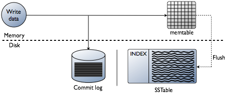
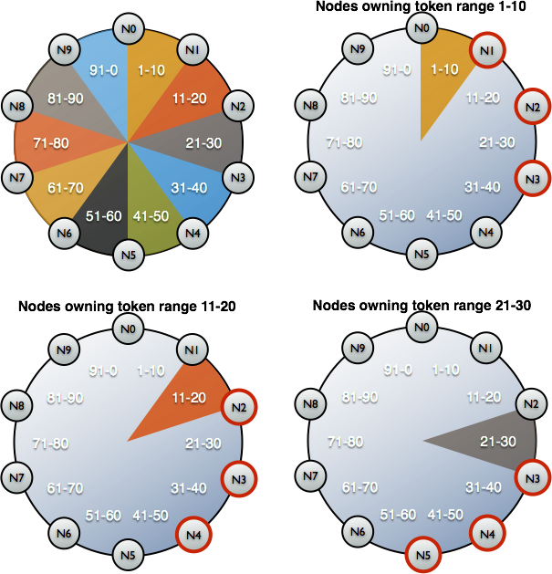

### Overview

Apache Cassandra is a massively scalable open source NoSQL database.  Cassandra is perfect for managing large amounts of data across multiple  data centers and the cloud. Cassandra delivers continuous availability,  linear scalability, and operational simplicity across many commodity  servers with no single point of failure, along with a powerful data  model designed for maximum flexibility and fast response times.

Cassandra has a “masterless” architecture, meaning all nodes are the  same. Cassandra provides automatic data distribution across all nodes  that participate in a “ring” or database cluster. 

Cassandra also provides customizable replication, storing redundant  copies of data across nodes that participate in a Cassandra ring.

Cassandra is written in Java.

The topology of Cassandra includes several layers:

1. *Node* — the single deployed instance of Cassandra;
2. *Rack* — the collection of Cassandra’s instances grouped by some attribute and located in the same data center;
3. *Datacenter* — the combination of all *Racks* located in the same data center;
4. *Cluster* — the collection of all *Datacenters*.
   - Cassandra uses an IP address to identify a node.
   - Cassandra stores part of the data in RAM to speed up reading and writing.

Cassandra stores some of its data in RAM, in the form of *MemTable*. There is another part of the data that is saved to disk as *SSTable*. Cassandra also has a unique instance called *Commit Log* that keeps records of all transactions and is stored on disk.



Cassandra itself has built-in mechanisms for data replication.  Therefore, there is no need to use distributed data storage systems like Ceph or GlusterFS in the case of a Cassandra cluster comprising a large number of nodes. In this situation, the most appropriate solution is to store data on the node’s disk via [local persistent volumes](https://kubernetes.io/docs/concepts/storage/volumes/#local) or by mounting `hostPath`.

---

To do a full backup, you have to flush in-memory data (*Memtables*) to the disk (*SSTables*). In Cassandra’s terminology, that process is called a “node drain”: it  makes a Cassandra node stop receiving connections and become unreachable — an unwanted behaviour in most cases.

Then the node backs up the data (by saving a *snapshot*) and saves the scheme (*keyspace*). However, there is one problem: the backup itself isn’t sufficient. We  also have to preserve data identifiers (in the form of dedicated tokens) for which the Cassandra node is responsible.



### Configuration

The Cassandra configuration files can be found in the conf folder.

### Data Directories

The following settings are in **conf/cassandra.yaml**.

- data_file_directories: /var/lib/cassandra/data (Default: $CASSANDRA_HOME/data/data)
- commitlog_directory: /var/lib/cassandra/commitlog (Default: $CASSANDRA_HOME/data/commitlog)
- saved_caches_directory: /var/lib/cassandra/saved_caches (Default: $CASSANDRA_HOME/data/saved_caches)

### Log

Log config file is **conf/logback.xml**

### cqlsh

**bin/cqlsh** is an interactive command line interface for Cassandra.

In sqlsh, commands are terminated with a semicolon (';'). 'help;' command can access online help.

Fetch data:

```cql
cqlsh:test> SELECT * FROM user;

 user_id | first_name | last_name
---------+------------+-----------
       1 |       Ming |        Li
       2 |       Hong |     Zhang
       3 |        Lin |        Li
```


### Data Model

Cassandra is a partitioned row store:

- Model brought from big table, row Key and a lot of columns
- Rows are organized into tables
- Primary key is required
- The first component of a table's primary key is the partition key
- The partition key determines which node stores the data
- Within a partition, rows are clustered by the remaining columns of the key

### CQL

CQL supports a rich set of data types including collection types.

Cassandra has three collection types:

- set: set, {'one', 'two'}
- list: list, ['one', 'two']
- map: map, {1: 'one', 2: 'two'}

### Cassandra file structure

A write to a Cassandra node first hits the **CommitLog** (sequential). (Then Cassandra stores values to column-family specific,  in-memory data structures called Memtables. The Memtables are flushed to disk whenever one of the configurable thresholds is exceeded. (1,  datasize in memtable. 2, # of objects reach certain limit, 3, lifetime  of a memtable expires.))

The **data** folder contains a subfolder for each keyspace. Each subfolder contains three kind of files:

- Data files: An SSTable (nomenclature borrowed from Google) stands for Sorted Strings Table and is a file of key-value string pairs (sorted by keys).
- Index file: (Key, offset) pairs (points into data file) 
- [Bloom filter](http://en.wikipedia.org/wiki/Bloom_filter): all keys in data file

Each ColumnFamily(Eg. object) in separated sstable files

```
ColumnFamilyName-version-#-Data.db
ColumnFamilyName-version-#-Index.db
ColumnFamilyName-version-#-Filter.db
```

#### Logs

https://murukeshm.github.io/cassandra/trunk/troubleshooting/reading_logs.html

Cassandra has three main logs, the `system.log`, `debug.log` and `gc.log`.

These logs by default live in `${CASSANDRA_HOME}/logs`, but most Linux distributions relocate logs to `/var/log/cassandra`. 
- `system.log` - default Cassandra log.
```bash
grep 'WARN\|ERROR' system.log | tail
zgrep 'WARN\|ERROR' system.log.* | less
```
- `debug.log` - additional debugging information.
- `gc.log` - standard Java GC log.
```bash
grep stopped gc.log.0.current | tail
```
