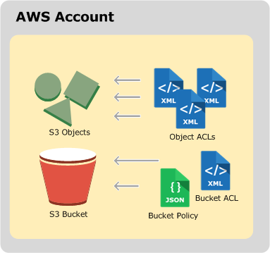
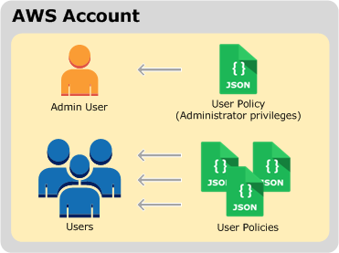

## Identity and access management in Amazon S3

> References:
>
> https://docs.aws.amazon.com/AmazonS3/latest/userguide/s3-access-control.html

By default, all Amazon S3 resources—buckets, objects, and related subresources (for example, lifecycle configuration and website configuration)—are private. Only the resource owner, the AWS account that created it, can access the resource. The resource owner can optionally grant access permissions to others by writing an access policy. Amazon S3 offers access policy options broadly categorized as resource-based policies and user policies. 

**Resource-based policies**

Bucket policies and access control lists (ACLs) are resource-based because you attach them to your Amazon S3 resources.                                           

​                                             						                                              						                                              							                                             						                                              					                                          

- **ACL** – Each bucket  and object has an ACL associated with it. An ACL is a list of grants identifying grantee and permission granted.  You use ACLs to grant basic read/write permissions to other AWS  accounts. ACLs use an Amazon S3–specific XML schema. 

- **Bucket policy** – For your bucket, you can add a bucket policy to grant  other AWS accounts or IAM users permissions for the bucket and the objects in it. Any object permissions apply only to the objects  that the bucket owner creates. Bucket policies supplement, and in  many cases, replace ACL-based access policies. 

**User policies**

You can use IAM to manage access to your Amazon S3 resources. You can create IAM users, groups, and roles in your account and attach access policies to them granting them access to AWS resources, including Amazon S3.                                 

​                                             						                                              						                                              							                                             						                                              					                                          

User policies are for managing permissions for users in your account. For cross-account permissions to other AWS accounts or users in another account, you must use a bucket policy. 

In its most basic sense, a policy contains the following elements:

- [Resources](https://docs.aws.amazon.com/AmazonS3/latest/userguide/s3-arn-format.html) – Buckets, objects, access points, and jobs are the Amazon S3 resources for which you can allow or deny permissions. In a policy, you use the Amazon Resource Name (ARN) to identify the resource. For more information, see [Amazon S3 resources](https://docs.aws.amazon.com/AmazonS3/latest/userguide/s3-arn-format.html). 
- [Actions](https://docs.aws.amazon.com/AmazonS3/latest/userguide/using-with-s3-actions.html) – For each resource, Amazon S3 supports a set of operations. You identify resource operations that you will allow (or deny) by using action keywords. For example, the `s3:ListBucket` permission allows the user to use the Amazon S3 [GET Bucket (List Objects)](https://docs.aws.amazon.com/AmazonS3/latest/API/RESTBucketGET.html) operation. For more information, see [Amazon S3 actions](https://docs.aws.amazon.com/AmazonS3/latest/userguide/using-with-s3-actions.html).
- [Effect](https://docs.aws.amazon.com/IAM/latest/UserGuide/reference_policies_elements_effect.html) – What the effect will be when the user requests the specific action—this can be either *allow* or *deny*. If you do not explicitly grant access to (allow) a resource, access is implicitly denied. You can also explicitly deny access to a resource. You might do this to make sure that a user can't access the resource, even if a different policy grants access. For more information, see [IAM JSON Policy Elements: Effect](https://docs.aws.amazon.com/IAM/latest/UserGuide/reference_policies_elements_effect.html). 
- [Principal](https://docs.aws.amazon.com/AmazonS3/latest/userguide/s3-bucket-user-policy-specifying-principal-intro.html) – The account or user who is allowed access to the actions and resources in the statement. In a bucket policy, the principal is the user, account, service, or other entity that is the recipient of this permission. For more information, see [Principals](https://docs.aws.amazon.com/AmazonS3/latest/userguide/s3-bucket-user-policy-specifying-principal-intro.html). 
- [Condition](https://docs.aws.amazon.com/AmazonS3/latest/userguide/amazon-s3-policy-keys.html) – Conditions for when a policy is in effect. You can use AWS‐wide keys and Amazon S3‐specific keys to specify conditions in an Amazon S3 access policy. For more information, see [Amazon S3 condition key examples](https://docs.aws.amazon.com/AmazonS3/latest/userguide/amazon-s3-policy-keys.html).

