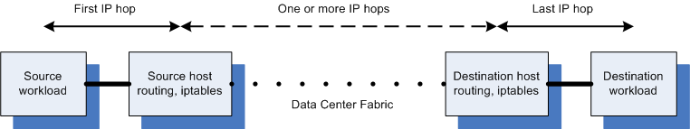

### Calico

Calico is an open source `networking and network security solution for containers`, virtual machines, and native host-based workloads.  Calico supports a broad range of platforms including Kubernetes,  OpenShift, Docker EE, OpenStack, and bare metal services.

Calico combines flexible networking capabilities with  run-anywhere security enforcement to provide a solution with native  Linux kernel performance and true cloud-native scalability. Calico  provides developers and cluster operators with a consistent experience  and set of capabilities whether running in public cloud or on-prem, on a single node or across a multi-thousand node cluster.

Calico is made up of the following interdependent components:

- [Felix](https://docs.projectcalico.org/reference/architecture/overview#felix), the primary Calico agent that runs on each machine that hosts endpoints.
- The [Orchestrator plugin](https://docs.projectcalico.org/reference/architecture/overview#orchestrator-plugin), orchestrator-specific code that tightly integrates Calico into that orchestrator.
- [etcd](https://docs.projectcalico.org/reference/architecture/overview#etcd), the data store.
- [BIRD](https://docs.projectcalico.org/reference/architecture/overview#bgp-client-bird), a BGP (Border Gateway Protocol) client that distributes routing information. **BGP** is a standard protocol for exchanging routing  information between two routers in a network. Each router running BGP  has one or more **BGP peers** - other routers which they  are communicating with over BGP. You can configure Calico nodes to peer  with each other, with route reflectors, and with top-of-rack (ToR)  routers.
- [BGP Route Reflector (BIRD)](https://docs.projectcalico.org/reference/architecture/overview#bgp-route-reflector-bird), an optional BGP route reflector for higher scale.

#### Felix

Felix is a daemon that runs on every machine that provides endpoints: in most cases that means on nodes that host containers or VMs. It is responsible for programming routes and ACLs, and anything else required on the host, in order to provide the desired connectivity for the endpoints on that host.

Depending on the specific orchestrator environment, Felix is responsible for the following tasks:

* Interface management
* Route programming
* ACL programming
* State reporting

#### Orchestrator plugin

Unlike Felix there is no single ‘orchestrator plugin’: instead, there are separate plugins for each major cloud orchestration platform (e.g. OpenStack, Kubernetes). The purpose of these plugins is to bind Calico more tightly into the orchestrator, allowing users to manage the Calico network just as they’d manage network tools that were built into the orchestrator.

A good example of an orchestrator plugin is the Calico Neutron ML2 mechanism driver. This component integrates with Neutron’s ML2 plugin, and allows users to configure the Calico network by making Neutron API calls. This provides seamless integration with Neutron.

The orchestrator plugin is responsible for the following tasks:

* API translation
* Feedback

#### etcd

etcd is a distributed key-value store that has a focus on consistency. Calico uses etcd to provide the communication between components and as a consistent data store, which ensures Calico can always build an accurate network.

Depending on the orchestrator plugin, etcd may either be the master data store or a lightweight mirror of a separate data store.

The etcd component is distributed across the entire deployment. It is divided into two groups of machines: the core cluster, and the proxies.

Additionally, on each machine that hosts either a [Felix](https://docs.projectcalico.org/reference/architecture/overview#felix) or a [plugin](https://docs.projectcalico.org/reference/architecture/overview#orchestrator-plugin), we run an etcd proxy. This reduces the load on the core cluster and shields nodes from the specifics of the etcd cluster. In the case where the etcd cluster has a member on the same machine as a [plugin](https://docs.projectcalico.org/reference/architecture/overview#orchestrator-plugin), we can forgo the proxy on that machine.

etcd is responsible for performing the following tasks:

* Data storage
* Communication

#### BGP client (BIRD)

Calico deploys a BGP client on every node that also hosts a [Felix](https://docs.projectcalico.org/reference/architecture/overview#felix). The role of the BGP client is to read routing state that [Felix](https://docs.projectcalico.org/reference/architecture/overview#felix) programs into the kernel and distribute it around the data center.

The BGP client is responsible for performing the following task:

* Route distribution

#### BGP route reflector (BIRD)

For larger deployments, simple BGP can become a limiting factor because it requires every BGP client to be connected to every other BGP client in a mesh topology. This requires an increasing number of connections that rapidly become tricky to maintain, due to the N^2 nature of the increase.

For that reason, in larger deployments, Calico will deploy a BGP route reflector. This component, commonly used in the Internet, acts as a central point to which the BGP clients connect, preventing them from needing to talk to every single BGP client in the cluster.

For redundancy, multiple BGP route reflectors can be deployed seamlessly. The route reflectors are purely involved in the control of the network: no endpoint data passes through them.

In Calico, this BGP component is also most commonly [BIRD](http://bird.network.cz/), configured as a route reflector rather than as a standard BGP client.

The BGP route reflector is responsible for the following task:

* Centralized route distribution

#### Typha

Typha is the component for scaling Kubernetes deployments.

The Typha daemon sits between the datastore (such as the Kubernetes API  server) and many instances of Felix. Typha’s main purpose is to increase scale by reducing each node’s impact on the datastore.  Services such  as [Felix](https://github.com/projectcalico/felix) and [confd](https://github.com/projectcalico/confd) connect to Typha instead of connecting directly to the datastore as  Typha maintains a single datastore connection on behalf of all its  clients. It caches the datastore state and deduplicates events so that  they can be fanned out to many listeners.

#### calicoctl

The command line tool, `calicoctl`, makes it easy to manage Calico network and security policy, as well as other Calico configurations.

The full list of resources that can be managed, including a description of each, is described in the [Resource definitions](https://docs.projectcalico.org/reference/resources/overview) section.

#### IP routing and iptables

In the Calico approach, IP packets to or from a workload are routed and firewalled by the Linux routing table and iptables infrastructure on the workload’s host. For a workload that is sending packets, Calico ensures that the host is always returned as the next hop MAC address regardless of whatever routing the workload itself might configure. For packets addressed to a workload, the last IP hop is that from the destination workload’s host to the workload itself.

