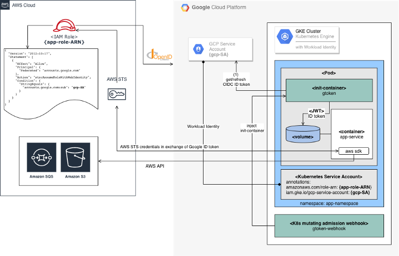

# Securely Access AWS Services from Google Kubernetes Engine (GKE)

> References:
>
> https://www.doit-intl.com/securely-access-aws-from-gke

GCP  has Workload Identity works by binding Kubernetes service accounts and Cloud IAM service accounts, so you can use Kubernetes-native concepts to  define which workloads run as which identities, and permit your  workloads to automatically access other Google Cloud services.

AWS has IAM roles for service accounts on Amazon EKS clusters, you can associate an IAM role with a Kubernetes service account. This service account can then provide AWS permissions to the containers in any pod that uses  that service account.

#### The Naive approach

Export AWS Access Key and Secret Key for some AWS IAM User, and inject AWS credentials into the *orchestration job*, either as a credentials file or environment variables using [Kubernetes Secrets](https://kubernetes.io/docs/concepts/configuration/secret/) resource protected with [RBAC authorization policy](https://kubernetes.io/docs/concepts/configuration/secret/#clients-that-use-the-secret-api).

#### The gtoken approach

AWS allows to create an IAM role for OpenID Connect Federation [OIDC](https://openid.net/connect/) identity providers instead of IAM users. Google implements OIDC provider and integrates it tightly with GKE through **Workload Identity** feature. Providing a valid OIDC token to GKE pod, running under  Kubernetes Service Account linked to a Google Cloud Service Account. 

In order to get temporary AWS credentials from AWS Security Token Service ([STS](https://docs.aws.amazon.com/STS/latest/APIReference/Welcome.html)), you need to provide a valid OIDC **ID token**.

