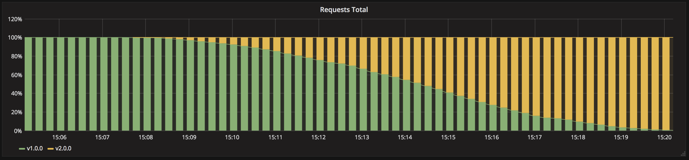
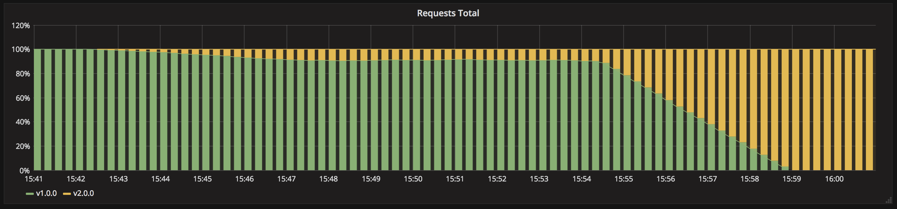
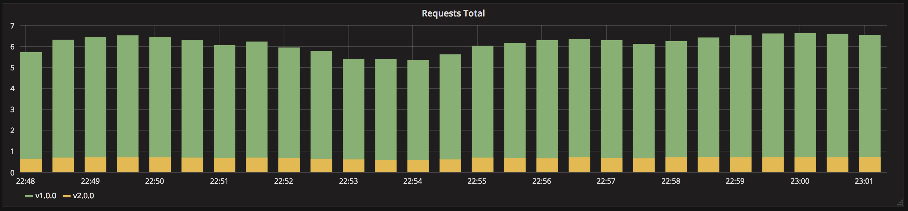

# Deployment strategies


> References:
> https://github.com/ContainerSolutions/k8s-deployment-strategies


#### Recreate

> Version A is terminated then version B is rolled out.

[](https://github.com/ContainerSolutions/k8s-deployment-strategies/blob/master/recreate/grafana-recreate.png)

Stop all the running application instances and then spin up the instances with the new version.

#### Ramped deployments (Rolling update)

> Version B is slowly rolled out and replacing version A. Also known as rolling-update or incremental.

[](https://github.com/ContainerSolutions/k8s-deployment-strategies/blob/master/ramped/grafana-ramped.png)

Instances running the old version get retired as new instances with the new version get spun up.
Applicable when your service is horizontally scaled (more than one instance). Depending on the system taking care of the ramped deployment, you can tweak the following parameters to increase the deployment time:
- Parallelism, max batch size: Number of concurrent instances to roll out.
- Max surge: How many instances to add in addition of the current amount.
- Max unavailable: Number of unavailable instances during the rolling update procedure.

In Kubernetes:
- Set `.spec.strategy.type` to `RollingUpdate` (the default value).
- Set `.spec.strategy.rollingUpdate.maxUnavailable` and `.spec.strategy.rollingUpdate.maxSurge` to some reasonable value.
- Configure the `readinessProbe`.

#### Blue/Green deployments

> Version B is released alongside version A, then the traffic is switched to version B.

[](https://github.com/ContainerSolutions/k8s-deployment-strategies/blob/master/blue-green/grafana-blue-green.png)

```
- version 1 is serving traffic
- deploy version 2
- wait until version 2 is ready
- switch incoming traffic from version 1 to version 2
- shutdown version 1
```

We always manage 2 versions of our production environment. One of them  is considered **blue** — i.e this is the version that is now live. The new versions are always deployed to the **green replica** of the environment. After we run the necessary tests and verifications to make sure the **blue** environment is ready we just flip over the traffic, so **green** becomes **blue** and **blue** becomes **green**.

In Kubernetes it can be done via labels, for example:
```yaml
labels:
	app: guestbook
  tier: frontend
  track: canary
```

You can apply the blue/green deployment technique for a single service or multiple services using an Ingress controller:
- [multiple services using Ingress](https://github.com/ContainerSolutions/k8s-deployment-strategies/blob/master/blue-green/multiple-services)
- [single service](https://github.com/ContainerSolutions/k8s-deployment-strategies/blob/master/blue-green/single-service)

It's not recommended to use Helm for blue/green deployment.

#### Canary releases

> Version B is released to a subset of users, then proceed to a full rollout.

[](https://github.com/ContainerSolutions/k8s-deployment-strategies/blob/master/canary/grafana-canary.png)

A small portion of the fleet is updated to the new version of your application. Usually the traffic is split based on weight.

In Kubernetes it can be done via labels, for example:
```yaml
labels:
	app: guestbook
  tier: frontend
  track: canary
```

You can apply the canary deployment technique using the native way by adjusting the number of replicas or if you use Nginx as Ingress controller you can define fine grained traffic splitting via Ingress annotations:
- [native](https://github.com/ContainerSolutions/k8s-deployment-strategies/blob/master/canary/native)
- [nginx-ingress](https://github.com/ContainerSolutions/k8s-deployment-strategies/blob/master/canary/nginx-ingress)

It's not recommended to use Helm for canary deployment.

#### A/B testing

> Version B is released to a subset of users under specific condition.

[](https://github.com/ContainerSolutions/k8s-deployment-strategies/blob/master/ab-testing/grafana-ab-testing.png)

Consists of routing a subset of users to a new functionality under specific conditions. It is usually a technique for making business decisions based on statistics rather than a deployment strategy. However, it is related and can be implemented by adding extra functionality to a canary deployment.

This technique is widely used to test conversion of a given feature and only roll-out the version that converts the most.

Here is a list of conditions that can be used to distribute traffic amongst the versions:
- Weight
- Cookie value
- Query parameters
- Geolocalisation
- Technology support: browser version, screen size, operating system, etc.
- Language

#### Shadow deployment

> Version B receives real-world traffic alongside version A and doesn’t impact the response.

[](https://github.com/ContainerSolutions/k8s-deployment-strategies/blob/master/shadow/grafana-shadow.png)

A shadow deployment consists of releasing version B alongside version A, fork version A’s incoming requests and send them to version B as well without impacting production traffic. This is particularly useful to test production load on a new feature. A rollout of the application is triggered when stability and performance meet the requirements.