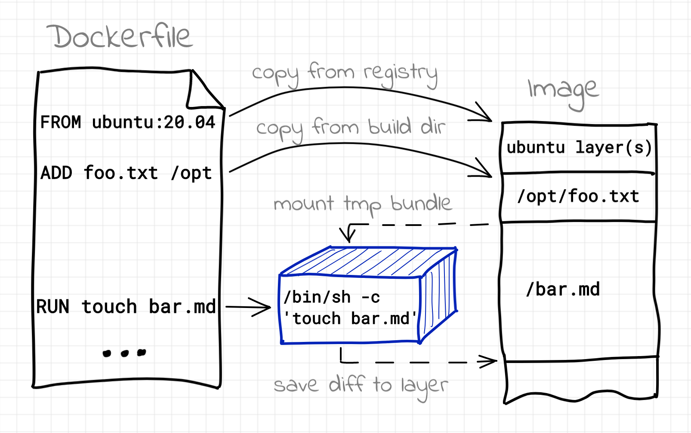

# How Docker Build Works Internally

> https://iximiuz.com/en/posts/you-need-containers-to-build-an-image/

[images](https://github.com/opencontainers/image-spec) can be seen as archives with a filesystem inside. They  may also contain some configurational data like a default command to be  executed when a container starts, exposed ports, etc. Technically [images aren't required to run containers](https://iximiuz.com/en/posts/you-dont-need-an-image-to-run-a-container/). Unlike virtual machines, containers are just [isolated and restricted processes](https://iximiuz.com/en/posts/not-every-container-has-an-operating-system-inside/) on your Linux host. They do form an isolated execution environment,  including the personalized root filesystem, but the bare minimum to  start a container is just a folder with a single executable file inside. So, when we are starting a container from an image, the image gets  unpacked and its content is provided to the [container runtime](https://github.com/opencontainers/runtime-spec) in a form of a [filesystem bundle](https://github.com/opencontainers/runtime-spec/blob/44341cdd36f6fee6ddd73e602f9e3eca1466052f/bundle.md), i.e. a regular directory containing the future root filesystem files  and some configs (all those layers you may have started thinking about  are abstracted away by a [union mount](https://en.wikipedia.org/wiki/Union_mount) driver like [overlay fs](https://dev.to/napicella/how-are-docker-images-built-a-look-into-the-linux-overlay-file-systems-and-the-oci-specification-175n)).

Every time, Docker (or buildah, or podman, etc) encounters a `RUN` instruction in the Dockerfile it actually fires a new container.

