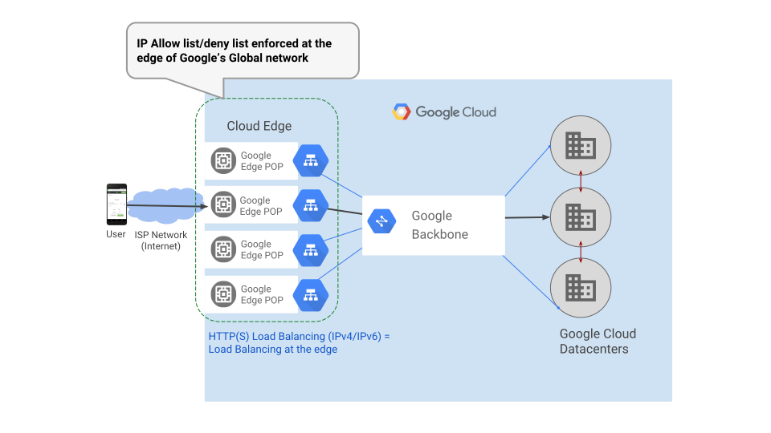
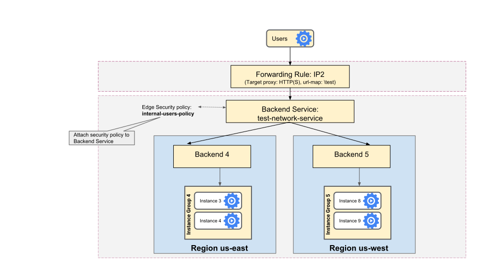
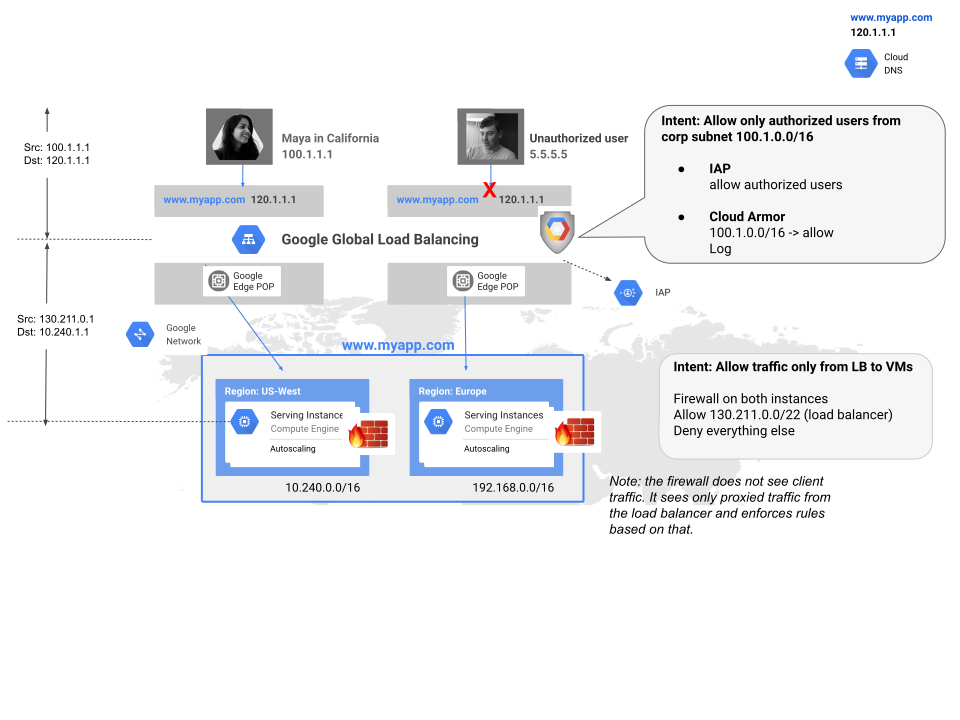
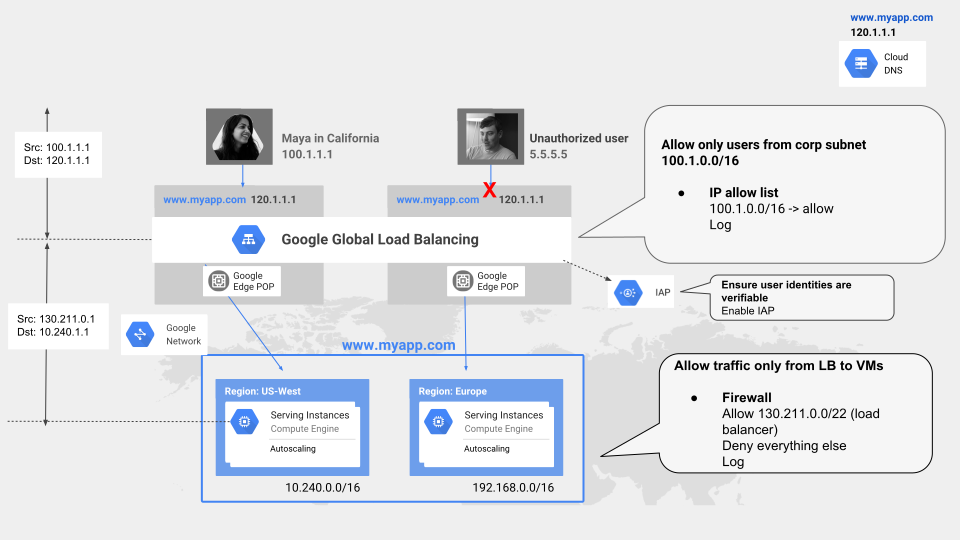
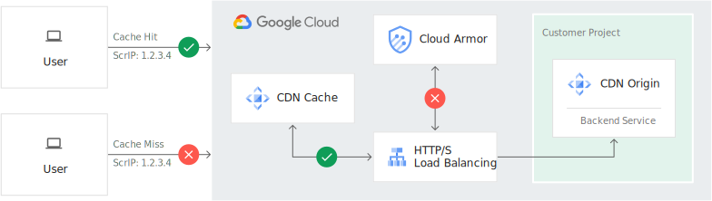

## Google Cloud Armor

> References:
> https://cloud.google.com/armor/docs/concepts
> https://cloud.google.com/armor/docs/configure-security-policies#gcloud


Use Google Cloud Armor security policies to protect applications running behind a load balancer from distributed denial-of-service (DDoS) and other web-based attacks, whether the applications are deployed on Google Cloud, in a hybrid deployment, or in a multi-cloud architecture.

Google Cloud Armor security policies are made up of rules that filter traffic based on layer 3, 4, and 7 attributes. For example, you can specify conditions that match on an incoming request's IP address, IP range, region code, or request headers.

Google Cloud Armor security policies are available only for backend services behind an **external HTTP(S) load balancer.** DDoS protection is automatically provided for HTTP(S) Load Balancing, SSL Proxy Load Balancing, and TCP Proxy Load Balancing.

The HTTP, HTTPS, HTTP/2, and QUIC protocols are all supported.

The backends to the backend service can be virtual machine (VM) instances in an instance group, zonal network endpoint groups (zonal NEGs), or internet network endpoint groups (internet NEGs). When you use Google Cloud Armor to protect a hybrid deployment or multi-cloud architecture, the backends must be internet NEGs.

#### Edge security with Google Cloud Armor security policies

HTTP(S) Load Balancing is implemented at the edge of Google's network in [Google's points of presence (PoPs)](https://cloud.google.com/about/locations#network-tab) around the world. Traffic directed to an [external HTTP(S) load balancer](https://cloud.google.com/load-balancing/docs/https) enters the PoP closest to the user. It is then load balanced over Google's global network to the closest backend that has sufficient capacity available. (In Standard Tier traffic enters Google's network through peering, ISP, or transit networks in the region where you have deployed your Google Cloud resources).

Google Cloud Armor security policies enable you to allow or deny access to your external HTTP(S) load balancer at the Google Cloud edge, as close as possible to the source of incoming traffic. This prevents unwelcome traffic from consuming resources or entering your Virtual Private Cloud (VPC) networks.



#### HTTP(S) Load Balancing security policies

Each backend service of an external HTTP(S) load balancer can reference a single Google Cloud Armor security policy. You can use the same security policy with more than one backend service on the same or different external HTTP(S) load balancers.

You designate the [priority (rule evaluation order)](https://cloud.google.com/armor/docs/security-policy-overview#eval-order) when multiple rules are configured.

#### IP address allowlist and denylist rules

You can create IP address allowlist and denylist rules within a security policy.

#### Rules language and enforcement engine

The rules language and enforcement engine provides the following:
- The ability to write custom rule expressions that can match on various layer 3 through layer 7 attributes of incoming requests. Google Cloud Armor provides a [flexible language](https://cloud.google.com/armor/docs/rules-language-reference) for writing custom match conditions.
- The ability to deny or allow requests based on the incoming request's **region** code. ([ISO 3166-1 alpha 2](https://www.wikipedia.org/wiki/ISO_3166-2) codes).

---

Preconfigured rules for XSS, SQLi, LFI, RFI, and RCE.

---

#### About Google Cloud Armor security policies

Each rule is evaluated with respect to incoming traffic.

A Google Cloud Armor security policy *rule* consists of a match condition and an action to take when that condition is met. 

When a condition is met, the action is either to allow or deny traffic.

You can associate a Google Cloud Armor security policy with one or more backend services. A backend service can have only one security policy associated with it.

If a Google Cloud Armor security policy is associated with any backend service, it can't be deleted. A backend service can be deleted regardless of whether it has an associated security policy.

If multiple forwarding rules point to a backend service that has an associated security policy, the policy rules are enforced for all traffic coming in to each of the forwarding rule IP addresses.



#### Rule evaluation order

Rule evaluation order is determined by two factors: *rule priority* and *rule type*.

The rule with the lowest numeric value assigned has the highest logical priority. 

#### Fingerprint

Each Google Cloud Armor security policy has a field `fingerprint`. The fingerprint is a hash of the contents stored in the policy. The fingerprint protects you from overriding another user's update. 

#### How WebSocket connections are handled

Cloud Armor can block a WebSocket channel from being established, for example, if an IP address denylist blocks the originating IP address. However, subsequent transactions in the channel do not conform to the HTTP protocol, and Google Cloud Armor does not evaluate any messages after the first request.

#### Google Cloud Armor and VPC firewall rules

Google Cloud Armor security policies and [VPC firewall rules](https://cloud.google.com/vpc/docs/firewalls) have different functions:
- Google Cloud Armor security policies **provide edge security** and act on client traffic to Google Front Ends (GFEs).
- VPC firewall rules **allow or deny traffic to and from your backend**s. You must create ingress allow firewall rules, whose targets are the load-balanced backend VMs, and whose sources are [IP ranges used by external HTTP(S) load balancers](https://cloud.google.com/load-balancing/docs/https#firewall_rules). These rules allow GFEs and the health check systems to communicate with your backend VMs.



#### Google Cloud Armor with HTTP(S) Load Balancing and IAP

Identity-Aware Proxy (IAP) verifies a user's identity and then determines whether that user should be permitted to access an application. To enable IAP for the external HTTP(S) load balancer, you enable it on the load balancer's backend services. Similarly, edge Google Cloud Armor security policies are attached to the backend services of an external HTTP(S) load balancer.

If Google Cloud Armor security policies and IAP are both enabled for a backend service of an external HTTP(S) load balancer, the IAP evaluation happens first. 



#### Google Cloud Armor with hybrid deployments

In a hybrid deployment, a Google Cloud load balancer needs access to an application or content source that runs outside Google Cloud, for example, in another cloud provider's infrastructure. You can use Google Cloud Armor to protect such deployments.

#### Google Cloud Armor with Cloud CDN

Google Cloud Armor ensures that the CDN origin server is protected from application attacks, mitigates OWASP Top 10 risks, and enforces layer 7 filtering policies.

Google Cloud Armor enforces security policies for backend services with Cloud CDN enabled *only* for cache misses; that is, for requests that miss or bypass the Cloud CDN cache.



#### Google Cloud Armor with serverless apps

You can use Google Cloud Armor security policies with a serverless NEG backend that points to a [Cloud Run](https://cloud.google.com/run/docs), [App Engine](https://cloud.google.com/appengine/docs), or [Cloud Functions](https://cloud.google.com/functions/docs) service. 

Users who have the default URL for a Cloud Functions service can bypass the load balancer and go directly to the service URL. 

#### Limitations

- An IP address denylist/allowlist for HTTP(S) Load Balancing is not supported for **Cloud Storage** backend buckets.
- Google Cloud Armor is not supported with **Internal HTTP(S) Load Balancing.**
- Security policies are enforced for CDN cache **misses only**. Content is served from cache even if a rule in a security policy would have denied the request.
- You can enable preview mode for a rule by using the `gcloud` command-line tool and the `--preview` flag of [`gcloud compute security-policies rules update`](https://cloud.google.com/sdk/gcloud/reference/compute/security-policies/rules/update). To disable preview mode, use the `--no-preview` flag.

---

If you delete and then recreate a Kubernetes Ingress resource, you must reapply the security policy to the new backend service or services. 

---

[Security Command Center](https://cloud.google.com/security-command-center/docs) is the security and risk database for Google Cloud. Security Command Center includes a risk dashboard and analytics system for surfacing, understanding, and remediating Google Cloud security and data risks across an organization.

Google Cloud Armor is integrated automatically with Security Command Center and exports two findings to the Security Command Center dashboard: **Allowed Traffic Spike** and **Increasing Deny Ratio**. This guide describes the findings and how to interpret them.

---

Google Cloud Armor preconfigured rules are complex web application firewall (WAF) rules with dozens of signatures that are compiled from open source industry standards. Google offers these rules as-is. The rules allow Google Cloud Armor to evaluate dozens of distinct traffic signatures by referring to conveniently-named rules, rather than requiring you to define each signature manually.

---

#### Commands

```bash
gcloud compute security-policies list
gcloud compute security-policies describe auth

kubectl describe ingress xxxxxxxxxxxx

gcloud compute backend-services xxxxxxxxxxxx
gcloud compute backend-services update xxxxxxxxxxxx --security-policy auth

name=xxxxxxxxxxxx
armor=$(gcloud compute security-policies list | awk '{print $1}' | grep -v "NAME")
ips=($(kubectl describe nodes -l cloud.google.com/gke-nodepool=$name --insecure-skip-tls-verify | grep ExternalIP | sed 's/^..ExternalIP:...//'))

gcloud compute security-policies rules update 1002 \
	--security-policy $armor  \
  --src-ip-ranges "${ips[0]},${ips[1]},${ips[2]},${ips[3]} ------"  \
  --action "allow"
```
