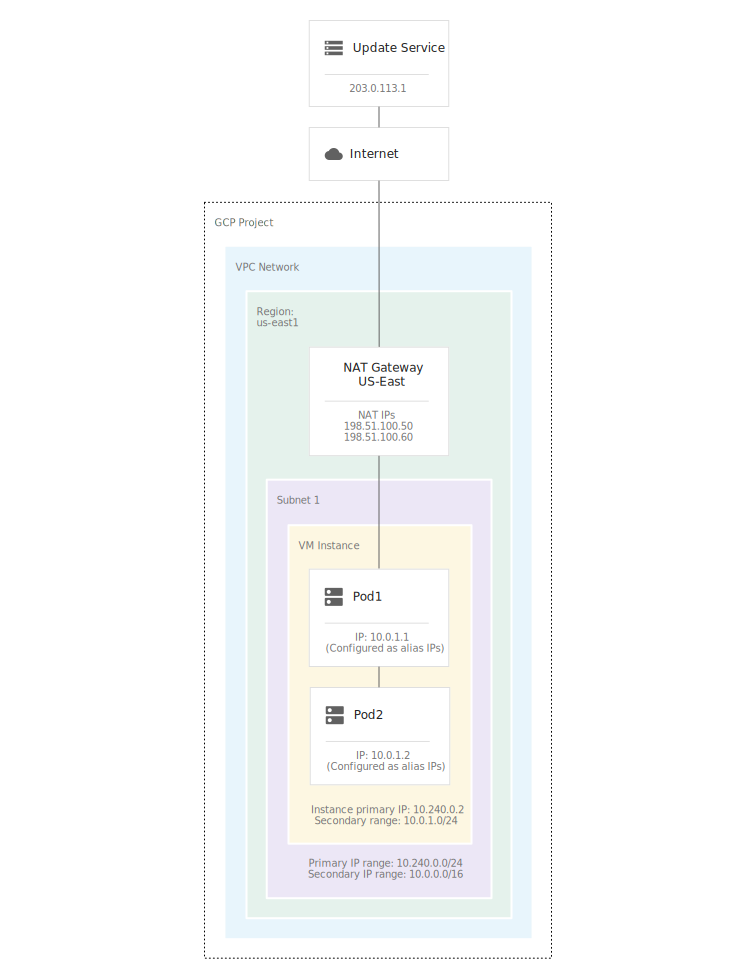

## Cloud NAT overview

> References:
> https://cloud.google.com/nat/docs/overview
> https://cloud.google.com/nat/docs/using-nat
> [NAT](../nat.md)

**Gives VMs access to the internet. **
**VMs should not have external IP addresses.  **
**Works with routes in VPC network whose next hops are the default internet gateway.** 

Cloud NAT ([network address translation](https://www.wikipedia.org/wiki/Network_address_translation)) lets Google Cloud virtual machine (VM) instances without external IP addresses and private Google Kubernetes Engine (GKE) clusters send outbound packets to the internet and receive any corresponding established inbound response packets.

Cloud NAT is a distributed, software-defined managed service. It's not based on proxy VMs or appliances. Cloud NAT configures the [Andromeda software](https://cloudplatform.googleblog.com/2014/04/enter-andromeda-zone-google-cloud-platforms-latest-networking-stack.html)  that powers your Virtual Private Cloud (VPC) network so that it provides *source network address translation (SNAT)* for VMs without external IP addresses. Cloud NAT also provides *destination network address translation (DNAT)* for established inbound response packets.


Cloud NAT implements outbound NAT in conjunction with [static routes](https://cloud.google.com/vpc/docs/routes#static_routes) in your VPC network whose next hops are the *default internet gateway*. In a basic configuration, a [default route](https://cloud.google.com/vpc/docs/routes#routingpacketsinternet) in your VPC network meets this requirement.

Cloud NAT does *not* implement unsolicited inbound connections from the internet. DNAT is only performed for packets that arrive as responses to outbound packets.

Cloud NAT can be configured to provide NAT to the internet for packets sent from the following:

- The VM's network interface's primary internal IP address, provided that the network interface doesn't have an external IP address assigned to it. If the network interface has an external IP address assigned to it, Google Cloud automatically performs one-to-one NAT.
- An [alias IP range](https://cloud.google.com/vpc/docs/alias-ip) assigned to the VM's network interface. Even if the network interface has an external IP address assigned to it, you can configure a Cloud NAT gateway to provide NAT for packets whose sources come from an alias IP range of the interface. An external IP address on an interface never performs one-to-one NAT for alias IP addresses.

Cloud NAT allows outbound and established inbound responses to those connections. Each Cloud NAT gateway performs source network address translation (SNAT) on egress, and destination network address translation (DNAT) for established response packets.

Cloud NAT does *not* permit unsolicited inbound requests from the internet, even if firewall rules would otherwise permit those requests.

Each Cloud NAT gateway is associated with a single VPC network, region, and Cloud Router.

Cloud NAT relies on custom static routes whose next hops are the default internet gateway. To fully utilize a Cloud NAT gateway, your VPC network needs a default route whose next hop is the default internet gateway.

You can configure a Cloud NAT gateway to provide NAT for the following:

- Primary and secondary IP address ranges of all subnets in the region.
- Primary IP address ranges of all subnets in the region.
- Custom subnet IP address ranges.

If you configure a VM with [multiple network interfaces](https://cloud.google.com/vpc/docs/multiple-interfaces-concepts), each interface must be in a separate VPC network.

When you create a Cloud NAT gateway, you can choose to have the gateway automatically allocate regional external IP addresses. Alternatively, you can manually assign a fixed number of regional external IP addresses to the gateway.

#### Applicable RFCs

Cloud NAT supports *Endpoint-Independent Mapping* and *Endpoint-Dependent Filtering* as defined in [RFC 5128](https://tools.ietf.org/html/rfc5128). You can enable or disable Endpoint-Independent Mapping. By default, NAT gateway uses Endpoint-Independent Mapping.

*Endpoint-Independent Mapping* means that if a VM sends packets from a given internal IP address and port pair to multiple different destinations, then the gateway maps all of those packets to the same NAT IP address and port pair, regardless of the destination of the packets.

*Endpoint-Dependent Filtering* means that response packets from the internet are allowed to enter only if they are from an IP address and port that a VM had already sent packets to.

#### Routes interactions

A Cloud NAT gateway can only use routes whose next hops are the default internet gateway. Each VPC network starts with a default route whose destination is `0.0.0.0/0` and whose next hop is the default internet gateway.

If you create a custom static route with next hops set to [any other type of custom static route next hop](https://cloud.google.com/vpc/docs/routes#static-route-next-hops), packets with destination IPs matching the destination of the route are sent to that next hop instead of to the default internet gateway.

If you create a custom static route whose next hop is a Cloud VPN tunnel, Cloud NAT does not use that route.

If an on-premises router advertises a custom dynamic route to a Cloud Router managing a Cloud VPN tunnel or Cloud Interconnect attachment (VLAN), Cloud NAT gateways cannot use that route.

#### GKE interaction

A Cloud NAT gateway can perform NAT for nodes and Pods in a [private cluster](https://cloud.google.com/kubernetes-engine/docs/concepts/private-cluster-concept), which is a type of VPC-native cluster. The Cloud NAT gateway must be configured to apply to at least the following subnet IP address ranges for the subnet that your cluster uses:

- Subnet primary IP address range (used by nodes)
- Subnet secondary IP address range used for Pods in the cluster
- Subnet secondary IP address range used for Services in the cluster

When a Cloud NAT gateway is configured to provide NAT for a private cluster, it reserves NAT source IP addresses and source ports for each node VM. Those NAT source IP addresses and source ports are usable by Pods because Pod IP addresses are implemented as alias IP ranges assigned to each node VM. Because the smallest possible Pod IP address range is 256 IP addresses—subnet mask of `/24`—the Cloud NAT [port reservation procedure](https://cloud.google.com/nat/docs/ports-and-addresses#port-reservation-procedure) reserves at least 1,024 NAT source IP addresses and source ports per node.

Independent of Cloud NAT, GKE performs SNAT by using software running on each node when Pods send packets to the internet, unless you've changed the cluster's [IP masquerade configuration](https://cloud.google.com/kubernetes-engine/docs/how-to/ip-masquerade-agent). If you need granular control over egress traffic from Pods, you can use a [network policy](https://cloud.google.com/kubernetes-engine/docs/how-to/network-policy).

GKE example:




## Cloud NAT address and port overview

#### NAT IP addresses

A *NAT IP address* is a regional external IP address, routable on the internet. A VM without an external IP address, in a subnetwork (subnet) served by a Cloud NAT gateway, uses a NAT IP address when it sends packets to a destination on the internet.

To assign NAT IP addresses to a Cloud NAT gateway, use one of the following methods:

- Automatic NAT IP address allocation.
- Manual NAT IP address assignment.

#### Ports

When you create a Cloud NAT gateway, you specify a *minimum number of ports per VM instance*. When a Cloud NAT gateway performs source network address translation (SNAT) on a packet sent by a VM, it changes the packet's NAT source IP address and source port.

When you use a Cloud NAT gateway to provide NAT services for a [private Google Kubernetes Engine cluster](https://cloud.google.com/kubernetes-engine/docs/concepts/private-cluster-concept), the number of NAT source IP address and source port tuples are assigned to the whole node VM, shared by all Pods on the node.

#### Ports and connections

The number of NAT source IP address and source port tuples that a Cloud NAT gateway reserves for a VM limits the number of connections that the VM can make to a unique destination (unique 3-tuple consisting of a destination IP address, a destination port, and an IP protocol). A *connection* means a unique 5-tuple consisting of the NAT source IP address and source port tuple combined with a unique destination 3-tuple.

### Commands

```bash
# Create
gcloud compute routers nats create NAT_CONFIG \
    --router=NAT_ROUTER \
    --auto-allocate-nat-external-ips \
    --nat-all-subnet-ip-ranges \
    --enable-logging

# Show conf
gcloud compute routers nats describe NAT_CONFIG --router=NAT_ROUTER
gcloud compute routers get-nat-mapping-info
gcloud compute routers get-status
```

### Logging

When Cloud NAT logging is enabled, one log entry can be generated for each of the following scenarios:

- When a network connection using NAT is created.
- When a packet is dropped because no port was available for NAT.

The VM can generate 50-100 log entries per second per vCPU.

```bash
# Enable logging
gcloud compute routers nats update NAT_GATEWAY \
    --router=ROUTER_NAME \
    --region=REGION \
    --enable-logging

# view
gcloud logging read 'resource.type=nat_gateway' \
    --limit=10 \
    --format=json
```

### Monitoring

Cloud NAT provides a set of predefined dashboards that display activity across your gateway:

- Open connections
- Egress data processed
- Ingress data processed
- Port utilization
- NAT allocation errors

### Debug connection from GKE node

```bash
# Connect to the node
gcloud compute ssh NODE_NAME \
    --zone us-east4-c \
    --tunnel-through-iap

# Find the process ID of the kube-dns container
ps aux | grep -i "\s/kube-dns"

# Access the container
sudo nsenter --target PROCESS_ID --net /bin/bash

# Attempt to connect to the internet
curl example.com
```
