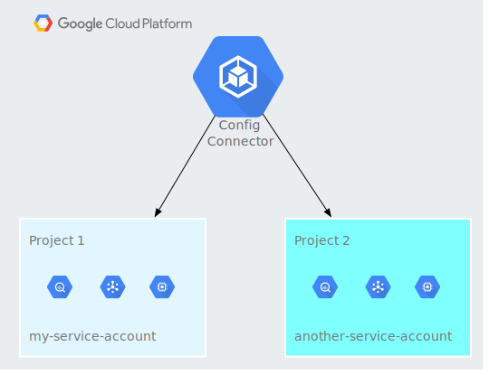

## Config Connector

> References:
> https://cloud.google.com/config-connector/docs/concepts
> https://cloud.google.com/config-connector/docs/how-to
> https://github.com/GoogleCloudPlatform/k8s-config-connector


Config Connector is a Kubernetes addon that allows you to manage Google Cloud resources through Kubernetes.

Config Connector provides a collection of Kubernetes [Custom Resource Definitions](https://kubernetes.io/docs/concepts/extend-kubernetes/api-extension/custom-resources/) (CRDs) and controllers. The Config Connector CRDs allow Kubernetes to create and manage Google Cloud resources when you configure and apply Objects to your cluster.

Supported resources: https://cloud.google.com/config-connector/docs/reference/overview

---

You can install Config Connector in one of two ways:

- [Using the Google Kubernetes Engine (GKE) Config Connector add-on](https://cloud.google.com/config-connector/docs/how-to/install-upgrade-uninstall)
- [Manual installation](https://cloud.google.com/config-connector/docs/how-to/advanced-install#manual): To use manual installation, you need to download and use a [Kubernetes Operator](https://kubernetes.io/docs/concepts/extend-kubernetes/operator/). Manual installations track the current release of Config Connector more closely; the Operator applies new versions faster than the add-on.

---

If you want to install Config Connector on GKE clusters, [Workload Identity](https://cloud.google.com/kubernetes-engine/docs/how-to/workload-identity) is the recommended approach. Workload Identity binds a Kubernetes service account to a Google service account.

If you want to install Config Connector on other Kubernetes distributions , you should use Cloud Identity. This option requires you to create a Google service account key and import the key's credentials as a Secret to your clusters.

---

You can choose to manage resources with a single service account, or multiple service accounts.

With cluster mode, you can use a single Google service account to create and manage resources, even if you are using Config Connector to manage multiple projects.


Namespaced mode lets you manage multiple projects with multiple Google service accounts bound to your Config Connector cluster.



---

Config Connector can use the annotations on the resource's `Namespace` to determine what project, folder, or organization to create the resources in. The `Namespace`'s annotation will only be applied if the resource configuration does not already specify where to create the resource.

---

Config Connector can manage your resources at the project-level, folder-level, or organization-level scope.

---

With declarative configuration, you define the desired state of the system. The system then works constantly to remain as close as possible to this state. 

With Config Connector, you can create and update resources in any order, regardless of dependency relationships. GKE moves your declared configuration towards [eventual consistency](https://en.wikipedia.org/wiki/Eventual_consistency) with the desired state.

Mutable but unreadable fields are actuated on change only.

Resources will not be recreated when modifying immutable fields.

---

Each Config Connector resource is a [Kubernetes object](https://kubernetes.io/docs/concepts/overview/working-with-objects/kubernetes-objects/)  with a [`Spec` and a `Status`](https://kubernetes.io/docs/concepts/overview/working-with-objects/kubernetes-objects/#object-spec-and-status) and [metadata](https://kubernetes.io/docs/concepts/overview/working-with-objects/annotations/#attaching-metadata-to-objects)  fields. 

---

Config Connector will only manage the corresponding Google Cloud resource if it is able to obtain a lease on the Google Cloud resource and conflict prevention is [enabled](https://cloud.google.com/config-connector/docs/concepts/managing-conflicts#modifying_conflict_prevention).

### How-to guides

When you create a resource, Config Connector `creates` the resource if it doesn't exist. If a Google Cloud resource already exists with the same name, then Config Connector `acquires` the resource and manages it.

**Importing existing Google Cloud resources**

`config-connector` uses [Cloud Asset Inventory](https://cloud.google.com/asset-inventory/docs/overview)'s [Export](https://cloud.google.com/asset-inventory/docs/exporting-to-cloud-storage) functionality to discover existing Google Cloud resources. 

You can provide an asset inventory export by providing a path to a local file containing the export or piping the results of an export to `config-connector` on STDIN.

The `config-connector` tool can export resources from a Google Cloud [Resource hierarchy](https://cloud.google.com/resource-manager/docs/cloud-platform-resource-hierarchy).

**Creating resource references**

A Google Cloud resource created with Config Connector can reference other resources. Config Connector defines these relationships through resource references.

```yaml
apiVersion: pubsub.cnrm.cloud.google.com/v1beta1
kind: PubSubSubscription
metadata:
  name: pubsubsubscription-referencing-topic
spec:
  topicRef:
    name: myTopic
```

**Monitoring your Resources**

```bash
kubectl get gcp
```

---

You can use Prometheus to collect and show metrics from Config Connector:

- Using the [Prometheus Operator provided by CoreOS](https://coreos.com/operators/prometheus/docs/latest/), or
- Following the [Prometheus documentation](https://prometheus.io/docs/prometheus/latest/getting_started/)  to configure your cluster for scraping.
