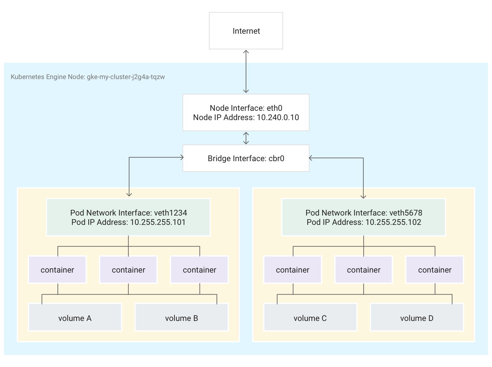
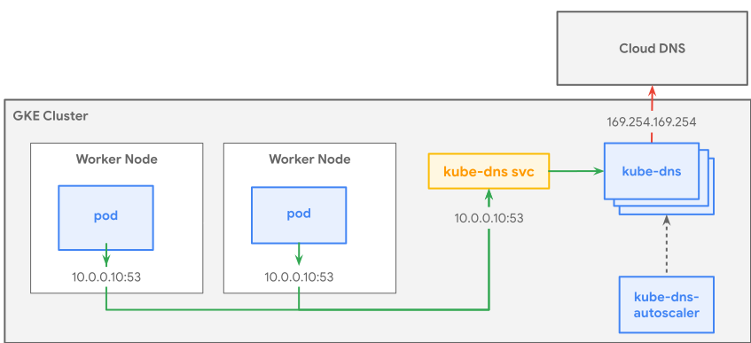
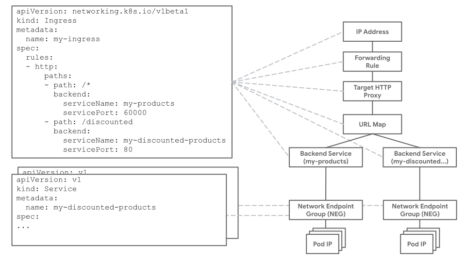
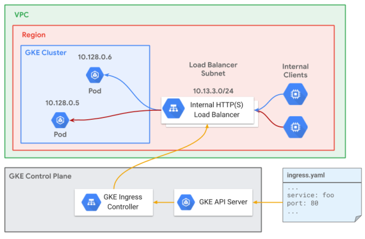

# Network overview

> References:
> https://cloud.google.com/kubernetes-engine/docs/concepts/network-overview

**ClusterIP:** The IP address assigned to a Service. This address is stable for the lifetime of the Service.
**Pod IP:** The IP address assigned to a given Pod. This is ephemeral.
**Node IP:** The IP address assigned to a given node.

## Networking Inside the Cluster

#### IP Allocation

Kubernetes uses various IP ranges to assign IP addresses to nodes, Pods, and Services:
- Each node has an IP address assigned from the cluster's ==Virtual Private Cloud (VPC) network.== This node IP provides connectivity from control components like `kube-proxy` and the `kubelet` to the Kubernetes API server. This IP is the node's connection to the rest of the cluster.
- Each node has a ==pool== of IP addresses that GKE assigns Pods running on that node (a [/24 CIDR block by default](https://en.wikipedia.org/wiki/Classless_Inter-Domain_Routing)).
- Each Pod has a ==single== IP address assigned from the Pod CIDR range of its node. This IP address is shared by all containers running within the Pod, and connects them to other Pods running in the cluster.
- Each Service has an IP address, called the ==ClusterIP==, assigned from the cluster's VPC network.

#### Pods

When Kubernetes schedules a Pod to run on a node, it creates a [network namespace](http://man7.org/linux/man-pages/man8/ip-netns.8.html)  for the Pod in the node's Linux kernel. This network namespace connects the node's physical network interface, such as `eth0`, with the Pod using a virtual network interface, so that packets can flow to and from the Pod. 

The associated virtual network interface in the node's root network namespace connects to a Linux bridge that allows communication among Pods on the same node. A Pod can also send packets outside of the node using the same virtual interface.

If you use GKE's CNI, one end of the veth pair is attached to the Pod in its namespace, and the other is connected to the Linux bridge device `cbr0`.

If Network Policy is enabled, one end of the veth pair is attached to the Pod and the other to `eth0`.

#### Services

Kubernetes uses labels to group multiple related Pods into a logical unit called a Service. A Service has a stable IP address and ports (ClusterIP), and provides load balancing among the set of Pods whose labels match all the labels you define in the [label selector](https://kubernetes.io/docs/concepts/overview/working-with-objects/labels/#label-selectors)  when you create the Service.

Kubernetes also assigns a hostname to the ClusterIP, by adding a [DNS entry](https://kubernetes.io/docs/concepts/services-networking/service/#dns).

#### Kube-Proxy

Kubernetes manages connectivity among Pods and Services using the `kube-proxy` component. This is deployed as a static Pod on each node by default. 

`kube-proxy`, which is **not** an in-line proxy, but an egress-based load- balancing controller, watches the Kubernetes API server and continually maps the ClusterIP to healthy Pods by adding and removing destination NAT (DNAT) rules to the node's `iptables` subsystem.

## Networking Outside the Cluster

GKE provides three different types of Load Balancers to control access and to spread incoming traffic across your cluster:
- [**External Load Balancers** ](https://cloud.google.com/kubernetes-engine/docs/concepts/network-overview#ext-lb) manage traffic coming from outside the cluster and outside your Google Cloud Virtual Private Cloud (VPC) network. They use forwarding rules associated with the Google Cloud network to route traffic to a Kubernetes node.
- [**Internal Load Balancers**](https://cloud.google.com/kubernetes-engine/docs/concepts/network-overview#int-lb) manage traffic coming from within the same VPC network. Like external load balancers, they use forwarding rules associated with the Google Cloud network to route traffic to a Kubernetes node.
- [**HTTP(S) Load Balancers**](https://cloud.google.com/kubernetes-engine/docs/concepts/network-overview#https-lb) are specialized external load balancers used for HTTP(S) traffic. They use an Ingress resource rather than a forwarding rule to route traffic to a Kubernetes node.

The load balancer is not aware of which nodes in the cluster are running Pods for its Service. Instead, it balances traffic across all nodes in the cluster, even those not running a relevant Pod.

**External Load Balancer**

If your Service needs to be reachable from outside the cluster and outside your VPC network, you can configure your Service as a [LoadBalancer](https://kubernetes.io/docs/concepts/services-networking/service/#publishing-services-service-types), by setting the Service's `type` field to `LoadBalancer` when defining the Service. GKE then provisions a [Network Load Balancer](https://cloud.google.com/load-balancing/docs/network) in front of the Service.

**Internal Load Balancer**

The Internal Load Balancer chooses an IP address from your cluster's VPC subnet instead of an external IP address. Applications or services within the VPC network can use this IP address to communicate with Services inside the cluster.

**HTTP(S) Load Balancer**

You can allow clients external to your VPC network to access this type of application using a Kubernetes [Ingress resource](https://kubernetes.io/docs/concepts/services-networking/ingress/). An Ingress resource allows you to map hostnames and URL paths to Services within the cluster. When using a HTTP(S) load balancer, you must configure the Service to use a [NodePort](https://kubernetes.io/docs/concepts/services-networking/service/#nodeport), as well as a ClusterIP.

## Limiting Connectivity to Pods and Services

You can limit access among Pods using a [network policy](https://cloud.google.com/kubernetes-engine/docs/how-to/network-policy). Network policy definitions allow you to restrict the [ingress](https://cloud.google.com/kubernetes-engine/docs/tutorials/network-policy#step_2_restrict_incoming_traffic_to_pods) and [egress](https://cloud.google.com/kubernetes-engine/docs/tutorials/network-policy#step_3_restrict_outgoing_traffic_from_the_pods) of Pods based on an arbitrary combination of labels, IP ranges, and port numbers.

If your Service uses an [External Load Balancer](https://cloud.google.com/kubernetes-engine/docs/concepts/network-overview#ext-lb), traffic from any external IP address can access your Service by default. You can restrict which IP address ranges can access endpoints within your cluster, by configuring the `loadBalancerSourceRanges` option when configuring the Service. No VPC firewall rule is created.

If your service uses the [HTTP(S) Load Balancer](https://cloud.google.com/kubernetes-engine/docs/concepts/network-overview#https-lb), you can use a [Google Cloud Armor security policy](https://cloud.google.com/armor/docs/security-policy-concepts) to limit which external IP addresses can access your Service and which responses to return when access is denied because of the security policy. You can configure [Cloud Logging](https://cloud.google.com/logging/docs) to log information about these interactions.

# Services

A client sends a request to the stable IP address, and the request is routed to one of the Pods in the Service.

A Service identifies its member Pods with a selector.

With a Service, you get a stable IP address that lasts for the life of the Service, even as the IP addresses of the member Pods change.

There are five types of Services:
- **ClusterIP (default):** Internal clients send requests to a stable internal IP address.
- **NodePort:** Clients send requests to the IP address of a node on one or more `nodePort` values that are specified by the Service. Is an extension of the `ClusterIP` type.
- **LoadBalancer:** Clients send requests to the IP address of a network load balancer. Is an extension of the `NodePort` type. When you create a Service of type `LoadBalancer`, a Google Cloud controller wakes up and configures a [network load balancer](https://cloud.google.com/load-balancing/docs/network) in your project.
- **ExternalName:** Internal clients use the DNS name of a Service as an alias for an external DNS name.
- **Headless:** You can use a [headless service](https://kubernetes.io/docs/concepts/services-networking/service/#headless-services) in situations where you want a Pod grouping, but don't need a stable IP address.

The `ports` field of a Service is an array of [ServicePort](https://v1-16.docs.kubernetes.io/docs/reference/generated/kubernetes-api/v1.14/#serviceport-v1-core)  objects. The ServicePort object has these fields:
- name
- protocol
- port (arbitrary)
- targetPort (not arbitrary)
- nodePort

When you create a Service, Kubernetes creates an [Endpoints](https://v1-16.docs.kubernetes.io/docs/reference/generated/kubernetes-api/v1.14/#endpoints-v1-core) object that has the same name as your Service. Kubernetes uses the Endpoints object to keep track of which Pods are members of the Service.

# Container-native load balancing

Container-native load balancing leverages a data model called [network endpoint groups (NEGs)](https://cloud.google.com/load-balancing/docs/negs). NEGs are collections of network endpoints represented by IP-port pairs.

When [NEGs are used with GKE Ingress](https://cloud.google.com/kubernetes-engine/docs/how-to/container-native-load-balancing), the Ingress controller facilitates the creation of all aspects of the L7 load balancer. This includes creating the virtual IP address, forwarding rules, health checks, firewall rules, and more.

With container-native load balancing, load balancer traffic is distributed directly to the Pods which should receive the traffic, eliminating the extra network hop.

# VPC-native clusters

In GKE, clusters can be distinguished according to the way they route traffic from one Pod to another Pod. A cluster that uses [alias IP address ranges](https://cloud.google.com/vpc/docs/alias-ip) is called a VPC-native cluster. A cluster that uses [custom static routes in a VPC network](https://cloud.google.com/vpc/docs/routes) is called a routes-based cluster.

VPC-native clusters have several benefits.

The VPC-native cluster uses three unique [subnet IP address ranges](https://cloud.google.com/vpc/docs/vpc#manually_created_subnet_ip_ranges):
- It uses the subnet's primary IP address range for all ==node== IP addresses.
- It uses one secondary IP address range for all ==Pod== IP addresses.
- It uses another secondary IP address range for all ==Service== (cluster IP) addresses.

# Service discovery and DNS

In Kubernetes, service discovery is implemented with autogenerated service names that map to the service's IP address. Service names follow a [standard specification](https://github.com/kubernetes/dns/blob/master/docs/specification.md): `my-svc.my-namespace.svc.my-zone`.

GKE provides managed DNS for resolving service names and for resolving external names. This is implemented by kube-dns, a cluster add-on that is deployed by default in all GKE clusters. The kube-dns deployment is accessed through a corresponding [Service](https://cloud.google.com/kubernetes-engine/docs/concepts/service) that groups the `kube-dns` Pods and gives them a single IP address. 

The kubelet agent running on each Node configures the Pod's `etc/resolv.conf` to use the `kube-dns` service's ClusterIP.

kube-dns is the authoritative name server for the cluster domain (`cluster.local`) and it recursively resolves external names. Short names that are not fully qualified, like `myservice`, are completed first with local search paths.

# GKE Ingress for HTTP(S) Load Balancing

In GKE, an [Ingress](https://kubernetes.io/docs/concepts/services-networking/ingress/)  object defines rules for routing HTTP(S) traffic to applications running in a cluster. An Ingress object is associated with one or more [Service](https://cloud.google.com/kubernetes-engine/docs/concepts/service) objects, each of which is associated with a set of Pods.

When you create an Ingress object, the [GKE Ingress controller](https://github.com/kubernetes/ingress-gce)  creates a [Google Cloud HTTP(S) Load Balancer](https://cloud.google.com/load-balancing/docs/https) and configures it according to the information in the Ingress and its associated Services.

GKE Ingress resources come in two types:
- [Ingress for external HTTP(S) load balancer](https://cloud.google.com/kubernetes-engine/docs/concepts/ingress-xlb) deploys the [Google Cloud external HTTP(S) load balancer](https://cloud.google.com/load-balancing/docs/https). This internet-facing load balancer is deployed globally across Google's edge network as a managed and scalable pool of load balancing resources.
- [Ingress for Internal HTTP(S) Load Balancing](https://cloud.google.com/kubernetes-engine/docs/concepts/ingress-ilb) deploys the [Google Cloud internal HTTP(S) load balancer](https://cloud.google.com/load-balancing/docs/l7-internal). These internal HTTP(S) load balancers are powered by Envoy proxy systems outside of your GKE cluster, but within your VPC network.

#### Container-native load balancing

[Container-native load balancing](https://cloud.google.com/kubernetes-engine/docs/how-to/container-native-load-balancing) is the practice of load balancing directly to Pod endpoints in GKE using [Network Endpoint Groups (NEGs)](https://cloud.google.com/load-balancing/docs/negs).

With NEGs, traffic is load balanced from the load balancer directly to the Pod IP as opposed to traversing the VM IP and kube-proxy networking. In addition, [Pod readiness gates](https://kubernetes.io/docs/concepts/workloads/pods/pod-lifecycle/#pod-readiness-gate) are implemented to determine the health of Pods from the perspective of the load balancer and not just the Kubernetes in-cluster health probes.

#### Multiple backend services

Each external HTTP(S) load balancer or internal HTTP(S) load balancer uses a single URL map, which references one or more backend services. One backend service corresponds to each Service referenced by the Ingress.

In a GKE cluster, you create and configure an HTTP(S) load balancer by creating a Kubernetes Ingress object. An Ingress object must be associated with one or more Service objects, each of which is associated with a set of Pods.

When you create the Ingress, the GKE ingress controller creates and configures an external HTTP(S) load balancer or internal HTTP(S) load balancer according to the information in the Ingress and the associated Services. Also, the load balancer is given a stable IP address that you can associate with a domain name.

The only supported wildcard character for the `path` field of an Ingress is the `*` character. The `*` character must follow a forward slash (`/`) and must be the last character in the pattern. 

#### Default backend

You can specify a default backend by providing a `backend` field in your Ingress manifest. Any requests that don't match the paths in the `rules` field are sent to the Service and port specified in the `backend` field.

#### Ingress to Compute Engine resource mappings

Here are some of the Compute Engine resources created on behalf  of ingress:

#### Options for providing SSL certificates

- Google-managed certificates
- Self-managed certificates shared with Google Cloud
- Self-managed certificates as Secret resources

#### Health checks

Each of the backend services corresponds to a Kubernetes Service, and each backend service must reference a [Google Cloud health check](https://cloud.google.com/load-balancing/docs/health-check-concepts). This health check is different from a Kubernetes liveness or readiness probe because the health check is implemented outside of the cluster.

#### Using multiple TLS certificates

You can do this by specifying multiple certificates in an Ingress manifest. The load balancer chooses a certificate if the Common Name (CN) in the certificate matches the hostname used in the request.

# Ingress for External HTTP(S) Load Balancing

Google Cloud's external HTTP(S) load balancer is a globally distributed load balancer for exposing applications publicly on the internet. It's deployed across Google Points of Presence (PoPs).

BackendConfig is a custom resource that holds configuration information for Google Cloud features. To learn more about supported features, see [Ingress features](https://cloud.google.com/kubernetes-engine/docs/how-to/ingress-features). You can use a BackendConfig to configure an external HTTP(S) load balancer to use features like:
- [Google Cloud Armor](https://cloud.google.com/armor/docs/security-policy-concepts)
- [Cloud CDN](https://cloud.google.com/cdn/docs/overview)
- [Health checks](https://cloud.google.com/kubernetes-engine/docs/concepts/ingress#health_checks)
- [Identity-Aware Proxy](https://cloud.google.com/iap/docs/enabling-kubernetes-howto)

#### Support for WebSocket
With External HTTP(S) Load Balancing, the WebSocket protocol works without any configuration.

#### Static IP addresses for HTTP(S) load balancers
When you create an Ingress object, you get a stable external IP address that clients can use to access your Services and in turn, your running containers. The IP address is stable in the sense that it ==lasts for the lifetime of the Ingress object.== If you want a permanent IP address that stays the same across deleting your Ingress and creating a new one, you must reserve a global [static external IP address](https://cloud.google.com/compute/docs/ip-addresses/reserve-static-external-ip-address).

#### Setting up HTTPS (TLS) between client and load balancer

An HTTP(S) load balancer acts as a proxy between your clients and your application. If you want to accept HTTPS requests from your clients, the load balancer must have a certificate so it can prove its identity to your clients. The load balancer must also have a private key to complete the HTTPS handshake.

When the load balancer accepts an HTTPS request from a client, the traffic between the client and the load balancer is encrypted using TLS. However, the load balancer terminates the TLS encryption, and forwards the request without encryption to the application.

To provide an HTTP(S) load balancer with a certificate and key that you created yourself, create a Kubernetes [Secret](https://cloud.google.com/kubernetes-engine/docs/how-to/ingress-multi-ssl#creating_secrets) object. The Secret holds the certificate and key. Add the Secret to the `tls` field of your `Ingress` manifest.

#### Disabling HTTP

If you want all traffic between the client and the HTTP(S) load balancer to use HTTPS, you can disable HTTP by including the `kubernetes.io/ingress.allow-http` annotation in your Ingress manifest. Set the value of the annotation to `"false"`.

# Ingress for Internal HTTP(S) Load Balancing

In GKE, the internal HTTP(S) load balancer is a proxy-based, regional, Layer 7 load balancer that enables you to run and scale your services behind an internal load balancing IP address.

Using Ingress for Internal HTTP(S) Load Balancing requires you to use a ==proxy-only subnet.==

The internal HTTP(S) load balancer provides a pool of proxies for your network. The proxies evaluate where each HTTP(S) request should go based on factors such as the URL map, the BackendService's session affinity, and the balancing mode of each backend NEG.

