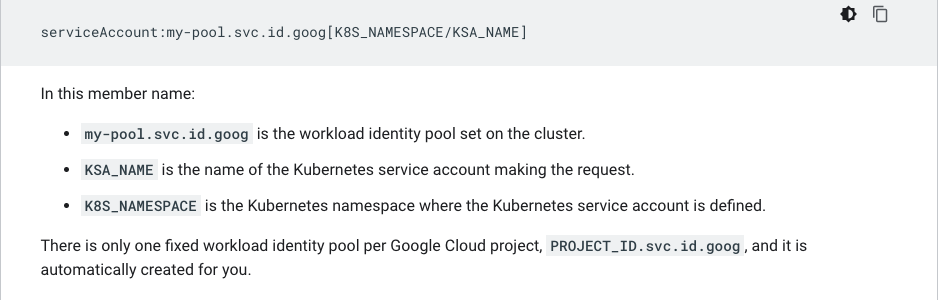

### GCP IAM

- **Members** are regular user accounts in GCP and can be assigned **Roles**. 

- - AWS analogue - IAM Users

- **Resources** are objects in GCP such as Folders, GKE clusters, Compute Engine VMs , Cloud Storage buckets, KMS keys and more.

- - AWS analogue - AWS services and objects such as S3, Lambda, IAM groups

- **Permissions** are a three part policy that allows or denies access to **Resources** in GCP. They are formatted as such: *service.resource.action* and often correspond directly to API calls for GCP services.

- - AWS analogue - IAM Policy Permissions

- **Roles** are collections of permissions and can be assigned to **Members** and **Service Accounts.** The roles assigned to a member are defined in a **Policy**.

- - AWS analogue - IAM Policies

- **Service Accounts** are user accounts intended to be assigned to GCP **Resources**, such as Compute Engine.

- - AWS analogue - IAM Roles

- **Policies** define the relationship between **Members** and **Roles** and are attached to GCP **Resources.** This is used to ensure authorization is acquired when members request access to resources and reject them if it is not. Policies can also be attached to GCP Projects and all Members in that Project will be authorized by the Policy.

- - AWS analogue - IAM Trust Relationships

- **Workload Identity** allows GKE to map Kubernetes service accounts with GCP **Service Accounts**.

- - AWS analogue - None (KIAM)

GCP Object Hierarchy - Permissions are transitive and flow from global->local

1. **Organization**
2. **Folder**
3. **Project**
4. **Resource**

GCP Role Hierarchy

1. **Basic/Primitive -** Viewer, Editor, Owner. Grants thousands of permissions if applied. Owner includes Editor which includes Viewer
2. **Predefined** - Google managed, pre-created roles for common use-cases such as Compute Administration or Monitoring
3. **Custom -** User created roles that provide granular permission management for users/resources

Example IAM Policy in GCP:

```json
{
  "bindings": [
    {
      "role": "roles/storage.objectAdmin",
       "members": [
         "user:ali@example.com",
         "serviceAccount:my-other-app@appspot.gserviceaccount.com",
         "group:admins@example.com",
         "domain:google.com"
       ]
    },
    {
      "role": "roles/storage.objectViewer",
      "members": [
        "user:maria@example.com"
      ]
    }
  ]
}
```

#### Authentication Overview

GCP supports two types of **Principals/Identities** that can be granted access to resources.

1. **Google Accounts (member accounts)**
2. **Service Accounts** (Only 100 user defined Service Accounts can be created in a project).

##### Authentication Credentials types

Requests made with one of these to a Google API are considered requests from a **Registered Application** but may also require a **Principal** to be provided to grant access to the requested resources.

1. **API Key** - Traditional string password associated with a Member
2. **Service Account Key** - RSA keypair that can be managed by Google or by the user used by Service Accounts
3. **OAuth 2.0 client credentials**

Google recommends using the Google Client libraries to set up authentication requests to Google APIs. All Google APIs use OAuth 2.0 to authenticate users if identity is required. If anonymity is valid, then only using an API key will suffice. Service Accounts can access data within Google Cloud from services like Compute Engine, App Engine, Cloud Functions, GKE, etc using automatically injected service account credentials. If the request is coming from a user managed Service Account, then you need to provide the private key to the client to facilitate the request. In this case, Google holds the public portion of the keypair and will authenticate the service account and subsequently generate client credentials for use in the environment the service account is executed from.

In the case of GKE and Compute service accounts, client libraries will be able to automatically find the credentials using the ENV variable `GOOGLE_APPLICATION_CREDENTIALS`. If this variable isn't set, the library will attempt to authenticate using the default service account on the resource. If there is no default service account available or if the default account lacks the permissions to use the API you are attempting to call, the request for authentication will be rejected. The variable will be set automatically if using a Google Managed Service Account, and needs to be set to the filepath of the RSA Private Key belonging to the Service Account if the account is User Managed.

##### Service Accounts types:

1. **Default Service Accounts** - https://cloud.google.com/iam/docs/service-accounts#default
2. **User Managed** - created by the user. Requires managing the RSA private key and providing it during client authentication to Google APIs via ENV variable or directly.
3. **Google Managed -**  automatically created and managed by Google and contains common permission scopes needed and/or desired for Google Services that support it.

The `roles/iam.serviceAccountUser` role can be assigned to user accounts and applied at either project or service account level. This allows a user to assume the same permissions as the service account.

Services can also request **Short-Lived** credentials to authenticate with Google services using a temporary credential set. These can be OpenID Auth tokens, OAuth 2.0 credentials, JWTs, or blobs. For this to occur, you can use one service as a Token Granter using the role `roles/iam.serviceAccountTokenCreator` on another service account that will be assumed by the client using the temporary credentials.

#### Authenticating GKE Services as GCP Service Accounts

Prior to the introduction of Workflow Identity, services running in Kubernetes had two options to authenticate as a service account:

1. Use the private key of a service account scoped for the needs of the K8s service account, usually loaded in an ENV var.
2. Use the service account assigned to the node.

Neither of these options are ideal. Workflow Identity provides a mechanism to federate K8s service accounts by tying them to GCP service accounts. Once Workflow Identity is enabled on a GKE cluster, Kubernetes service accounts can be bound to GCP Service Accounts via an API call. 



If there are multiple GKE clusters sharing an Identity Pool that contain identical K8s namespaces and service names, then the mapping shown above will apply to any Kubernetes service account in those clusters that matches. This allows for cross-cluster identity management.

The GKE metadata server takes a few seconds to start to run on a newly created Pod. Therefore, attempts to authenticate or authorize using Workload Identity made within the first few seconds of a Pod's life may fail. Retrying the call will resolve the problem.