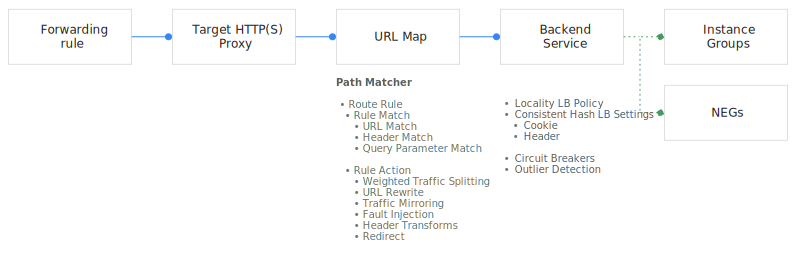

## Cloud Load Balancing

> References:
> https://cloud.google.com/load-balancing/docs/concepts
> https://cloud.google.com/load-balancing/docs/how-to

A load balancer distributes user traffic across multiple instances of your applications. By spreading the load, load balancing reduces the risk that your applications experience performance issues. Cloud Load Balancing is a fully distributed, software-defined managed service. It isn't hardware-based, so you don't need to manage a physical load balancing infrastructure.

#### Types of Cloud Load Balancing

| Internal or external | Regional or global                                           | Supported network tiers | Proxy or pass-through | Traffic type  | Load balancer type |
| -------------------- | ------------------------------------------------------------ | ----------------------- | --------------------- | ------------- | ------------------ |
| Internal             | Regional                                                     | Premium only            | Pass-through          | TCP or UDP    | Internal TCP/UDP   |
|                      | Regional                                                     | Premium only            | Proxy                 | HTTP or HTTPS | Internal HTTP(S)   |
| External             | Regional                                                     | Premium or Standard     | Pass-through          | TCP or UDP    | TCP/UDP Network    |
|                      | Global in Premium Tier                                       | Premium or Standard     | Proxy                 | TCP           | TCP Proxy          |
|                      | Effectively regional[1](https://cloud.google.com/load-balancing/docs/load-balancing-overview#gfe-tier-note) in        Standard Tier | Premium or Standard     | Proxy                 | SSL           | SSL Proxy          |
|                      |                                                              | Premium or Standard     | Proxy                 | HTTP or HTTPS | External HTTP(S)   |

#### Global versus regional load balancing

Use **global load balancing** when your backends are distributed across multiple regions, your users need access to the same applications and content, and you want to provide access by using a single anycast IP address. Global load balancing can also provide IPv6 termination.

Use **regional load balancing** when your backends are in one region, and you only require IPv4 termination.

#### External versus internal load balancing

- **External load balancers** distribute traffic coming from the internet to your VPC network.
- **Internal load balancers** distribute traffic to instances inside of Google Cloud.

#### Traffic type

- HTTP and HTTPS
  - External HTTP(S) Load Balancing
  - Internal HTTP(S) Load Balancing
- TCP
  - TCP Proxy Load Balancing
  - Network Load Balancing
  - Internal TCP/UDP Load Balancing
- UDP
  - Network Load Balancing
  - Internal TCP/UDP Load Balancing

#### Backend region and network

All backends must be in the same VPC network and the same region as the backend service. The backend service must also be in the same region and VPC network as the forwarding rule (except Premium Tier).

#### DDoS protections for external load balancers

All of the Google Cloud proxy-based external load balancers automatically inherit DDoS protection from Google Front Ends (GFEs), which are part of Google's production infrastructure.

In addition to the automatic DDoS protection provided by the GFEs, you can configure [Google Cloud Armor](https://cloud.google.com/armor/docs) for external HTTP(S) load balancers.

#### The underlying technology of Google Cloud load balancers

- [Google Front Ends (GFEs)](https://cloud.google.com/security/security-design#google_front_end_service) are software-defined, distributed systems that are located in Google points of presence (PoPs) and perform global load balancing in conjunction with other systems and control planes.
- [Andromeda](https://cloudplatform.googleblog.com/2014/04/enter-andromeda-zone-google-cloud-platforms-latest-networking-stack.html) is Google Cloud's software-defined network virtualization stack.
- [Maglev](https://research.google.com/pubs/pub44824.html) is a distributed system for Network Load Balancing.
- [Envoy proxy](https://www.envoyproxy.io/) is an open source edge and service proxy, designed for cloud-native applications.

## Internal HTTP(S) Load Balancing

Internal HTTP(S) Load Balancing is a proxy-based, regional Layer 7 load balancer that enables you to run and scale your services behind an internal IP address.

It distributes HTTP and HTTPS traffic to backends hosted on Compute Engine and Google Kubernetes Engine (GKE). The load balancer is accessible only in the chosen region of your Virtual Private Cloud (VPC) network on an internal IP address.

At a high level, an internal HTTP(S) load balancer consists of:
- **An internal IP address to which clients send traffic** (same region as the load balancer).
- **One or more backend services to which the load balancer forwards traffic** - can be Compute Engine VMs, groups of Compute Engine VMs (through instance groups), or GKE nodes (through network endpoint groups [NEGs]). These backends must be located in the same region as the load balancer.
- **A [URL map](https://cloud.google.com/load-balancing/docs/url-map-concepts)**, which defines traffic control rules (based on Layer 7 parameters such as HTTP headers) that map to specific backend services. The load balancer evaluates incoming requests against the URL map to route traffic to backend services or perform additional actions (such as redirects).
- **Health checks**, which periodically check the status of backends and reduce the risk that client traffic is sent to a non-responsive backend.

#### Google Cloud resources required for an internal HTTP(S) load balancer

**Proxy-only subnet** provides a set of IP addresses that Google uses to run Envoy proxies. You must create one proxy-only subnet in each region of a VPC network. All your internal HTTP(S) load balancers in a region and VPC network share the same proxy-only subnet because all internal HTTP(S) load balancers in the region and VPC network share a pool of Envoy proxies.

Each internal HTTP(S) load balancer uses these Google Cloud configuration resources:
- An **internal managed forwarding rule** specifies an internal IP address, port, and regional target HTTP(S) proxy. Clients use the IP address and port to connect to the load balancer's Envoy proxies – the forwarding rule's IP address is the IP address of the load balancer.
- A **regional target HTTP(S) proxy** terminates HTTP(S) connections from clients. The load balancer preserves the Host header of the original client request. The load balancer also appends two IP addresses to the `X-Forwarded-For` header.
- The HTTP(S) proxy uses a **regional URL map** to make a routing determination based on HTTP attributes (such as the request path, cookies, or headers). Based on the routing decision, the proxy forwards client requests to specific regional backend services. 
- A **regional backend service** distributes requests to healthy backends (either instance groups containing Compute Engine VMs or NEGs containing GKE containers).
- One or more **backends** must be connected to the backend service.
- A **regional health check** periodically monitors the readiness of your backends.

#### SSL certificates

If you are using HTTPS-based load balancing, you must install one or more [SSL certificates](https://cloud.google.com/load-balancing/docs/ssl-certificates) on the target HTTPS proxy. These certificates are used by target HTTPS proxies to secure communications between the load balancer and the client.

#### Firewall rules

Your internal HTTP(S) load balancer requires the following firewall rules:
- An ingress allow rule [to permit traffic from the health check ranges](https://cloud.google.com/load-balancing/docs/health-checks#fw-rule)
- An ingress allow rule that permits traffic from the [proxy-only subnet](https://cloud.google.com/load-balancing/docs/l7-internal/proxy-only-subnets)

#### Timeouts and retries

Internal HTTP(S) Load Balancing has two distinct types of timeouts:
- A configurable HTTP **backend service timeout**, which represents the amount of time the load balancer waits for your backend to return a complete HTTP response.
- A **TCP session timeout**, whose value is fixed at 10 minutes (600 seconds).

#### WebSocket support

Google Cloud HTTP(S)-based load balancers have native support for the WebSocket protocol when you use HTTP or HTTPS as the protocol to the backend.

#### Traffic types, scheme, and scope

Backend services support the HTTP, HTTPS, or HTTP/2 protocols. Clients and backends do not need to use the same request protocol. Because the scope of an internal HTTP(S) load balancer is regional, not global, clients and backend VMs or endpoints must all be in the same region.

---

Internal HTTP(S) Load Balancing supports networks that use Shared VPC. 

---

#### Limitations

- Internal HTTP(S) Load Balancing operates at a regional level.

- There's no guarantee that a request from a client in one zone of the region is sent to a backend that's in the same zone as the client.

- Internal HTTP(S) Load Balancing isn't compatible with the following features:
  - [Identity-Aware Proxy](https://cloud.google.com/iap)
  - [Cloud CDN](https://cloud.google.com/cdn/docs)
  - [Google Cloud Armor](https://cloud.google.com/armor/docs)
  - [Cloud Storage](https://cloud.google.com/storage/docs) buckets
  - [Google-managed SSL certificates](https://cloud.google.com/load-balancing/docs/ssl-certificates/google-managed-certs)
  - [SSL policies](https://cloud.google.com/load-balancing/docs/ssl-policies-concepts)

- Supports HTTP/2 only over TLS.
- etc.

## Traffic management overview for internal HTTP(S) load balancers

Internal HTTP(S) Load Balancing supports advanced traffic management functionality that enables you to use the following features:
- **Traffic steering.** Intelligently route traffic based on HTTP(S) parameters (for example, host, path, headers, and other request parameters).
- **Traffic actions.** Perform request-based and response-based actions (for example, redirects and header transformations).
- **Traffic policies.** Fine-tune load balancing behavior (for example, advanced load balancing algorithms).

At a high level, internal HTTP(S) load balancers provide traffic management by leveraging [regional URL maps](https://cloud.google.com/compute/docs/reference/rest/v1/regionUrlMaps) and [regional backend services](https://cloud.google.com/compute/docs/reference/rest/v1/regionBackendServices) resources.

#### Routing requests to backends

Logical flow of a **simple host and path rule:**

**Advanced host, path, and route rules** provide additional configuration options compared to simple host and path rules. These options enable more advanced traffic management patterns and also modify some of the semantics. 

#### Traffic policies

- Control the load balancing algorithm among instances within the backend service.
- Control the volume of connections to an upstream service.
- Control the eviction of unhealthy hosts from a backend service.

## Internal HTTP(S) Load Balancing and connected networks

#### Using VPC Network Peering

When you use [VPC Network Peering](https://cloud.google.com/vpc/docs/vpc-peering#internal_load_balancing) to connect your VPC network to another network, Google Cloud shares subnet routes between the networks. The subnet routes allow traffic from the peer network to reach internal load balancers in your network. 

- For internal TCP/UDP load balancers, you must create ingress firewall rules to allow traffic from client VMs in the peer network.
- Client virtual machine (VM) instances in the peer network are located in the same region as your internal load balancer — unless (for internal TCP/UDP load balancer only) you configure [global access](https://cloud.google.com/load-balancing/docs/l7-internal/internal-https-lb-and-other-networks#global_access).

All internal load balancers are shared automatically.

#### Using Cloud VPN and Cloud Interconnect

You can access an internal load balancer from a peer network that is connected through a [Cloud VPN tunnel](https://cloud.google.com/vpn/docs/concepts/overview) or interconnect attachment (VLAN) for a [Dedicated Interconnect](https://cloud.google.com/interconnect/docs/concepts/dedicated-overview) connection or [Partner Interconnect](https://cloud.google.com/interconnect/docs/concepts/partner-overview). The peer network can be an on-premises network, another Google Cloud VPC network, or a virtual network hosted by a different cloud provider.

## Setting up Internal HTTP(S) Load Balancing

1. A VPC network with two subnets:
   1. Backends (instance groups and NEGs) and the forwarding rule.
   2. Proxy-only subnet in the `us-west1` region.
2. A firewall rule that permits proxy-only subnet traffic flows in your network (allows TCP port `80`, `443`, and `8080` traffic from `10.129.0.0/23`).
3. Backend instances: Compute Engine VMs and GKE backends added to [standalone network endpoint groups (NEGs)](https://cloud.google.com/kubernetes-engine/docs/how-to/standalone-neg).
4. Instance groups and NEGs.
5. A regional health check that reports the readiness of your backends.
6. A regional backend service that monitors the usage and health of backends.
7. A regional URL map that parses the URL of a request and forwards requests to specific backend services based on the host and path of the request URL.
8. A regional target HTTP or HTTPS proxy, which receives a request from the user and forwards it to the URL map.
9. A forwarding rule, which has the internal IP address of your load balancer, to forward each incoming request to the target proxy.

## External HTTP(S) Load Balancing overview

External HTTP(S) Load Balancing supports the following backend types:
- [Instance groups](https://cloud.google.com/compute/docs/instance-groups)
- [Zonal network endpoint groups (NEGs)](https://cloud.google.com/load-balancing/docs/negs/zonal-neg-concepts)
- [Serverless NEGs](https://cloud.google.com/load-balancing/docs/negs/serverless-neg-concepts): One or more [App Engine](https://cloud.google.com/appengine/docs), [Cloud Run](https://cloud.google.com/run/docs), or [Cloud Functions](https://cloud.google.com/functions/docs) services
- [Internet NEGs](https://cloud.google.com/load-balancing/docs/negs/internet-neg-concepts), for endpoints that are outside of Google Cloud (also known as custom origins)
- Buckets in [Cloud Storage](https://cloud.google.com/storage/docs)

#### How connections work in HTTP(S) Load Balancing

The external HTTP(S) load balancers are reverse proxy load balancers. The load balancer terminates incoming connections, and then opens new connections from the load balancer to the backends. The reverse proxy functionality is provided by the Google Front Ends (GFEs). There isn't just a single proxy. In Premium Tier, the same global external IP address is advertised from various points of presence, and traffic is directed to the client's nearest GFE.

Multiple GFEs can initiate HTTP(S) connections to your backends. Packets sent from GFEs have source IP addresses from the same range used by health check probers: `35.191.0.0/16` and `130.211.0.0/22`.

Protocol used by each GFE to connect to your backends can be HTTP, HTTPS, or HTTP/2.

HTTP(S) Load Balancing is a global service when the Premium [Network Service Tier](https://cloud.google.com/network-tiers/docs/overview) is used. You may have more than one backend service in a region, and you may create backend services in more than one region, all serviced by the same global load balancer. 

#### Architecture and resources

- An **external forwarding rule** specifies an external IP address, port, and global target HTTP(S) proxy. Clients use the IP address and port to connect to the load balancer.
- A **global target HTTP(S) proxy** receives a request from the client. The HTTP(S) proxy evaluates the request by using the URL map to make traffic routing decisions. The proxy can also authenticate communications by using SSL certificates. [Target proxies](https://cloud.google.com/load-balancing/docs/target-proxies) terminate HTTP(S) connections from clients. 
- A **global SSL certificates** to prove its identity to clients.
- A **global URL map** to make a routing determination based on HTTP attributes (such as the request path, cookies, or headers).
- A **backend service** or **backend bucket** distributes requests to healthy [backends](https://cloud.google.com/load-balancing/docs/features#backends).
- One or more **backends** must be connected to the backend service or backend bucket. Backends can be instance groups, NEGs or buckets.
- A **global health check** periodically monitors the readiness of your backends. This reduces the risk that requests might be sent to backends that can't service the request.
- A **firewall** for your backends to accept health check probes.

#### Load distribution algorithm

Before a Google Front End (GFE) sends requests to backend instances, the GFE estimates which backend instances have capacity to receive requests. This capacity estimation is made proactively, not at the same time as requests are arriving. The GFEs receive periodic information about the available capacity and distribute incoming requests accordingly.

External HTTP(S) Load Balancing supports two balancing modes:
- `RATE`, for instance groups or NEGs, is the target maximum number of requests (queries) per second (RPS, QPS). The target maximum RPS/QPS can be exceeded if all backends are at or above capacity.
- `UTILIZATION` is the backend utilization of VMs in an instance group.

#### Session affinity

Google Cloud HTTP(S) Load Balancing offers three types of session affinity:
- NONE. Session affinity is not set for the load balancer.
- [Client IP affinity](https://cloud.google.com/load-balancing/docs/backend-service#client_ip_affinity) sends requests from the same client IP address to the same backend.
- [Generated cookie affinity](https://cloud.google.com/load-balancing/docs/backend-service#generated_cookie_affinity) sets a client cookie when the first request is made, and then sends requests with that cookie to the same backend.

#### WebSocket support

Google Cloud HTTP(S)-based load balancers have native support for the WebSocket protocol when you use HTTP or HTTPS as the protocol to the backend. The load balancer does not need any configuration to proxy WebSocket connections.

#### QUIC protocol support for HTTPS Load Balancing

HTTPS Load Balancing supports the [QUIC protocol](https://www.chromium.org/quic)  in connections between the load balancer and the clients.

#### Timeouts and retries

HTTP(S) Load Balancing has two distinct types of timeouts:
- A configurable HTTP **backend service timeout**, which represents the amount of time the load balancer waits for your backend to return a complete HTTP response. The default value for the backend service timeout is 30 seconds.
- A **TCP session timeout**, whose value is fixed at 10 minutes (600 seconds).

#### Illegal request and response handling

The external HTTP(S) load balancer blocks both client requests and backend responses from reaching the backend or the client, respectively, for a number of reasons: https://cloud.google.com/load-balancing/docs/https#illegal_request_and_response_handling

## Traffic management overview for external HTTP(S) load balancers

At a high level, external HTTP(S) load balancers provide traffic management by using [global URL maps](https://cloud.google.com/compute/docs/reference/rest/v1/urlMaps).

The load balancer provides the following mutually exclusive primary actions:
- Route requests to a backend service
- Perform a redirect

When you set up a load balancer, you can configure a URL rewrite action before the load balanacer sends requests to the backend service or backend bucket. 

Rewrites or redirects can be applied at three levels in the URL map:
- At the `pathRule` where the action takes effect when a path is matched
- At the `pathMatcher` where the action takes effect when no paths are matched for this `pathMatcher`
- At the `urlMap` where the action takes effect when none of the hosts specified in any of the host rules are matched

External HTTP(S) Load Balancing supports advanced traffic management functionality that enables you to use the following features:
- Traffic steering. Intelligently route traffic based on HTTP(S) parameters:
  - [Host and path](https://cloud.google.com/load-balancing/docs/https/setting-up-https)
- Traffic actions. Perform request-based actions:
  - [Rewrites](https://cloud.google.com/load-balancing/docs/https/setting-up-url-rewrite)
  - [Redirects](https://cloud.google.com/load-balancing/docs/https/setting-up-http-https-redirect)
  - [Header-based and parameter-based routing](https://cloud.google.com/load-balancing/docs/https/setting-up-query-and-header-routing)
- Traffic policies. Fine-tune load balancing behavior:
  - [Timeouts](https://cloud.google.com/sdk/gcloud/reference/compute/backend-services/create#--timeout)
  - [Max rates and max connections](https://cloud.google.com/sdk/gcloud/reference/compute/backend-services/add-backend)

#### Routing requests to backends

In HTTP(S) Load Balancing, the backend for your traffic is determined by using a two-phased approach:
- The load balancer selects a backend service with backends.
- The backend service selects a backend instance based on policies defined in a [global backend service](https://cloud.google.com/compute/docs/reference/rest/v1/backendServices).

When you configure routing, you can choose between the following modes:
- Simple host and path testing, by using `pathRules`
- Advanced request testing, by using `routeRules`

## Setting up an external HTTP load balancer

Simple **HTTP** Load Balancing:

Simple **HTTPS** Load Balancing:

## Creating custom headers

Custom headers work as follows:
- When the external HTTP(S) load balancer makes a request to the backend, the load balancer adds request headers.
- The external HTTP(S) load balancer sets response headers before returning the responses to the client.

## HTTP(S) Load Balancing Logging and Monitoring

You can enable, disable, and view logs for an HTTP(S) Load Balancing [backend service](https://cloud.google.com/load-balancing/docs/backend-service).

HTTP(S) Load Balancing exports monitoring data to [Cloud Monitoring](https://cloud.google.com/monitoring/docs).

## Network endpoint groups (NEG) overview

A network endpoint group (NEG) is a configuration object that specifies a group of backend endpoints or services. A common use case for this configuration is deploying services in containers. You can also distribute traffic in a granular fashion to applications running on your backend instances.

You can use NEGs as [backends](https://cloud.google.com/load-balancing/docs/features#backends) for some load balancers.

Zonal and internet NEGs define how endpoints should be reached, whether they are reachable, and where they are located. Unlike these NEG types, serverless NEGs don't contain endpoints.

A *zonal NEG* contains one or more endpoints that can be Compute Engine VMs or services running on the VMs. Each endpoint is specified as an `IP:port` combination.

An *internet NEG* contains a single endpoint that is hosted outside of Google Cloud. This endpoint is specified by hostname `FQDN:port` or `IP:port`.

A *serverless NEG* points to [Cloud Run](https://cloud.google.com/run/docs), [App Engine](https://cloud.google.com/appengine/docs), [Cloud Functions](https://cloud.google.com/functions/docs) services residing in the same region as the NEG.

### Internet NEG

An internet NEG is a backend that resides outside of Google Cloud. You can use an internet NEG as the backend for a backend service for a Google Cloud external HTTP(S) load balancer. You should do this when you want to serve content from an origin that is hosted outside of Google Cloud, and you want your external HTTP(S) load balancer to be the frontend.

You can use Internet NEG only with [external HTTP(S) Load Balancing](https://cloud.google.com/load-balancing/docs/https). 

When you [create an internet network endpoint group](https://cloud.google.com/load-balancing/docs/negs/setting-up-internet-negs), you specify the network endpoint type of `INTERNET_FQDN_PORT` or `INTERNET_IP_PORT`.

### Serverless NEG

A serverless NEG can represent:
- A Cloud Run service or a group of services sharing the same URL pattern.
- A Cloud Functions function or a group of functions sharing the same URL pattern.
- An App Engine app (Standard or Flex), a specific service within an app, or even a specific version of an app.

You can use Internet NEG only with [external HTTP(S) Load Balancing](https://cloud.google.com/load-balancing/docs/https). 

Serverless NEGs do not have any network endpoints such as ports or IP addresses. They can only point to an existing [Cloud Run (fully managed)](https://cloud.google.com/run/docs), [App Engine](https://cloud.google.com/appengine/docs), or [Cloud Functions](https://cloud.google.com/functions/docs) service residing in the same region as the NEG.

When you create a serverless NEG, you specify the fully-qualified domain name (FQDN) of the [Cloud Run (fully managed)](https://cloud.google.com/run/docs), [App Engine](https://cloud.google.com/appengine/docs), or [Cloud Functions](https://cloud.google.com/functions/docs) service. The endpoint is of type `SERVERLESS`.

### Zonal NEG

Resources that represent collections of IP address and port combinations for Google Cloud resources within a single [subnet](https://cloud.google.com/vpc/docs/vpc#vpc_networks_and_subnets). Each IP address and port combination is called a *network endpoint*.

You cannot use zonal NEGs as a backend with internal TCP/UDP load balancers. 

Because zonal NEG backends allow you to specify IP addresses and ports, you can distribute traffic in a granular fashion among applications or containers running *within* VM instances.

You cannot use instance groups and zonal NEGs as backends in the same backend service.

Backend services using zonal NEGs for backends can only use balancing modes of `RATE` or `CONNECTION`. You **cannot** use a balancing mode of `UTILIZATION`.
