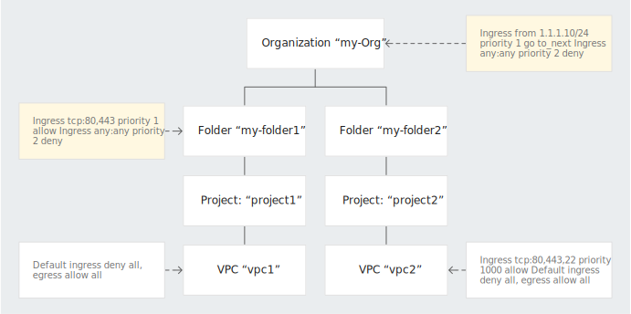
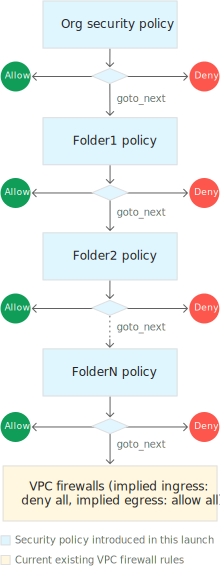

# VPC firewall

> References:
> https://cloud.google.com/vpc/docs/firewalls
> https://cloud.google.com/vpc/docs/using-firewalls
> https://cloud.google.com/vpc/docs/using-firewall-policies


Virtual Private Cloud (VPC) firewall rules apply to a **given project and network.**
VPC firewall rules let you allow or deny connections to or from your virtual machine (VM) instances. 
Every VPC network functions as a distributed firewall. While firewall rules are **defined at the network level**, connections are allowed or denied on a per-instance basis.

#### Specifications

VPC firewall rules have the following characteristics:

- Each firewall rule applies to incoming (ingress) or outgoing (egress) connection, not both.
- Firewall rules only support IPv4 connections.
- Each firewall rule's action is either `allow` or `deny`. The rule applies to connections as long as it is [enforced](https://cloud.google.com/vpc/docs/firewalls#enforcement).
- When you create a firewall rule, you must select a VPC network. While the rule is enforced at the instance level, its configuration is associated with a VPC network.
- VPC firewall rules are [stateful](https://wikipedia.org/wiki/Stateful_firewall): 
  - When a connection is allowed through the firewall in either direction, **return traffic** matching this connection is also allowed.
  - Return traffic must match the 5-tuple (source IP, destination IP, source port, destination port, protocol) of the accepted request traffic, but with the source and destination addresses and ports reversed.
  - Google Cloud associates incoming packets with corresponding outbound packets by using a connection tracking table.
  - Google Cloud implements connection tracking regardless of whether the protocol supports connections. If a connection is allowed between a source and a target (for an ingress rule) or between a target and a destination (for an egress rule), all response traffic is allowed as long as the firewall's connection tracking state is active. A firewall rule's tracking state is considered active if at least one packet is sent every 10 minutes.
  - ICMP response traffic, such as "ICMP TYPE 3, DESTINATION UNREACHABLE", generated in response to an allowed TCP/UDP connection is allowed through the firewall. This behavior is consistent with [RFC 792](https://tools.ietf.org/html/rfc792).
- VPC firewall rules do not reassemble fragmented TCP packets.
- The maximum number of tracked connections in the firewall rule table depends on the number of stateful connections supported by the machine type of the instance.

#### Implied rules

These rules exist, but are not shown in the Cloud Console:

- **Implied allow egress rule.** An egress rule whose action is `allow`, destination is `0.0.0.0/0`, and priority is the lowest possible (`65535`) lets any instance send traffic to any destination, except for traffic [blocked](https://cloud.google.com/vpc/docs/firewalls#blockedtraffic) by Google Cloud. A higher priority firewall rule may restrict outbound access. Internet access is allowed if no other firewall rules deny outbound traffic and if the instance has an external IP address or uses a Cloud NAT instance.
- **Implied deny ingress rule.** An ingress rule whose action is `deny`, source is `0.0.0.0/0`, and priority is the lowest possible (`65535`) protects all instances by blocking incoming connections to them. A higher priority rule might allow incoming access. The default network includes some [additional rules](https://cloud.google.com/vpc/docs/firewalls#more_rules_default_vpc) that override this one, allowing certain types of incoming connections.

#### Always blocked traffic

Google Cloud always blocks the traffic that is described in the following table. Your firewall rules cannot be used to allow any of this traffic:
- Certain GRE traffic (beta).
- Protocols other than TCP, UDP, ICMP, AH, ESP, SCTP, and GRE to external  IP addresses of Google Cloud resources.
- Egress traffic to TCP destination port 25 (SMTP).

#### Always allowed traffic

Local metadata server alongside each instance at `169.254.169.254`.

#### Firewall rule components

Each firewall rule consists of the following configuration components:

- The [direction of connection](https://cloud.google.com/vpc/docs/firewalls#direction_of_the_rule): ingress rules apply to incoming connections from specified sources to Google Cloud targets, and egress rules apply to connections going to specified destinations from targets.
- A numerical [priority](https://cloud.google.com/vpc/docs/firewalls#priority_order_for_firewall_rules), which determines whether the rule is applied. Only the highest priority (lowest priority number) rule whose other components match traffic is applied; conflicting rules with lower priorities are ignored.
- An [action on match](https://cloud.google.com/vpc/docs/firewalls#action_of_the_rule), either `allow` or `deny`, which determines whether the rule permits or blocks connections.
- The [enforcement status](https://cloud.google.com/vpc/docs/firewalls#enforcement) of the firewall rule: You can enable and disable firewall rules without deleting them.
- A [target](https://cloud.google.com/vpc/docs/firewalls#rule_assignment), which defines the ==instances== (including ==GKE clusters== and ==App Engine== flexible environment instances) to which the rule applies. You specify a target by using one of the following options:
  - All instances in the network.
  - Instances by target (network) tags.
  - Instances by target service accounts. The firewall rule applies only to instances that use a specific [service account](https://cloud.google.com/vpc/docs/firewalls#serviceaccounts).
- A [source](https://cloud.google.com/vpc/docs/firewalls#sources_or_destinations_for_the_rule) for ingress rules or a destination for egress rules:
  - Source IP ranges.
  - Source tags ([network tag](https://cloud.google.com/vpc/docs/add-remove-network-tags)). Source tags only apply to traffic sent from the network interface of another applicable instance in your VPC network.
  - Source service accounts ([service accounts](https://cloud.google.com/vpc/docs/firewalls#serviceaccounts)). Source service accounts only apply to traffic sent from the network interface of another applicable instance in your VPC network.
  - A combination of source IP ranges and source tags can be used.
  - A combination of source IP ranges and source service accounts can be used.
  - If all source IP ranges, source tags, and source service accounts are omitted, Google Cloud defines the source as any IP address (`0.0.0.0/0`).
- The [protocol (`tcp`, `udp`, `icmp`, `esp`, `ah`, `sctp`, `ipip`)  and port.

#### Source and target filtering by service account

You can use [service accounts](https://cloud.google.com/iam/docs/service-accounts) to create firewall rules that are more specific in nature:
- For both ingress and egress rules, you can use service accounts to specify targets.
- For ingress rules, you can specify the source for incoming packets as the primary internal IP address of any VM in the network where the VM uses a particular service account.

The service account must be [created](https://cloud.google.com/iam/docs/creating-managing-service-accounts) in the same project as the firewall rule before you create a firewall rule that relies on it.

You cannot mix and match service accounts and network tags in any firewall rule.

#### Use cases

Ingress firewall rules control incoming connections from a source to target instances in your VPC network. The source for an ingress rule can be defined as one of the following:
- A range of IPv4 addresses; the default is any (`0.0.0.0/0`).
- Other instances in your VPC network identified by service account.
- Other instances in your VPC network identified by network tags.

Egress firewall rules control outgoing connections from target instances in your VPC network. Egress rules with an `allow` action permit traffic from instances based on the other [components of the rule](https://cloud.google.com/vpc/docs/firewalls#firewall_rule_components).


# Hierarchical firewall policies

Hierarchical firewall policies let you create and enforce a consistent firewall policy across your organization. You can assign hierarchical firewall policies to the organization as a whole or to individual folders. These policies contain rules that can explicitly deny or allow connections, as do [Virtual Private Cloud (VPC) firewall rules](https://cloud.google.com/vpc/docs/firewalls). In addition, hierarchical firewall policy rules can delegate evaluation to lower-level policies or VPC network firewall rules with a `goto_next` action.

Lower-level rules cannot override a rule from a higher place in the resource hierarchy. This lets organization-wide admins manage critical firewall rules in one place.

#### Specifications

- Hierarchical firewall policies can be specified at the organization and folder nodes.
- Hierarchical firewall policies are containers for firewall rules. When you associate a policy with the organization or a folder, all rules are immediately applied. You can swap policies for a node, which atomically swaps all the firewall rules applied to virtual machine (VM) instances under that node.
- Rule evaluation is hierarchical based on resource hierarchy. All rules associated with the organization node are evaluated, followed by those of the first level of folders.
- Hierarchical firewall policy rules have a new `goto_next` action that you can use to delegate connection evaluation to lower levels of the hierarchy.
- Hierarchical firewall policy rules can be targeted to specific VPC networks and VMs by using target resources. This lets you create exceptions for groups of VMs.
- A new feature lets you see which firewall rules are actually applied to a specific network or VM interface, which helps with compliance and debugging.

#### Resource hierarchy



The yellow boxes represent hierarchical firewall policies that contain firewall rules, while the white boxes represent VPC firewall rules.

#### Rule evaluation

Hierarchical firewall policy rules are enforced at the VM level as are VPC firewall rules.



#### Commands

```bash
gcloud compute firewall-rules list --filter network=NETWORK_NAME \
    --sort-by priority \
    --format="table(
        name,
        network,
        direction,
        priority,
        sourceRanges.list():label=SRC_RANGES,
        destinationRanges.list():label=DEST_RANGES,
        allowed[].map().firewall_rule().list():label=ALLOW,
        denied[].map().firewall_rule().list():label=DENY,
        sourceTags.list():label=SRC_TAGS,
        targetTags.list():label=TARGET_TAGS
        )"
        
gcloud beta compute org-security-policies list [--organization ORG_ID | --folder FOLDER_ID]

gcloud beta compute org-security-policies describe POLICY_NAME --organization ORG_ID
```
