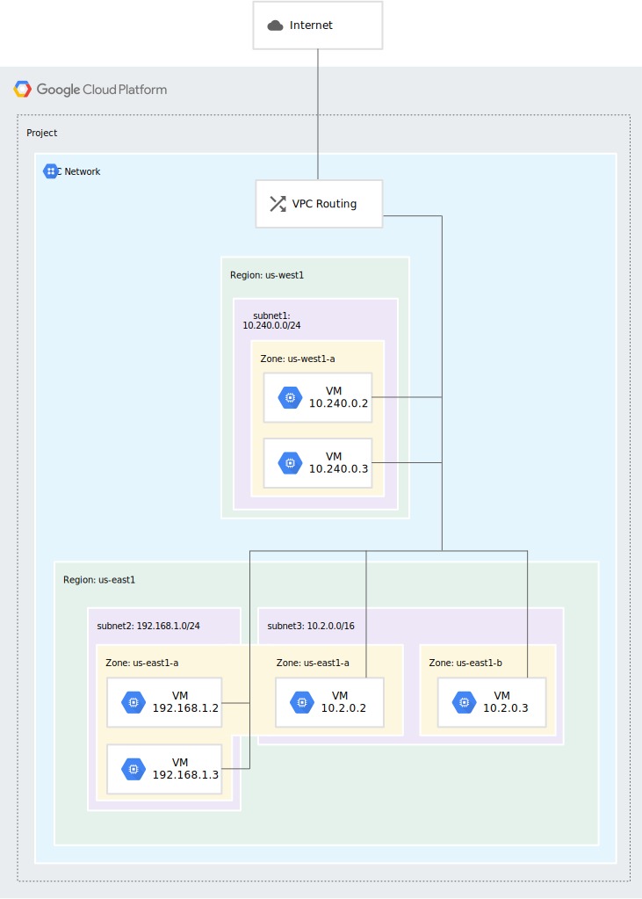
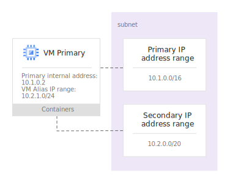

# VPC network overview
> References:
> https://cloud.google.com/vpc/docs/vpc
> https://cloud.google.com/vpc/docs/using-vpc
> https://cloud.google.com/vpc/docs/ip-addresses
> https://cloud.google.com/vpc/docs/alias-ip
> https://cloud.google.com/vpc/docs/multiple-interfaces-concepts


A Virtual Private Cloud (VPC) network is a virtual version of a physical network, implemented inside of Google's production network, using [Andromeda](https://www.usenix.org/system/files/conference/nsdi18/nsdi18-dalton.pdf)( network virtualization stack):
- Provides connectivity for your [Compute Engine virtual machine (VM) instances](https://cloud.google.com/compute/docs/instances), including [Google Kubernetes Engine (GKE) clusters](https://cloud.google.com/kubernetes-engine/docs/concepts/cluster-architecture), [App Engine flexible environment](https://cloud.google.com/appengine/docs/flexible) instances, and other Google Cloud products built on Compute Engine VMs.
- Offers native Internal TCP/UDP Load Balancing and proxy systems for Internal HTTP(S) Load Balancing.
- Connects to on-premises networks using Cloud VPN tunnels and Cloud Interconnect attachments.
- Distributes traffic from Google Cloud external load balancers to backends.

Projects can contain multiple VPC networks. New projects start with a default network (an auto mode VPC network) that has one subnetwork (subnet) in each region.

#### Specifications

VPC networks have the following properties:
- VPC networks are [global resources](https://cloud.google.com/compute/docs/regions-zones/global-regional-zonal-resources#globalresources).
- Subnets are [regional resources](https://cloud.google.com/compute/docs/regions-zones/global-regional-zonal-resources#regionalresources). Each subnet defines a range of IP addresses.
- Traffic to and from instances can be controlled with network [firewall rules](https://cloud.google.com/vpc/docs/vpc#firewall_rules). Rules are implemented on the VMs themselves, so traffic can only be controlled and logged as it leaves or arrives at a VM.
- Resources within a VPC network can communicate with one another by using internal (private) IPv4 addresses, subject to applicable network firewall rules.
- Instances with internal IP addresses can communicate with [Google APIs and services](https://developers.google.com/apis-explorer/).
- Network administration can be secured by using [Identity and Access Management (IAM)](https://cloud.google.com/iam/docs) roles.
- An [organization](https://cloud.google.com/resource-manager/docs/cloud-platform-resource-hierarchy#organizations) can use [Shared VPC](https://cloud.google.com/vpc/docs/shared-vpc) to keep a VPC network in a common host project. Authorized IAM members from other projects in the same organization can create resources that use subnets of the Shared VPC network.
- VPC networks can be connected to other VPC networks in different projects or organizations by using [VPC Network Peering](https://cloud.google.com/vpc/docs/vpc-peering).
- VPC networks can be securely connected in hybrid environments by using [Cloud VPN](https://cloud.google.com/network-connectivity/docs/vpn/concepts/overview) or [Cloud Interconnect](https://cloud.google.com/network-connectivity/docs/interconnect/concepts/overview).
- VPC networks support [GRE](https://wikipedia.org/wiki/Generic_Routing_Encapsulation)  traffic (beta) except traffic on Cloud VPN, Cloud Interconnect, Cloud NAT, and forwarding rules for [load balancing](https://cloud.google.com/load-balancing/docs/forwarding-rule-concepts) and [protocol forwarding](https://cloud.google.com/compute/docs/protocol-forwarding). GRE enables you to use services such as secure access service edge (SASE) and [SD-WAN](https://wikipedia.org/wiki/SD-WAN).
- VPC networks only support IPv4 [unicast](https://wikipedia.org/wiki/Unicast) traffic. They do **not** support [broadcast](https://wikipedia.org/wiki/Broadcasting_(networking)), [multicast](https://wikipedia.org/wiki/IP_multicast), or IPv6 traffic *within* the network; VMs in the VPC network can only send to IPv4 destinations and only receive traffic from IPv4 sources. However, it is possible to create an IPv6 address for a [global load balancer](https://cloud.google.com/load-balancing/docs/ipv6).

#### Networks and subnets

VPC network consists of one or more useful IP range partitions called subnets. Each subnet is associated with a region. VPC networks do not have any IP address ranges associated with them. IP ranges are [defined for the subnets](https://cloud.google.com/vpc/docs/vpc#manually_created_subnet_ip_ranges). 

When you create a subnet, you must define its primary IP address range. The primary internal addresses for the following resources come from the subnet's primary range: VM instances, internal load balancers, and internal protocol forwarding. You can optionally add secondary IP address ranges to a subnet, which are only used by [alias IP ranges](https://cloud.google.com/vpc/docs/alias-ip). 

Every subnet has four reserved IP addresses in its primary IP range. There are no reserved IP addresses in the secondary IP ranges.

#### Routes

Routes define paths for packets leaving instances (egress traffic). Routes in Google Cloud are divided into two categories: system-generated and custom.

System-generated routes:
- The [default route](https://cloud.google.com/vpc/docs/routes#routingpacketsinternet) defines a path for traffic to leave the VPC network. It provides general internet access to VMs that meet the [internet access requirements](https://cloud.google.com/vpc/docs/vpc#internet_access_reqs). It also provides the typical path for Private Google Access.
- A [subnet route](https://cloud.google.com/vpc/docs/routes#subnet-routes) is created for each of the IP ranges associated with a subnet. Every subnet has at least one subnet route for its primary IP range. Additional subnet routes are created for a subnet if you add secondary IP ranges to it. Subnet routes define paths for traffic to reach VMs that use the subnets. You cannot remove subnet routes manually.

For one instance to be able to communicate with another, appropriate firewall rules must also be configured because every network has an implied deny firewall rule for ingress traffic.

The default network includes several firewall rules in addition to the implied ones, including the `default-allow-internal` rule, which permits instance-to-instance communication within the network. The default network also comes with ingress rules allowing protocols such as RDP and SSH.

#### Dynamic routing mode

Each VPC network has an associated dynamic routing mode that controls the behavior of all of its [Cloud Routers](https://cloud.google.com/network-connectivity/docs/router/concepts/overview). Cloud Routers share routes to your VPC network and learn custom dynamic routes from connected networks when you connect your VPC network to another network by using [a Cloud VPN tunnel that uses dynamic routing](https://cloud.google.com/network-connectivity/docs/vpn/concepts/choosing-networks-routing#dynamic-routing), or by using [Dedicated Interconnect](https://cloud.google.com/network-connectivity/docs/interconnect/concepts/dedicated-overview) or [Partner Interconnect](https://cloud.google.com/network-connectivity/docs/interconnect/concepts/partner-overview).

#### Firewall rules

Firewall rules apply to both outgoing (egress) and incoming (ingress) traffic in the network. Firewall rules control traffic even if it is entirely within the network, including communication among VM instances.

Every VPC network has two [implied firewall rules](https://cloud.google.com/vpc/docs/firewalls#default_firewall_rules). One implied rule allows most egress traffic, and the other denies all ingress traffic. You cannot delete the implied rules, but you can override them with your own. Google Cloud always blocks some traffic, regardless of firewall rules; for more information, see [blocked traffic](https://cloud.google.com/vpc/docs/firewalls#blockedtraffic).

#### Internet access requirements

- The network must have a valid default internet gateway route or custom route whose destination IP range is the most general (`0.0.0.0/0`). This route defines the path to the internet.
- Firewall rules must allow egress traffic from the instance. Unless overridden by a higher priority rule, the implied allow rule for egress traffic permits outbound traffic from all instances.
- One of the following must be true:
  - The instance must have an external IP address. An external IP address can be assigned to an instance [when it is created](https://cloud.google.com/compute/docs/ip-addresses/reserve-static-external-ip-address#assign_new_instance) or [after it has been created](https://cloud.google.com/compute/docs/ip-addresses/reserve-static-external-ip-address#IP_assign).
  - The instance must be able to use [Cloud NAT](https://cloud.google.com/nat/docs) or an instance-based proxy that is the target for a static `0.0.0.0/0` route.

#### Example



#### Commands

```bash
gcloud compute networks list
gcloud compute networks describe NETWORK_NAME

gcloud compute networks subnets list
gcloud compute networks subnets describe SUBNET_NAME --region=REGION
```


# IP addresses

Resources such as VM instances and load balancers have IP addresses in Google Cloud. These IP addresses enable Google Cloud resources to communicate with other resources in Google Cloud, in on-premises networks, or on the public internet:
- External IP address - publicly advertised. Resources with external IP addresses can communicate with the public internet. All external IP addresses must be public addresses. However, you can use certain public IP addresses as internal addresses as well.
- Internal IP address - not publicly advertised. They are used only within a network. Every VPC network or on-premises network has at least one internal IP address range. Resources with internal IP addresses communicate with other resources as if they're all on the same private network. Internal IP addresses can be private addresses or privately reused public IP addresses.
- Private IP address - are internal and cannot be internet routable. All private IP addresses are internal IP addresses; however, not all internal IP addresses are private IP addresses.
- Public IP address - are internet routable. External IP addresses are always public IP addresses. However, public IP addresses are not always external; you can reuse certain public IP addresses as internal IP addresses.

#### Regional and global IP addresses

Google Cloud labels addresses to indicate how a particular address is being used:
- Regional internal addresses
- Global internal addresses
- Regional external addresses
- Global external addresses

#### Ephemeral and static IP addresses

An ephemeral IP address is an IP address that doesn't persist beyond the life of the resource.

Reserving a static IP address assigns the address to your project until you explicitly release it.


# Alias IP ranges

Google Cloud alias IP ranges let you assign ranges of internal IP addresses as aliases to a virtual machine's (VM) network interfaces. This is useful if you have multiple services running on a VM and you want to assign each service a different IP address. Alias IP ranges also work with [GKE Pods](https://cloud.google.com/kubernetes-engine/docs/how-to/ip-aliases).

All [subnets](https://cloud.google.com/compute/docs/vpc) have a primary CIDR range, which is the range of internal IP addresses that define the subnet. Each VM instance gets its primary internal IP address from this range. You can also allocate alias IP ranges from that primary range, or you can add a secondary range to the subnet and allocate alias IP ranges from the secondary range. Use of alias IP ranges does not require secondary subnet ranges.



#### Key benefits of alias IP ranges

Google Cloud automatically installs Virtual Private Cloud (VPC) network routes for primary and alias IP ranges for the subnet of the primary network interface. Your container orchestrator does not need to specify VPC network connectivity for these routes. This simplifies routing traffic and managing your containers.

Validation processes in Google Cloud ensure that container pod IP addresses do not conflict with VM IP addresses.

Anti-spoofing checks are performed against traffic.

Alias IP ranges are routable within the Google Cloud virtual network without requiring additional routes.

Alias IP addresses can be announced by [Cloud Router](https://cloud.google.com/sdk/gcloud/reference/compute/routers/create) to an on-premises network connected via VPN or Interconnect.

#### DNS with alias IP addresses

Cloud does not associate alias IP addresses on the primary interface with the host name, and it does not associate any IP addresses of secondary interfaces with the host name. You can manually configure DNS to associate other IP addresses.


# Multiple network interfaces

Every instance in a VPC network has a default network interface. You can create additional network interfaces attached to your VMs. Multiple network interfaces enable you to create configurations in which an instance connects directly to several VPC networks.

#### Use cases

- Network and security function: Multiple network interfaces enable virtualized network appliance functions such as load balancers, network address translation (NAT) servers, and proxy servers that are configured with multiple network interfaces.
- Perimeter and DMZ isolation.

#### Additional operational details

When you create instances with multiple network interfaces, your instances or instance templates can have certain interfaces attached to subnets local to the project, while other interfaces can be attached to Shared VPC networks.

When an internal DNS query is made with the instance hostname, it resolves to the primary interface (`nic0`) of the instance. If the `nic0` interface of the instance belongs to a VPC network different from the VPC network of the instance issuing the internal DNS query, the query will fail.

In a multiple interface instance that uses DHCP, every interface gets a route for the subnet that it is in. In addition, the instance gets a single default route that is associated with the primary interface `eth0`. Any traffic leaving an instance for any destination other than a directly connected subnet will leave the instance via the default route on `eth0`.

When a VM instance has multiple interfaces and a [network tag](https://cloud.google.com/vpc/docs/add-remove-network-tags), the network tag might not impact all of the VM's interfaces.

Except for [Internal TCP/UDP Load Balancing](https://cloud.google.com/load-balancing/docs/internal), all Google Cloud load balancers only distribute traffic to the first interface (`nic0`) of a backend instance.

If an instance's interface is in a particular VPC network, that network's firewall rules apply to that interface.