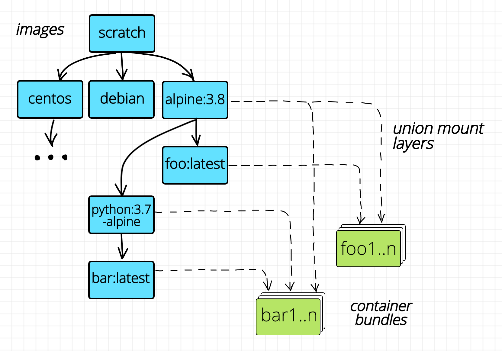

# Does a Container Image Have an OS Inside

> https://iximiuz.com/en/posts/not-every-container-has-an-operating-system-inside/

- [Linux kernel](https://en.wikipedia.org/wiki/Linux_kernel) is the core part of the Linux operating system.

- [Linux operating system](https://en.wikipedia.org/wiki/Linux) is a combination of the kernel and a user-land (libraries, GNU utilities, config files, etc).

- [Linux distribution](https://en.wikipedia.org/wiki/Linux_distribution) is a particular version of the Linux operating system like Debian, CentOS, or Alpine.*

**A container is a process (or a bunch of processes) running on the Linux host**. The container process is isolated ([namespaces](https://docs.docker.com/engine/security/security/#kernel-namespaces)) from the rest of the system and restricted from both the resource consumption ([cgroups](https://docs.docker.com/engine/security/security/#control-groups)) and security ([capabilities](https://man7.org/linux/man-pages/man7/capabilities.7.html), [AppArmor](https://docs.docker.com/engine/security/apparmor/), [Seccomp](https://docs.docker.com/engine/security/seccomp/)) standpoints. But in the end, this is still a regular process, same as any other process on the host system.

# How to Run a Container Without an Image

> https://iximiuz.com/en/posts/you-dont-need-an-image-to-run-a-container/

Docker uses a tool called [*runc*](https://github.com/opencontainers/runc) to run containers. Docker depends on [*containerd*](https://github.com/containerd/containerd) which in turn relies on a [standardized container runtime](https://github.com/opencontainers/runtime-spec) implementation. 

*runc* needs just a regular filesystem directory with at least one executable file inside and a `config.json`. This combination is called [a bundle](https://github.com/opencontainers/runtime-spec/blob/master/bundle.md).

Any compliant container runtime should adhere to the [OCI Runtime Specification](https://github.com/opencontainers/runtime-spec) .

Docker (or any other container engine like *containerd*, or *podman*) takes an image and converts it to an OCI bundle before invoking the lower-level container runtime like *runc*.

The layered image structure solves the problem of the efficient building (by eradicating the need for copying files, hence decreasing the build  time) and storage (by eradicating file duplication, hence decreasing the space requirements). 