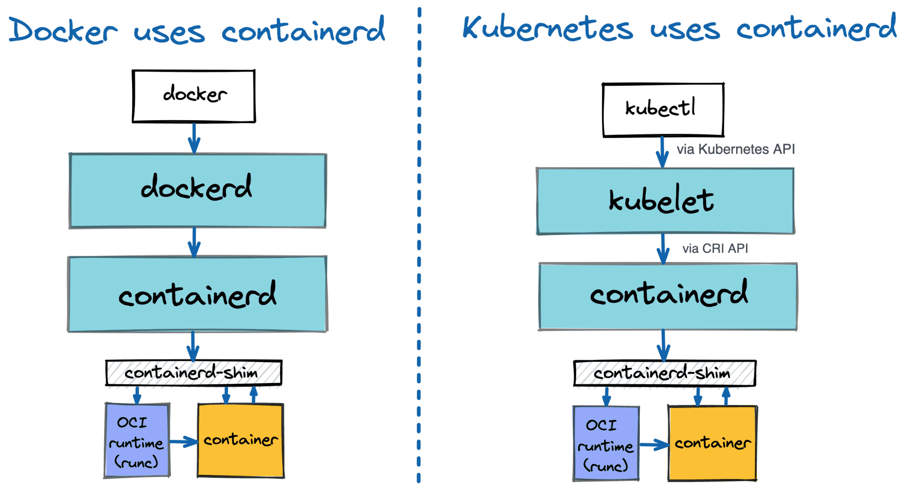
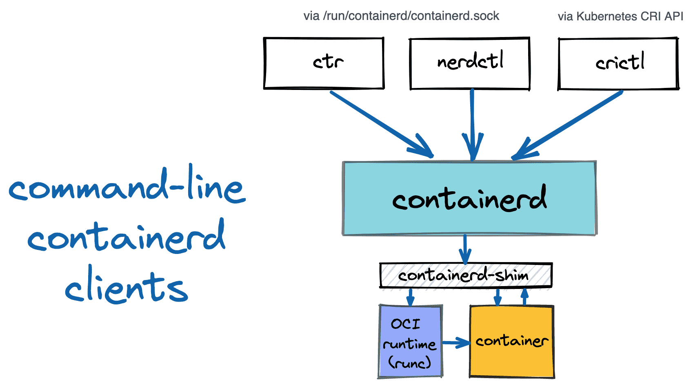

# Why and How to Use containerd From Command Line

> References:
>
> https://iximiuz.com/en/posts/containerd-command-line-clients/

[containerd](https://github.com/containerd/containerd) is a [high-level container runtime](https://iximiuz.com/en/posts/journey-from-containerization-to-orchestration-and-beyond/#container-runtimes), *aka* [container manager](https://iximiuz.com/en/posts/journey-from-containerization-to-orchestration-and-beyond/#container-management). To put it simply, it's a daemon that manages the complete container  lifecycle on a single host: creates, starts, stops containers, pulls and stores images, configures mounts, networking, etc.

It also can be used from the command line via one of the available clients.

- [ctr](https://github.com/containerd/containerd/tree/e1ad7791077916aac9c1f4981ad350f0e3fce719/cmd/ctr) is a command-line client shipped as part of the containerd project. If  you have containerd running on a machine, chances are the `ctr` binary is also there.
- `nerdctl` aims to be user-friendly and Docker-compatible. To some extent, `nerdctl + containerd` can seamlessly replace `docker + dockerd`.
- `crictl` was created to inspect and debug container runtimes and applications on a Kubernetes node.