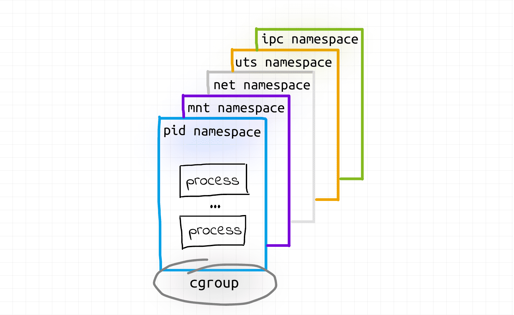
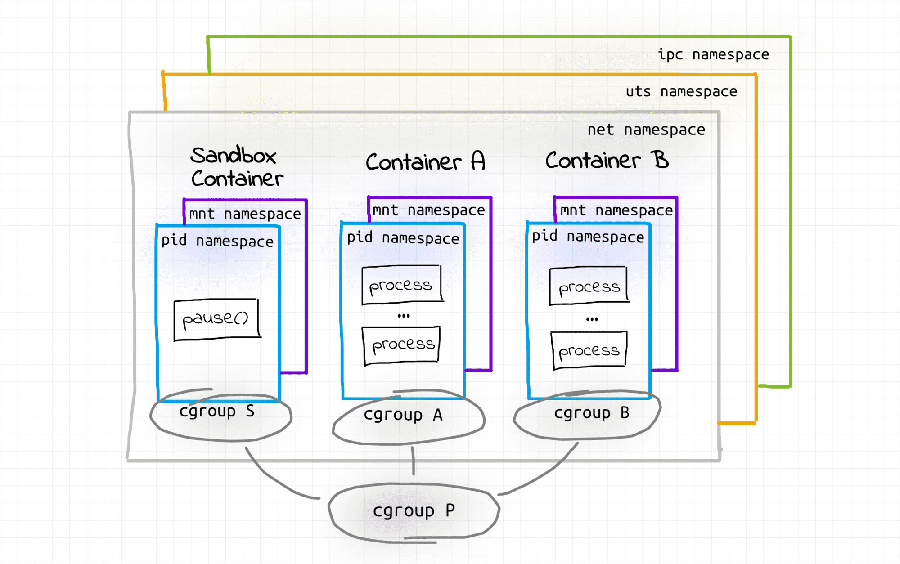

# Containers vs. Pods - Taking a Deeper Look

> https://iximiuz.com/en/posts/containers-vs-pods/

Ok, so the namespaces used to isolate the above container are:

- **mnt** (*Mount*) - the container has an isolated mount table.
- **uts** (*UNIX Time-Sharing*) - the container is able to have its own hostname and domain name.
- **ipc** (*Interprocess Communication*) - processes inside the container can communicate via system-level IPC only to processes inside the same container.
- **pid** (*Process ID*) - processes inside the  container are only able to see other processes inside the same container or inside the same pid namespace.
- **net** (*Network*) - the container gets its own network stack.

The cgroups limits for a given process can be checked via examining the  corresponding subtree in the cgroup virtual filesystem. The *cgroupfs* is usually mounted as `/sys/fs/cgroup`, and the process-specific part of the path can be found at `/proc/<PID>/cgroup`.

Docker container:

Pod:

