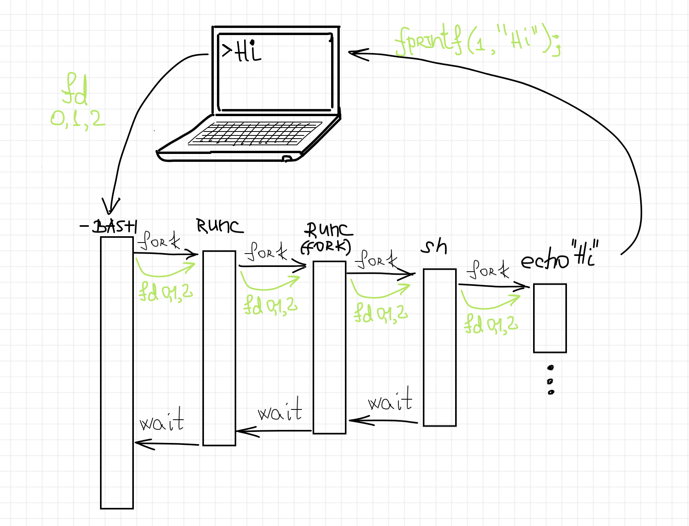
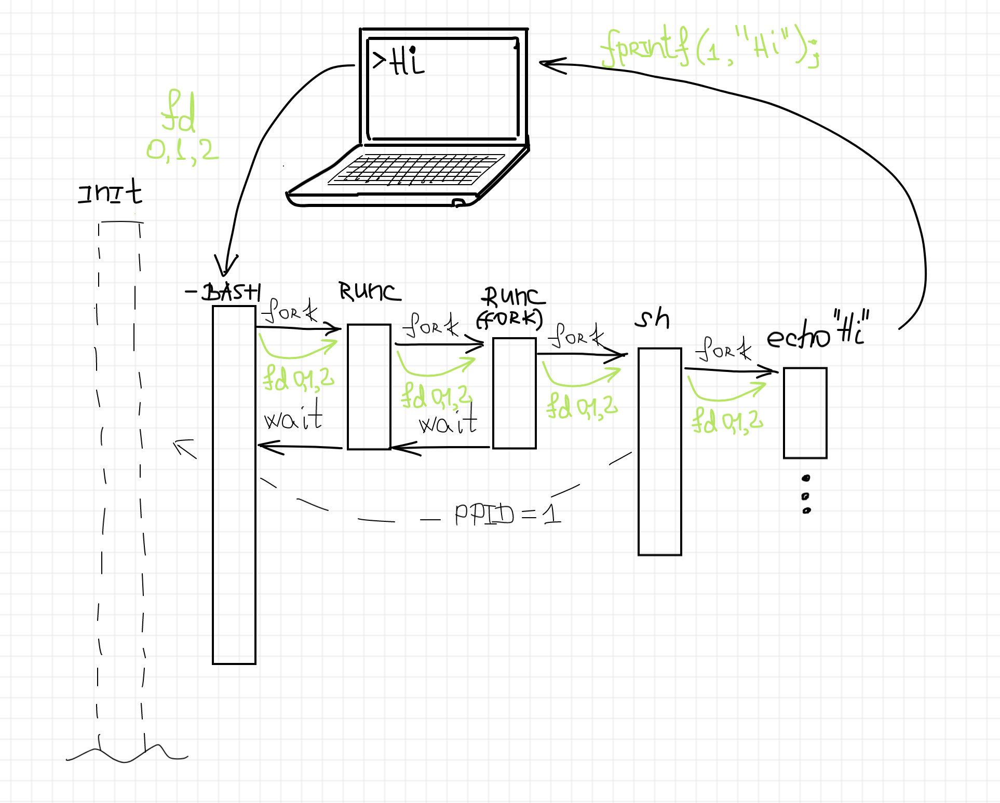
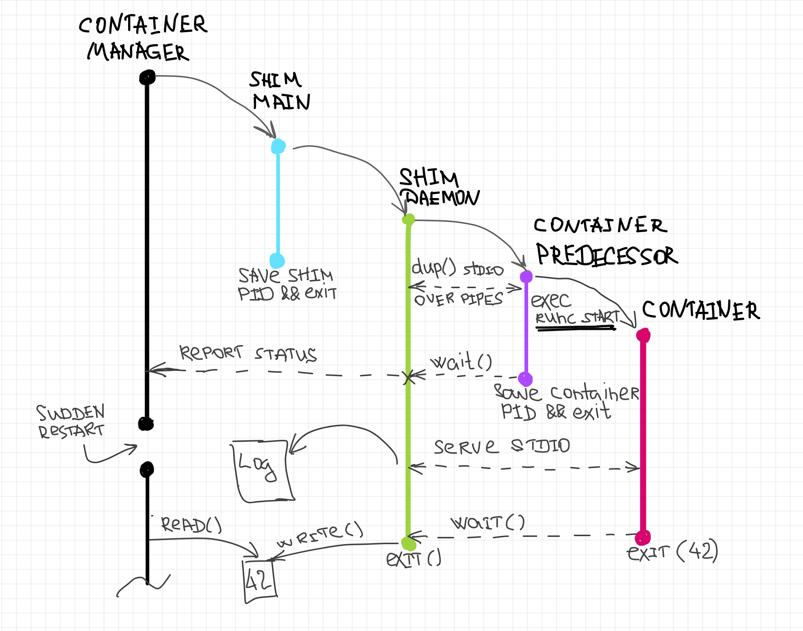

`runc` is a CLI tool for spawning and running containers according to the OCI specification.

In order to use runc you must have your container in the format of an OCI bundle. If you have Docker installed you can use its `export` method to acquire a root filesystem from an existing Docker container.

```bash
# create the top most bundle directory
mkdir /mycontainer
cd /mycontainer

# create the rootfs directory
mkdir rootfs

# export busybox via Docker into the rootfs directory
docker export $(docker create busybox) | tar -C rootfs -xvf -
```

After a root filesystem is populated you just generate a spec in the format of a `config.json` file inside your bundle. `runc`provides a `spec` command to generate a base template spec that you are then able to edit. To find features and documentation for fields in the spec please refer to the [specs](https://github.com/opencontainers/runtime-spec) repository.

```bash
runc spec
```

Now you can execute the container in two different ways:

```bash
# run as root
cd /mycontainer
runc run mycontainerid
```

or

Start a container is using the specs lifecycle operations. This will also launch the container in the background so you will have to edit the `config.json` to remove the `terminal` setting for the simple examples here. Your process field in the `config.json` should look like this below with `"terminal": false` and `"args": ["sleep", "5"]`.

Now we can go through the lifecycle operations in your shell.

```bash
# run as root
cd /mycontainer
runc create mycontainerid

# view the container is created and in the "created" state
runc list

# start the process inside the container
runc start mycontainerid

# after 5 seconds view that the container has exited and is now in the stopped state
runc list

# now delete the container
runc delete mycontainerid
```

`runc` has the ability to run containers without root privileges. This is called `rootless`:

```bash
# Same as the first example
mkdir ~/mycontainer
cd ~/mycontainer
mkdir rootfs
docker export $(docker create busybox) | tar -C rootfs -xvf -

# The --rootless parameter instructs runc spec to generate a configuration for a rootless container, which will allow you to run the container as a non-root user.
runc spec --rootless

# The --root parameter tells runc where to store the container state. It must be writable by the user.
runc --root /tmp/runc run mycontainerid
```


# Implementing Container Runtime Shim: runc

> References:
>
> https://iximiuz.com/en/posts/implementing-container-runtime-shim/


[A container runtime shim](https://iximiuz.com/en/posts/journey-from-containerization-to-orchestration-and-beyond/#runtime-shims) is a piece of software that resides in between [ a container manager (*containerd*, *cri-o*, *podman*)](https://iximiuz.com/en/posts/journey-from-containerization-to-orchestration-and-beyond/#container-management) and [a container runtime (*runc*, *crun*)](https://iximiuz.com/en/posts/journey-from-containerization-to-orchestration-and-beyond/#container-runtimes) solving the integration problem of these counterparts.


*runc* is **a command-line tool** for running containerized applications. A tool to spawn a new ordinary Linux process but inside of an isolated environment (dedicated root file system and a new process tree and is being achieved via Linux *namespaces* and *cgroups* facilities).

*Stdio streams* of our login bash shell have been [passed through](https://github.com/opencontainers/runc/blob/201b06374548b64212f4ceb1529688d435e42899/docs/terminals.md#-pass-through) to the container and then set as its own *stdio streams*:



[**foreground**](https://github.com/opencontainers/runc/blob/201b06374548b64212f4ceb1529688d435e42899/docs/terminals.md#foreground) - means that the *runc* process always stays in between the container process and the launching process (bash shell in our example). 

There is another mode supported by *runc*, called [**detached**](https://github.com/opencontainers/runc/blob/201b06374548b64212f4ceb1529688d435e42899/docs/terminals.md#detached). In detached mode there is no long-running foreground runc process once the container has started. The main use-case of detached mode is for higher-level tools that want to be wrappers around `runc`.



**If we want to keep control of the container's \*stdio\* streams, the container process cannot be independent of the launching process.** And since we know, that the container manager can be restarted due to a crash, update, or some other reasons, that makes it impossible to  launch *runc* directly from the container manager process. Thus,  we need to have a helper process living as long as the underlying  container process and serving it. And such a process called **container runtime shim**.

A container runtime shim is a lightweight daemon launching *runc* and controlling the container process. The shim's process is tightly  bound to the container's process but is completely detached from the  manager's process. All the communications between the container and the  manager happen through the shim. 

The shim usually is responsible for the following (and probably some other) things:

- Serves container's *stdout* and *stderr* streams even during the manager restart.  For instance, kubectl logs triggers the following delegation chain:

  ```
  kubectl <-- network --> Kubernetes Core API <-- network --> kubelet <-- (CRI gRPC API) --> CRI Runtime Service (cri-o, containerd, docker) <-- read() --> logs on node's disk
  ```

- Attaches to a running container.
- Keeps track of container exit code. 
- Synchronizes container manager with the container creation status.



The main process of the shim is short-lived and serves the purpose of  the daemonization of the shim:

- it forks the actual shim daemon process
- writes its PID on disk
- exits immediately, leaving the shim detached  from the launching process (i.e. a container manager)

The long-lived shim daemon process:

- starts from creating a new session and detaching its *stdio* streams from the parent (by redirecting them to `/dev/null`). 
- then it forks one more process, the predecessor of the container process.
- This process `exec`s `runc create` with the provided parameters
- The shim daemon process waits for the termination of the container predecessor
- then reports the status of this operation back to the container manager.
- shim daemon process can start serving the container's *stdio* streams as well as awaiting the container termination.
- Once the container termination status is known, the shim process writes it to a predefined location on disk and exits.

