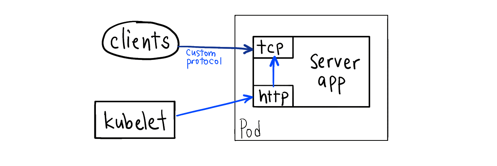
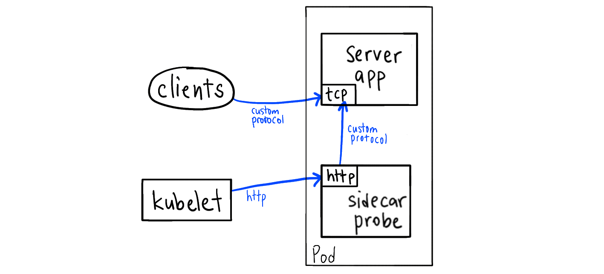
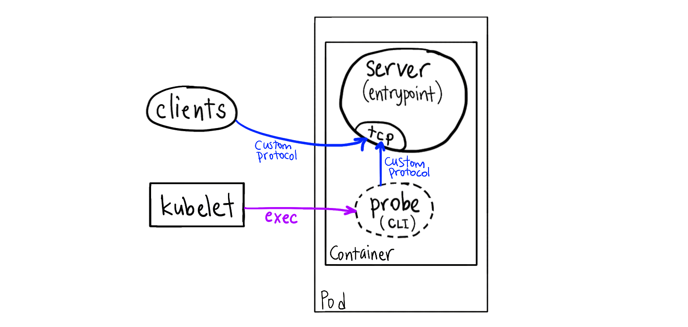
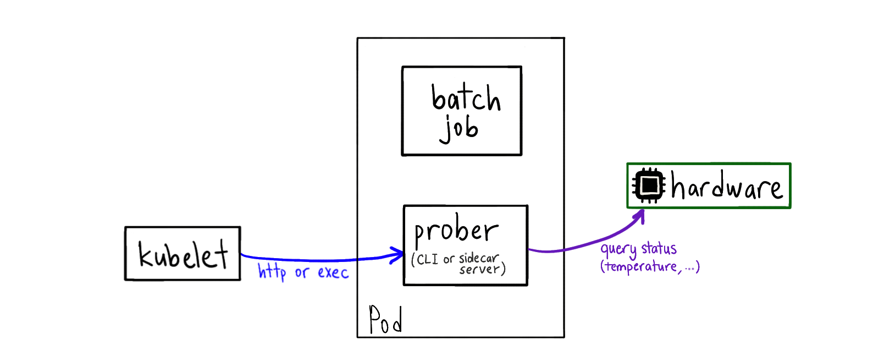

### Advanced Health Check Patterns in Kubernetes

Kubernetes support three types of health probes for Pods. They are implemented in the kubelet (which starts the Pod).

1. **HTTP GET:** Makes a request to the specified port and `/path` in the Pod, expects a 200 OK response.
2. **TCP Socket:** This establishes a TCP connection to the IP address of the pod on the specified port.
3. **Exec:** Runs a command in the container; expects exit code 0.

##### Secondary Health Port

If your app does not expose an HTTP endpoint, you can refactor your app to listen on a secondary port that exposes an HTTP server for health checking.

**Example:** You have a gRPC application and you refactor it to expose a http port for health checks.

##### Sidecar health server

Your app container doesn't expose an HTTP endpoint for health checking, so you deploy another container in the same Pod (sidecar pattern) that exposes an HTTP endpoint and calls your app.

This works because all containers of the pod are in the same loopback interface (localhost). You don't need to expose this port to the outside world, since the kubelet can reach it over containerPort.

**Example:** You have a DNS server like dnsmasq, you deploy a sidecar server. Every time it gets an health request, it makes a DNS query to the main app over localhost.

##### Headless CLI probe

This method uses the "exec" probe to invoke a tool in the container's filesystem.

You have an app that doesn't expose a health check endpoint. So you periodically invoke a tool inside the container, and this tool makes a request to the server app.

This requires you to ship a client tool that speaks the protocol of the server app in the container image. This is neat because you don't have to modify your server code or continuously run an extra server.

**Example:** You deploy a redis-server container and you use redis-cli to query the server over localhost.

##### Hardware/System probe

Your app (can be a batch job) uses a hardware resource and starts exhausting it. You add a probe CLI tool (or a sidecar server) to the Pod that queries the hardware status and starts failing the health check.

This way, readiness/liveness probes will crash and cause rescheduling of the Pod to another physical node.

This requires you to mount something like `/dev` or `/sys` into the container from the host.

**Example:** Machine learning jobs heating up the GPU after a while, causing slower computation. Moving the job to a different node can remedy this.