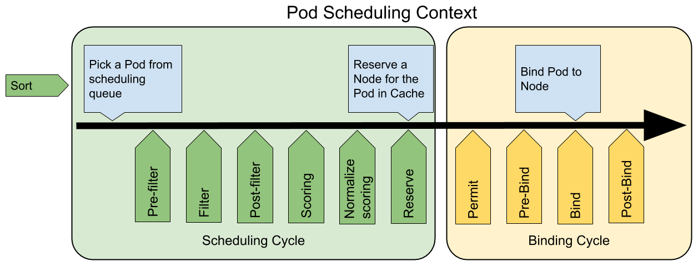

## Configuration Best Practices

- When defining configurations, specify the latest stable API version.
- Configuration files should be stored in version control before being pushed to the  cluster. This allows you to quickly roll back a configuration change if  necessary. It also aids cluster re-creation and restoration.
- Write your configuration files using YAML rather than JSON. Though these  formats can be used interchangeably in almost all scenarios, YAML tends  to be more user-friendly.
- Group related objects into a single file whenever it makes sense. One file is often easier to manage than several. 
- Note also that many `kubectl` commands can be called on a directory. For example, you can call `kubectl apply` on a directory of config files.
- Don’t specify default values unnecessarily: simple, minimal configuration will make errors less likely.
- Put object descriptions in annotations, to allow better introspection.
- Don’t use naked Pods (that is, Pods not bound to a [ReplicaSet](https://kubernetes.io/docs/concepts/workloads/controllers/replicaset/) or [Deployment](https://kubernetes.io/docs/concepts/workloads/controllers/deployment/)) if you can avoid it. Naked Pods will not be rescheduled in the event of a node failure.
- Create a [Service](https://kubernetes.io/docs/concepts/services-networking/service/) before its corresponding backend workloads (Deployments or  ReplicaSets), and before any workloads that need to access it. When  Kubernetes starts a container, it provides environment variables  pointing to all the Services which were running when the container was  started. *This does imply an ordering requirement* - any `Service` that a `Pod` wants to access must be created before the `Pod` itself, or else the environment variables will not be populated. DNS does not have this restriction.
- Don’t specify a `hostPort` for a Pod unless it is absolutely necessary. When you bind a Pod to a `hostPort`, it limits the number of places the Pod can be scheduled, because each <`hostIP`, `hostPort`, `protocol`> combination must be unique. If you don’t specify the `hostIP` and `protocol` explicitly, Kubernetes will use `0.0.0.0` as the default `hostIP` and `TCP` as the default `protocol`.
  - If you only need access to the port for debugging purposes, you can use the [apiserver proxy](https://kubernetes.io/docs/tasks/access-application-cluster/access-cluster/#manually-constructing-apiserver-proxy-urls) or [`kubectl port-forward`](https://kubernetes.io/docs/tasks/access-application-cluster/port-forward-access-application-cluster/).
  - If you explicitly need to expose a Pod’s port on the node, consider using a [NodePort](https://kubernetes.io/docs/concepts/services-networking/service/#nodeport) Service before resorting to `hostPort`.
    - Avoid using `hostNetwork`, for the same reasons as `hostPort`.
    - Use [headless Services](https://kubernetes.io/docs/concepts/services-networking/service/#headless-services) (which have a `ClusterIP` of `None`) for easy service discovery when you don’t need `kube-proxy` load balancing.
- Define and use [labels](https://kubernetes.io/docs/concepts/overview/working-with-objects/labels/) that identify **semantic attributes** of your application or Deployment, such as `{ app: myapp, tier: frontend, phase: test, deployment: v3 }`.
- You can manipulate labels for debugging. Because Kubernetes controllers  (such as ReplicaSet) and Services match to Pods using selector labels,  removing the relevant labels from a Pod will stop it from being  considered by a controller or from being served traffic by a Service. If you remove the labels of an existing Pod, its controller will create a  new Pod to take its place. This is a useful way to debug a previously  “live” Pod in a “quarantine” environment. To interactively remove or add labels, use [`kubectl label`](https://kubernetes.io/docs/reference/generated/kubectl/kubectl-commands#label).
- The [imagePullPolicy](https://kubernetes.io/docs/concepts/containers/images/#updating-images) and the tag of the image affect when the [kubelet](https://kubernetes.io/docs/admin/kubelet/) attempts to pull the specified image (IfNotPresent, Always etc.)
- Use `kubectl apply -f `. This looks for Kubernetes configuration in all `.yaml`, `.yml`, and `.json` files in `` and passes it to `apply`.
- Use label selectors for `get` and `delete` operations instead of specific object names. See the sections on [label selectors](https://kubernetes.io/docs/concepts/overview/working-with-objects/labels/#label-selectors) and [using labels effectively](https://kubernetes.io/docs/concepts/cluster-administration/manage-deployment/#using-labels-effectively).
- Use `kubectl run` and `kubectl expose` to quickly create single-container Deployments and Services. See [Use a Service to Access an Application in a Cluster](https://kubernetes.io/docs/tasks/access-application-cluster/service-access-application-cluster/) for an example.

## Resource Bin Packing for Extended Resources

The kube-scheduler can be configured to enable bin packing of resources along with extended resources using `RequestedToCapacityRatioResourceAllocation` priority function. Priority functions can be used to fine-tune the kube-scheduler as per custom needs.

The behavior of the `RequestedToCapacityRatioResourceAllocation` priority function can be controlled by a configuration option called `requestedToCapacityRatioArguments`. This argument consists of two parameters `shape` and `resources`. Shape allows the user to tune the function as least requested or most requested based on `utilization` and `score` values. Resources consists of `name` which specifies the resource to be considered during scoring and `weight` specify the weight of each resource.

This feature is disabled by default.

## Managing Compute Resources for Containers

When you specify a [Pod](https://kubernetes.io/docs/concepts/workloads/pods/pod/), you can optionally specify how much CPU and memory (RAM) each Container needs. When Containers have resource requests specified, the scheduler can make better decisions about which nodes to place Pods on. And when Containers have their limits specified, contention for resources on a node can be handled in a specified manner.

**Resource types**

CPU and memory are each a resource type. A resource type has a base unit. CPU is specified in units of cores, and memory is specified in units of bytes. CPU and memory are collectively referred to as *compute resources*, or just *resources*. Compute resources are measurable quantities that can be requested, allocated, and consumed. They are distinct from [API resources](https://kubernetes.io/docs/concepts/overview/kubernetes-api/). API resources, such as Pods and [Services](https://kubernetes.io/docs/concepts/services-networking/service/) are objects that can be read and modified through the Kubernetes API server.

**Resource requests and limits of Pod and Container**

- `spec.containers[].resources.limits.cpu`
- `spec.containers[].resources.limits.memory`
- `spec.containers[].resources.limits.hugepages-`
- `spec.containers[].resources.requests.cpu`
- `spec.containers[].resources.requests.memory`
- `spec.containers[].resources.requests.hugepages-`

**Meaning of CPU**

Limits and requests for CPU resources are measured in cpu units. One cpu, in Kubernetes, is equivalent to 1 core (for example 1 GCP core). Fractional requests are allowed. The expression `0.1` is equivalent to the expression `100m`, which can be read as “one hundred millicpu”. CPU is always requested as an absolute quantity, never as a relative quantity; 0.1 is the same amount of CPU on a single-core, dual-core, or 48-core machine.

**Meaning of memory**

Limits and requests for `memory` are measured in bytes. You can express memory as a plain integer or as a fixed-point integer using one of these suffixes: E, P, T, G, M, K. You can also use the power-of-two equivalents: Ei, Pi, Ti, Gi, Mi, Ki. 

**How Pods with resource requests are scheduled**

When you create a Pod, the Kubernetes scheduler selects a node for the Pod to run on. Each node has a maximum capacity for each of the resource types: the amount of CPU and memory it can provide for Pods. The scheduler ensures that, for each resource type, the sum of the resource requests of the scheduled Containers is less than the capacity of the node. 

Note that although actual memory or CPU resource usage on nodes is very low, the scheduler still refuses to place a Pod on a node if the capacity check fails. This protects against a resource shortage on a node when resource usage later increases, for example, during a daily peak in request rate.

**How Pods with resource limits are run**

When the kubelet starts a Container of a Pod, it passes the CPU and memory limits to the container runtime (to Docker using  [`--cpu-shares`](https://docs.docker.com/engine/reference/run/#cpu-share-constraint) and  [`--memory`](https://docs.docker.com/engine/reference/run/#/user-memory-constraints) flags in the `docker run` command. 

If a Container exceeds its memory limit, it might be terminated. If it is restartable, the kubelet will restart it, as with any other type of runtime failure.

If a Container exceeds its memory request, it is likely that its Pod will be evicted whenever the node runs out of memory.

**Troubleshooting**

* If the scheduler cannot find any node where a Pod can fit, the Pod remains unscheduled until a place can be found. You can check node capacities and amounts allocated with the `kubectl describe nodes` command. 
* Your Container might get terminated because it is resource-starved. To check whether a Container is being killed because it is hitting a resource limit, call `kubectl describe pod` .

**Local ephemeral storage**

In each Kubernetes node, kubelet’s root directory (/var/lib/kubelet by  default) and log directory (/var/log) are stored on the root partition  of the node. This partition is also shared and consumed by Pods via  emptyDir volumes, container logs, image layers and container writable  layers.

Each Container of a Pod can specify one or more of the following (in bytes):
- spec.containers[].resources.limits.ephemeral-storage
- spec.containers[].resources.requests.ephemeral-storage

When local ephemeral storage is used, it is monitored on an ongoing basis by the kubelet. The monitoring is performed by scanning each emptyDir volume, log directories, and writable layers on a periodic basis. Project quotas can also be used for both monitoring and enforcement. 

**Extended resources**

Extended resources are fully-qualified resource names outside the `kubernetes.io` domain. They allow cluster operators to advertise and users to consume the non-Kubernetes-built-in resources.

There are two steps required to use Extended Resources. First, the cluster operator must advertise an Extended Resource. Second, users must request the Extended Resource in Pods.

See [Device Plugin](https://kubernetes.io/docs/concepts/extend-kubernetes/compute-storage-net/device-plugins/) for how to advertise device plugin managed resources on each node.

To advertise a new node-level extended resource, the cluster operator can submit a `PATCH` HTTP request to the API server to specify the available quantity in the `status.capacity` for a node in the cluster. After this operation, the node’s `status.capacity` will include a new resource. The `status.allocatable` field is updated automatically with the new resource asynchronously by the kubelet.

Cluster-level extended resources are not tied to nodes. They are usually managed by scheduler extenders, which handle the resource consumption and resource quota. You can specify the extended resources that are handled by scheduler extenders in [scheduler policy configuration](https://github.com/kubernetes/kubernetes/blob/release-1.10/pkg/scheduler/api/v1/types.go#L31).

## Pod Overhead

When you run a Pod on a Node, the Pod itself takes an amount of system resources. These resources are additional to the resources needed to run the container(s) inside the Pod. Pod Overhead is a feature for accounting for the resources consumed by the pod infrastructure on top of the container requests & limits.

When Pod Overhead is enabled, the overhead is considered in addition to the sum of container resource requests when scheduling a pod. Similarly, Kubelet will include the pod overhead when sizing the pod cgroup, and when carrying out pod eviction ranking.

## Assigning Pods to Nodes

You can constrain a [Pod](https://kubernetes.io/docs/concepts/workloads/pods/pod-overview/) to only be able to run on particular [Node(s) ](https://kubernetes.io/docs/concepts/architecture/nodes/), or to prefer to run on particular nodes. There are several ways to do this, and the recommended approaches all use [label selectors](https://kubernetes.io/docs/concepts/overview/working-with-objects/labels/) to make the selection.

`nodeSelector` is the simplest recommended form of node selection constraint. `nodeSelector` is a field of PodSpec. It specifies a map of key-value pairs. For the pod to be eligible to run on a node, the node must have each of the indicated key-value pairs as labels (it can have additional labels as well). The most common usage is one key-value pair.

In addition to labels you [attach](https://kubernetes.io/docs/concepts/configuration/assign-pod-node/#step-one-attach-label-to-the-node), nodes come pre-populated with a standard set of labels. These labels are

- [`kubernetes.io/hostname`](https://kubernetes.io/docs/reference/kubernetes-api/labels-annotations-taints/#kubernetes-io-hostname)
- [`failure-domain.beta.kubernetes.io/zone`](https://kubernetes.io/docs/reference/kubernetes-api/labels-annotations-taints/#failure-domainbetakubernetesiozone)
- [`failure-domain.beta.kubernetes.io/region`](https://kubernetes.io/docs/reference/kubernetes-api/labels-annotations-taints/#failure-domainbetakubernetesioregion)
- [`topology.kubernetes.io/zone`](https://kubernetes.io/docs/reference/kubernetes-api/labels-annotations-taints/#topologykubernetesiozone)
- [`topology.kubernetes.io/region`](https://kubernetes.io/docs/reference/kubernetes-api/labels-annotations-taints/#topologykubernetesiozone)
- [`beta.kubernetes.io/instance-type`](https://kubernetes.io/docs/reference/kubernetes-api/labels-annotations-taints/#beta-kubernetes-io-instance-type)
- [`node.kubernetes.io/instance-type`](https://kubernetes.io/docs/reference/kubernetes-api/labels-annotations-taints/#nodekubernetesioinstance-type)
- [`kubernetes.io/os`](https://kubernetes.io/docs/reference/kubernetes-api/labels-annotations-taints/#kubernetes-io-os)
- [`kubernetes.io/arch`](https://kubernetes.io/docs/reference/kubernetes-api/labels-annotations-taints/#kubernetes-io-arch)

---

The `NodeRestriction` admission plugin prevents kubelets from setting or modifying labels with a `node-restriction.kubernetes.io/` prefix.

---

 The affinity/anti-affinity feature, greatly expands the types of constraints you can express, it consists of two types of affinity, “node affinity” and “inter-pod affinity/anti-affinity”. Node affinity is like the existing `nodeSelector` (but using a more expressive syntax), while inter-pod affinity/anti-affinity constrains against pod labels rather than node labels.

There are currently two types of node affinity, called `requiredDuringSchedulingIgnoredDuringExecution` and `preferredDuringSchedulingIgnoredDuringExecution`.

Node affinity is specified as field `nodeAffinity` of field `affinity` in the PodSpec.

If you specify both `nodeSelector` and `nodeAffinity`, *both* must be satisfied for the pod to be scheduled onto a candidate node.

Inter-pod affinity and anti-affinity allow you to constrain which nodes your pod is eligible to be scheduled *based on labels on pods that are already running on the node* rather than  based on labels on nodes. The rules are of the form “this pod should (or should not) run in  an X if that X is already running one or more pods that meet rule Y”. Y is expressed as a LabelSelector with an optional associated list of  namespaces; unlike nodes, because pods are namespaced (and therefore the labels on pods are implicitly namespaced), a label selector over pod labels must specify which namespaces the  selector should apply to. Conceptually X is a topology domain like node, rack, cloud provider zone, cloud provider region, etc.

---

`nodeName` is the simplest form of node selection constraint, but due to its limitations it is typically not used. `nodeName` is a field of PodSpec. If it is non-empty, the scheduler ignores the pod and the kubelet running on the named node tries to run the pod. Thus, if `nodeName` is provided in the PodSpec, it takes precedence over the above methods for node selection.

## Taints and Tolerations

Node affinity, described [here](https://kubernetes.io/docs/concepts/configuration/assign-pod-node/#node-affinity-beta-feature), is a property of *pods* that *attracts* them to a set of nodes (either as a preference or a hard requirement). Taints are the opposite – they allow a *node* to *repel* a set of pods.

Taints and tolerations work together to ensure that pods are not scheduled onto inappropriate nodes. One or more taints are applied to a node; this marks that the node should not accept any pods that do not tolerate the taints. Tolerations are applied to pods, and allow (but do not require) the pods to schedule onto nodes with matching taints.

You add a taint to a node using [kubectl taint](https://kubernetes.io/docs/reference/generated/kubectl/kubectl-commands#taint). For example,
```shell
kubectl taint nodes node1 key=value:NoSchedule
```

places a taint on node `node1`. The taint has key `key`, value `value`, and taint effect `NoSchedule`. This means that no pod will be able to schedule onto `node1` unless it has a matching toleration.

To remove the taint added by the command above, you can run:
```shell
kubectl taint nodes node1 key:NoSchedule-
```

Alternatively, you can use `effect` of `PreferNoSchedule`. This is a “preference” or “soft” version of `NoSchedule` – the system will *try* to avoid placing a pod that does not tolerate the taint on the node, but it is not required. The third kind of `effect` is `NoExecute`

You can put multiple taints on the same node and multiple tolerations on the same pod.

A few of the use cases are:
- Dedicated Nodes
- Nodes with Special Hardware
- Taint based Evictions - per-pod-configurable eviction behavior when there are node problems. The node controller automatically taints a node when certain condition is true (out-of-disk, memory-pressure etc.)

## Secrets

Kubernetes `secret` objects let you store and manage sensitive information, such as passwords, OAuth tokens, and ssh keys. Putting this information in a `secret` is safer and more flexible than putting it verbatim in a [Pod](https://kubernetes.io/docs/concepts/workloads/pods/pod-overview/) definition or in a [container image ](https://kubernetes.io/docs/reference/glossary/?all=true#term-image). 

To use a secret, a pod needs to reference the secret. A secret can be used with a pod in two ways: as files in a [volume](https://kubernetes.io/docs/concepts/storage/volumes/) mounted on one or more of its containers, or used by kubelet when pulling images for the pod.

Kubernetes automatically creates secrets (built-in) which contain credentials for accessing the API and it automatically modifies your pods to use this type of secret.

The `kubectl create secret` command packages these files into a Secret and creates the object on the Apiserver.

The [Secret](https://kubernetes.io/docs/reference/generated/kubernetes-api/v1.17/#secret-v1-core) contains two maps: data and stringData. The data field is used to store arbitrary data, encoded using base64. The stringData field is provided for convenience, and allows you to provide secret data as unencoded strings.

```yaml
apiVersion: v1
kind: Secret
metadata:
  name: mysecret
type: Opaque
data:
  username: YWRtaW4=
  password: MWYyZDFlMmU2N2Rm
```

**Using Secrets**

1. Secrets can be mounted as data volumes or be exposed as [environment variables](https://kubernetes.io/docs/concepts/containers/container-environment-variables/) to be used by a container in a pod. They can also be used by other parts of the system, without being directly exposed to the pod. For example, they can hold credentials that other parts of the system should use to interact with external systems on your behalf.

  This is an example of a pod that mounts a secret in a volume:
  ```yaml
  apiVersion: v1
  kind: Pod
  metadata:
    name: mypod
  spec:
    containers:
    - name: mypod
      image: redis
      volumeMounts:
      - name: foo
        mountPath: "/etc/foo"
        readOnly: true
    volumes:
    - name: foo
      secret:
        secretName: mysecret
  ```

  We can also control the paths within the volume where Secret keys are projected. You can use `.spec.volumes[].secret.items` field to change target path of each key.

  You can also specify the permission mode bits files part of a secret will have. If you don’t specify any, `0644` is used by default.

  Inside the container that mounts a secret volume, the secret keys appear as files and the secret values are base-64 decoded and stored inside these files.

  When a secret being already consumed in a volume is updated, projected keys are eventually updated as well. Kubelet is checking whether the mounted secret is fresh on every periodic sync. However, it is using its local cache for getting the current value of the Secret.

2. To use a secret in an [environment variable](https://kubernetes.io/docs/concepts/containers/container-environment-variables/) in a pod, you need to modify Pod definition in each containe. The environment variable that consumes the secret key should populate the secret’s name and key in `env[].valueFrom.secretKeyRef`.

   ```yaml
   apiVersion: v1
   kind: Pod
   metadata:
     name: secret-env-pod
   spec:
     containers:
     - name: mycontainer
       image: redis
       env:
         - name: SECRET_USERNAME
           valueFrom:
             secretKeyRef:
               name: mysecret
               key: username
         - name: SECRET_PASSWORD
           valueFrom:
             secretKeyRef:
               name: mysecret
               key: password
     restartPolicy: Never
   ```

   Inside a container that consumes a secret in an environment variables, the secret keys appear as normal environment variables containing the base-64 decoded values of the secret data: `echo $SECRET_USERNAME`

3. An imagePullSecret is a way to pass a secret that contains a Docker (or other) image registry password to the Kubelet so it can pull a private image on behalf of your Pod. 

   You can manually create an imagePullSecret, and reference it from a serviceAccount. Any pods created with that serviceAccount or that default to use that serviceAccount, will get their imagePullSecret field set to that of the service account.

---

Secret volume sources are validated to ensure that the specified object reference actually points to an object of type `Secret`. Therefore, a secret needs to be created before any pods that depend on it. References to Secrets that do not exist will prevent the pod from starting.

Secret API objects reside in a [namespace ](https://kubernetes.io/docs/concepts/overview/working-with-objects/namespaces). They can only be referenced by pods in that same namespace.

Individual secrets are limited to 1MiB in size.

**Best practices**

When deploying applications that interact with the secrets API, access should be limited using [authorization policies](https://kubernetes.io/docs/reference/access-authn-authz/authorization/) such as [RBAC](https://kubernetes.io/docs/reference/access-authn-authz/rbac/).

`watch` and `list` requests for secrets within a namespace are extremely powerful capabilities and should be avoided, since listing secrets allows the clients to inspect the values of all secrets that are in that namespace. Use `get` instead.

**Security Properties** 

A secret is only sent to a node if a pod on that node requires it. Kubelet stores the secret into a `tmpfs` so that the secret is not written to disk storage. Once the Pod that depends on the secret is deleted, kubelet will delete its local copy of the secret data as well.

One Pod does not have access to the secrets of another Pod.

Each container in a pod has to request the secret volume in its `volumeMounts` for it to be visible within the container.

**Risks**

In the API server secret data is stored in [etcd ](https://kubernetes.io/docs/tasks/administer-cluster/configure-upgrade-etcd/):
- Administrators should enable encryption at rest for cluster data
- Administrators should limit access to etcd to admin users
- Administrators may want to wipe/shred disks used by etcd when no longer in use
- If running etcd in a cluster, administrators should make sure to use SSL/TLS for etcd peer-to-peer communication.

If you configure the secret through a manifest (JSON or YAML) file which has the secret data encoded as base64, sharing this file or checking it in to a source repository means the secret is compromised.

Applications still need to protect the value of secret after reading it from the volume (not logging it or transmitting).

A user who can create a pod that uses a secret can also see the value of that secret.

Currently, anyone with root on any node can read *any* secret from the apiserver, by impersonating the kubelet.

## Organizing Cluster Access Using kubeconfig Files

Use kubeconfig files to organize information about clusters, users, namespaces, and authentication mechanisms. The `kubectl` command-line tool uses kubeconfig files to find the information it needs to choose a cluster and communicate with the API server of a cluster. By default, `kubectl` looks for a file named `config` in the `$HOME/.kube` directory. You can specify other kubeconfig files by setting the `KUBECONFIG` environment variable or by setting the [`--kubeconfig`](https://kubernetes.io/docs/reference/generated/kubectl/kubectl/) flag.

---

A *context* element in a kubeconfig file is used to group access parameters under a convenient name. Each context has three parameters: cluster, namespace, and user. By default, the `kubectl` command-line tool uses parameters from the *current context* to communicate with the cluster.

To choose the current context:
```
kubectl config use-context
```

---

The `KUBECONFIG` environment variable holds a list of kubeconfig files.

If the `KUBECONFIG` environment variable does exist, `kubectl` uses an effective configuration that is the result of merging the files listed in the `KUBECONFIG` environment variable.

## Pod Priority and Preemption

[Pods](https://kubernetes.io/docs/user-guide/pods) can have *priority*. Priority indicates the importance of a Pod relative to other Pods. If a Pod cannot be scheduled, the scheduler tries to preempt (evict) lower priority Pods to make scheduling of the pending Pod possible.

To use priority and preemption:

1. Add one or more [PriorityClasses](https://kubernetes.io/docs/concepts/configuration/pod-priority-preemption/#priorityclass).
2. Create Pods with[`priorityClassName`](https://kubernetes.io/docs/concepts/configuration/pod-priority-preemption/#pod-priority) set to one of the added PriorityClasses.

In Kubernetes 1.11 and later, preemption is controlled by a kube-scheduler flag `disablePreemption`, which is set to `false` by default. If you want to disable preemption despite the above note, you can set `disablePreemption` to `true`.

**PriorityClass**

A PriorityClass is a non-namespaced object that defines a mapping from a priority class name to the integer value of the priority. The name is specified in the `name` field of the PriorityClass object’s metadata. The value is specified in the required `value` field. The higher the value, the higher the priority.

PriorityClass also has two optional fields: `globalDefault` and `description`. The `globalDefault` field indicates that the value of this PriorityClass should be used for Pods without a `priorityClassName`. Only one PriorityClass with `globalDefault` set to true can exist in the system. If there is no PriorityClass with `globalDefault` set, the priority of Pods with no `priorityClassName` is zero.

The `description` field is an arbitrary string. It is meant to tell users of the cluster when they should use this PriorityClass.

```yaml
apiVersion: scheduling.k8s.io/v1
kind: PriorityClass
metadata:
  name: high-priority
value: 1000000
globalDefault: false
description: "This priority class should be used for XYZ service pods only."
```

**Non-preempting PriorityClasses**

Pods with `PreemptionPolicy: Never` will be placed in the scheduling queue ahead of lower-priority pods, but they cannot preempt other pods. A non-preempting pod waiting to be scheduled will stay in the scheduling queue, until sufficient resources are free, and it can be scheduled.

`PreemptionPolicy` defaults to `PreemptLowerPriority`, which will allow pods of that PriorityClass to preempt lower-priority pods (as is existing default behavior).

**Pod priority**

The priority admission controller uses the `priorityClassName` field and populates the integer value of the priority. If the priority class is not found, the Pod is rejected.

```yaml
apiVersion: v1
kind: Pod
metadata:
  name: nginx
  labels:
    env: test
spec:
  containers:
  - name: nginx
    image: nginx
    imagePullPolicy: IfNotPresent
  priorityClassName: high-priority
```

**Preemption**

When Pods are created, they go to a queue and wait to be scheduled. The scheduler picks a Pod from the queue and tries to schedule it on a Node. If no Node is found that satisfies all the specified requirements of the Pod, preemption logic is triggered for the pending Pod. Preemption logic tries to find a Node where removal of one or more Pods with lower priority would enable new Pod to be scheduled on that Node. If such a Node is found, one or more lower priority Pods get evicted from the Node. After the Pods are gone, new Pod can be scheduled on the Node.

When Pods are preempted, the victims get their [graceful termination period](https://kubernetes.io/docs/concepts/workloads/pods/pod/#termination-of-pods). They have that much time to finish their work and exit. If they don’t, they are killed.

A [Pod Disruption Budget (PDB)](https://kubernetes.io/docs/concepts/workloads/pods/disruptions/) allows application owners to limit the number of Pods of a replicated application that are down simultaneously from voluntary disruptions. Kubernetes supports PDB when preempting Pods, but respecting PDB is best effort. The Scheduler tries to find victims whose PDB are not violated by preemption, but if no such victims are found, preemption will still happen, and lower priority Pods will be removed despite their PDBs being violated.

A Node is considered for preemption only when the answer to this question is yes: “If all the Pods with lower priority than the pending Pod are removed from the Node, can the pending Pod be scheduled on the Node?”

## Scheduling Framework

The Scheduling Framework defines a few extension points. Scheduler plugins register to be invoked at one or more extension points. Some of these plugins can change the scheduling decisions and some are informational only.

Each attempt to schedule one Pod is split into two phases, the **scheduling cycle** and the **binding cycle**.

The scheduling cycle selects a node for the Pod, and the binding cycle applies that decision to the cluster. Together, a scheduling cycle and binding cycle are referred to as a “scheduling context”.

Scheduling cycles are run serially, while binding cycles may run concurrently.

A scheduling or binding cycle can be aborted if the Pod is determined to be unschedulable or if there is an internal error. The Pod will be returned to the queue and retried.



Plugins can be enabled in the scheduler configuration.
