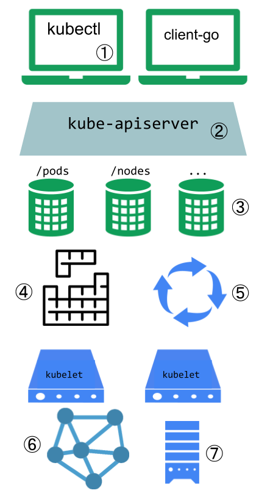
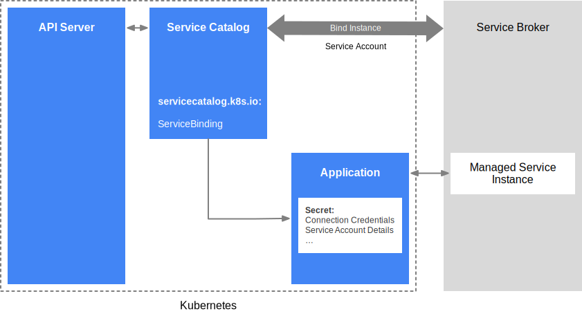

## Extending your Kubernetes Cluster

Customization approaches can be broadly divided into configuration, which only involves changing flags, local configuration files, or API resources; and extensions, which involve running additional programs or services.

---

Configuration files and flags are documented in the Reference section of the online documentation, under each binary:
- [kubelet](https://kubernetes.io/docs/admin/kubelet/)
- [kube-apiserver](https://kubernetes.io/docs/admin/kube-apiserver/)
- [kube-controller-manager](https://kubernetes.io/docs/admin/kube-controller-manager/)
- [kube-scheduler](https://kubernetes.io/docs/admin/kube-scheduler/).

Flags and configuration files may not always be changeable in a hosted  Kubernetes service or a distribution with managed installation. When  they are changeable, they are usually only changeable by the cluster  administrator. Also, they are subject to change in future Kubernetes  versions, and setting them may require restarting processes. For those  reasons, they should be used only when there are no other options.

*Built-in Policy APIs*, such as [ResourceQuota](https://kubernetes.io/docs/concepts/policy/resource-quotas/), [PodSecurityPolicies](https://kubernetes.io/docs/concepts/policy/pod-security-policy/), [NetworkPolicy](https://kubernetes.io/docs/concepts/services-networking/network-policies/) and Role-based Access Control ([RBAC](https://kubernetes.io/docs/reference/access-authn-authz/rbac/)), are built-in Kubernetes APIs. APIs are typically used with hosted  Kubernetes services and with managed Kubernetes installations. They are  declarative and use the same conventions as other Kubernetes resources  like pods, so new cluster configuration can be repeatable and be managed the same way as applications. And, where they are stable, they enjoy a [defined support policy](https://kubernetes.io/docs/reference/deprecation-policy/) like other Kubernetes APIs. For these reasons, they are preferred over *configuration files* and *flags* where suitable.

---

Extensions are software components that extend and deeply integrate with Kubernetes. They adapt it to support new types and new kinds of hardware.

There is a specific pattern for writing client programs that work well with Kubernetes called the *Controller* pattern. Controllers typically read an object’s `.spec`, possibly do things, and then update the object’s `.status`. A controller is a client of Kubernetes. When Kubernetes is the client and calls out to a remote service, it is called a *Webhook*. The remote service is called a *Webhook Backend*. Like Controllers, Webhooks do add a point of failure.

In the *Binary Plugin* model, Kubernetes executes a binary (program). Binary plugins are used by the kubelet (e.g. [Flex Volume Plugins](https://github.com/kubernetes/community/blob/master/contributors/devel/sig-storage/flexvolume.md) and [Network Plugins](https://kubernetes.io/docs/concepts/cluster-administration/network-plugins/)) and by kubectl.


**Extension Points**



1. [Kubectl plugins](https://kubernetes.io/docs/tasks/extend-kubectl/kubectl-plugins/) extend the kubectl binary. They only affect the individual user’s local environment, and so cannot enforce site-wide policies.
2. The apiserver handles all requests. Several types of extension points in  the apiserver allow authenticating requests, or blocking them based on  their content, editing content, and handling deletion. These are  described in the [API Access Extensions](https://kubernetes.io/docs/concepts/overview/extending#api-access-extensions) section.
3. The apiserver serves various kinds of *resources*. *Built-in resource kinds*, like `pods`, are defined by the Kubernetes project and can’t be changed. You can  also add resources that you define, or that other projects have defined, called *Custom Resources*, as explained in the [Custom Resources](https://kubernetes.io/docs/concepts/overview/extending#user-defined-types) section. Custom Resources are often used with API Access Extensions.
4. The Kubernetes scheduler decides which nodes to place pods on. There are  several ways to extend scheduling. These are described in the [Scheduler Extensions](https://kubernetes.io/docs/concepts/overview/extending#scheduler-extensions) section.
5. Much of the behavior of Kubernetes is implemented by programs called  Controllers which are clients of the API-Server. Controllers are often  used in conjunction with Custom Resources.
6. The kubelet runs on servers, and helps pods appear like virtual servers with their own IPs on the cluster network. [Network Plugins](https://kubernetes.io/docs/concepts/overview/extending#network-plugins) allow for different implementations of pod networking.
7. The kubelet also mounts and unmounts volumes for containers. New types of storage can be supported via [Storage Plugins](https://kubernetes.io/docs/concepts/overview/extending#storage-plugins).

### API Extensions

**User-Defined Types**

Consider adding a Custom Resource to Kubernetes if you want to define new controllers, application configuration objects or other declarative APIs, and to manage them using Kubernetes tools, such as `kubectl`. Do not use a Custom Resource as data storage for application, user, or monitoring data. For more about Custom Resources, see the [Custom Resources concept guide](https://kubernetes.io/docs/concepts/api-extension/custom-resources/).

**Combining New APIs with Automation**

The combination of a custom resource API and a control loop is called the [Operator pattern](https://kubernetes.io/docs/concepts/extend-kubernetes/operator/). The Operator pattern is used to manage specific, usually stateful,  applications. These custom APIs and control loops can also be used to  control other resources, such as storage or policies.

**Changing Built-in Resources**

When you extend the Kubernetes API by adding custom resources, the added resources always fall into a new API Groups. You cannot replace or  change existing API groups. Adding an API does not directly let you affect the behavior of existing  APIs (e.g. Pods), but API Access Extensions do.

**API Access Extensions**

When a request reaches the Kubernetes API Server, it is first  Authenticated, then Authorized, then subject to various types of  Admission Control. See [Controlling Access to the Kubernetes API](https://kubernetes.io/docs/reference/access-authn-authz/controlling-access/) for more on this flow. Each of these steps offers extension points. Kubernetes has several built-in authentication methods that it supports. It can  also sit behind an authenticating proxy, and it can send a token from an Authorization header to a remote service for verification (a webhook).  All of these methods are covered in the [Authentication documentation](https://kubernetes.io/docs/reference/access-authn-authz/authentication/)

**Authentication**

[Authentication](https://kubernetes.io/docs/reference/access-authn-authz/authentication/) maps headers or certificates in all requests to a username for the client making the request. Kubernetes provides several built-in authentication methods, and an [Authentication webhook](https://kubernetes.io/docs/reference/access-authn-authz/authentication/#webhook-token-authentication) method if those don’t meet your needs.

**Authorization**

[Authorization](https://kubernetes.io/docs/reference/access-authn-authz/webhook/) determines whether specific users can read, write, and do other  operations on API resources. It just works at the level of whole  resources – it doesn’t discriminate based on arbitrary object fields. If the built-in authorization options don’t meet your needs, and [Authorization webhook](https://kubernetes.io/docs/reference/access-authn-authz/webhook/) allows calling out to user-provided code to make an authorization decision.

**Dynamic Admission Control**

After a request is authorized, if it is a write operation, it also goes through [Admission Control](https://kubernetes.io/docs/reference/access-authn-authz/admission-controllers/) steps. In addition to the built-in steps, there are several extensions:
- The [Image Policy webhook](https://kubernetes.io/docs/reference/access-authn-authz/admission-controllers/#imagepolicywebhook) restricts what images can be run in containers.
- To make arbitrary admission control decisions, a general [Admission webhook](https://kubernetes.io/docs/reference/access-authn-authz/extensible-admission-controllers/#admission-webhooks) can be used. Admission Webhooks can reject creations or updates.

### Infrastructure Extensions

**Storage Plugins**

[Flex Volumes](https://github.com/kubernetes/community/blob/master/contributors/design-proposals/storage/flexvolume-deployment.md) allow users to mount volume types without built-in support by having the Kubelet call a Binary Plugin to mount the volume.

**Device Plugins**

Device plugins allow a node to discover new Node resources (in addition to the builtin ones like cpu and memory) via a [Device Plugin](https://kubernetes.io/docs/concepts/cluster-administration/device-plugins/).

**Network Plugins**

Different networking fabrics can be supported via node-level [Network Plugins](https://kubernetes.io/docs/admin/network-plugins/).

**Scheduler Extensions**

The scheduler is a special type of controller that watches pods, and assigns pods to nodes. The default scheduler can be replaced entirely, while continuing to use other Kubernetes components, or [multiple schedulers](https://kubernetes.io/docs/tasks/administer-cluster/configure-multiple-schedulers/) can run at the same time. This is a significant undertaking, and almost all Kubernetes users find they do not need to modify the scheduler. The scheduler also supports a [webhook](https://github.com/kubernetes/community/blob/master/contributors/design-proposals/scheduling/scheduler_extender.md) that permits a webhook backend (scheduler extension) to filter and prioritize the nodes chosen for a pod.

## Extending the Kubernetes API with the aggregation layer

The aggregation layer enables installing additional Kubernetes-style  APIs in your cluster. These can either be pre-built, existing 3rd party  solutions, such as [service-catalog](https://github.com/kubernetes-incubator/service-catalog/blob/master/README.md), or user-created APIs like [apiserver-builder](https://github.com/kubernetes-incubator/apiserver-builder/blob/master/README.md), which can get you started.

The aggregation layer runs in-process with the kube-apiserver. Until an  extension resource is registered, the aggregation layer will do nothing. To register an API, users must add an APIService object, which “claims” the URL path in the Kubernetes API. At that point, the aggregation  layer will proxy anything sent to that API path (e.g.  /apis/myextension.mycompany.io/v1/…) to the registered APIService.

Ordinarily, the APIService will be implemented by an *extension-apiserver* in a pod running in the cluster. This extension-apiserver will normally need to be paired with one or more controllers if active management of  the added resources is needed. As a result, the apiserver-builder will  actually provide a skeleton for both.

Extension-apiservers should have low latency connections to and from the kube-apiserver (5 seconds or less). For now, setting the `EnableAggregatedDiscoveryTimeout=false` feature gate on the kube-apiserver will disable the timeout restriction. It will be removed in a future release.

## Custom Resources

A *resource* is an endpoint in the [Kubernetes API](https://kubernetes.io/docs/reference/using-api/api-overview/) that stores a collection of [API objects](https://kubernetes.io/docs/concepts/overview/working-with-objects/kubernetes-objects/) of a certain kind. For example, the built-in *pods* resource contains a collection of Pod objects.

A *custom resource* is an extension of the Kubernetes API that is not necessarily available in a default Kubernetes installation. It represents a customization of a particular Kubernetes installation. However, many core Kubernetes functions are now built using custom resources, making Kubernetes more modular.

Custom resources can appear and disappear in a running cluster through dynamic registration, and cluster admins can update custom resources independently of the cluster itself. Once a custom resource is installed, users can create and access its objects using [kubectl](https://kubernetes.io/docs/user-guide/kubectl-overview/), just as they do for built-in resources like *Pods*.

On their own, custom resources simply let you store and retrieve structured data. When you combine a custom resource with a *custom controller*, custom resources provide a true *declarative API*.

A [declarative API](https://kubernetes.io/docs/concepts/overview/kubernetes-api/) allows you to *declare* or specify the desired state of your resource and tries to keep the current state of Kubernetes objects in sync with the desired state. The controller interprets the structured data as a record of the user’s desired state, and continually maintains this state.

You can deploy and update a custom controller on a running cluster, independently of the cluster’s lifecycle. Custom controllers can work with any kind of resource, but they are especially effective when combined with custom resources. The [Operator pattern](https://coreos.com/blog/introducing-operators.html) combines custom resources and custom controllers. You can use custom controllers to encode domain knowledge for specific applications into an extension of the Kubernetes API.

---

When creating a new API, consider whether to [aggregate your API with the Kubernetes cluster APIs](https://kubernetes.io/docs/concepts/api-extension/apiserver-aggregation/) or let your API stand alone.

Consider API aggregation if your API is [Declarative](https://kubernetes.io/docs/concepts/extend-kubernetes/api-extension/custom-resources/#declarative-apis), and prefer a stand-alone API if it is an Imperative one. Aggregated APIs are subordinate APIServers that sit behind the primary  API server, which acts as a proxy. This arrangement is called [API Aggregation](https://kubernetes.io/docs/concepts/extend-kubernetes/api-extension/apiserver-aggregation/) (AA). To users, it simply appears that the Kubernetes API is extended.

Kubernetes provides two ways to add custom resources to your cluster:
- CRDs are simple and can be created without any programming.
- [API Aggregation](https://kubernetes.io/docs/concepts/extend-kubernetes/api-extension/apiserver-aggregation/) requires programming, but allows more control over API behaviors like how data is stored and conversion between API versions.

CRDs are easier to use. Aggregated APIs are more flexible.

---

The [CustomResourceDefinition](https://kubernetes.io/docs/tasks/access-kubernetes-api/custom-resources/custom-resource-definitions/) API resource allows you to define custom resources. Defining a CRD  object creates a new custom resource with a name and schema that you  specify. The Kubernetes API serves and handles the storage of your  custom resource.

---

Usually, each resource in the Kubernetes API requires code that  handles REST requests and manages persistent storage of objects. The  main Kubernetes API server handles built-in resources like *pods* and *services*, and can also generically handle custom resources through [CRDs](https://kubernetes.io/docs/concepts/extend-kubernetes/api-extension/custom-resources/#customresourcedefinitions).

The [aggregation layer](https://kubernetes.io/docs/concepts/extend-kubernetes/api-extension/apiserver-aggregation/) allows you to provide specialized implementations for your custom resources by writing and deploying your own standalone API server. The main API server delegates requests to you for the custom resources that you handle, making them available to all of its clients.

---

There are several points to be aware of before adding a custom resource to your cluster:
- While creating a CRD does not automatically add any new points of  failure, packages or other installation bundles, often include CRDs as well as a Deployment of third-party code that  implements the business logic for a new custom resource. Installing an Aggregated APIserver always involves running a new Deployment.
- Custom resources consume storage space in the same way that  ConfigMaps do. Creating too many custom resources may overload your API  server’s storage space. Aggregated API servers may use the same storage as the main API server, in which case the same warning applies.
- CRDs always use the same authentication, authorization, and audit logging as the built-in resources of your API Server. Most RBAC roles will not grant access to the new resources, You’ll need to explicitly grant access to the new resources.
- Kubernetes [client libraries](https://kubernetes.io/docs/reference/using-api/client-libraries/) can be used to access custom resources. Not all client libraries support custom resources. 

## Network Plugins

The kubelet has a single default network plugin, and a default  network common to the entire cluster. It probes for plugins when it  starts up, remembers what it finds, and executes the selected plugin at  appropriate times in the pod lifecycle. There are two Kubelet command line  parameters to keep in mind when using plugins:
- `cni-bin-dir`: Kubelet probes this directory for plugins on startup
- `network-plugin`: The network plugin to use from `cni-bin-dir`. It must match the name reported by a plugin probed from the plugin directory. For CNI plugins, this is simply “cni”. Kubelet reads a file from `--cni-conf-dir` (default `/etc/cni/net.d`) and uses the CNI configuration from that file to set up each pod’s network. 
  The CNI networking plugin supports `hostPort`.
  The CNI networking plugin also supports pod ingress and egress traffic shaping.

**Requirements**

Besides providing the [`NetworkPlugin` interface](https://github.com/kubernetes/kubernetes/tree/v1.17.0/pkg/kubelet/dockershim/network/plugins.go) to configure and clean up pod networking, the plugin may also need  specific support for kube-proxy. The iptables proxy obviously depends on iptables, and the plugin may need to ensure that container traffic is  made available to iptables.

**kubenet**

Kubenet is a very basic, simple network plugin, on Linux only. It does  not, of itself, implement more advanced features like cross-node  networking or network policy. It is typically used together with a cloud provider that sets up routing rules for communication between nodes, or in single-node environments.

Where needed, you can specify the MTU explicitly with the `network-plugin-mtu` kubelet option. For example, on AWS the `eth0` MTU is typically 9001, so you might specify `--network-plugin-mtu=9001`. If you’re using IPSEC you might reduce it to allow for encapsulation overhead e.g. `--network-plugin-mtu=8873`

## Device Plugins

Kubernetes provides a [device plugin framework](https://github.com/kubernetes/community/blob/master/contributors/design-proposals/resource-management/device-plugin.md) that you can use to advertise system hardware resources to the [Kubelet ](https://kubernetes.io/docs/reference/generated/kubelet).

Instead of customizing the code for Kubernetes itself, vendors can implement a device plugin that you deploy either manually or as a [DaemonSet ](https://kubernetes.io/docs/concepts/workloads/controllers/daemonset). The targeted devices include GPUs, high-performance NICs, FPGAs, InfiniBand adapters, and other similar computing resources that may require vendor specific initialization and setup.

**Device plugin registration**

The kubelet exports a `Registration` gRPC service:

```gRPC
service Registration {
	rpc Register(RegisterRequest) returns (Empty) {}
}
```

A device plugin can register itself with the kubelet through this gRPC service. During the registration, the device plugin needs to send:
- The name of its Unix socket.
- The Device Plugin API version against which it was built.
- The `ResourceName` it wants to advertise. Here `ResourceName` needs to follow the [extended resource naming scheme](https://kubernetes.io/docs/concepts/configuration/manage-compute-resources-container/#extended-resources) as `vendor-domain/resourcetype`. (For example, an NVIDIA GPU is advertised as `nvidia.com/gpu`.)

Following a successful registration, the device plugin sends the kubelet the list of devices it manages, and the kubelet is then in charge of advertising those resources to the API server as part of the kubelet node status update.

**Deployment**

You can deploy a device plugin as a DaemonSet, as a package for your node’s operating system, or manually.

The canonical directory `/var/lib/kubelet/device-plugins` requires privileged access, so a device plugin must run in a privileged security context. If you’re deploying a device plugin as a DaemonSet, `/var/lib/kubelet/device-plugins` must be mounted as a [Volume](https://kubernetes.io/docs/concepts/storage/volumes/) in the plugin’s [PodSpec](https://kubernetes.io/docs/reference/generated/kubernetes-api/v1.17/#podspec-v1-core).

**Monitoring**

In order to monitor resources provided by device plugins, monitoring agents need to be able to discover the set of devices that are in-use on the node and obtain metadata to describe which container the metric should be associated with. [Prometheus](https://prometheus.io/) metrics exposed by device monitoring agents should follow the [Kubernetes Instrumentation Guidelines](https://github.com/kubernetes/community/blob/master/contributors/devel/sig-instrumentation/instrumentation.md), identifying containers using `pod`, `namespace`, and `container` prometheus labels.

**Device Plugin integration with the Topology Manager**

The Topology Manager is a Kubelet component that allows resources to be  co-ordintated in a Topology aligned manner. In order to do this, the  Device Plugin API was extended to include a `TopologyInfo` struct.

## Operator pattern

Operators are software extensions to Kubernetes that make use of [custom resources](https://kubernetes.io/docs/concepts/extend-kubernetes/api-extension/custom-resources/) to manage applications and their components. Operators follow Kubernetes principles, notably the [control loop](https://kubernetes.io/docs/concepts/#kubernetes-control-plane).

The Operator pattern aims to capture the key aim of a human operator who is managing a service or set of services.

Kubernetes’ [controllers](https://kubernetes.io/docs/concepts/architecture/controller/) concept lets you extend the cluster’s behaviour without modifying the code of Kubernetes itself. Operators are clients of the Kubernetes API that act as controllers for a [Custom Resource](https://kubernetes.io/docs/concepts/api-extension/custom-resources/).

**Example**

Some of the things that you can use an operator to automate include:
- deploying an application on demand
- taking and restoring backups of that application’s state
- choosing a leader for a distributed application without an internal member election process
- etc.

**Deploying**

The most common way to deploy an Operator is to add the Custom Resource Definition and its associated Controller to your cluster. The Controller will normally run outside of the [control plane ](https://kubernetes.io/docs/reference/glossary/?all=true#term-control-plane), much as you would run any containerized application.

## Service Catalog

Service Catalog is an extension API that enables applications running in Kubernetes clusters to easily use external managed software  offerings, such as a datastore service offered by a cloud provider.

It provides a way to list, provision, and bind with external [Managed Services](https://kubernetes.io/docs/reference/glossary/?all=true#term-managed-service) from [Service Brokers](https://kubernetes.io/docs/reference/glossary/?all=true#term-service-broker) without needing detailed knowledge about how those services are created or managed.

A service broker, as defined by the [Open service broker API spec](https://github.com/openservicebrokerapi/servicebroker/blob/v2.13/spec.md), is an endpoint for a set of managed services offered and maintained by a third-party, which could be a cloud provider such as AWS, GCP, or  Azure. Some examples of managed services are Microsoft Azure Cloud Queue,  Amazon Simple Queue Service, and Google Cloud Pub/Sub, but they can be  any software offering that can be used by an application.

Using Service Catalog, a [cluster operator](https://kubernetes.io/docs/reference/glossary/?all=true#term-cluster-operator) can browse the list of managed services offered by a service broker,  provision an instance of a managed service, and bind with it to make it  available to an application in the Kubernetes cluster.

**Architecture**


It is implemented as an extension API server and a controller, using etcd for storage. It also uses the [aggregation layer](https://kubernetes.io/docs/concepts/extend-kubernetes/api-extension/apiserver-aggregation/) available in Kubernetes 1.7+ to present its API.

**API Resources**

Service Catalog installs the `servicecatalog.k8s.io` API and provides the following Kubernetes resources:
- `ClusterServiceBroker`: An in-cluster representation of a service broker, encapsulating its  server connection details. 
- `ClusterServiceClass`: A managed service offered by a particular service broker. When a new `ClusterServiceBroker` resource is added to the  cluster, the Service Catalog controller connects to the service broker  to obtain a list of available managed services. It then creates a new `ClusterServiceClass` resource corresponding to each managed service.
- `ClusterServicePlan`: A specific offering of a managed service. For example, a managed  service may have different plans available, such as a free tier or paid  tier etc. Similar to `ClusterServiceClass`, when a new `ClusterServiceBroker` is added to the cluster, Service Catalog creates a new `ClusterServicePlan` resource corresponding to each Service Plan available for each managed service.
- `ServiceInstance`: A provisioned instance of a `ClusterServiceClass`. These are created by cluster operators to make a specific instance of a  managed service available for use by one or more in-cluster  applications. When a new `ServiceInstance` resource is created, the Service Catalog controller connects to the appropriate service broker and  instruct it to provision the service instance.
- `ServiceBinding`: Access credentials to a `ServiceInstance`. These are created by cluster operators who want their applications to make use of a `ServiceInstance`. Upon creation, the Service Catalog controller creates a Kubernetes `Secret` containing connection details and credentials for the Service Instance, which can be mounted into Pods.

## Usage

A cluster operator can use Service Catalog API Resources to provision  managed services and make them available within a Kubernetes cluster.  The steps involved are:

* Listing the managed services and Service Plans available from a service broker.
  Cluster operator must create a `ClusterServiceBroker` resource within the `servicecatalog.k8s.io` group. This resource contains the URL and connection details necessary to access a service broker endpoint.


* Provisioning a new instance of the managed service.
  A cluster operator can initiate the provisioning of a new instance by creating a `ServiceInstance` resource.


* Binding to the managed service, which returns the connection credentials.
  A cluster operator must bind to the managed service to get the  connection credentials and service account details necessary for the  application to use the service. This is done by creating a `ServiceBinding` resource.


* Mapping the connection credentials into the application.

These pieces of information are stored in secrets that the application  in the cluster can access and use to connect directly with the managed  service.



If you are familiar with [Helm Charts ](https://helm.sh/docs/topics/charts/), [install Service Catalog using Helm](https://kubernetes.io/docs/tasks/service-catalog/install-service-catalog-using-helm/) into your Kubernetes cluster. 

## Poseidon-Firmament - An alternate scheduler

Poseidon-Firmament scheduler is an alternate scheduler that can be deployed alongside the default Kubernetes scheduler.

It incorporates novel flow network graph based scheduling  capabilities alongside the default Kubernetes Scheduler. Firmament  scheduler models workloads and clusters as flow networks and runs  min-cost flow optimizations over these networks to make scheduling  decisions.

It models the scheduling problem as a constraint-based  optimization over a flow network graph. This is achieved by reducing  scheduling to a min-cost max-flow optimization problem. The  Poseidon-Firmament scheduler dynamically refines the workload  placements.

Configuration:

```yaml
apiVersion: v1
kind: Pod

...
spec:
	schedulerName: poseidon
```
