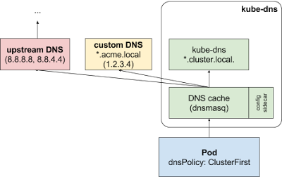

DNS is a built-in Kubernetes service launched automatically using the addon manager cluster add-on.

As of Kubernetes v1.12, CoreDNS is the recommended DNS Server, replacing kube-dns.

The CoreDNS Deployment is exposed as a Kubernetes Service with a static IP. Both the CoreDNS and kube-dns Service are named `kube-dns` in the `metadata.name` field.

The kubelet passes DNS to each container with the `--cluster-dns=<dns-service-ip>` flag.

DNS names also need domains. You configure the local domain in the kubelet with the flag `--cluster-domain=`.

The DNS server supports forward lookups (A records), port lookups (SRV records), reverse IP address lookups (PTR records) and more. 

If a Pod’s dnsPolicy is set to default, it inherits the name resolution configuration from the node that the Pod runs on. The Pod’s DNS resolution should behave the same as the node. That can be change by using the kubelet’s `--resolv-conf` flag. 


## CoreDNS

CoreDNS is a DNS server that is modular and pluggable, and each plugin adds new functionality to CoreDNS. This can be configured by maintaining a [Corefile](https://coredns.io/2017/07/23/corefile-explained/), which is the CoreDNS configuration file.

Default configuration:

```yaml
apiVersion: v1
kind: ConfigMap
metadata:
  name: coredns
  namespace: kube-system
data:
  Corefile: |
    .:53 {
        errors
        health {
            lameduck 5s
        }
        ready
        kubernetes cluster.local in-addr.arpa ip6.arpa {
            pods insecure
            fallthrough in-addr.arpa ip6.arpa
            ttl 30
        }
        prometheus :9153
        forward . /etc/resolv.conf
        cache 30
        loop
        reload
        loadbalance
    }
```

The Corefile configuration includes the following [plugins](https://coredns.io/plugins/) of CoreDNS:
- [errors](https://coredns.io/plugins/errors/): Errors are logged to stdout.
- [health](https://coredns.io/plugins/health/): Health of CoreDNS is reported to http://localhost:8080/health. In this extended syntax `lameduck` will make the process unhealthy then wait for 5 seconds before the process is shut down.
- [ready](https://coredns.io/plugins/ready/): An HTTP endpoint on port 8181 will return 200 OK, when all plugins that are able to signal readiness have done so.
- [kubernetes](https://coredns.io/plugins/kubernetes/): CoreDNS will reply to DNS queries based on IP of the services and pods of Kubernetes. `ttl` allows you to set a custom TTL for responses.

The `pods insecure` option is provided for backward compatibility with kube-dns:
- [prometheus](https://coredns.io/plugins/metrics/): Metrics of CoreDNS are available at http://localhost:9153/metrics in [Prometheus](https://prometheus.io/) format.
- [forward](https://coredns.io/plugins/forward/): Any queries that are not within the cluster domain of Kubernetes will be forwarded to predefined resolvers (/etc/resolv.conf).
- [cache](https://coredns.io/plugins/cache/): This enables a frontend cache.
- [loop](https://coredns.io/plugins/loop/): Detects simple forwarding loops and halts the CoreDNS process if a loop is found.
- [reload](https://coredns.io/plugins/reload): Allows automatic reload of a changed Corefile. After you edit the  ConfigMap configuration, allow two minutes for your changes to take  effect.
- [loadbalance](https://coredns.io/plugins/loadbalance): This is a round-robin DNS loadbalancer that randomizes the order of A, AAAA, and MX records in the answer.

---

CoreDNS has the ability to configure stubdomains and upstream nameservers using the [forward plugin](https://coredns.io/plugins/forward/).


## Kube-dns

The running DNS Pod holds 3 containers:
- `kubedns`: watches the Kubernetes master for changes in Services and Endpoints, and maintains in-memory lookup structures to serve DNS requests.
- `dnsmasq`: adds DNS caching to improve performance.
- `sidecar`: provides a single health check endpoint to perform healthchecks for `dnsmasq` and `kubedns`.

Cluster administrators can specify custom stub domains and upstream nameservers by providing a ConfigMap for kube-dns (`kube-system:kube-dns`). For example, the following ConfigMap sets up a DNS configuration with a single stub domain and two upstream nameservers:

```yaml
apiVersion: v1
kind: ConfigMap
metadata:
  name: kube-dns
  namespace: kube-system
data:
  stubDomains: |
    {"acme.local": ["1.2.3.4"]}
  upstreamNameservers: |
    ["8.8.8.8", "8.8.4.4"]
```

DNS requests with the “.acme.local” suffix are forwarded to a DNS listening at 1.2.3.4. Google Public DNS serves the upstream queries.

The table below describes how queries with certain domain names map to their destination DNS servers:

| Domain name                          | Server answering the query             |
| ------------------------------------ | -------------------------------------- |
| kubernetes.default.svc.cluster.local | kube-dns                               |
| foo.acme.local                       | custom DNS (1.2.3.4)                   |
| widget.com                           | upstream DNS (one of 8.8.8.8, 8.8.4.4) |

Custom upstream nameservers and stub domains do not affect Pods with a `dnsPolicy` set to “`Default`” or “`None`”.

If a Pod’s `dnsPolicy` is set to “`ClusterFirst`”, its name resolution is handled differently, depending on whether stub-domain and upstream DNS servers are configured:
- **Without custom configurations**: Any query that does not match the configured cluster domain suffix, such as “www.kubernetes.io”, is forwarded to the upstream nameserver inherited from the node.
- **With custom configurations**: If stub domains and upstream DNS servers are configured, DNS queries are routed according to the following flow:



Options for the kube-dns `kube-system:kube-dns` ConfigMap:

| Field                            | Format                                                       | Description                                                  |
| -------------------------------- | ------------------------------------------------------------ | ------------------------------------------------------------ |
| `stubDomains` (optional)         | A JSON map using a DNS suffix key such as “acme.local”, and a value consisting of a JSON array of DNS IPs. | The target nameserver can itself be a Kubernetes Service. For instance, you can run your own copy of dnsmasq to export custom DNS names into the  ClusterDNS namespace. |
| `upstreamNameservers` (optional) | A JSON array of DNS IPs.                                     | If specified, the values replace the nameservers taken by default from the node’s `/etc/resolv.conf`. Limits: a maximum of three upstream nameservers can be specified. |

**CoreDNS configuration equivalent to kube-dns**

A ConfigMap created for kube-dns to support `StubDomains`and `upstreamNameservers` translates to the `forward` plugin in CoreDNS. Similarly, the `Federations` plugin in kube-dns translates to the `federation` plugin in CoreDNS.
