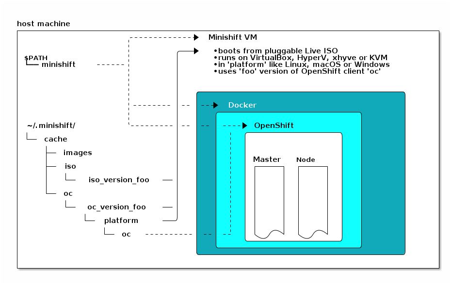

### Minishift

Minishift runs OpenShift locally by running a single-node OpenShift cluster inside a VM.
https://docs.okd.io/latest/minishift/command-ref/minishift.html

#### Install

```bash
# Setting up the virtualization environment
brew install docker-machine-driver-xhyve
sudo chown root:wheel $(brew --prefix)/opt/docker-machine-driver-xhyve/bin/docker-machine-driver-xhyve
sudo chmod u+s $(brew --prefix)/opt/docker-machine-driver-xhyve/bin/docker-machine-driver-xhyve
brew info --installed --json=v1 docker-machine-driver-xhyve

# Installing
brew cask install minishift
```

#### Quickstart

```bash
minishift start

# Display the command you need to type into your shell in order to add the oc binary to your PATH 
minishift oc-env

# Accessing the Web Console
minishift console --url

# Accessing OpenShift Services
minishift openshift service [-n NAMESPACE] [--url] NAME

# Logs
minishift logs

# Stop
minishift stop

# Deletes the Minishift VM, including the local OpenShift cluster and all associated files.
minishift delete

# To completely uninstall Minishift, delete everything in the MINISHIFT_HOME
rm -rf ~/.minishift
rm -rf ~/.kube

# Update
minishift update
```

#### Using Minishift

When you use Minishift, you interact with the following components:

- the Minishift virtual machine (VM)
- the Docker daemon running on the VM
- the OpenShift cluster running on the Docker daemon



#### Life-cycle

The  [`minishift start`](https://docs.okd.io/latest/minishift/command-ref/minishift_start.html) command creates and configures the Minishift VM and provisions a local, single-node OpenShift cluster within the Minishift VM. Also copies the **oc** binary to your host (**~/.minishift/cache/oc/v3.11.0**) so that you can interact with OpenShift through the `oc`command line tool or through the Web console, which can be accessed through the URL provided in the output of the `minishift start`command.

The  [`minishift stop`](https://docs.okd.io/latest/minishift/command-ref/minishift_stop.html) command stops your OpenShift cluster and shuts down the Minishift VM, but preserves the OpenShift cluster state. Starting Minishift again will restore the OpenShift cluster.

The [`minishift delete`](https://docs.okd.io/latest/minishift/command-ref/minishift_delete.html) command deletes the OpenShift cluster, and also shuts down and deletes the Minishift VM. No data or state are preserved.

#### Persistent Volumes

As part of the OpenShift cluster provisioning, 100 [persistent volumes](https://docs.okd.io/latest/dev_guide/persistent_volumes.html) are created for your OpenShift cluster. Default path is **/var/lib/minishift/openshift.local.pv** on the Minishift VM.

#### Networking

The Minishift VM is exposed to the host system with a host-only IP address that can be obtained with the [`minishift ip`](https://docs.okd.io/latest/minishift/command-ref/minishift_ip.html) command.

#### Connecting to the Minishift VM with SSH

You can use the [`minishift ssh`](https://docs.okd.io/latest/minishift/command-ref/minishift_ssh.html) command to interact with the Minishift VM.

#### Profiles

Each Minishift profile is created with its own configuration (memory, CPU, disk size, add-ons, and so on) and is independent of other profiles.

```bash
 minishift profile list
 minishift --profile
 minishift profile set XXXXXXX
```

As part of the `minishift start`command, a [CLI profile](https://docs.okd.io/latest/cli_reference/manage_cli_profiles.html) named **minishift**is also created. This profile, also known as a *context*, contains the configuration to communicate with your OpenShift cluster.

#### Add-ons

Add-ons are directories that contain a text file with the **.addon** extension.

```bash
minishift addons install <path_to_addon_directory>
minishift addons list --verbose=true
```

#### Host Folders

Host folders are directories on the host which are shared between the host and the Minishift VM. This allows for two way file synchronization between the host and the VM. The following sections discuss usage of the `minishift hostfolder`command. Currently [CIFS](https://en.wikipedia.org/wiki/Server_Message_Block) and [SSHFS](https://en.wikipedia.org/wiki/SSHFS) based host folders are supported.

#### Exposing Services

```bash
# Expose by a route as a host name
oc expose svc/frontend --hostname=www.example.com

# Create a NodePort service, so
# OpenShift node will proxy that port into your service and
# configure an Ingress IP to access this port.
minishift start
eval $(minishift oc-env)
oc new-app -e MYSQL_ROOT_PASSWORD=admin https://raw.githubusercontent.com/openshift/origin/master/examples/db-templates/mariadb-persistent-template.json
oc rollout status -w dc/mariadb
oc expose dc mariadb --type=LoadBalancer --name=mariadb-ingress
oc export svc mariadb-ingress
mysql --user=root --password=admin --host=$(minishift ip) --port=30907

# Port Forwarding
oc port-forward POD [LOCAL_PORT:]REMOTE_PORT
```

#### Docker Registry

```bash
# Login
docker login -u developer -p $(oc whoami -t) $(minishift openshift registry)
# Tag the image against the OpenShift registry
docker tag my-app $(minishift openshift registry)/myproject/my-app
# Push the image to the registry to create an image stream
docker push $(minishift openshift registry)/myproject/my-app
# Create an application from the image stream
oc new-app --image-stream=my-app --name=my-app
# and expose the service
oc expose service my-app
```
