# Programming Kubernetes

## Introduction

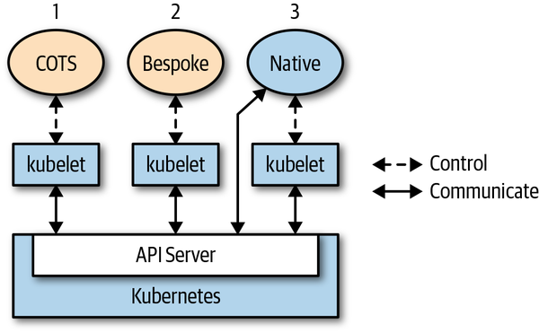

COTS (*commercially available off-the-shelf*) - the app itself is not aware it runs on Kubernetes and usually doesn’t have to be. Kubernetes controls the app’s  lifecycle—find node to run, pull image, launch container(s), carry out  health checks, mount volumes etc.

Bespoke app, something you wrote from scratch, with or without having had Kubernetes as the runtime environment in mind, and run it on  Kubernetes. The same modus operandi as in the case of a COTS applies.

Cloud-native or Kubernetes-native application that is fully aware it is  running on Kubernetes and leverages Kubernetes APIs and resources to  some extent.


Customize and/or extend Kubernetes: 

- using [configuration files and flags](http://bit.ly/2KteqbA) for control plane components like the `kubelet` 
- using Kubernetes API server
- using a number of defined extension points:
  - [cloud providers](http://bit.ly/2FpHInw) - providing a [custom `cloud-controller-manager` process to integrate with a cloud](http://bit.ly/2WWlcxk). Cloud providers allow the use of cloud provider–specific tools like load balancers or Virtual Machines (VMs).
  - Binary `kubelet` plug-ins for [network](http://bit.ly/2L1tPzm), [devices](http://bit.ly/2XthLgM) (such as GPUs), [storage](http://bit.ly/2x7Unaa), and [container runtimes](http://bit.ly/2Zzh1Eq).
  - Binary `kubectl` [plug-ins](http://bit.ly/2FmH7mu).
  - Access extensions in the API server, such as the [dynamic admission control with webhooks](http://bit.ly/2DwR2Y3)
  - Custom resources and custom controllers
  - Custom API servers
  - Scheduler extensions, such as using a [webhook](http://bit.ly/2xcg4FL) to implement your own scheduling decisions.
  - [Authentication](http://bit.ly/2Oh6DPS) with webhooks.

## Controllers and Operators

A *controller* implements a control loop, watching the shared  state of the cluster through the API server and making changes in an  attempt to move the current state toward the desired state. Controllers can act on core resources such as deployments or services or can watch and manipulate user-defined custom resources.

Operators are controllers that encode some operational knowledge, such as application lifecycle management.

## The Control Loop

1. Read the state of resources, preferably event-driven.
2. Change the state of objects in the cluster or the cluster-external  world. For example, launch a pod, create a network endpoint, or query a  cloud API.
3. Update status of the resource in step 1 via the API server in `etcd`.
4. Repeat cycle; return to step 1.


**Informers** watch the desired state of resources in a scalable and sustainable fashion. They also implement a resync mechanism that enforces periodic reconciliation, and is often used  to make sure that the cluster state and the assumed state cached in  memory do not drift (e.g., due bugs or network issues).

**Work queue** is a component that can be used by the event handler to handle  queuing of state changes and help to implement retries. In `client-go` this functionality is available via the [*workqueue* package](http://bit.ly/2x7zyeK). Resources can be requeued in case of errors when updating the world or  writing the status (steps 2 and 3 in the loop), or just because we have  to reconsider the resource after some time for other reasons.


Watch events and the top-level Event object in Kubernetes are two different things:

- Watch events are sent through streaming HTTP connections between the API server and controllers to drive informers.
- The top-level Event object is a resource like pods, deployments, or services, with the special property that it has a time-to-live of an hour and then is purged automatically from etcd.


Trigger options (edge-driven versus level-driven):

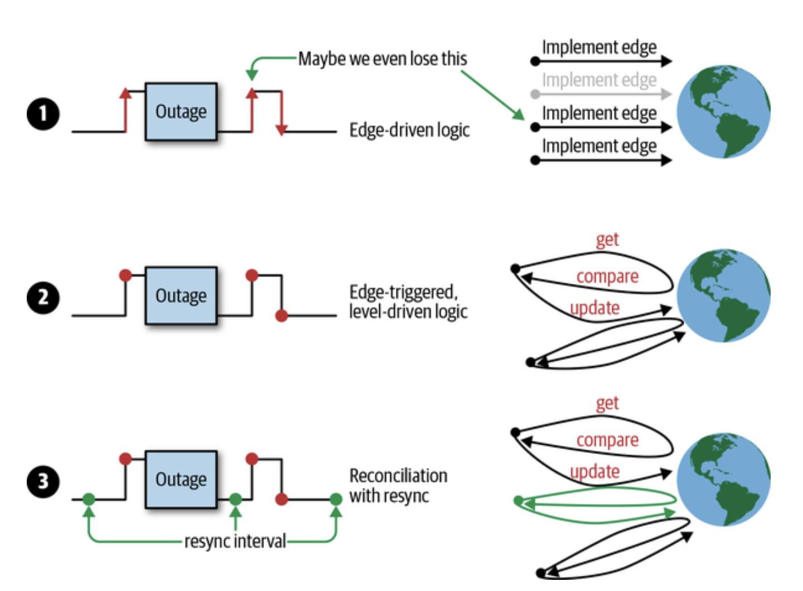

Given the challenges of pure edge-driven triggers, the Kubernetes controllers typically implement the third strategy.


Scheduling architectures in distributed systems:

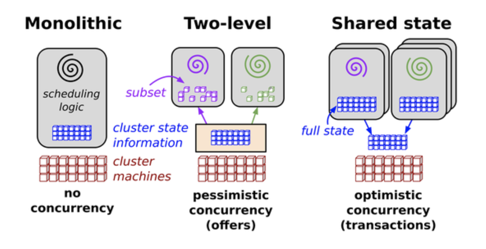

Kubernetes API server uses optimistic concurrency.


The resource version of each object is a string in Kubernetes that contains an integer. This integer comes directly from `etcd`. `etcd` maintains a counter that increases each time the value of a key (which holds the object’s serialization) is modified.

## Operators

The artifacts shipped in the context of the operator are:

- A set of *custom resource definitions* (CRDs) capturing the domain-specific schema and custom resources  following the CRDs that, on the instance level, represent the domain of  interest.
- A custom controller, supervising the custom resources, potentially  along with core resources. For example, the custom controller might spin up a pod.

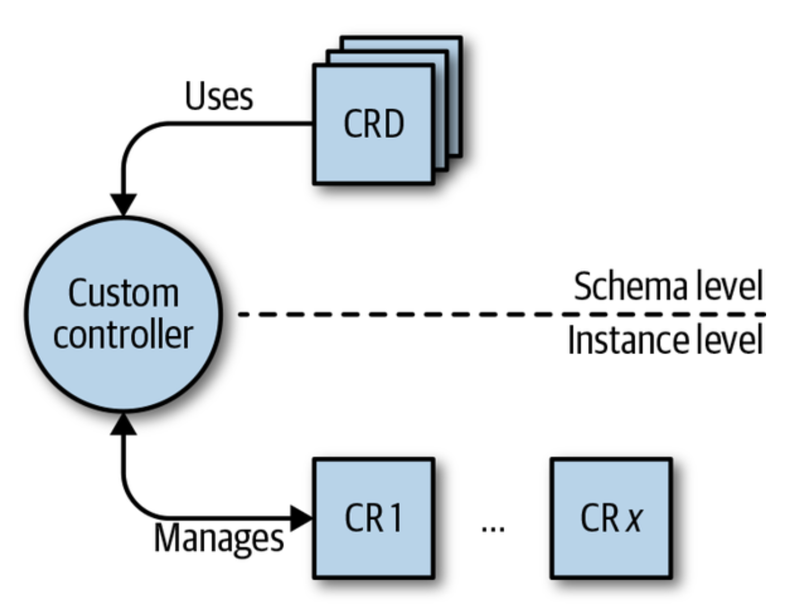


## The API Server

Kubernetes is made up of a bunch of nodes (machines in the cluster) with different roles: the control plane on the master node(s) consists of the API server,  controller manager, and scheduler. The API server is the central  management entity and the only component that talks directly with the  distributed storage component `etcd`.

The API server has the following core responsibilities:

- To serve the Kubernetes API. This API is used cluster-internally by the  master components, the worker nodes, and your Kubernetes-native apps, as well as externally by clients such as `kubectl`.
- To proxy cluster components, such as the Kubernetes dashboard, or to stream logs, service ports, or serve `kubectl exec` sessions.

Serving the API means:

- Reading state: getting single objects, listing them, and streaming changes
- Manipulating state: creating, updating, and deleting objects

State is persisted via `etcd`.

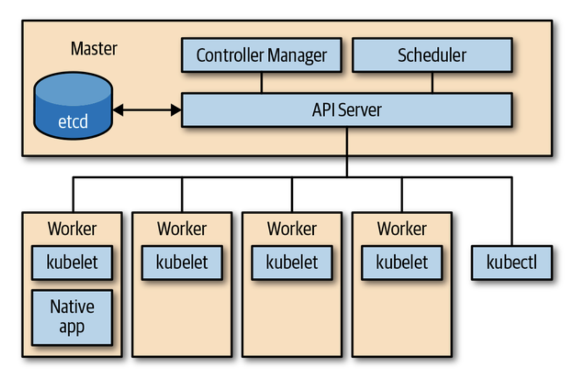

#### Kind

The type of an entity. Each object has a field `Kind`, which tells a client such as `kubectl` that it represents, for example, a pod. There are three categories of kinds:  

- Objects represent *a persistent entity in the system*—for example, `Pod` or `Endpoints`. Objects have names, and many of them live in namespaces.  
- Lists are collections of one or more kinds of entities. Lists have a limited set of common metadata. Examples include `PodList`s or `NodeList`s. When you do a **`kubectl get pods`**, that’s exactly what you get.  
- Special-purpose kinds are used for specific actions on objects and for nonpersistent entities such as `/binding` or `/scale`. For discovery, Kubernetes uses `APIGroup` and `APIResource`; for error results, it uses `Status`.

#### API group

A collection of `Kind`s that are logically related. For example, all batch objects like `Job` or `ScheduledJob` are in the batch API group.

#### Version

Each API group can exist in multiple versions, and most of them do. For example, a group first appears as `v1alpha1` and is then promoted to `v1beta1` and finally graduates to `v1`. 

#### Resource

A usually lowercase, plural word (e.g., `pods`) identifying a set of HTTP endpoints (paths) exposing the CRUD (create,  read, update, delete) semantics of a certain object type in the system. 

## GVR

Resources are always part of an API group and a version, collectively referred to as *GroupVersionResource* (or GVR). A GVR uniquely defines an HTTP path.

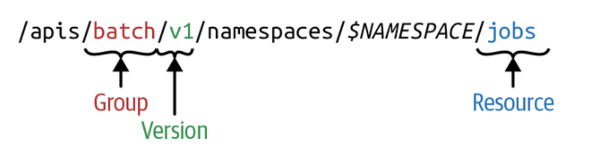

Similarly to GVRs, each kind lives in an API group, is versioned, and is identified via a *GroupVersionKind* (GVK).

## Declarative State Management

Most API objects make a distinction between the specification of the *desired state* of the resource and the *status* of the object at the current time. A *specification*, or spec for short, is a complete description of the desired state of a  resource and is typically persisted in stable storage, usually `etcd`.

## How the API Server Processes Requests

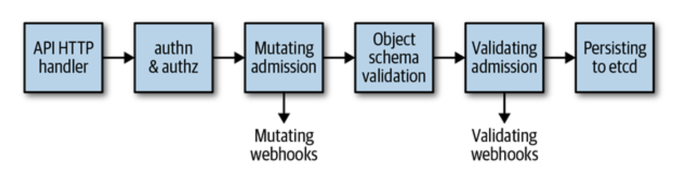

1. The HTTP request is processed by a chain of filters registered in `DefaultBuildHandlerChain()`. This chain is defined in [*k8s.io/apiserver/pkg/server/config.go*](http://bit.ly/2x9t27e). It applies a series of filter  operations on said request. Either the filter passes and attaches  respective information to the context—to be precise, `ctx.RequestInfo`, with `ctx` being the [context](https://golang.org/pkg/context) in Go (e.g., the authenticated user)—or, if a request does not pass a  filter, it returns an appropriate HTTP response code stating the reason.
2. Next, depending on the HTTP path, the multiplexer in [*k8s.io/apiserver/pkg/server/handler.go*](http://bit.ly/2WUd0c6) routes the HTTP request to the respective handler.
3. A handler is registered for each API group—see [*k8s.io/apiserver/pkg/endpoints/groupversion.go*](http://bit.ly/2IvvSKA) and [*k8s.io/apiserver/pkg/endpoints/installer.go*](http://bit.ly/2Y1eySV) for details. It takes the HTTP request as well as the context (for  example, user and access rights) and retrieves as well as delivers the  requested object from `etcd` storage.

After this generic handler chain is passed the actual request processing starts:

- Requests for */*, */version*, */apis*, */healthz*, and other nonRESTful APIs are directly handled.

- Requests for RESTful resources go into the request pipeline consisting of:

  - *admission*

    Incoming objects go through an admission chain. That chain has some 20 different admission plug-ins.[1](https://learning.oreilly.com/library/view/programming-kubernetes/9781492047094/ch02.html#idm46336866991944) Each plug-in can be part of the mutating phase, part of the validating phase or both. In the mutating phase, the incoming request payload can be changed; for example, the image pull policy is set to `Always`, `IfNotPresent`, or `Never` depending on the admission configuration. The second admission phase is purely for validation; for example,  security settings in pods are verified, or the existence of a namespace  is verified before creating objects in that namespace.

  - *validation*

    Incoming objects are checked against a large validation logic, which  exists for each object type in the system. For example, string formats  are checked to verify that only valid DNS-compatible characters are used in service names, or that all container names in a pod are unique.

  - `etcd`-*backed CRUD logic*

    Here the different verbs we saw in [“The HTTP Interface of the API Server”](https://learning.oreilly.com/library/view/programming-kubernetes/9781492047094/ch02.html#api-server-http-interface) are implemented; for example, the update logic reads the object from `etcd`, checks that no other user has modified the object in the sense of [“Optimistic Concurrency”](https://learning.oreilly.com/library/view/programming-kubernetes/9781492047094/ch01.html#optimistic-concurrency), and, if not, writes the request object to `etcd`.

## Basics of client-go

The Kubernetes programming interface in Go mainly consists of the *k8s.io/client-go* library. *client-go* is a typical web service client library that supports all API types that are officially part of Kubernetes.

The Kubernetes API Go types for objects like pods, services, and deployments are located in [their own repository](http://bit.ly/2ZA6dWH). It is accessed as `k8s.io/api` in Go code.

[API Machinery](http://bit.ly/2xAZiR2) includes all the generic building blocks to implement a Kubernetes-like API.

## Versioning and Compatibility

Using a client with a version of an API group that the API server does  not support will fail. Clients are hardcoded to a version, and the  application developer has to select the right API group version in order to speak to the cluster at hand.

`v1alpha1`, `v1alpha2`, `v2alpha1`, and so on are called *alpha versions* and considered unstable.

`v1beta1`, `v1beta2`, `v2beta1`, and so on, are called *beta versions*. They are on the way to stability.

`v1`, `v2`, and so on are stable, generally available APIs.

## Kubernetes Objects in Go

Kubernetes objects fulfill a Go interface called `runtime.Object`.

```
type Object interface {
    GetObjectKind() schema.ObjectKind
    DeepCopyObject() Object
}
type ObjectKind interface {
    SetGroupVersionKind(kind GroupVersionKind)
    GroupVersionKind() GroupVersionKind
}
```

Kubernetes objects from *k8s.io/api* implement the type getter and setter of `schema.ObjectKind` by embedding the `metav1.TypeMeta`

```
type TypeMeta struct {
    Kind string `json:"kind,omitempty" protobuf:"bytes,1,opt,name=kind"`
    APIVersion string `json:"apiVersion,omitempty"`
}
```

most top-level objects have a field of type `metav1.ObjectMeta`

```
type ObjectMeta struct {
    Name string `json:"name,omitempty"`
    Namespace string `json:"namespace,omitempty"`
    UID types.UID `json:"uid,omitempty"`
    ResourceVersion string `json:"resourceVersion,omitempty"`
    CreationTimestamp Time `json:"creationTimestamp,omitempty"`
    DeletionTimestamp *Time `json:"deletionTimestamp,omitempty"`
    Labels map[string]string `json:"labels,omitempty"`
    Annotations map[string]string `json:"annotations,omitempty"`
    ...
}
```

In JSON or YAML these fields are under *metadata*.

Finally, nearly every top-level object has a `spec` and a `status` section.

## Client Sets

A client set gives access to clients for multiple API groups and resources. 

## Informers and Caching

Informers give a higher-level programming interface for the most common  use case for watches: in-memory caching and fast, indexed lookup of  objects by name or other properties in-memory.

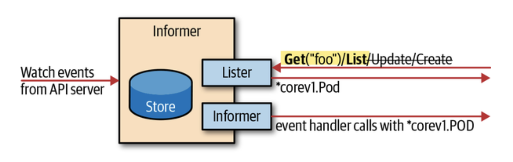

When the long-running watch connection breaks down, they recover from it by trying another watch request, picking up the event stream without  losing any events. If the outage is long, and the API server lost events because `etcd` purged them from its database before the new watch request was successful, the informer will relist all objects.

One binary should instantiate only one informer per GroupVersionResource. To make sharing of informers easy, we can instantiate an informer by using the *shared informer factory*.

## Work Queue

A work queue is a data structure. You can add elements and take elements  out of the queue, in an order predefined by the queue. Formally, this  kind of queue is called a *priority queue*.

```
type Interface interface {
    Add(item interface{})
    Len() int
    Get() (item interface{}, shutdown bool)
    Done(item interface{})
    ShutDown()
    ShuttingDown() bool
}
```

## API Machinery

### Kinds

Kinds are divided into API groups and are versioned. Therefore, a core term in the API Machinery repository is GroupVersionKind, or *GVK* for short. Kinds do not formally map one-to-one to HTTP paths.

### Resources

Resources are again grouped and versioned, leading to the term *GroupVersionResource*, or *GVR* for short. Each GVR corresponds to one HTTP (base) path. GVRs are used to identify REST endpoints of the Kubernetes API.

### REST Mapping

The mapping of a GVK to a GVR is called *REST mapping*.

A `RESTMapper` is the interface that enables us to request the GVR for a GVK:

```
RESTMapping(gk schema.GroupKind, versions ...string) (*RESTMapping, error)
```

### Scheme

A scheme connects the world of Golang with the  implementation-independent world of GVKs. The main feature of a scheme  is the mapping of Golang types to possible GVKs:

```
func (s *Scheme) ObjectKinds(obj Object) ([]schema.GroupVersionKind, bool, error)
```

The scheme takes the Golang type of the given object via reflection and maps it to the registered GVK(s) of that Golang type.

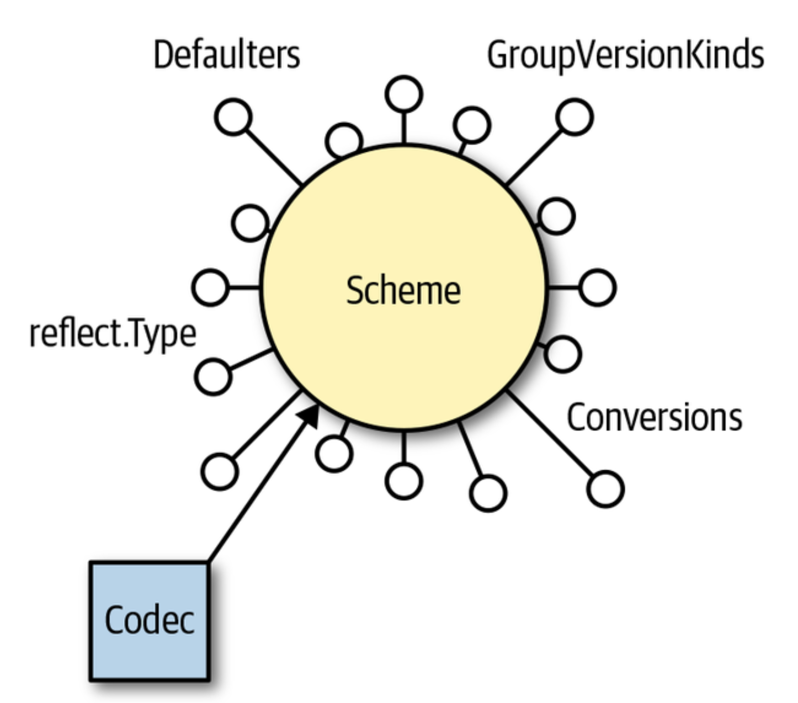

API Machinery concept:

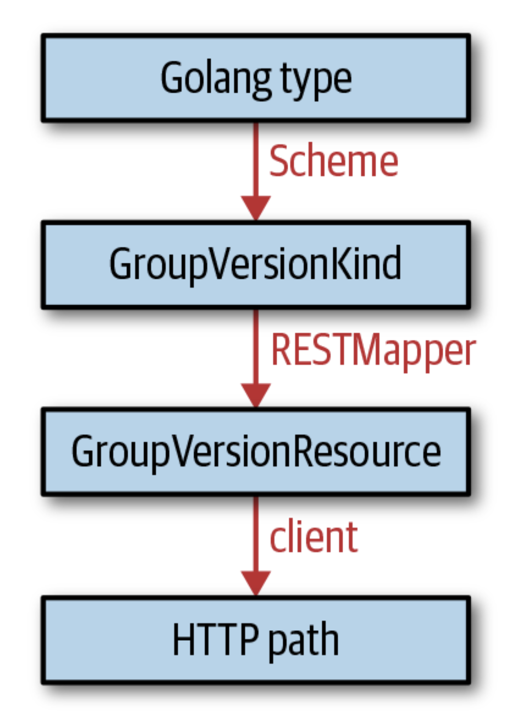

# Custom Resources

Custom resources are used for small, in-house configuration objects without any corresponding controller logic—purely declaratively defined. They are stored in the same `etcd` instance as the main Kubernetes API resources and served by the same Kubernetes API server. 

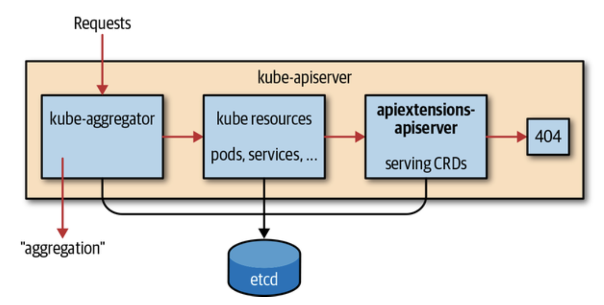

A CustomResourceDefinition (CRD) is a Kubernetes resource itself. It describes the available CRs in the cluster.

CRs can be validated by the API server during creation and updates. This is done based on the [OpenAPI v3 schema](http://bit.ly/2RqtN5i) specified in the `validation` fields in the CRD spec.

More complex validations can be implemented in validating admission webhooks—that is, in a Turing-complete programming language.

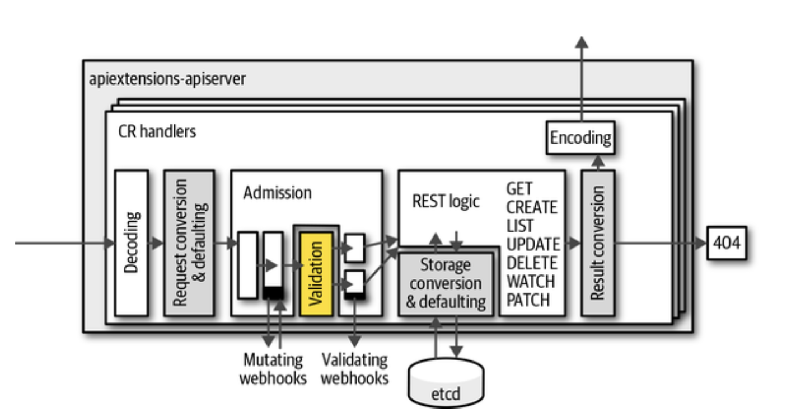

Custom resources can be accessed from Golang:

- Using the `client-go` dynamic client (see [“Dynamic Client”](https://learning.oreilly.com/library/view/programming-kubernetes/9781492047094/ch04.html#dynamic-client))
- Using a typed client:
  - As provided by [kubernetes-sigs/controller-runtime](http://bit.ly/2ZFtDKd) and used by the Operator SDK and Kubebuilder.
  - As generated by `client-gen`, like that in [*k8s.io/client-go/kubernetes*](http://bit.ly/2FnmGWA)

## Dynamic Client

The dynamic client in [*k8s.io/client-go/dynamic*](http://bit.ly/2Y6eeSK) is totally agnostic to known GVKs. It does not even use any Go types other than [*unstructured.Unstructured*](http://bit.ly/2WYZ6oS), which wraps just `json.Unmarshal` and its output.

The dynamic client makes use of neither a scheme nor a RESTMapper. This  means that the developer has to provide all the knowledge about types  manually by providing a resource (see [“Resources”](https://learning.oreilly.com/library/view/programming-kubernetes/9781492047094/ch03.html#resources)) in the form of a GVR.

## Typed Clients

Typed clients do not use `map[string]interface{}`-like generic data structures but instead use real Golang types, which are different and specific for each GVK. 

Golang types are traditionally placed in a file called *types.go* in the package *pkg/apis/`group`/`version`*.

The *doc.go* file describes the API’s purpose and includes a number of package-global code generation tags.

*register.go* includes helpers to register the custom resource Golang types into a scheme.

## Automating Code Generation

Code generators are used a lot in the implementation of native Kubernetes resources.

Go is a simple language by design. It lacks higher-level or even  metaprogramming-like mechanisms to express algorithms on different data  types in a generic (i.e., type-independent) way. The “Go way” is to use  external code generation instead.

Very early in the Kubernetes development process, more and more code  had to be rewritten as more resources were added to the system. Code  generation made the maintenance of this code much easier.

While some of the code-generator behavior is controlled via command-line  flags as described earlier (especially the packages to process), a lot  more properties are controlled via *tags* in your Go files. There are two kind of tags:

- Global tags above the `package` line in a file called *doc.go*
- Local tags above a type declaration (e.g., above a struct definition)

## Writing Operators

In terms of the business logic, we have two parts to implement in the operator:

- In [*types.go*](http://bit.ly/31QosJw) we modify the `AtSpec` struct to include the respective fields, such as `schedule` and `command`. Note that you must run `update-codegen.sh` whenever you change something here in order to regenerate dependent files.
- In [*controller.go*](http://bit.ly/31MM4OS) we change the `NewController()` and `syncHandler()` functions as well as add helper functions, including creating pods and checking schedule time.

Implement the state transitions between the three phases—from `PhasePending` to `PhaseRunning` to `PhaseDone`—in [controller.go](http://bit.ly/31MM4OS).

### Kubebuilder

[Kubebuilder](http://bit.ly/2I8w9mz), owned and maintained by the Kubernetes Special Interest Group (SIG) API  Machinery, is a tool and set of libraries enabling you to build  operators in an easy and efficient manner. 

### The Operator SDK

To make it easier to build Kubernetes applications, CoreOS/Red Hat has put together the Operator Framework. Part of that is the [Operator SDK](http://bit.ly/2KtpK7D), which enables developers to build operators without requiring deep knowledge of Kubernetes APIs.

## Shipping Controllers and Operators

- Helm helps you to install and upgrade Kubernetes applications by defining  and applying so-called charts, effectively parameterized YAML manifests. 

- [Kustomize](https://kustomize.io) provides a declarative approach to configuration customization of Kubernetes manifest files, adhering to the familiar Kubernetes API.

- In order to customize values of raw Kubernetes manifests, you can use a range of CLI tools such as `sed`, `awk`, or `jq` in shell scripts.

- You can use any of the traditional configuration management systems, such  as Ansible, Puppet, Chef, or Salt, to package and deliver your operator.

- A new generation of so-called [cloud-native programming languages](http://bit.ly/2Rwh5lu), such as Pulumi and Ballerina, allows for, among other things, packaging and lifecycle management of Kubernetes-native apps.
- With `ytt` you have another option for a YAML templating tool using a language that is itself a modified version of Google’s configuration language [Starlark](http://bit.ly/2NaqoJh). It operates semantically on the YAML structures and focuses on reusability.

### Permissions

Always create a [dedicated service account](http://bit.ly/2RwoSQp) to run your controller. In other words: *never* use the `default` service account in a namespace.

Define a `ClusterRole` with the necessary RBAC rules along with a `RoleBinding` to bind it to a specific namespace.

The controller *should not* have permissions to manage CRDs and webhooks.

# Custom API Servers

As an alternative to CustomResourceDefinitions, you can use a custom API  server. Custom API servers can serve API groups with resources the same  way the main Kubernetes API server does. In contrast to CRDs, there are  hardly any limits to what you can do with a custom API server.

CRDs:

- Use `etcd` as their storage medium (or whatever the Kubernetes API server uses).
- Do not support protobuf, only JSON.
- Support only two kinds of subresources: */status* and */scale*.
- Do not support graceful deletion. Finalizers can simulate this but do not allow a custom graceful deletion time.
- Add significantly to the Kubernetes API server’s CPU load, because  all algorithms are implemented in a generic way (for example,  validation).
- Implement only standard CRUD semantics for the API endpoints.
- Do not support cohabitation of resources (i.e., resources in different API groups or resources of different names that share storage).

# Chapter 8. Custom API Servers

As an alternative to CustomResourceDefinitions, you can use a custom API  server. Custom API servers can serve API groups with resources the same  way the main Kubernetes API server does. In contrast to CRDs, there are  hardly any limits to what you can do with a custom API server.

This chapter begins by listing a number of reasons why CRDs might not be the right solution for your use case. It describes the aggregation pattern that makes it possible to extend the Kubernetes API surface with a custom API server. Finally, you’ll learn to actually  implement a custom API server using Golang.

# Use Cases for Custom API Servers

A custom API server can be used in place of CRDs. It can do everything  that CRDs can do and offers nearly infinite flexibility. Of course, this comes at a cost: complexity of both development and operation.

Let’s look at some limits of CRDs as of the time of this writing (when Kubernetes 1.14 was the stable release). CRDs:

- Use `etcd` as their storage medium (or whatever the Kubernetes API server uses).
- Do not support protobuf, only JSON.
- Support only two kinds of subresources: */status* and */scale* (see [“Subresources”](https://learning.oreilly.com/library/view/programming-kubernetes/9781492047094/ch04.html#crd-subresources)).
- Do not support graceful deletion.[1](https://learning.oreilly.com/library/view/programming-kubernetes/9781492047094/ch08.html#idm46336853170760) Finalizers can simulate this but do not allow a custom graceful deletion time.
- Add significantly to the Kubernetes API server’s CPU load, because  all algorithms are implemented in a generic way (for example,  validation).
- Implement only standard CRUD semantics for the API endpoints.
- Do not support cohabitation of resources (i.e., resources in different API groups or resources of different names that share storage).[2](https://learning.oreilly.com/library/view/programming-kubernetes/9781492047094/ch08.html#idm46336853165528)

A custom API server, in contrast, does not have these restrictions. 

- Can use any storage medium:
  - The [metrics API server](http://bit.ly/2FvgfAV), which stores data in memory for maximum performance
  - API servers mirroring a Docker registry in [OpenShift](http://redhat.com/openshift)
  - API servers mirroring cloud APIs
  - etc.
- Can provide protobuf support like all native Kubernetes resources do.
- Can provide any custom subresource; for example, the Kubernetes API server provides */exec*, */logs*, */port-forward*, and more, most of which use very custom protocols like WebSockets or HTTP/2 streaming.
- Can implement graceful deletion as Kubernetes does for pods. `kubectl` waits for the deletion, and the user can even provide a custom graceful termination period.
- Can implement all operations like validation, admission, and  conversion in the most efficient way using Golang, without a roundtrip  through webhooks, which add further latency.
- Can implement custom semantics, like the atomic reservation of a service IP in the core v1 `Service` kind. 
- Can serve resources that have a common storage mechanism (i.e., a common `etcd` key path prefix) but live in different API groups or are named  differently.

## The Architecture

Custom API servers are processes serving API groups, usually built using the generic API server library [*k8s.io/apiserver*](http://bit.ly/2X3joNX). These processes can run inside or outside of the cluster. In the former case, they run inside pods, with a service in front.

Path of requests targeted at a custom API server, but coming in at the Kubernetes API server TCP socket:

1. Requests are received by the Kubernetes API server.
2. They pass the handler chain consisting of authentication, audit  logging, impersonation, max-in-flight throttling, authorization etc.
3. As the Kubernetes API server knows the aggregated APIs, it can intercept requests to the HTTP path */apis/`aggregated-API-group-name`*.
4. The Kubernetes API server forwards the request to the custom API server.


API Services

For the Kubernetes API server to know about the API groups a custom API server serves, one `APIService` object must be created in the `apiregistration.k8s.io/v1` API group. These objects list only the API groups and versions, not resources or any further details.

 `GroupPriorityMinimum` value determines where the group is prioritized. If multiple `APIService` objects for different versions differ, the highest value rules.

### Inner Structure of a Custom API Server

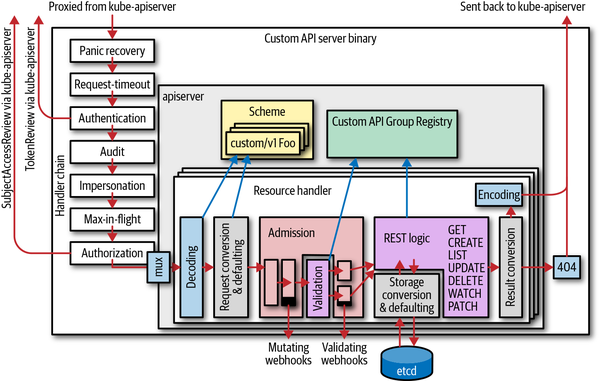

An aggregated API server:

- Has the same basic internal structure as the Kubernetes API server.
- Has its own handler chain, including authentication, audit, impersonation, max-in-flight throttling, and authorization.
- Has its own resource handler pipeline, including decoding, conversion, admission, REST mapping, and encoding.
- Calls admission webhooks.
- Might write to `etcd` (it can use a different storage backend, though). The `etcd` cluster does not have to be the same as the one used by the Kubernetes API server.
- Has its own scheme and registry implementation for custom API groups. The registry implementation might differ and be customized to any  degree.
- Does authentication again. It usually does client certificate  authentication and token-based authentication, calling back to the  Kubernetes API server with a `TokenAccessReview` request. 
- Does its own auditing. This means the Kubernetes API server audits  certain fields, but only on the meta level. Object-level auditing is  done in the aggregated custom API server.
- Does its own authentication using `SubjectAccessReview` requests to the Kubernetes API server.

### Delegated Authentication and Trust

An aggregated custom API server (based on [*k8s.io/apiserver*](http://bit.ly/2X3joNX)) is built on the same authentication library as the Kubernetes API  server. It can use client certificates or tokens to authenticate a user.

Because an aggregated custom API server is architecturally placed behind the Kubernetes API server, requests are already authenticated by the Kubernetes API server. The Kubernetes  API server stores the result of the authentication in HTTP request headers.

### Delegated Authorization

Authorization is based on the username and group list. The default authorization mechanism in Kubernetes is role-based access control (RBAC). RBAC maps identities to roles, and roles to authorization rules, which finally accept or reject requests.

An aggregated custom API server authorizes requests using delegated authorization via `SubjectAccessReview`s. It does not evaluate RBAC rules itself but instead delegates evaluation to the Kubernetes API server.

## Writing Custom API Servers

The main Kubernetes API server is implemented via the *k8s.io/apiserver* library. A custom API server will use the very same code. The main  difference is that our custom API server will run in-cluster. This means that it can assume that a `kube-apiserver` is available in the cluster and use it to do delegated authorization and to retrieve other kube-native resources.

- The *k8s.io/apiserver* library uses an *options and config pattern* to create a running API server.
- standard handler chain includes delegated authentication, delegated authorization, and auditing.
- HTTPS server running and serving requests for the generic endpoints: */logs*, */metrics*, */version*, */healthz*, and */apis*.

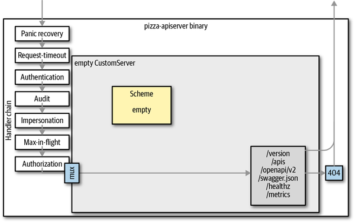

Every API server serves a number of resources and versions. Some resources have multiple versions. To make multiple versions of a resource possible, the API server converts between versions.

To avoid quadratic growth of necessary conversions between versions, API servers use an *internal version* when implementing the actual API logic. The internal version is also often called *hub version* because it is a kind of hub that every other version is converted to and from. The internal API logic is implemented just once for that hub version.

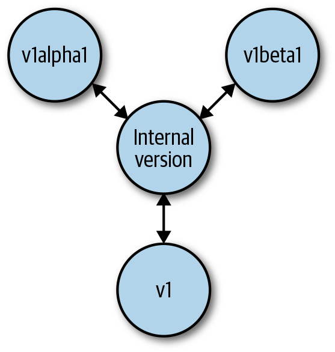

Life-cycle of an API request:

- The user sends a request using a specific version (e.g., `v1`).
- The API server decodes the payload and converts it to the internal version.
- The API server passes the internal version through admission and validation.
- The API logic is implemented for internal versions in the registry.
- `etcd` reads and writes the versioned object (e.g., `v2`—the storage version); that is, it converts from and to the internal version.
- Finally, the result is converted to the request version, in this case, `v1`.

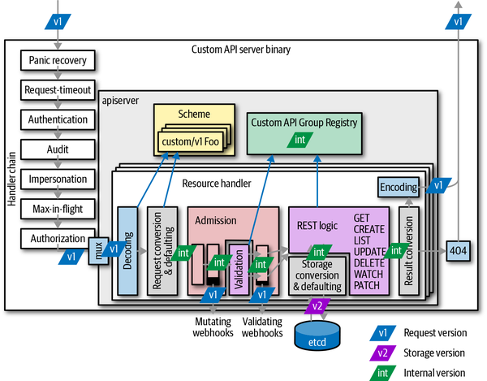

On each edge between the internal hub version and the external version, a conversion takes place.

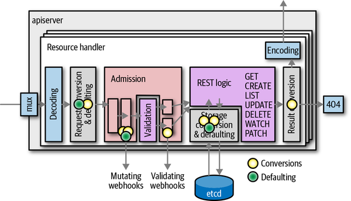

In addition to conversion *defaulting* takes place. Defaulting is the process of filling in unspecified field  values. Defaulting is highly coupled with conversion, and is always done on the external version when it comes in from the user’s request, from `etcd` or from an admission webhook, but never when converted from the hub to the external version.

Conversion is crucial for the API server mechanics. It is also crucial that all  conversions (back and forth) must be correct in the sense of being *roundtrippable*. Roundtrippable means that we can convert back and forth in the version graph starting with random values, and we never lose any information; that is, conversions are bijective, or one-to-one.

### Writing the API Types

As we have seen, to add an API to the custom API server, we have to write  the internal hub version types and the external version types and  convert between them.

API types are traditionally placed into the *pkg/apis/`group-name`* package of the project with *pkg/apis/`group-name`/types.go* for internal types and *pkg/apis/`group-name`/`version`/types.go* for the external versions).

Conversions will be created at *pkg/apis/`group-name`/`version`/zz_generated.conversion.go* (for `conversion-gen` output) and *pkg/apis/`group-name`/`version`/conversion.go* for custom conversions written by the developer.

In a similar way, defaulting code will be created for `defaulter-gen` output at *pkg/apis/`group-name`/`version`/zz_generated.defaults.go* and at *pkg/apis/`group-name`/`version`/defaults.go* for custom defaulting code written by the developer. 

#### Conversions

Conversion takes an object in one version and converts it into an object in  another version. Conversion is implemented through conversion functions, some of them manually written by convention), and others autogenerated.

Conversion functions must not mutate the source object, but the output  is allowed to share data structures with the source. This means that  consumers of conversion output have to make sure not to mutate an object if the original object must not be mutated.

#### Defaulting

Defaulting is the step in an API request’s lifecycle that sets default values for  omitted fields in incoming objects (from the client or from `etcd`). For example, a pod has a `restartPolicy` field. If the user does not specify it, a value will default to `Always`.

Most defaulting code is just generated with the [`defaulter-gen`](http://bit.ly/2J108vK) binary. It traverses API types and creates defaulting functions in *pkg/apis/`group-name`/`version`/zz_generated.defaults.go*. The code doesn’t do anything by default other than calling defaulting functions for the substructures.

#### Roundtrip Testing

Getting conversions right is hard. Roundtrip tests are an essential tool to check  automatically in a randomized test that conversions behave as planned  and do not lose data when converting from and to all known group  versions.

#### Validation

Incoming objects are validated shortly after they have been deserialized, defaulted, and converted to the internal version. 

Validation is done between mutating admission plug-ins and validating admission plug-ins, long before the actual creation or update logic is executed. This means validation has to be implemented only once for the internal version, not for all external versions.

### Registry and Strategy

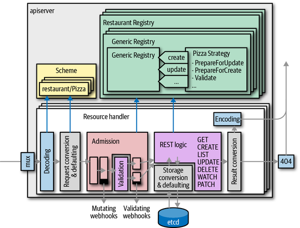

The REST logic is usually implemented by what is called the *generic registry*. It is—as the name suggests—a generic implementation of the registry interfaces in the package *k8s.io/apiserver/pkg/registry/rest*.

The generic registry can be customized to a certain degree using an object called a *strategy*. The strategy provides callbacks to functionality like validation.

### API Installation

To activate an API in an API server, two steps are necessary:

1. The API version must be installed into the API type’s (and conversion and defaulting functions’) server scheme.
2. The API version must be installed into the server HTTP multiplexer (mux).

### Admission

Every request passes the chain of admission plug-ins after being unmarshaled, defaulted, and converted to internal types. More precisely, requests pass admission twice:

- The mutating plug-ins
- The validating plug-ins

Admission plug-ins can be both mutating and validating and therefore  can potentially get called twice by the admission mechanism:

- Once in the mutation phase, called for all mutating plug-ins sequentially
- Once in the validation phase, called (potentially parallelized) for all validating plug-ins

More precisely, a plug-in can implement both the mutating and the  validating admission interface, with two different methods for both  cases.

An admission plug-in is a type implementing:

- The admission plug-in interface `Interface`
- Optionally the `MutatingInterface`
- Optionally the `ValidatingInterface`

## Deploying Custom API Servers

Often, the aggregated API server is deployed to some nodes reserved for control plane pods, usually called *masters*. In that case, a `DaemonSet` is a good choice to run one custom API server instance per master node. This leads to a high availability setup. 

#### Setting Up RBAC

The service account of an API service first needs some generic permissions to participate in:

- namespace lifecycle

  Objects can be created only in an existing namespace, and are deleted when the namespace is deleted. For this the API server has to get,  list, and watch namespaces.

- admission webhooks

  Admission webhooks configured via `MutatingWebhookConfigurations` and `ValidatedWebhookConfigurations` are called from each API server independently. For this the admission  mechanism in our custom API server has to get, list, and watch these  resources.

We configure both by:

- creating an RBAC cluster role
- binding it to our service account `apiserver` via a `ClusterRoleBinding`

#### Certificates and Trust

The `APIService` object contains the `caBundle` field. This configures how the aggregator (inside the Kubernetes API server) trusts the custom API  server. This CA bundle contains the certificate (and intermediate  certificates) used to verify that the aggregated API server has the  identity it claims to have.

# Advanced Custom Resources

We call these features “advanced” because they move CRDs from being a  manifest (i.e., purely declarative) into the Golang world (i.e., into a  real software development project).

### Custom Resource Versioning

Inside of the custom API server, each object in a request is first  converted from the API endpoint version to an internal version and then converted back to an external version for storage and to return a response. The conversion mechanism is implemented by conversion functions, some of them manually written, and some generated.

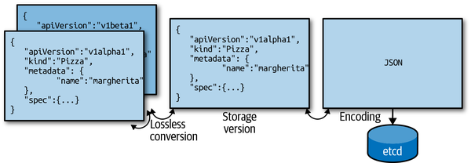

### Conversion Webhook Architecture

CRD conversions are implemented via webhooks in Kubernetes.

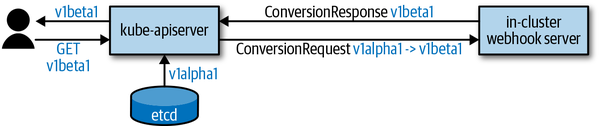

Conversion webhook calls for CRs

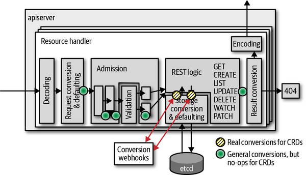

In contrast to aggregated custom API servers CRs do not use internal types but convert directly between the external API versions: CRD conversion takes place only from and to `etcd`.

Where conversion takes place for CRs:

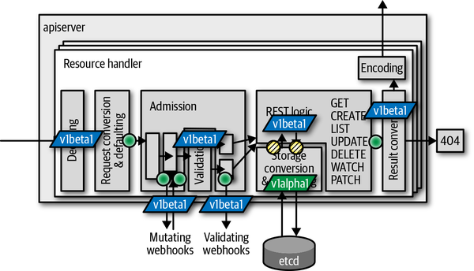

## Admission Webhooks

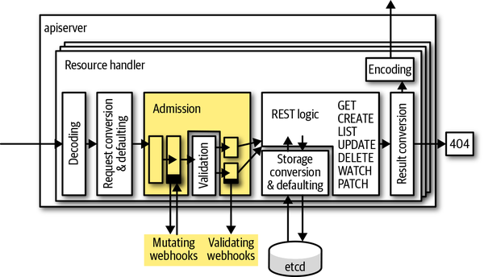

Admission webhooks are structurally very similar to the conversion webhooks. 

They are deployed in the cluster, put behind a service mapping port 443  to some port of the pods, and called using a review object, `AdmissionReview` in the API group `admission.k8s.io/v1beta1`.

The same `AdmissionReview` object is used for both mutating and validating admission webhooks.

Admission webhooks are not registered in the CRD manifest. The reason is that they apply  not only to CRDs, but to any kind of resource. You can even add custom  admission webhooks to standard Kubernetes resources. Instead there are registration objects: `MutatingWebhookRegistration` and `ValidatingWebhookRegistration`.

## Structural Schemas and the Future of CustomResourceDefinitions
