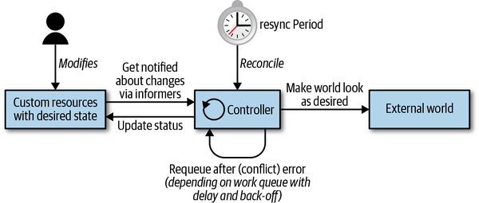

# Programming Kubernetes

### Introduction

COTS - the app itself is not aware it runs on Kubernetes and usually doesn’t have to be. Kubernetes controls the app’s  lifecycle—find node to run, pull image, launch container(s), carry out  health checks, mount volumes etc.

Bespoke app, something you wrote from scratch, with or without having had Kubernetes as the runtime environment in mind, and run it on  Kubernetes. The same modus operandi as in the case of a COTS applies.

Cloud-native or Kubernetes-native application that is fully aware it is  running on Kubernetes and leverages Kubernetes APIs and resources to  some extent.

Customize and/or extend Kubernetes: 

- using [configuration files and flags](http://bit.ly/2KteqbA) for control plane components like the `kubelet` or Kubernetes API server
- using a number of defined extension points:
  - [cloud providers](http://bit.ly/2FpHInw) - providing a [custom `cloud-controller-manager` process to integrate with a cloud](http://bit.ly/2WWlcxk). Cloud providers allow the use of cloud provider–specific tools like load balancers or Virtual Machines (VMs).
  - Binary `kubelet` plug-ins for [network](http://bit.ly/2L1tPzm), [devices](http://bit.ly/2XthLgM) (such as GPUs), [storage](http://bit.ly/2x7Unaa), and [container runtimes](http://bit.ly/2Zzh1Eq).
  - Binary `kubectl` [plug-ins](http://bit.ly/2FmH7mu).
  - Access extensions in the API server, such as the [dynamic admission control with webhooks](http://bit.ly/2DwR2Y3)
  - Custom resources and custom controllers
  - Custom API servers
  - Scheduler extensions, such as using a [webhook](http://bit.ly/2xcg4FL) to implement your own scheduling decisions.
  - [Authentication](http://bit.ly/2Oh6DPS) with webhooks.

### Controllers and Operators

A *controller* implements a control loop, watching the shared  state of the cluster through the API server and making changes in an  attempt to move the current state toward the desired state. Controllers can act on core resources such as deployments or services or can watch and manipulate user-defined custom resources.

Operators are controllers that encode some operational knowledge, such as application lifecycle management.

### The Control Loop

1. Read the state of resources, preferably event-driven.
2. Change the state of objects in the cluster or the cluster-external  world. For example, launch a pod, create a network endpoint, or query a  cloud API.
3. Update status of the resource in step 1 via the API server in `etcd`.
4. Repeat cycle; return to step 1.

**Informers** watch the desired state of resources in a scalable and sustainable fashion. They also implement a resync mechanism that enforces periodic reconciliation, and is often used  to make sure that the cluster state and the assumed state cached in  memory do not drift (e.g., due bugs or network issues).

**Work queue** is a component that can be used by the event handler to handle  queuing of state changes and help to implement retries. In `client-go` this functionality is available via the [*workqueue* package](http://bit.ly/2x7zyeK). Resources can be requeued in case of errors when updating the world or  writing the status (steps 2 and 3 in the loop), or just because we have  to reconsider the resource after some time for other reasons.

