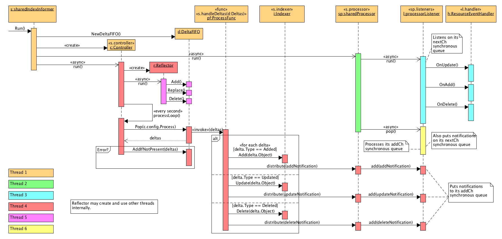
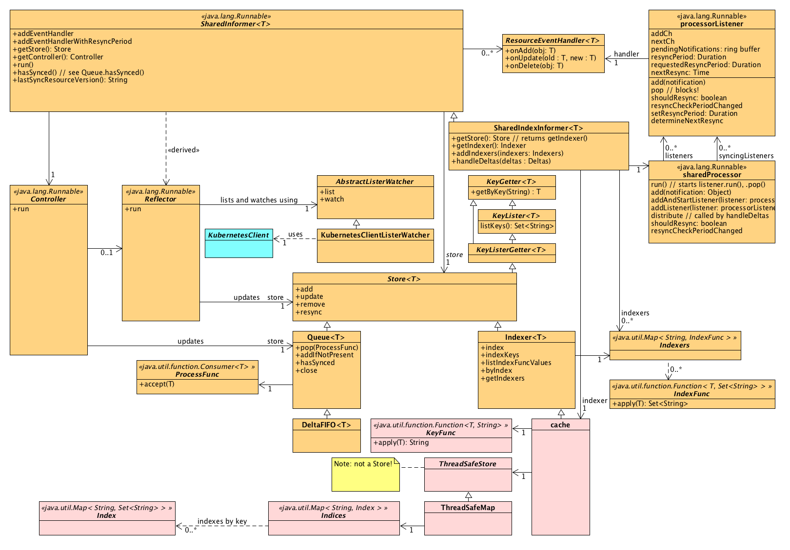

## Understanding Kubernetes’ tools/cache package

> References:
> https://lairdnelson.wordpress.com/2018/01/07/understanding-kubernetes-tools-cache-package-part-0
> https://lairdnelson.wordpress.com/2018/01/07/understanding-kubernetes-tools-cache-package-part-1
> https://lairdnelson.wordpress.com/2018/01/07/understanding-kubernetes-tools-cache-package-part-2
> https://lairdnelson.wordpress.com/2018/01/07/understanding-kubernetes-tools-cache-package-part-3
> https://lairdnelson.wordpress.com/2018/01/07/understanding-kubernetes-tools-cache-package-part-4
> https://lairdnelson.wordpress.com/2018/01/10/understanding-kubernetes-tools-cache-package-part-5
> https://lairdnelson.wordpress.com/2018/01/17/understanding-kubernetes-tools-cache-package-part-6
> https://lairdnelson.wordpress.com/2018/01/17/understanding-kubernetes-tools-cache-package-part-7
> https://lairdnelson.wordpress.com/2018/01/17/understanding-kubernetes-tools-cache-package-part-8

Kubernetes is a distributed messaging system, whose message broker of sorts is the [API server](https://kubernetes.io/docs/reference/generated/kube-apiserver/), and whose messages are specifications of desired state. 

`kubectl` and other clients can be seen as creators (broadcasters) of these  specifications, and certain Kubernetes programs can be seen as listeners for and reactors to the creation, modification and deletion of these  specifications, creating or starting or stopping or deleting other  programs, and possibly creating, modifying or deleting other  specification messages. 

The message, the Kubernetes *resource* you’re creating, applying or deleting, has three high-level parts to it: the *kind*, which says what kind of thing the message is about, the *specification*, which describes what you want to be true of the thing you’re creating or applying or deleting, and the *status*, which describes how things really are. 

Assuming we have a `ListerWatcher` backed by a Kubernetes  client, we now have a logical collection of Kubernetes resources of a  particular kind and a certain number of events concerning those  resources. It would be handy to put these things somewhere. 

`Store` seems nice and generic (no parameters of any types other than Go primitives). 

`tools/cache` package decided to create another concept called a [`Reflector`](https://github.com/kubernetes/kubernetes/blob/v1.9.0/staging/src/k8s.io/client-go/tools/cache/reflector.go#L49-L74), which is simply the grouping together of a `ListerWatcher` with a `Store` together with the [necessary](https://github.com/kubernetes/kubernetes/blob/v1.9.0/staging/src/k8s.io/client-go/tools/cache/reflector.go#L249) [plumbing](https://github.com/kubernetes/kubernetes/blob/v1.9.0/staging/src/k8s.io/client-go/tools/cache/reflector.go#L354) to route the return value of the `ListerWatcher`‘s `List()` function “into” the `Store`, as well as the [necessary plumbing to turn incoming `WatchEvent`s into additions, updates and removals of items in the `Store`](https://github.com/kubernetes/kubernetes/blob/v1.9.0/staging/src/k8s.io/client-go/tools/cache/reflector.go#L395-L416).

It *reflects* the contents of a Kubernetes message channel into a cache. Then if you want to do something in your Kubernetes controller  program with resource specifications and statuses of a particular kind,  you can look to the cache rather than to the API server itself.

Summed up, most `Controller` implementations probably should use a `Reflector` to populate a `Queue` (a particular kind of `Store`) with Kubernetes resources of a particular kind, and then also processes the contents of that `Queue`, presumably by `Pop`ping objects off of it.

Conceptually an **Informer** “is a” `Controller` together with the ability to distribute its `Queue`-related operations to an appropriate event handler.

---

A [`SharedIndexInformer` is, itself, a `SharedInformer` implementation that adds the ability to index its contents](https://github.com/kubernetes/kubernetes/blob/v1.9.0/staging/src/k8s.io/client-go/tools/cache/shared_informer.go#L33-L70). 

`SharedInformer` is a kind of informer that can support many event handlers.

In `SharedIndexInformer`, the `Store` into which Kubernetes API server events are reflected [is a `DeltaFIFO`](https://github.com/kubernetes/kubernetes/blob/v1.9.0/staging/src/k8s.io/client-go/tools/cache/shared_informer.go#L191), not an `Indexer`. But an `Indexer` *[is supplied](https://github.com/kubernetes/kubernetes/blob/v1.9.0/staging/src/k8s.io/client-go/tools/cache/shared_informer.go#L191)* to that `DeltaFIFO`, *and* [is the return value of the `SharedIndexInformer`‘s `GetStore` function](https://github.com/kubernetes/kubernetes/blob/v1.9.0/staging/src/k8s.io/client-go/tools/cache/shared_informer.go#L249-L251)! This tells us more about the *implied* contract of `GetStore`: clearly the `Store` it returns *must* not be used for modification.

[Any `Store` is also a `KeyListerGetter`](https://github.com/kubernetes/kubernetes/blob/v1.9.0/staging/src/k8s.io/client-go/tools/cache/store.go#L38-L39), a `KeyLister` and a `KeyGetter`.  A `KeyListerGetter` is a combination of the `KeyLister` and `KeyGetter` types. [A `KeyLister` is anything that can list its keys](https://github.com/kubernetes/kubernetes/blob/v1.9.0/staging/src/k8s.io/client-go/tools/cache/delta_fifo.go#L596-L599), and a `KeyGetter` is *not* something that can get a key, but [something that houses *other* things that can be retrieved by key](https://github.com/kubernetes/kubernetes/blob/v1.9.0/staging/src/k8s.io/client-go/tools/cache/delta_fifo.go#L601-L604) (like some sort of map).

A `SharedIndexInformer` instantiates the concept of an informer with multiple event handlers and, by definition, a single `Queue`, a `DeltaFIFO`, that they share.

---

- A `DeltaFIFO` is a `Queue` of `Deltas` instances. [It turns out a `Deltas` type is just a collection of `Delta` instances](https://github.com/kubernetes/kubernetes/blob/v1.9.0/staging/src/k8s.io/client-go/tools/cache/delta_fifo.go#L647-L649).
- The `Deltas` instances a `DeltaFIFO` holds are “keyable”. A `string` key can be extracted from a given `Deltas` instance by way of a `KeyFunc`.
- Certain `Deltas` instances inside the `DeltaFIFO` can be “known”.

A `Delta`, in other words, is an event. It is the combination of [a verb (the `DeltaType`)](https://github.com/kubernetes/kubernetes/blob/v1.9.0/staging/src/k8s.io/client-go/tools/cache/delta_fifo.go#L623-L635) and the payload (the object stored in the `Object` field).

So a `DeltaFIFO` is a thread-safe `Queue` of collections (`Deltas`) of events (`Delta`), indexed by some sort of key, where each event (`Delta`) in the collection represents the addition, modification or removal of a Kubernetes resource.

---

Controller sequence thread diagram:

Structural diagram:

