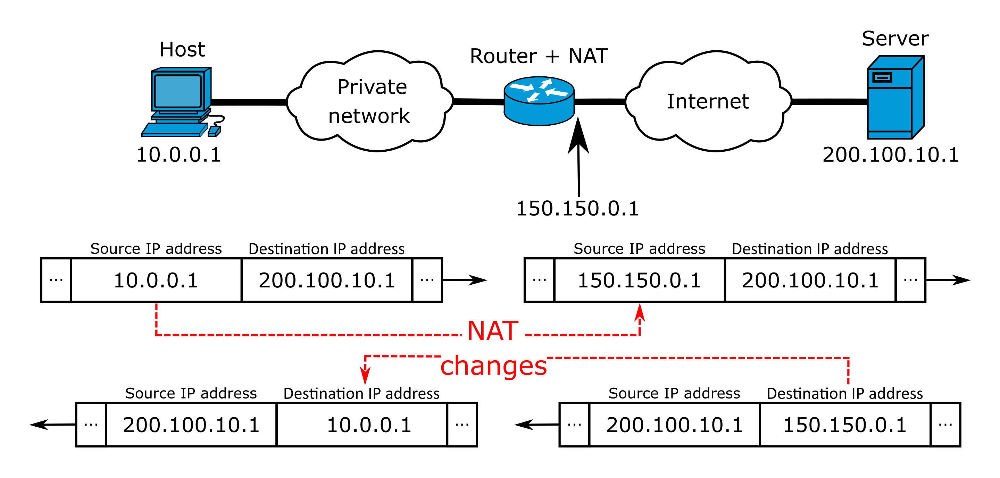

# NAT

**Network address translation**  is a method of remapping an IP address space  into another by modifying network address information in the IP header of packets while they are in transit across a traffic routing device.

**Destination network address translation (DNAT)** is a technique for transparently changing the destination IP address of an end route packet and performing the inverse function for any replies. Any router situated between two endpoints can perform this transformation of the packet.

DNAT is commonly used to publish a service located in a private network on a publicly accessible IP address. This use of DNAT is also called port forwarding, or DMZ when used on an entire server, which becomes exposed to the WAN, becoming analogous to an undefended military demilitarised zone (DMZ). 