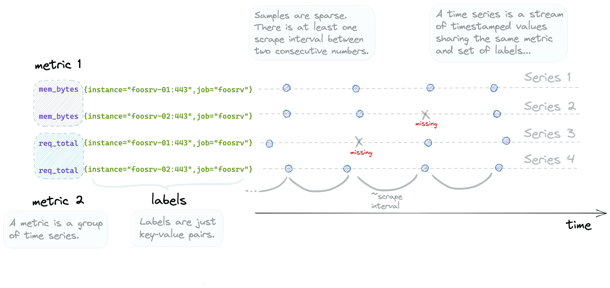
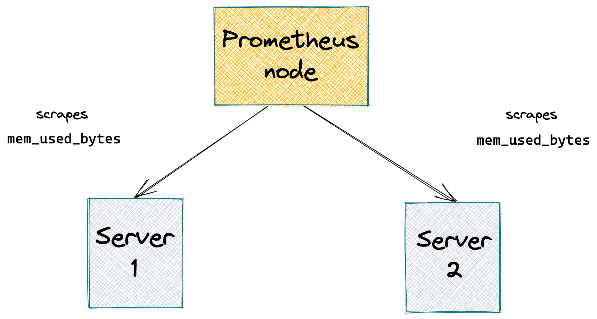
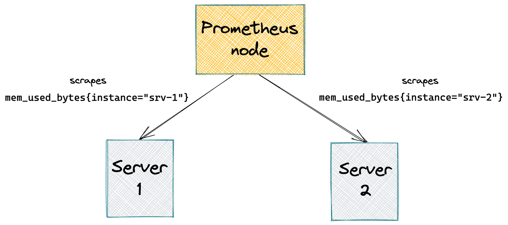
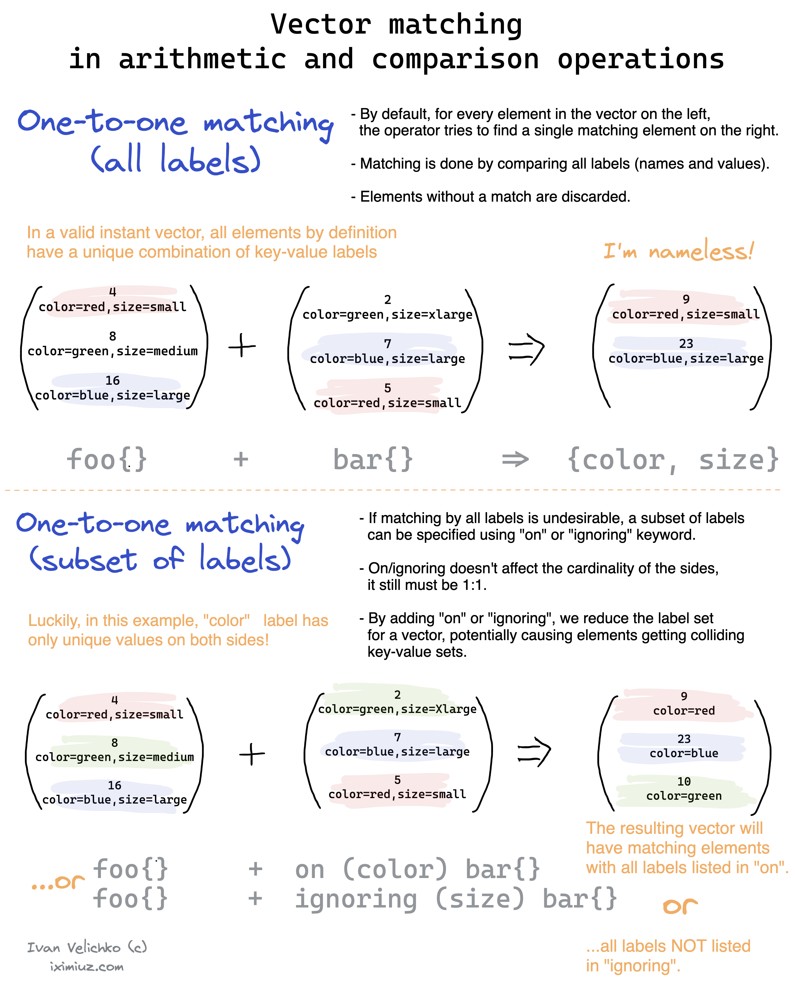
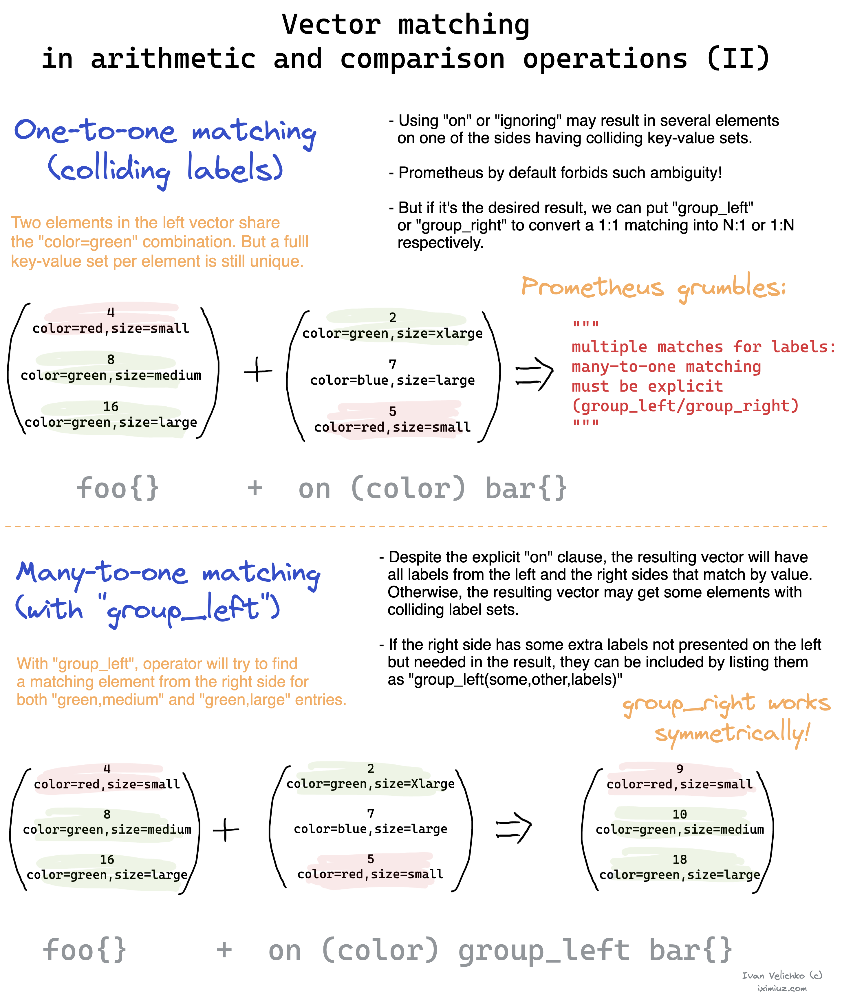
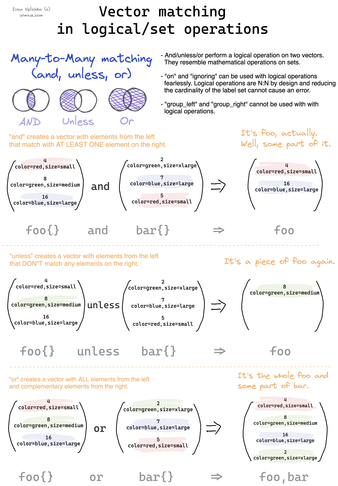

# Learning Prometheus and PromQL

> References:
>
> https://iximiuz.com/en/series/learning-prometheus-and-promql/

Prometheus is not a time-series database. It's a monitoring system that happens to use a TSDB under the hood. This TSDB is optimized to serve monitoring  use cases efficiently, sometimes at the expense of correctness or  completeness of query results. That's why periodically, it might be  tricky to reason about the observed behavior.

A *metric* is a feature (i.e., a characteristic) of a system that is being measured. Typical examples of metrics are:

- http_requests_total
- http_request_size_bytes
- system_memory_used_bytes
- node_network_receive_bytes_total

​    

A *label* is a certain attribute of a metric. Typical examples of labels are:

- instance - an *instance* (a server or cronjob process) of a *job* being monitored in the `<host>:<port>` form
- job - a name of a logical group of *instances* sharing the same purpose
- endpoint - name of an HTTP API endpoint
- method - HTTP method
- status_code - HTTP status code

​    

Prometheus uses a *pull model*, and the metric collection process is called *scraping*.

In Prometheus, scraping is configured via providing a static list of `<host>:<port>` ***scraping targets\***. It's also possible to configure a service-discovery-specific (consul,  docker, kubernetes, ec2, etc.) endpoint to fetch such a list at runtime. You also need to specify a ***scrape interval\*** - a delay between any two consecutive scrapes.

Every Prometheus server node is autonomous. I.e., there is no  distributed metric storage in the default Prometheus setup, and every  node acts as a self-sufficient monitoring server with local metric  storage.

Values are always floating-point numbers; timestamps are integers storing the number of milliseconds since the Unix epoch.

Since it's a single node scraping multiple distributed endpoints with  potentially different performance and network conditions, the exact  sample timestamps will vary  for every scrape.

If a target reports a *gauge* (i.e., *instant measurement*) metric that changes more frequently than it's scraped, the intermediate values will never be seen by the Prometheus node.

### PromQL binary operators

- arithmetic `+ - / * ^ %`
- comparison `< > <= >= == !=`
- logical/set `and, unless, or`

Binary operations are defined for different types of operands -  scalar/scalar, scalar/vector, and vector/vector.

### One-to-one vector matching

### One-to-many and many-to-one vector matching

Prometheus does support *many-to-one* and *one-to-many* vector matching. But it has to be specified explicitly by adding either `group_left` or `group_right` modifier to a query. 

Unless logical binary operator `and|unless|or` is used, Prometheus always considers at least one side of the binary operation as having the cardinality of *"one"*. If during a query execution Prometheus finds a collision (label-wise) on the *"one"* side, the query will fail.

### Many-to-many vector matching (logical/set operations)

Logical (*aka* set) binary operators `and`, `unless`, and `or` surprisingly adhere to a simpler vector matching logic. These operations are always *many-to-many*. Hence no `group_left` or `group_right` may be needed. 

### Aggregation Over Time

Prometheus has a bunch of functions called `<smth>_over_time()`. They can be applied only to range vectors. It essentially makes them window aggregation functions.

The only way to construct a range vector in PromQL is by appending a bracketed duration to a vector selector. E.g. `http_requests_total[5m]`.

An `<agg>_over_time()` function can be applied only to a vector selector, meaning the aggregation will always be done using raw scrapes.

Unlike scalar elements of an instant vector, each element of the  range vector is actually an array. Elements of such an array are scrape  values falling into the corresponding time bucket. By applying an `<agg>_over_time` function to these buckets, we achieve a *moving window* effect that potentially can incorporate all data points without leaving any gaps. If the window duration is at least one resolution step long,  none of the available data points will be discarded.

​    

Grafana tip: use `$__interval` built-in variable for your range vector durations.

Prometheus supports different *logical types* of metrics - *gauges*, *counters*, *histograms*, and *summaries*. There is no difference between these types. All of them are just stored as series of *float numbers*. PromQL doesn't really distinguish between the logical types of metrics  either. What only matters for PromQL is an expression type. I.e., it  wouldn't allow you to call a function that expects an instant vector  with a range vector argument: **functions `min_over_time()`, `max_over_time()`, `avg_over_time()`, `sum_over_time()`, `stddev_over_time()`, and `stdvar_over_time()` makes sense to use only with gauge metrics.**

