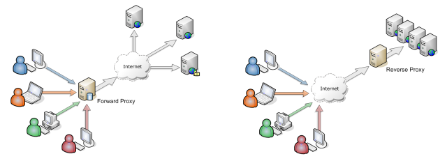

# What's the difference between a proxy server and a reverse proxy server?

> References:
> [squid](../soft/squid.md) 

The word "proxy" describes someone or something acting on behalf of someone else. In the computer realm, we are talking about one server acting on the behalf of another computer.

Three computers connected to the internet:

- X = your computer, or "**client**" computer on the internet
- Y = the **proxy** web site, proxy.example.org
- Z = the web **site** you want to visit, www.example.net

#### FORWARD proxy

Normally, one would connect directly from `X --> Z.` However, in some scenarios, it is better for `Y --> Z` on behalf of `X`, which chains as follows: `X --> Y --> Z`. For example, X is unable to access Z directly because:
* access to site Z is blocked by someone
* the administrator of `Z` has blocked `X`.

#### REVERSE proxy

Normally, one would connect directly from `X --> Z.` However, in some scenarios, it is better for the administrator of `Z` to restrict or disallow direct access and force visitors to go through Y first. So, as before, we have data being retrieved by `Y --> Z` on behalf of `X`, which chains as follows: `X --> Y --> Z`. 

What is different this time compared to a "forward proxy," is that this time the user `X` does not know he is accessing `Z`, because the user `X` only sees he is communicating with `Y`. The server `Z` is invisible to clients and only the reverse proxy `Y` is visible externally. The client `X` thinks he is only communicating with `Y` (`X --> Y`), but the reality is that `Y` forwarding all communication (`X --> Y --> Z` again). Reasons why Z would want to set up a reverse proxy server:
* Z wants to force all traffic to its web site to pass through Y first (like CDN)
* The administrator of Z is worried about retaliation for content hosted  on the server and does not want to expose the main server directly to  the public.

#### HTTPS proxy

There are two subtypes of forward proxies – explicit and implicit, and two ways to proxy [SSL/TLS](https://www.ssltrust.com.au/ssl-certificates) communication – terminating and non-terminating:
- **Tunnel Proxy (non-terminating):** This is a proxy that transparently transmits traffic. The proxy server  specifically transmits the HTTPS traffic over TCP transparently. It does not decrypt or perceive the specific content of its proxy traffic. The  client performs direct TLS/SSL interaction with the target server.
- **Man-in-the-Middle (MITM) Proxy (terminating):** The proxy server  decrypts HTTPS traffic, uses a self-signed certificate to complete the  TLS/SSL handshake with the client, and completes normal TLS interaction  with the target server. Two TLS/SSL sessions are set up on the  client-proxy-server link.

When acting as a forward proxy and processing the  traffic sent by the client, the proxy server doesn't see the target  domain name in the URL requested by the client since the HTTP traffic is encrypted and encapsulated in TLS/SSL.