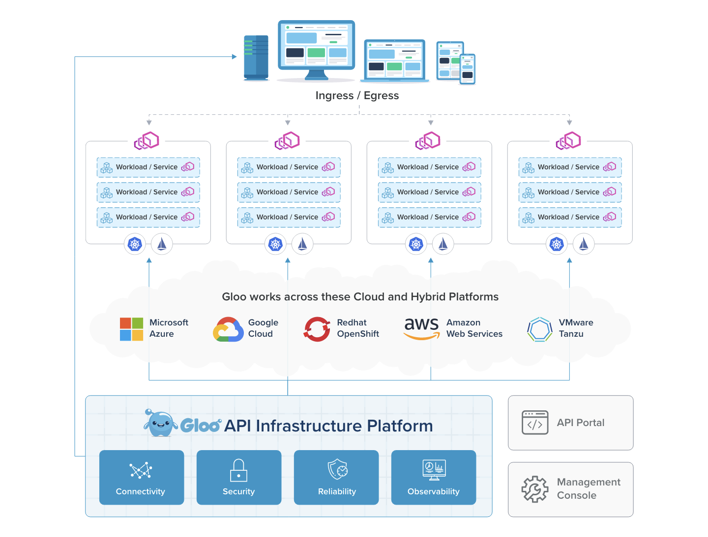
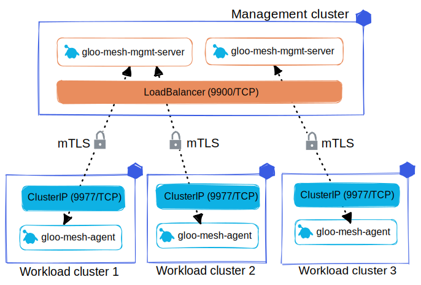
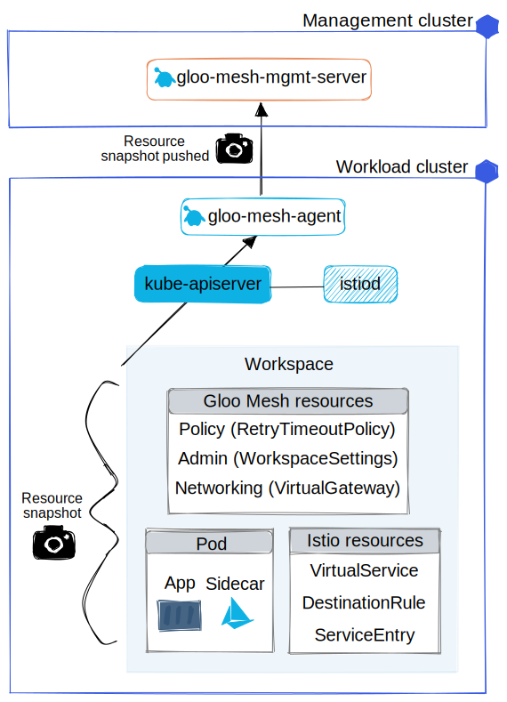
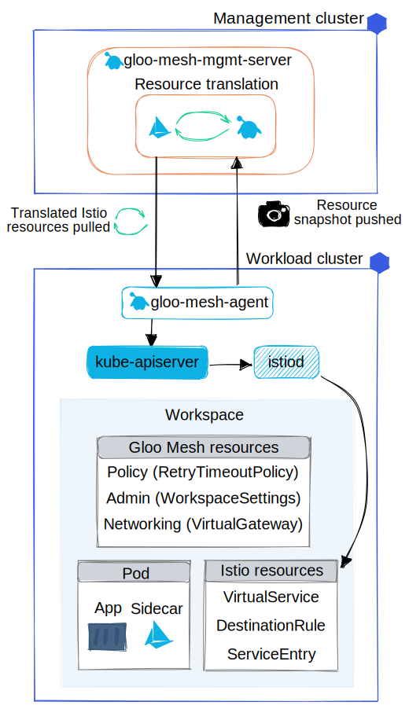

# Gloo Mesh Enterprise

> References: https://docs.solo.io/gloo-mesh-enterprise/latest/

Gloo Mesh Enterprise is a distribution of the [Istio service mesh](https://istio.io/) that is hardened for production support across multicluster hybrid clusters and service meshes. The Gloo Mesh API simplifies the complexity of your service mesh by  installing custom resource definitions (CRDs) that you configure. Then,  Gloo Mesh translates these CRDs into Istio resources across your  environment, and provides visibility across all of the resources and  traffic. Enterprise features include multi-tenancy, global failover and  routing, observability, and east-west rate limiting and policy  enforcement through authorization and authentication plug-ins.

## What is a service mesh?

A service mesh is a dedicated infrastructure layer that you add your  apps to. The service mesh provides central management for your  cloud-native microservices architecture. This way, you can optimize your apps in areas like communication, routing, reliability, security, and  observability.

To abstract service-to-service communication, a service mesh uses  proxies. Proxies, also referred to as sidecars, are deployed alongside  your microservice. The proxies form the data plane of the service mesh. By intercepting  every communication between the microservices, you can control traffic. 

## Istio architecture 

Istio comes with the Istio control plane `istiod` and  Envoy sidecar proxies that build the Isto data plane. Envoy is a network proxy that manages all inbound and outbound traffic for the service  mesh.

## Relay architecture

A Gloo setup consists of one management cluster that the Gloo  management components are installed in, and one or more workload  clusters that run services meshes which are registered with and managed  by the management cluster. The management cluster serves as the  management plane, and the workload clusters serve as the data plane.

- deployment named `gloo-mesh-mgmt-server` runs the management server.
- deployment named `gloo-mesh-agent`  runs the relay agent on each workload cluster. 

---

Relay agents on workload clusters are registered with the Gloo management server on the management cluster.

Relay agents discover resources in the workload cluster, and send a snapshot of resource and service mesh states to the management server.

The management server translates the resource snapshots into Istio configurations, and relay agents pull the Istio configurations into each service mesh.

## Multi-tenancy with workspaces

Gloo introduces a new concept for Kubernetes-based multi-tenancy, the Workspace custom resource. A workspace consists of one or more  Kubernetes namespaces that are in one or more clusters. Think of a  workspace as the boundary of your team's resources.

## Traffic management

Control the routing and response to requests that enter or leave your service mesh with Gloo Mesh’s traffic management APIs.

The APIs enable you to quickly set up complex and secure routing for a service mesh that spreads one or more Kubernetes clusters while  significantly reducing the number of resources that you need to manage.

With route tables, you can set up intra-mesh routing for the apps that you expose with a virtual gateway.

With virtual destinations, you can define unique internal hostnames for  apps that are spread across multiple clusters, and enable service  discovery for these apps within the mesh by adding the hostnames to the  service mesh registry.

## Policies

With traffic policies, you can specify how you want to manipulate and respond to incoming requests in your service mesh. For example, you  might want to add or remove header information before forwarding the  request to your service, implement retries, timeouts, and failover  scenarios, or ensure that services use mutual TLS (mTLS) when  communicating with each other.
