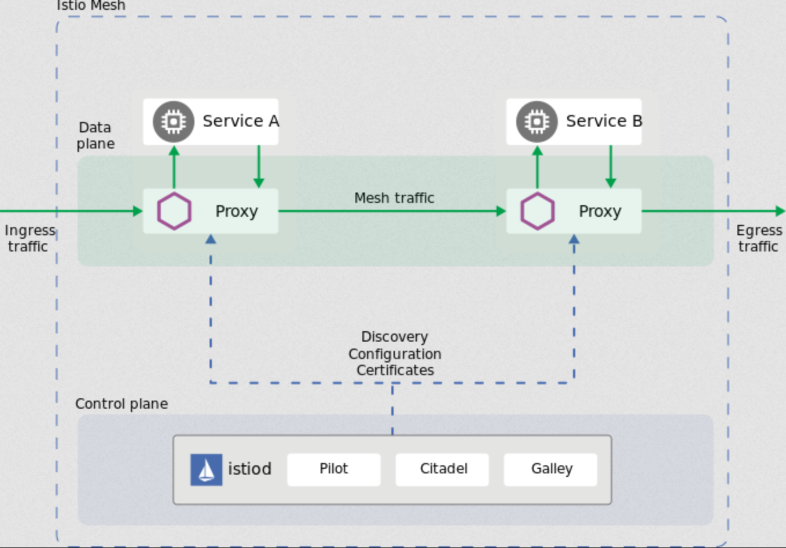

## What is Istio? 

**Istio** is a service mesh, a distinct  category of cloud native software that provides traffic management,  security, and observability within a platform. There are many services  meshes available in the wild right now: Hashicorp Consul, Linkerd,  Kong’s Kuma, Microsoft’s Open Service Mesh. Istio has wide  community adoption, robust feature set, and rich integration in the  Cloud Native ecosystem. Leveraging Istio allows to utilize features  like progressive deployment models (blue-green, canary), A/B testing,  automated regional failover, and more.

## How Does It Work? 

At its core, an Istio service mesh is divided into two parts: the **control plane** and the **data plane**

- The **data plane** consists of the Envoy sidecars running alongside the compute (i.e. pods) within the mesh. These sidecars intercept all inbound **AND** outbound traffic for the pod, and because of that, it can make  intelligent routing decisions on the pod’s behalf (e.g. rejecting the  request because mTLS is invalid or only allowing requests to/from  certain endpoints).
- The **control plane** is the brain of Istio. It is responsible for reading configuration from the cluster (populated by resources like `VirtualService`s, `DestinationRule`s, `Gateway`s, etc.) and pushing that config to the data plane (i.e. envoy sidecars).  The data plane then uses this configuration to make intelligent routing  systems.

One of the benefits of this model is that even if the control plane  goes down for a little bit, the data plane may be able to continue to  successfully route traffic for a limited time.

## Istio Resources 

### VirtualService 

A `VirtualService` manifest provides configuration for **traffic routing**. In this context, traffc routing consists of all work done to answer the question “what host (i.e. logical destination) should respond to this  request”. `VirtualService` configuration can answer this  question by taking into account URL patterns, L7 request fields (like  headers), and CORS policies. Furthermore, a `VirtualService`  can take more complex actions based on these parameters such as request  mirroring, redirection, fault injection, rewrites, and more. The `VirtualService` listens for traffic corresponding to any FQDN (named `host` in the configuration) that DNS can resolve within the cluster. Once a match is made, the `VirtualService` configuration specifies another `host` to send the traffic to; that `host` corresponds to a `DestinationRule`.

### DestinationRule

After Istio uses a `VirtualService` to decide to which logical destination to send a given request (addressed via a DNS-resolvable FQDN or `host`), Istio then reads the `DestinationRule` for that host in order to perform more validation and/or logic before the request actually hits the compute. A `DestinationRule` manifest can manipulate traffic in a variety of ways such as  rate-limiting, splitting the destination into 2 different versions (e.g. for A/B testing or canary deployments), regional failover (i.e. send  traffic to the other cluster’s pods if this one receives a certain  threshold of 5xx errors), circuit breaking, connection pool  modifications, and more.