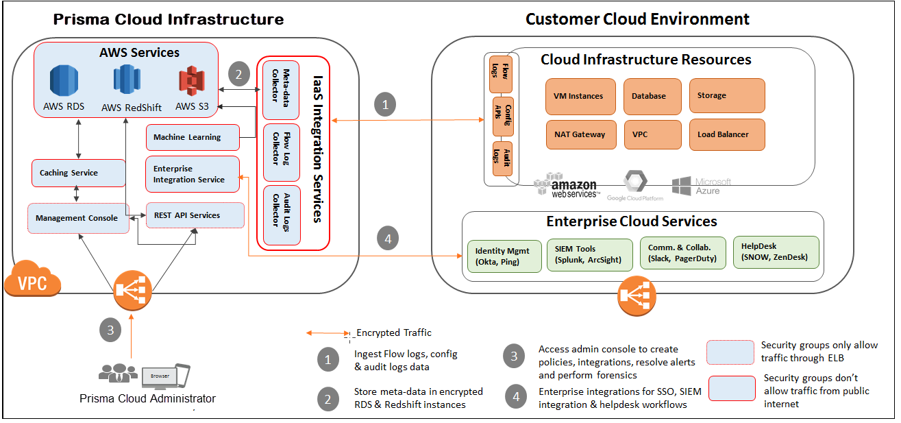
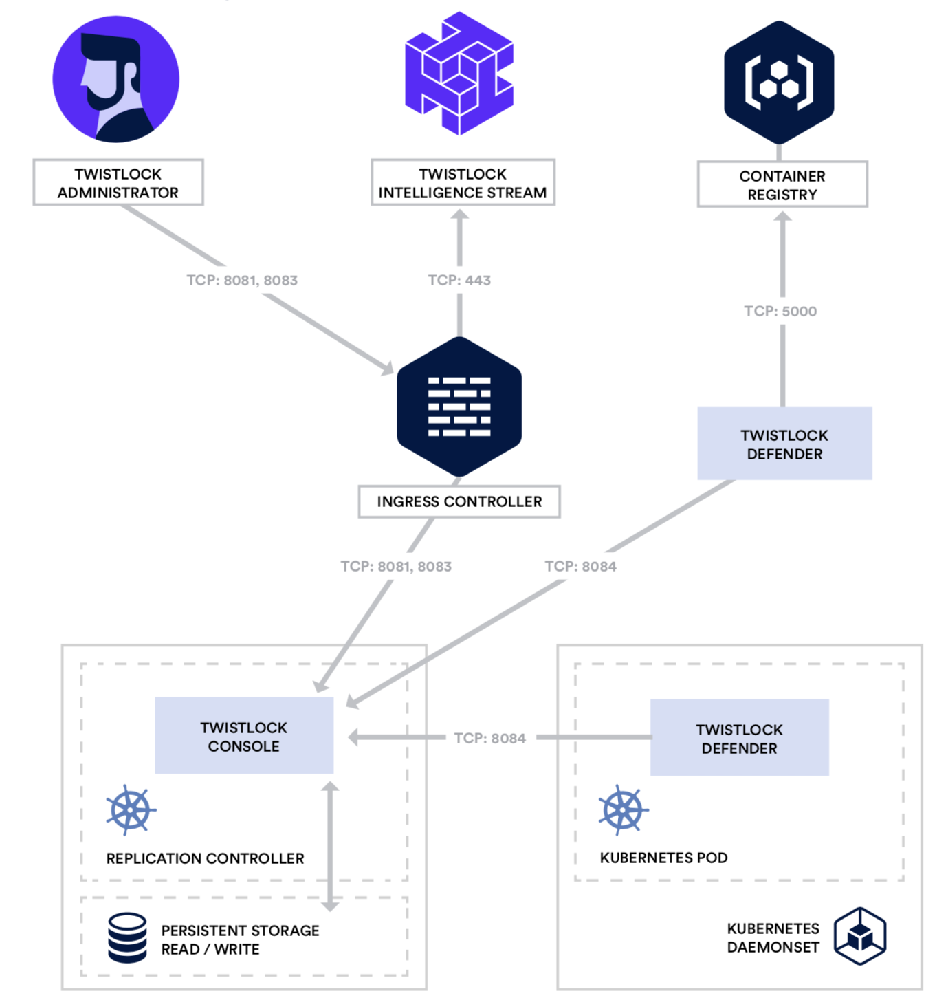

## PrismaCloud (Twistlock)

> References:
> https://docs.paloaltonetworks.com/prisma/prisma-cloud/prisma-cloud-admin-compute/install/getting_started.html
> https://docs.paloaltonetworks.com/prisma/prisma-cloud/prisma-cloud-admin-compute/technology_overviews/defender_architecture.html
> 
> API:
> https://cdn.twistlock.com/docs/api/twistlock_api.html
> https://api.docs.prismacloud.io/reference#health-check


Twistlock provides lifecycle security for containerized environments, “from pipeline to perimeter”. Twistlock capabilities include runtime  defense, vulnerability management, cloud native firewalls, pre-built  compliance templates for HIPAA, PCI, GDPR, and NIST SP 800-190. It can  be integrated into your CI/CD pipeline. Automated and custom policies  can block builds or deployments based on vulnerabilities or compliance  requirements. Runtime capabilities were recently expanded from only  containerized applications to include VMs.



**Capabilities:**

* Vulnerability management: 
  * Vulnerability detection.
  * Prevent the deployment of vulnerable images (policies and rules).
  * Scan images and functions in any registry.
  * Integrates vulnerability scanning with any CI tool.
  * Uptodate database of vulnerabilities.
* Runtime Defense
  * Use machine learning to automatically build a 4D model of every application in your environment (behaviors of your hosts and containers, across process, network, file system, and system call sensors).
  * Automatically identify attack patterns.
  * Collects forensic data on all your cloud native workloads, couples it with runtime defense and incident identification (like flight data recorder).
  * Secure any type of host, containerized stack, PaaS platform, and serverless platform at runtime.
* Monitor, Achieve, and Enforce Compliance for Containers and Hosts
  * Compliant with external requirements like HIPAA, FISMA, PCI, and GDPR, while also maintaining compliance with internally-developed policies (over 400 out-of-the-box configurations and policy controls).
  * Officially certified to implement the AWS, Docker, Kubernetes, and Linux CIS Benchmarks.
  * Automatically discover cloud native assets across public clouds.
  * Ensure that images can only be deployed from these trusted sources.
  * Single view of all policies in your environment, the current compliance state, and historical compliance data. 
* Cloud Native Security Integrated with CI/CD Pipelines
  * Native plugins for CI tools and standalone vulnerability scanner.
  * Create granular policies that provide you with precise control over every CI job.
  * Surfaces scanning results in both your native development tools and within the Twistlock UI. 
* Securing Cloud Native Apps with Layer 4 and Layer 7 Firewalling
  * Automatically maps, identifies, and allows valid traffic flows in your environment.
  * Dynamically creates filters that automatically allow valid connections and drop suspicious connections.
  * Twistlock Cloud Native Application Firewall (CNAF) - automatically filter web traffic sent to your applications regardless of what cloud, cluster node, IP address, or port they happen to be running on. Automatically re-routes inbound traffic through Twistlock Defender, and  applies an optimized, application-specific, layer-7 filter.
  * Twistlock Cloud Native Network Firewall (CNNF) - layer 4 firewall that works in any cloud and orchestrator.
  * Twistlock Radar offers views of the real-time connections in your environment.
* Complete Access Control for Cloud Workloads and Cloud Native Apps
  * Twistlock is a Kubernetes audit dynamic backend, consuming all the audit events from all your clusters. 
  * Authorization framework used in Docker and OpenShift.
  * Integrates with the secrets management tools like Hashicorp Vault, CyberArk  Enterprise Password Vault, AWS Secrets Manager, and Microsoft Azure Key  Vault.
  * Provides high-fidelity audit details for sensitive operations across all your hosts (sudo, sshd etc.)
  * File integrity monitoring.
  * Ingest security log files from any application or service.
  * Enterprise identity integrations with Active Directory, OpenLDAP, Ping, Okta, Shibboleth, Azure AD, and G Suite.
  * 7 separate roles to provide least privilege access to your devops and security teams.

**Complete Security for AWS ECS, EKS, Fargate, and Lambda**

* Twistlock IAM role integration to securely and seamlessly connect to ECR repositories. 
* Over 300 built-in checks.
* full coverage for Amazon Linux.
* Automatically-deployed [layer-3 and layer-7 firewalls](https://www.twistlock.com/platform/cloud-native-firewall/) work with your VPCs and security groups.
* visibility, security, and compliance for applications managed by AWS App Mesh.
* Twistlock [integrates with AWS Security Hub](https://www.twistlock.com/2018/11/28/cloud-native-security-intelligence-integrating-aws-security-hub/).
* [Support for AWS Lambda Layers.](https://www.twistlock.com/2018/11/29/introducing-lambda-layers/)

Twistlock also supports Microsoft Azure, Docker, GCP, Pivotal, Openshift, Serverless, etc.

### General Information

Prisma™ Cloud is a cloud security posture management (CSPM) and cloud workload protection platform (CWPP) that provides comprehensive  visibility and threat detection across your organization’s hybrid,  multi-cloud infrastructure. 

Prisma Cloud taps into the cloud providers’ APIs for read-only access to your network traffic, user activity, and configuration of systems  and services, and correlates these disparate data sets to help the cloud compliance and security analytics teams prioritize risks and quickly  respond to issues. It also uses an agent-based approach to secure your  host, container, and serverless computing environments against  vulnerabilities, malware, and compliance violations.

For visibility, compliance and governance of your cloud environments Prisma Cloud is available as a [cloud-delivered or SaaS service](https://docs.paloaltonetworks.com/content/techdocs/en_US/prisma/prisma-cloud/prisma-cloud-admin-compute/welcome/pcee_vs_pcce.html). For securing your host, container, and functions across the application lifecycle, Prisma Cloud is available as:

- **Prisma Cloud Compute**, which is the SaaS version of the full  Cloud Native Security Platform that delivers host, container, and  serverless capabilities along with the cloud security posture management capabilities. Palo Alto Networks operates the Console for you, and you must deploy the agents (Defenders) into your environment to secure hosts, containers,  and serverless functions running in any cloud, including on-premises. 
- **Prisma Cloud Compute Edition**, which is the downloadable,  self-hosted software that you can use to protect hosts, containers, and  serverless functions running in any cloud, including on-premises and  even fully air-gapped environments. You must deploy and operate the  Console and Defenders in your own environment. 

### Platform Components

Prisma Cloud consists of a  central management interface, called Console, security agents called  Defender, a threat intelligence service, and ancillary tools and  plugins.

- [Console](https://docs.paloaltonetworks.com/content/techdocs/en_US/prisma/prisma-cloud/prisma-cloud-reference-architecture-compute/platform_components/console.html)

Prisma Cloud Compute Console serves as the user interface within Prisma Cloud. The graphical user interface (GUI) lets you define policy, configure and control your Prisma Cloud deployment, and view the overall health (from a security perspective) of your container environment. Console also provides an API for customers that want to control Prisma Cloud programmatically to build out their own integrations or custom tooling. The API is thoroughly documented. Endpoints are provided for all features, functions, and controls offered in the GUI.

Prisma Cloud Compute Console is offered as an on premise deployment or as a  Softeware as a Services (SaaS).   Security capabilities are identical  across the two options, however customers may opt for one deployment  model or another based on their individual architecture needs.

- [Defender](https://docs.paloaltonetworks.com/content/techdocs/en_US/prisma/prisma-cloud/prisma-cloud-reference-architecture-compute/platform_components/defender.html)

Prisma Cloud Defenders enforce the policies defined in Console and send event data up to the Console for correlation. There are several types of Defenders, and depending on the assets in your environment that require protection you may end up deploying all of them or a subset. Defenders support the full variety of workloads in cloud native environments.

- [Intelligence Stream](https://docs.paloaltonetworks.com/content/techdocs/en_US/prisma/prisma-cloud/prisma-cloud-reference-architecture-compute/platform_components/intel_stream.html)

The Prisma Cloud Intelligence Stream is a real-time threat feed delivered from the Prisma Cloud content delivery network (CDN) to our customers' installations. This service gathers, analyzes, and prepares threat data for distribution to the Console located on your network. Console pulls data down from the Threat Intelligence Stream using HTTPS requests. The Intelligence Stream is Console’s only required external dependency.

- [The twistcli tool](https://docs.paloaltonetworks.com/content/techdocs/en_US/prisma/prisma-cloud/prisma-cloud-reference-architecture-compute/platform_components/twistcli.html)

The twistcli tool is a command-line control and configuration tool. It ships with your Prisma Cloud release and can be found in the Prisma Cloud release tarball. Support is provided for both Linux and MacOs.

The twistcli tool provides a number of functions:

- Scanning images for vulnerabilities and compliance issues. This is useful when you’re building custom tooling, or when you’re using a CI tool for which Prisma Cloud does not provide a native plugin.
- Deploying (installing and uninstalling) Console and Defender across all environments.
- Downloading the latest threat data from the Intelligence Stream for transfer to an air-gapped environment.
- Packaging log files and other relevant data from your environment and optionally uploading that data so that Prisma Cloud Support can help debug issues.
- Interacting with Serverless and Fargate artifacts to automatically produce the artifacts necessary to run workloads in Serverless or Fargate.

- [Connectivity Flows](https://docs.paloaltonetworks.com/content/techdocs/en_US/prisma/prisma-cloud/prisma-cloud-reference-architecture-compute/platform_components/connectivity_flows.html)

- [High Availability](https://docs.paloaltonetworks.com/content/techdocs/en_US/prisma/prisma-cloud/prisma-cloud-reference-architecture-compute/platform_components/high_availability.html)

### Getting started

Prisma Cloud software consists of two components: Console and Defender. Palo Alto Networks hosts Console for you. To secure your environment, deploy Defender to your environment.

Console is Prisma Cloud’s management interface. It lets you define policy and monitor your environment.

Defender protects your environment according to the policies set in Console. There are a number of [Defender types](https://docs.paloaltonetworks.com/content/techdocs/en_US/prisma/prisma-cloud/prisma-cloud-admin-compute/install/defender_types.html), each designed to protect a specific resource type.

The primary concern for most customers getting started with Prisma Cloud is securing their container environment. To do this, install Container Defender on every host that runs  containers. Container orchestrators typically provide native capabilities for  deploying an agent, such as Defender, to every node in the cluster. Prisma Cloud leverages these capabilities to install Defender.

### Defender types

Defenders enforce the  policies you set in Console. They come in a number of different flavors. Each flavor is designed for protecting specific types of cloud-native  resources and for optimal deployment into the environment, with full  support for automated workflows.

**Container Defender (Linux and Windows)**

It offers the most features, it can simultaneously protect both  containers and host, and nothing needs to be embedded inside your  containers for Defender to be able to protect them.

Container Defender protects both your containers and the underlying host. Docker must be installed on the host because this Defender type runs as a container.

There are some minimum requirements to run Container Defender. You should have full control over the host where Container Defender runs. It must be able to run alongside the other containers on the host with [select kernel capabilities](https://docs.paloaltonetworks.com/content/techdocs/en_US/prisma/prisma-cloud/prisma-cloud-admin-compute/install/system_requirements.html#_system_requirements__kernel). And it must be able to run in the host’s network and process namespace.

**Host Defender (Linux and Windows)**

Host Defender utilizes Prisma Cloud’s model-based approach for protecting hosts that do not run containers. This Defender type lets you extend Prisma Cloud to protect all the hosts in your environment, regardless of their purpose. Defender runs as a systemd service on Linux and a Windows service on Windows. If Docker Engine is detected on the host, installation of this Defender type is blocked; install Container Defender instead.

**Serverless Defender**

Serverless Defenders offer runtime protection for [AWS Lambda functions](https://docs.aws.amazon.com/lambda/latest/dg/welcome.html). Serverless Defender must be [embedded inside your functions](https://docs.paloaltonetworks.com/content/techdocs/en_US/prisma/prisma-cloud/prisma-cloud-admin-compute/install/install_defender/install_serverless_defender.html). Deploy one Serverless Defender per function.

**App Embedded Defender**

Container-on-demand services are a typical use case for App Embedded  Defender. They abstract away the underlying cluster, host, operating system, and  software modules (such as Docker Engine) and present them as a single  black box. Hooks into the operating system that Container Defender needs to monitor and protect resources aren’t available in these environments. Instead, embed App Embedded Defender directly inside the container to  establish a point of control. Prisma Cloud supports an automated workflows for embedding App Embedded  Defenders.

**Fargate**

A key attribute of the App Embedded Fargate Defender is that you don’t  need to change how the container images in the task are built. The process of embedding the App Embedded Defender simply manipulates  the task definition to inject a Prisma Cloud sidecar container, and  start existing task containers with a new entrypoint, where the  entrpoint binary is hosted by the Prisma Cloud sidecar container. The transformation of an unprotected task to a protected task takes  place at the task definition level only. The container images in the task don’t need to be manually modified. This streamlined approach means that you don’t need to maintain two  versions of an image (protected and unprotected). You simply maintain the unprotected version, and when you protect a  task, Prisma Cloud dynamically injects App Embedded Defender into it.

The Prisma Cloud sidecar container has a couple of jobs:

- Hosts the Defender binary that gets injected into containers in the task.
- Proxies all communication to Console. Even if you have multiple containers in a task, it appears as a single entity in Console’s dashboard.
- Synchronizes policy with Console and sends alerts to Console.

**Dockerfile**

Provide a Dockerfile, and Prisma Cloud returns a new version of the  Dockerfile in a bundle. Rebuild the new Dockerfile to embed Prisma Cloud into the container  image. When the container starts, Prisma Cloud App Embedded Defender starts as  the parent process in the container, and it immediately invokes your  program as its child.

**Manual**

If you’re not running a Docker image, but you still want Prisma Cloud to protect it, deploy App Embedded Defender with the manual method. Download the App Embedded Defender, set up the required environment  variables, then start your program as an argument to the App Embedded  Defender.

**PCF Defender**

[PCF Defenders](https://docs.paloaltonetworks.com/content/techdocs/en_US/prisma/prisma-cloud/prisma-cloud-admin-compute/vulnerability_management/pcf_blobstore.html) run on your PCF infrastructure and scan the droplets in your blobstores for vulnerabilities. The PCF Defender is delivered as a tile that can be installed from your PCF Ops Manager Installation Dashboard.

### Credentials store

Many container environments utilize multiple cloud providers and third party services. To improve accessibility and reusability, Prisma Cloud manages all credentials in a central store. Credentials are used when setting up the following integrations:

- Cloud provider scanning
- Registry scanning
- Serverless function scanning
- Alerting
- Secret stores

The credential store can be found under **Manage > Authentication > Credentials Store**.

Credentials cannot be deleted if they are currently in use. To see all the places where a credentials is being used, go to **Manage > Authentication > Credentials Store**, click on an entry in the table, and review the **Usages** list.

Accessing GCP to scan resources can be done in one of two ways.  You can make use of a service account and create a key for that account or you  can use an API Key.  Google recommends that you use a service account  with a key and we document that here.  More information is available  here https://cloud.google.com/docs/authentication/api-keys

### Kubernetes installation



Prisma Cloud is installed with a utility called `twistcli`, which is bundled along with the rest of the Prisma Cloud software. The twistcli utility generates a YAML configuration file for Defender. You then create the required objects in your cluster with `kubectl create`.

Firewalls and ports (Prisma Cloud Defenders):

- Incoming: None
- Outgoing: 8084

Defender is installed as a DaemonSet, which ensures that an instance of Defender runs on every node in the cluster.

To install Prisma Cloud on [Google Kubernetes Engine (GKE)](https://cloud.google.com/kubernetes-engine/#), use the standard Kubernetes install flow. Before getting started, create a ClusterRoleBinding, which grants the permissions required to create the Defender DaemonSet.

The Google Cloud Platform (GCP) service account that you use to create  the Prisma Cloud Console resources, including Deployment controller and  PersistentVolumeClaim, must have at least the **Kubernetes Engine Developer** role to be successful.

The GCP service account that you use to create the Defender resources,  including DaemonSet, must have the Kubernetes cluster-admin role.

You’ll need to use an account with the GCP **Kubernetes Engine Admin** role to bind the Kubernetes cluster-admin role to your Kubernetes developer’s service account.

### Prisma Cloud Resource Query Language (RQL)

RQL is a structured query language that resembles Structured Query Language (SQL). RQL supports the following types of queries:

- **Config**—Use [Config Query](https://docs.paloaltonetworks.com/content/techdocs/en_US/prisma/prisma-cloud/prisma-cloud-rql-reference/rql-reference/config-query.html#id9f10d8f9-7bdf-4ce7-a97d-6dfa71d27856) to search for the configuration of the cloud resources.
- **Event**—Use [Event Query](https://docs.paloaltonetworks.com/content/techdocs/en_US/prisma/prisma-cloud/prisma-cloud-rql-reference/rql-reference/event-query.html#id7f21ba55-c711-4996-be59-3e6ce80ea9e4) to search and audit all the console and API access events in your cloud environment.
- **Network**—Use [Network Query](https://docs.paloaltonetworks.com/content/techdocs/en_US/prisma/prisma-cloud/prisma-cloud-rql-reference/rql-reference/network-query.html#id6e80b7a7-43a3-4f93-baf6-45604a8fe54f) to search real-time network events in your environment.

### Prisma Cloud Alerts and Notifications

Prisma™ Cloud continually monitors all of your cloud environments to detect misconfigurations (such as exposed cloud storage instances), advanced network threats (such as cryptojacking and data exfiltration), potentially compromised accounts (such as stolen access keys), and vulnerable hosts. Prisma Cloud then correlates configuration data with user behavior and network traffic to provide context around misconfigurations and threats in the form of actionable alerts.

In addition, Prisma Cloud provides out-of-box ability to [Configure External Integrations on Prisma Cloud](https://docs.paloaltonetworks.com/content/techdocs/en_US/prisma/prisma-cloud/prisma-cloud-admin/configure-external-integrations-on-prisma-cloud.html#id24911ff9-c9ec-4503-bb3a-6cfce792a70d) with third-party technologies, such as SIEM platforms, ticketing systems, messaging systems, and automation frameworks so that you can continue using your existing operational, escalation, and notification tools.

### Prisma Cloud Integrations

Prisma™ Cloud provides multiple out-of-the-box integration options that you can use to integrate Prisma Cloud in to your existing security workflows and with the technologies you already use. The Amazon GuardDuty, AWS Inspector, Qualys, and Tenable integrations are inbound or pull-based integrations where Prisma Cloud periodically polls for the data and retrieves it from the external integration system; all other integrations are outbound or push-based integrations where Prisma Cloud sends data about an alert or error to the external integration system.

### Compliance Dashboard

The Compliance Overview is a dashboard that provides a snapshot of your overall compliance posture across various compliance standards.  Use the Compliance Dashboard as a tool for risk oversight across all the supported cloud platforms and gauge the effectiveness of the security processes and controls you have implemented to keep your enterprise secure. You can also [create compliance reports](https://docs.paloaltonetworks.com/content/techdocs/en_US/prisma/prisma-cloud/prisma-cloud-admin/prisma-cloud-compliance/add-a-new-compliance-report.html#id29559c3b-f4e6-416e-81db-e24dcb3149b2) and run them immediately, or schedule them on a recurring basis to measure your compliance over time.

`CIS v1.0, CSA CCM v3.0.1,CCPA,GDPR, HITRUST v9.3, HIPAA, ISO 27001:2013, MITRE ATT&CK, NIST 800.53 R4, NIST CSF v1.1, PCI DSS v3.2, PIPEDA, SOC 2`

## Prisma Cloud Advanced Threat Protection

Prisma Cloud Advanced  Threat Protection (ATP) is a collection of malware signatures and IP  reputation lists aggregated from commercial threat feeds, open source  threat feeds, and Prisma Cloud Labs. It is delivered to your installation via the Prisma Cloud Intelligence  Stream.

The data in ATP is used by Prisma Cloud’s runtime defense system to detect  suspicious activities, such as a container communicating with a botnet  herder or Tor entry node. You can augment ATP by [importing custom malware data](https://docs.paloaltonetworks.com/content/techdocs/en_US/prisma/prisma-cloud/prisma-cloud-admin-compute/configure/custom_feeds.html#_custom_feeds_import-malware-signatures) and [importing IP reputation lists](https://docs.paloaltonetworks.com/content/techdocs/en_US/prisma/prisma-cloud/prisma-cloud-admin-compute/configure/custom_feeds.html#_custom_feeds_import-ip-reputation-lists). ATP is the combination of both the Prisma Cloud-provided data set and your own custom data set.

### App-specific network intelligence

Prisma Cloud can learn  about the settings for your apps from their configuration files, and use this knowledge to detect runtime anomalies. No special configuration is required to enable this feature.

In addition to identifying ports that are exposed via the EXPOSE directive in a Dockerfile, or the -p argument passed to docker run, Prisma Cloud  can identify port settings from an app’s configuration file. This enables Prisma Cloud to detect, for example, if the app has been  commandeered to listen on an unexpected port, or if a malicious process  has managed to listen on the app’s port to steal data.

### Radar

Radar is the primary interface for monitoring and understanding your  environment. It is the default view when you first log into Console. It is designed to let you visualize and navigate through all of Prisma  Cloud’s data. For example, you can visualize connectivity between microservices, then  instantly drill into the per-layer vulnerability analysis tool, assess  compliance, and investigate incidents, all without leaving the Radar  canvas.

### Serverless Radar

Serverless Radar helps you to visualize and inspect the attack surface of the serverless functions in your environment. Although Prisma Cloud supports multiple serverless environments, currently serverless radar supports AWS Lambda only.

Serverless functions use different interconnect patterns than containers. Serverless apps are highly decomposed and interact with services using  cloud provider-specific gateways, rather than directly with each other  or through service meshes. Security teams can have difficulty conceptualizing these interactions,  identifying which functions interface with which high value assets, and  pinpointing unaccpetable exposure.

Even though cloud providers secure the underlying infrastructure that  enables Functions as a Service (including isolating functions from each  other), it’s still easy to deploy functions with vulnerabilities,  insecure configurations, and overly permissive roles. The underlying platform might be secure, but sensitive data can still be lost when an insecure function with read access to an S3 bucket is  compromised.

### Prisma Cloud Rules Guide - Docker

To access Docker daemon through Defender, you must explicitly specify Defender’s host and port. For example:
```bash
docker -H <DEFENDER_HOST_ADDRESS>:9998 run alpine
```

### Defender architecture

Defender instead runs as a Docker container and takes only those  specific system privileges required for it to perform it’s job.  It does not run as --privileged and instead takes the specific system  capabilities of net_admin, sys_admin, sys_ptrace, and audit_control that it needs to be able to enter the host namespace and interact with both  it and other containers running on the system. 

This architecture allows Defender to have a near real time view of the  activity occurring at the kernel level.  Because we also have detailed  knowledge of the operations of each container, we can correlate the  kernel data with the container data to get a comprehensive view of  process, file system, network, and system call activity from the kernel  and all the containers running on it.  This access also allows us to  take preventative actions like stopping compromised containers and  blocking anomalous processes and file system writes.

Critically, though, Defender runs as a user mode process.  If Defender  were to fail (and if that were to happen, it would be restarted  immediately), there would be no impact on the containers on the host,  nor the host kernel itself.  Additionally, we can and do apply cgroups to set hard limits on CPU and memory consumption, guaranteeing it will  be a ‘good neighbor’ on the host and not interfere with host performance or stability.

Defender is responsible for enforcing vulnerability and compliance blocking rules. When a blocking rule is created, Defender moves the original runC binary to a new path and inserts a Prisma Cloud runC shim binary in its place.

When a command to create a container is issued, it propagates down the  layers of the container orchestration stack, eventually terminating at  runC. Regardless of your environment (Docker, Kubernetes, or OpenShift, etc)  and underlying CRI provider, runC does the actual work of instantiating a container.

### Disaster recovery

Prisma Cloud disaster recovery automatically backs up all data and configuration files periodically. You can view all backups, make new backups, and restore specific backups from the Console UI. You can also restore specific backups using the twistcli command line utility.

Prisma Cloud is implemented with containers that cleanly separate the  application from its state and configuration data. To back up a Prisma Cloud installation, only the files in the data  directory need to be archived. Because Prisma Cloud containers read their state from the files in the  data directory, Prisma Cloud containers do not need to be backed up, and they can be installed and restarted from scratch.

When data recovery is enabled (default), Prisma Cloud archives its data  files periodically and copies the backup file to a location you specify. The default path to the data directory is /var/lib/twistlock. You can specify a different path to the data directory in twistlock.cfg when you install Console.

### Collections

Collections are predefined filters for segments of your environment. They are centrally defined, and can be used in rules and views across the product.

Collections can be used to:

- Partition views. They provide a convenient way to browse data from related resources.
- Optionally enforce which views specific users and groups can see. They can control access to data on a need-to-know basis. These are known as assigned collections.

### Runtime defense

Runtime defense is the set of features that provide both predictive and  threat based active protection for running containers. For example, predictive protection includes capabilities like  determining when a container runs a process not included in the origin  image or creates an unexpected network socket. Threat based protection includes capabilities like detecting when  malware is added to a container or when a container connects to a  botnet.
