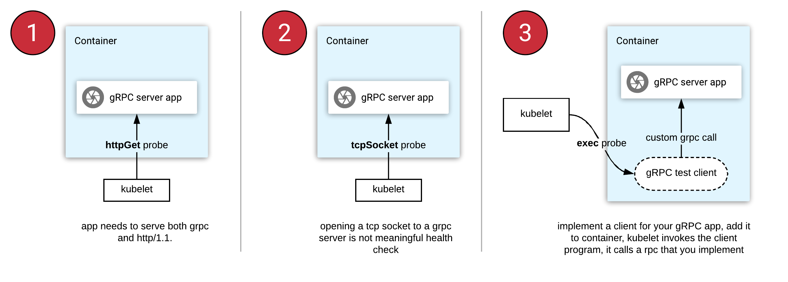
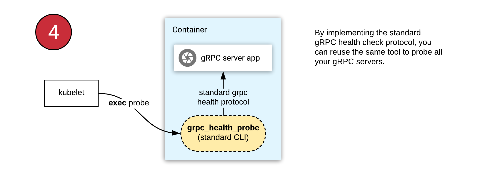

## gRPC Health Checking Protocol

> References:
>
> https://github.com/grpc/grpc/blob/v1.15.0/doc/health-checking.md


A GRPC service is used as the health checking mechanism for both simple client-to-server scenario and other control systems such as load-balancing:

- since it is a GRPC service itself, doing a health check is in the same format as a normal rpc.
- has rich semantics such as per-service health status. 
- as a GRPC service, it is able reuse all the existing billing, quota infrastructure, etc, and thus the server has full control over the access of the health checking service.

Service Definition:

```protobuf
syntax = "proto3";

package grpc.health.v1;

message HealthCheckRequest {
  string service = 1;
}

message HealthCheckResponse {
  enum ServingStatus {
    UNKNOWN = 0;
    SERVING = 1;
    NOT_SERVING = 2;
  }
  ServingStatus status = 1;
}

service Health {
  rpc Check(HealthCheckRequest) returns (HealthCheckResponse);
}
```

A client can query the server's health status by calling the `Check` method, and a deadline should be set on the rpc. The suggested format of service name is `package_names.ServiceName`, such as `grpc.health.v1.Health`.

The server should register all the services manually and set the individual status, including an empty service name and its status.


## Health checking gRPC servers on Kubernetes

> References:
>
> https://kubernetes.io/blog/2018/10/01/health-checking-grpc-servers-on-kubernetes
>
> https://github.com/grpc-ecosystem/grpc-health-probe

```
#kubernetes #healthcheck #probe #grpc
```


Kubernetes [does not support](https://github.com/kubernetes/kubernetes/issues/21493) gRPC health checks natively. This leaves the gRPC developers with the following three approaches when they deploy to Kubernetes:

[](https://kubernetes.io/images/blog/2019-09-30-health-checking-grpc/options.png)

1. **httpGet probe:** Cannot be natively used with gRPC. You need to refactor your app to serve both gRPC and HTTP/1.1 protocols (on different port numbers).
2. **tcpSocket probe:** Opening a socket to gRPC server is not meaningful, since it cannot read the response body.
3. **exec probe:** This invokes a program in a container's ecosystem periodically. In the case of gRPC, this means you implement a health RPC yourself, then write and ship a client tool with your container.

gRPC has a [standard health checking protocol](https://github.com/grpc/grpc/blob/v1.15.0/doc/health-checking.md). It can be used easily from any language. Generated code and the utilities for setting the health status are shipped in nearly all language implementations of gRPC.

The [**grpc-health-probe**](https://github.com/grpc-ecosystem/grpc-health-probe/):



With this tool, you can use the same health check configuration in all your gRPC applications. This approach requires you to:

1. Find the gRPC "health" module in your favorite language and start using it (example [Go library](https://godoc.org/github.com/grpc/grpc-go/health)).
2. Ship the [grpc_health_probe](https://github.com/grpc-ecosystem/grpc-health-probe/) binary in your container.
3. [Configure](https://github.com/grpc-ecosystem/grpc-health-probe/tree/1329d682b4232c102600b5e7886df8ffdcaf9e26#example-grpc-health-checking-on-kubernetes) Kubernetes "exec" probe to invoke the "grpc_health_probe" tool in the container.

Examples:

```bash
$ grpc_health_probe -addr=localhost:5000
healthy: SERVING

$ grpc_health_probe -addr=localhost:9999 -connect-timeout 250ms -rpc-timeout 100ms
failed to connect service at "localhost:9999": context deadline exceeded
exit status 2
```

Example for Kubernetes:

1. Choose a [binary release](https://github.com/grpc-ecosystem/grpc-health-probe/releases) and download it in your Dockerfile:

   ```bash
   RUN GRPC_HEALTH_PROBE_VERSION=v0.3.1 && \
       wget -qO/bin/grpc_health_probe https://github.com/grpc-ecosystem/grpc-health-probe/releases/download/${GRPC_HEALTH_PROBE_VERSION}/grpc_health_probe-linux-amd64 && \
       chmod +x /bin/grpc_health_probe
   ```

2. In your Kubernetes Pod specification manifest, specify a `livenessProbe` and/or `readinessProbe` for the container:

   ```yaml
   spec:
     containers:
     - name: server
       image: "[YOUR-DOCKER-IMAGE]"
       ports:
       - containerPort: 5000
       readinessProbe:
         exec:
           command: ["/bin/grpc_health_probe", "-addr=:5000"]
         initialDelaySeconds: 5
       livenessProbe:
         exec:
           command: ["/bin/grpc_health_probe", "-addr=:5000"]
         initialDelaySeconds: 10
   ```

   This approach provide proper readiness/liveness checking to your applications that implement the [gRPC Health Checking Protocol](https://github.com/grpc/grpc/blob/master/doc/health-checking.md).

