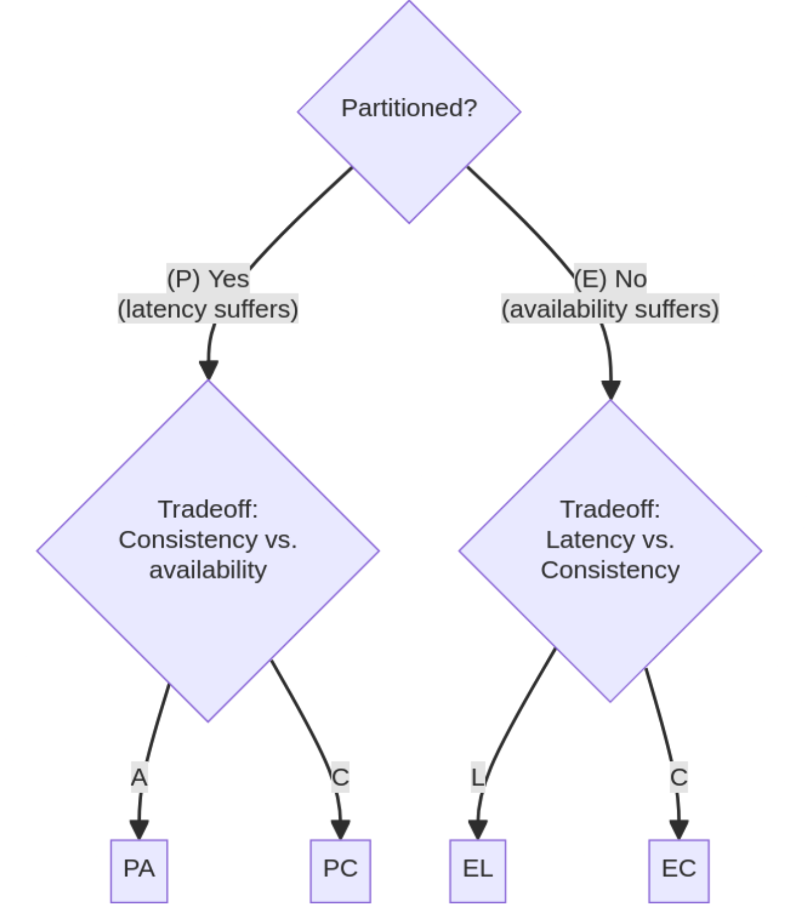

# Acid

ACID principles are related to database transactions and guaranteeing data validity.

### Atomic

Atomic means each statement executes cleanly or not at all.

- Printer example: entire document gets printed or nothing at all

For distributed systems, operations are executed by all nodes or none

### Consistent

Consistent transactions only make changes in predefined, predictable ways, i.e. any transaction will bring DB from one valid state to another. This also means the foreign keys, primary key relationships are guaranteed

- Printer example: printer prints half stage and gets stuck, then restarts and prints again

For distributed systems, database invariants are maintained

### Isolation

Isolation means concurrent read/writes don't affect one another.

- Printer example: no 2 documents get mixed up while printing

For distributed systems, no interference across nodes

### Durability

Durability means changes to data are saved and executed in case of DB errors or failures.

- Printer example: printer prints again if power outage with no erors

For distributed systems, transactions need to be stored in case of a total failure of a node

---

## Acid vs Base

Acid:

- Strongly Consistent
- Isolation
- Transactions
- Scale-up
- Precise answers
- Consistent always

Base:

- Weak consistency
- Last write wins
- Scale-out
- Approximate answers
- Availability first

Idempotent - can be called many times without different outcomes

---

# CAP

Impossible for a distributed system to simulatenously provide all three:

1. Consistency - all nodes see all data at same time, i.e. have a single up-to-date copy of the data, or every read receives the most recent write or an error
2. Available - Every request by a node must return a response, without guarantee that it contains the most recent version of the information
3. Partition Tolerance - when a communication break between nodes happens, partition-tolerant system still works even if partitions exist, system continues to operate

In the presence of a network partition, a distributed system must either choose consistency or availability.

- Weak consistency: after a write, reads may or may not see it. Best effort is taken, such as VoIP, video chat.
- Eventual Consistency: copies of data dont always have to be identical as long as they are designed to eventually become consistent, things like email.
- Strong Consistency: every read always sees the most recent write or an error.

| CA/CP/AP | Use Case                  | Definition                                                   | Real World Examples                  |
| -------- | ------------------------- | ------------------------------------------------------------ | ------------------------------------ |
| **CA**   | E-commerce Transactions   | **Consistency and Availability**: In this model, the system ensures strong consistency and high availability but may not tolerate network partitions. Transactions are guaranteed to be consistent and available, but network failures may cause downtime. | Traditional RDBMS (e.g., PostgreSQL) |
| **CP**   | Financial Trading Systems | **Consistency and Partition Tolerance**: In this model, the system prioritizes strong consistency and partition tolerance, which means it will continue to operate even when network partitions occur, but it may sacrifice availability under such conditions. | Bigtable, Redis, HBase               |
| **AP**   | Social Media Platforms    | **Availability and Partition Tolerance**: In this model, the system focuses on availability and partition tolerance, meaning it remains operational even during network partitions, but it may relax consistency guarantees. Data may eventually converge but not instantly. | Amazon DynamoDB, Cassandra           |

| Aspect           | Use Case                         | Example                                                      |
| ---------------- | -------------------------------- | ------------------------------------------------------------ |
| **Consistency**  | Financial Transactions           | Banks ensuring precise and consistent transaction records.   |
|                  | Inventory Management             | E-commerce platforms maintaining accurate stock levels.      |
|                  | Medical Records                  | Healthcare systems guaranteeing reliable patient data.       |
|                  | Distributed Databases            | Multi-datacenter databases used for compliance and reporting. |
| **Availability** | Social Media Platforms           | Social media platforms ensuring uninterrupted service.       |
|                  | Content Delivery Networks (CDNs) | CDNs distributing content with low latency and high availability. |
|                  | Real-time Messaging Apps         | Messaging apps prioritizing message delivery over strict consistency. |
|                  | Gaming Servers                   | Online games focusing on continuous gameplay, allowing temporary inconsistencies. |

**Consistency is favoured:**

Multiple clients need to have the same view of data, such as with financial information, personal information. Businesses require atomic reads and writes

**Availability is favored:**

Data accumulation is a priority, such as behavioral data or user preferences. Capture as much data about customer is doing at all time

# PACELC

In the case of a network partition (P), the system has to choose between availability (A) and consistency (C) 
but else (E), when the system operates normally in the absence of network partitions, the system has to choose between latency (L) and consistency (C).

| Aspect    | Use Case                            | Description                                                  |
| --------- | ----------------------------------- | ------------------------------------------------------------ |
| **L > C** | Real-time Multiplayer Online Games  | Online games prioritize low latency to ensure responsive gameplay, occasionally allowing minor in-game inconsistencies or delayed updates. |
|           | Social Media Feeds                  | Social media platforms focus on delivering content quickly to users, potentially leading to posts appearing out of chronological order or occasional visibility inconsistencies. |
|           | Video and Audio Streaming Services  | Streaming platforms trade consistency for low latency to minimize buffering and provide a seamless viewing experience, adapting content quality or tolerating minor inconsistencies to reduce interruptions. |
|           | High-Frequency Financial Trading    | Financial trading platforms value low latency for high-frequency trading, where traders may act on slightly outdated data to execute faster transactions. |
|           | IoT Sensor Data                     | IoT applications prioritize low latency for real-time data transmission, occasionally tolerating data delivery delays to ensure responsive interactions and control. |
| **C > L** | Financial Transactions              | Financial systems require strong consistency to ensure accurate and reliable transaction records, even if it may introduce some latency. |
|           | Healthcare Records                  | Healthcare systems prioritize consistency in patient data to avoid incorrect diagnoses or treatments, accepting latency for data accuracy. |
|           | Distributed Databases               | Databases used for compliance, auditing, and reporting emphasize strong consistency to ensure data accuracy and compliance, even if it results in some latency. |
|           | Inventory Management                | E-commerce platforms focus on consistency in inventory management to prevent overselling and maintain accurate product quantities, tolerating minor latency for data accuracy. |
|           | Regulatory Compliance and Reporting | Systems used for regulatory compliance and reporting prioritize strong consistency to ensure data accuracy, even if it introduces some latency. |
