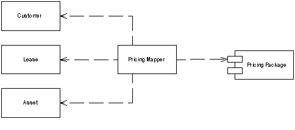
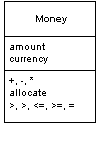
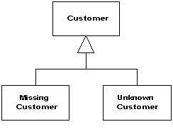
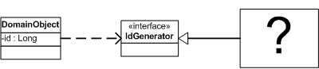
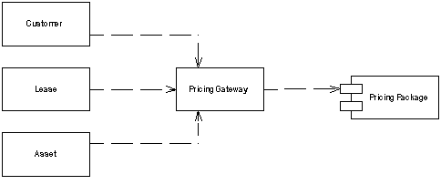
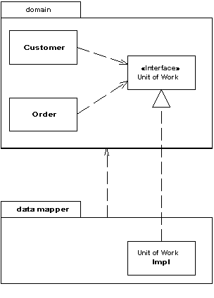
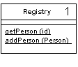
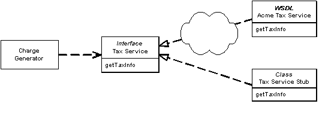
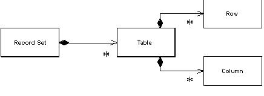
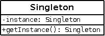

### Mapper

Объект, который управляет сообщением между независимыми друг от друга объектами.

Иногда нужно установить сообщение между двумя подсистемами,  которые, между тем должны оставаться в неведении друг о друге. Это может быть обусловлено невозможностью изменения этих объектов, или просто  нежеланием создавать зависимости между ними или между ними и изолирующей частью.

### Money

Надо думать о том, чтобы не сложить 10 долларов с 10 йенами без перевода курсов  валют. 

Не менее заметна проблема с округлением. Денежные вычисления часто округляют до наименьшей из существующих мер. При этом легко не учесть  копейки из-за ошибок округления.

### Special Case

Подкласс, содержащий особую логику для отдельных ситуаций.

Null-значения в ООП - неуклюжая вещь, так как она  зарубает на корню полиморфизм. Обычно есть возможность вызова  какого-либо метода на переменной заданного типа без необходимости  беспокоиться о том, принадлежит ли эта переменная конкретному классу или подклассу. В строго типизированных языках эту проверку делает  компилятор. Тем не менее, из-за того, что переменная может содержать null, существует опасность возникновения ошибки во время выполнения, при вызове метода на null-значении.

Если переменная может принимать значение null, вам нужно  постоянно заботиться о проверках на null и правильной обработке  null-значений. Часто, эта "правильная обработка" одинакова в большинстве случаев, и всё это заканчивается дублированием кода.

Вместо того, чтобы возвращать null или какое-то дополнительное значение, верните Special Case - объект с тем же интерфейсом, но ведущий себя иначе, чем основной.

### Plugin

Соединяет классы во время конфигурации, а не компиляции.

Паттерн [Separated Interface](http://design-pattern.ru/patterns/separated-interface.html) часто используется, когда один код выполняется в нескольких средах и  требует разной реализации отдельной логики. Большинство разработчиков  добиваются этого при помощи использования шаблона фабрики. Представим,  что надо генерировать первичный ключ при помощи паттерна [Separated Interface](http://design-pattern.ru/patterns/separated-interface.html). Можно использовать для юнит-тестирования простой объект-счёчик, а на  реальной системе - последовательность из БД. Фабричный метод скорее  всего будет содержать условный переход (if), проверяющий, установлен ли  флаг тестирования, и возвращать необходимый генератор ключа.

Как только у вас появится ещё несколько фабрик - начнётся путаница. Создание новой конфигурации, например "запуск юнит-тестов на  БД без контроля транзакций" или "запуск в продакшн на DB2 с полной  поддержкой транзакций", потребует правок в условиях в большом количестве фабрик, пересборку и переразвёртывание.

Конфигурация не должна быть разбросана по приложению, также как и требовать пересборки и переразвёртывания. Паттерн Plugin решает обе эти проблемы, предоставляя централизованную динамическую конфигурацию.

### Gateway

Объект, который инкапсулирует доступ к внешней системе и ресурсу.

При доступе к внешним ресурсам, обычно  используется API. Однако, API изначально являются чем-то сложным, потому что принимают во внимание структуру ресурса. Каждый, кто хочет понять  какой-нибудь ресурс, должен понять его API - будь то JDBC и SQL для  реляционных БД или W3C или JDOM для XML. Это делает ПО не только менее  понятным, но ещё это делает изменения гораздо более сложными, например,  если вы собираетесь перейти со временем с SQL на XML.

Решением здесь является обёртывание всего специального  API в класс, интерфейс которого выглядит как интерфейс обычного объекта. Остальные объекты обращаются к ресурсу через этот Шлюз, который транслирует эти простые вызовы в соответствующий специальный API-код.

### Separated Interface

Выделение какого-либо интерфейса к объекту в отдельный от объекта пакет.

При разработке какой-либо системы, можно добиться  улучшение её архитектуры, уменьшая связанность между её частями. Это  можно сделать так - распределив классы по отдельным пакетам и  контролировать зависимости этими пакетами. Тогда можно следовать  правилам о том, как классы из одного пакета могут обращаться к классам  из другого пакета. Например, то, которое запрещает классам с уровня  данных обращаться к классам с уровня представления.

Тем не менее, может возникнуть необходимость реализовать  методы, которые противоречат основной структуре зависимостей. В таком  случае можно использовать Выделенный Интерфейс, чтобы определить  какой-либо интерфейс в одном пакете, а реализовать в другом. Таким  образом, любой клиент, которому нужна зависимость от этого интерфейса  может совершенно не думать о реализации доступа. Паттерн Separated Interface предоставляет хорошую точку подключения паттерна [Gateway](http://design-pattern.ru/patterns/gateway.html).

### Registry

Хорошо известный объект, который используется другими объектами для получения общих объектов и сервисов.

Когда нужно найти какой-нибудь объект, обычно начинают с  другого объекта, связанного с целевым. Например, если нужно найти все  счета для покупателя, начинают, как раз с покупателя и используют его  метод получения счетов. Тем не менее, в некоторых случаях нет  подходящего объекта, с которого начать. Например, известен ID  покупателя, но нет ссылки на него.

Реестр - это глобальный объект по сути своей или, по крайней мере, так выглядит - он может функционировать только будучи глобальным.

### Service Stub

Ликвидирует зависимость от внешних проблемных сервисов во время тестирования.

Enterprise-системы часто зависят от внешних сервисов,  таких как, например, расчёт кредитного рейтинга, ставки налогов и т.п.

Замена сервиса на заглушку (Service Stub), которая выполняется локально и быстро, улучшит разработку.

### Value Object

Маленький объект для хранения величин таких как деньги или диапазон дат, равенство которых не основано на идентичности.

При работе с ООП, приходишь к выводу, что полезно  разделять ссылочные объекты и объекты-значения. Объект-значение обычно  гораздо меньше. Он как простой тип данных из тех языков, которые не  являются полностью объектно-ориентированными.

### Record Set

Представление данных из таблицы в приложении.

На этой почве появилось множество инструментов для  быстрого построения UI (пользовательского интерфейса). Эти UI-фреймворки основываются на реляционности данных и предоставляют различные  UI-элементы, которые легко настраиваются и управляются практически безо  всякого программирования.

Обратная сторона медали в том, что, несмотря на  невероятную лёгкость вывода и работы с данными, эти элементы не  предусматривают возможности добавления кода бизнес-логики. Проверки типа "правильный ли формат у эта даты" и любые правила исполнения попросту  некуда поставить. И в итоге, эта логика либо забивается в БД, либо  смешивается в кодом вывода информации.

Суть Record Set в предоставлении структуры данных, которая выглядит в точности как  результат SQL-запроса, но может управляться и обрабатываться любыми  частями системы.

### Layer Supertype

Тип, выступающий родительским для всех типов в своём уровне.

Нередко все классы одного уровня имеют одинаковые методы, которые не хочется дублировать повсеместно. Для того, чтобы избежать  дублирования, можно все общие методы перенести в один класс (Layer Supertype), который будет являться Супертипом всех классов в своём уровне.

### Singleton

В приложении экземпляр определённого класса должен присутствовать гарантировано в одном экземпляре. 

По сути создаётся статический экземпляр класса: защищённый от  клонирования, обычного инстанцирования через конструктор, и других  способов получения ссылки на единственный экземпляр — кроме статического метода-конструктора. 

Singleton часто называют «анти-паттерном», т.к. при использовании он несёт следующие проблемы: 
- Статический метод получения экземпляра создаёт жесткую связь, игнорируя инъекцию зависимостей. 
- Приложение неявно обладает неким состоянием. 
- «Одиночку» проблематично заменить в тестовом окружении.
