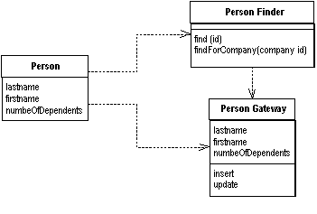
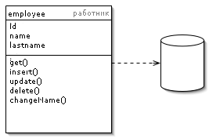
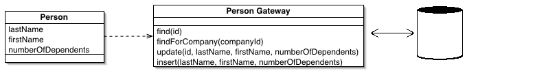
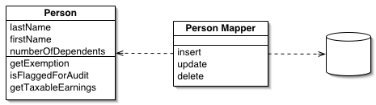

### Row Data Gateway

Объект выступает в роли шлюза к отдельной записи в источнике данных. Один экземпляр на одну запись.

Встраивание кода доступа к БД в объекты, хранящиеся в памяти,  может привести в некоторым неудобствам. Во-первых, если ваши объекты  содержат бизнес-логику, добавление взаимодействия с БД увеличит сложность. Вскоре тестирование станет неудобным, если объекты,  хранящиеся в памяти, завязаны на БД. Тесты станут медленнее из-за  доступа к БД.

Объект шлюза к записи представляется в точности, как запись в БД,  но при этом даёт возможность доступа посредством штатных средств языка  программирования. Все подробности доступа к БД скрыты за этим  интерфейсом.

Пример: объект шлюза PersonGateway, данные о записи из таблицы person и методы insert и  update, которые позволяют прозрачно работать с записью.

### Active Record

Один объект управляет и данными, и поведением. Большинство этих  данных постоянны и их надо хранить в БД. Этот паттерн использует  наиболее очевидный подход - хранение логики доступа к данным в объекте  сущности.

Объект является "обёрткой" одной строки из БД или представления, включает в себя доступ к БД и логику обращения с данными.

Пример: объект  "Работник" содержит данные об одном работнике и методы: добавить, обновить или удалить. Помимо прочего, отдельным методом вынесена смена имени.

### Table Data Gateway

Объект выступает в качестве шлюза между данными в приложении и в БД. Один объект работает сразу со всеми записями в таблице.

Объект шлюза к таблице содержит все запросы SQL для доступа к  отдельной таблице или представлению: выборка, обновление,  вставка, удаление (CRUD). Остальной код, для взаимодействия с БД, обращается к методам объекта шлюза.

Пример: объект шлюза PersonGateway содержит методы для доступа к таблице person в БД. Методы содержат SQL-код для выборки, вставки, обновления и удаления. Объект  может содержать специальную выборку, например поиск по компании.

### Data Mapper

Объектные и реляционные БД используют разные способы  структурирования данных. Множество составляющих объектов, например  коллекции и наследование, не представлены в реляционных БД. Когда  проектируется объектная модель с большим количеством бизнес-логики,  полезно применять такие механизмы для улучшения организации хранения  данных и логики, которая работает c ними. Это приводит к различиям в  организации. Так что объектная и реляционная схемы не идентичны.

Тем не менее, необходимость в обмене данными между двумя  схемами не отпадает, и этот обмен становится, в свою очередь, сложным.  Если же объект знает о реляционной структуре — изменения в одной из  структур приведёт к проблемам в другой.

Data Mapper — это программная прослойка, разделяющая  объект и БД. Его обязанность — пересылать данные между ними и  изолировать их друг от друга. При использовании Data Mapper'а объекты не нуждаются в знании о существовании БД. Они не нуждаются в SQL-коде, и  (естественно) в информации о структуре БД. Так как Data Mapper - это  разновидность паттерна [Mapper](http://design-pattern.ru/patterns/mapper.html), сам объект-Mapper неизвестен объекту.