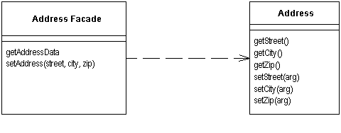
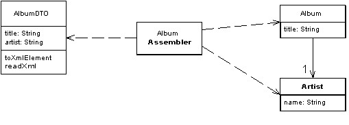

### Remote Facade

Предоставляет общий объединяющий интерфейс для набора методов объекта для улучшения эффективности сетевого взаимодействия.

Паттерн Remote Facade в объектно-ориентированной модели улучшает работу с маленькими объектами, у которых маленькие методы.

Любой объект, который задействован в удалённом  взаимодействии, нуждается в более общем интерфейсе, который бы позволил  минимизировать количество запросов, необходимых, чтобы сделать что-либо. Это затрагивает не только методы, но и объекты. Вместо того, чтобы  запрашивать счёт и все его пункты отдельно, надо считать и обновить все  пункты счёта за одно обращение. Это влияет на всю структуру объекта.

Паттерн Remote Facade представляет собой общий "Фасад" (по GoF) поверх структуры более  "мелко-молотых" объектов. Ни один из этих объектов не имеет удалённого  интерфейса, а Remote Facade не включает в себя никакой бизнес-логики. Всё, что делает Remote Facade - это транслирует общие запросы в набор небольших запросов к подчинённым объектам.

### Data Transfer Object

Объект, который пересылает данные между процессами для уменьшения количества вызовов методов.

При работе с удалённым интерфейсом, таким как, например, [Remote Facade](http://design-pattern.ru/patterns/remote-facade.html), каждый запрос к нему достаточно затратен. В результате, приходится  уменьшать количество вызовов, что означает необходимость передачи  большего количества данных за один вызов. Чтобы реализовать это, как  вариант, можно использовать множество параметров. Однако, при этом  зачастую код получается неуклюжим и неудобным.

Решением здесь является паттерн Data Transfer Object, который может хранить всю необходимую для вызова информацию. Он должен  быть сериализуемым для удобной передачи по сети. Обычно используется  объект-сборщик для передачи данных между DTO и объектами в приложении.