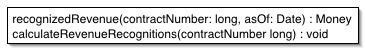

### Transaction Script

Организует бизнес-логику в процедуры, которые управляют каждая своим запросом.

Большинство бизнес-приложений можно представить в виде набора  транзакций. Какие-то из них выбирают данные, какие-то ‐ меняют. Каждое  взаимодействие пользователя и системы содержит определённый набор  действий. В некоторых случаях это может быть просто вывод данных из БД. В других случаях эти дествия могут содержать в себе множество вычислений и проверок.

Паттерн Transaction Script организует всю эту логику в одну процедуру, работая в БД напрямую или через тонкую обёртку. Каждая транзакция имеет свой Transaction Script, хотя общие подзадачи могут быть разбиты на процедуры.

### Domain Model

Объектная модель домена, объединяющая данные и поведение.

Бизнес-логика приложения может быть очень сложной. Правила и логика описывают множество случаев и модификаций поведения. Паттерн Domain Model образует сеть взаимосвязанных объектов, в  которой каждый объект представляет собой отдельную сущность:  может быть настолько большую, как корпорация или настолько малую, как строка из формы заказа.

### Table Module

Одна сущность обрабатывает всю бизнес-логику для всех строк таблице БД или виде.

Один из основополагающих принципов в ООП - сочетание данных и методов обработки этих данных. Традиционный объектно-ориентированный подход  основан на объектах с соответствием, как, например, в паттерне [Domain Model](http://design-pattern.ru/patterns/domain-model.html). Таким образом, если есть класс Employee, любой экземпляр этого класса  соответствует конкретному работнику. Эта структура работает хорошо,  потому что, имея связь, можно выполнять операции, использователь  отношения, и собирать данные о работнике

Одна из проблем в паттерне [Domain Model](http://design-pattern.ru/patterns/domain-model.html) заключается в интерфейсе к БД - часто приходится сильно постараться, чтобы записать или  считать данные из БД, преобразуя их между двумя представлениями.

Паттерн Table Module разделяет логику области определения (домена) на отдельные классы для  каждой таблицы в БД и один экземпляр класса содержит различные  процедуры, работающие с данными. Основное отличие от [Domain Model](http://design-pattern.ru/patterns/domain-model.html) заключается в том, что если есть несколько заказов, то [Domain Model](http://design-pattern.ru/patterns/domain-model.html) будет создавать для каждого из заказов свой объект, а Table Module будет управлять всем заказами при помощи одного объекта.

### Service Layer

Определяет границу между приложением и слоем сервисов, который  образует набор доступных операций и управляет ответом приложения в  каждой операции.

Бизнес-приложения обычно нуждаются в различных интерфейсах к данным,  которые они хранят и логике, которую реализуют: загрузчики данных,  пользовательские интерфейсы, интеграционные шлюзы и другое. Вопреки  различным целям, эти интерфейсы часто нуждаются во взаимодействии с  приложением для доступа и управления его данными и исполнения логики.  Эти взаимодействия могут быть сложными, использующими транзакции на  нескольких ресурсах и управление несколькими ответами на действие.  Программирование логики взаимодействия для каждого интерфейса вызовет  больше количество дублирования.

Паттерн Service Layer определяет для приложения границу и набор допустимых операций с точки  зрения взаимодействующих с ним клиентских. Он инкапсулирует  бизнес-логику приложения, управляя транзакциями и управляя ответами в  реализации этих операций.