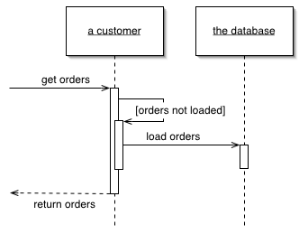
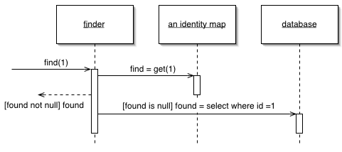

### Lazy Load

Объект, не содержит данных, но знает, где их взять.

Для загрузки данных из БД в память приложения удобно  пользоваться загрузкой не только данных об объекте, но и о сопряжённых с ним объектах. Это делает загрузку данных проще для разработчика: он  просто использует объект, который, тем не менее вынужден загружать все  данные в явном виде.

Но это ведёт к случаям, когда будет загружаться огромное  количество сопряжённых объектов, что плохо скажется на  производительности в случаях, когда эти данные реально не нужны.

Паттерн Lazy Load подразумевает отказ от загрузки дополнительных  данных, когда в этом нет необходимости. Вместо этого ставится маркер о  том, что данные не загружены и их надо загрузить в случае, если они  понадобятся.

Существует четыре основных варианта ленивой загрузки:

- **Lazy Initialization** использует специальный макер (обычно null), чтобы пометить поле, как не загруженное. При каждом обращении к полю проверяется значение маркера  и, если значение поля не загружено - оно загружается.
- **Virtual Proxy** - объект с таким же интерфейсом, как и настоящий объект. При первом  обращении к методу объекта, виртуальный прокси загружает настоящий  объект и перенаправляет выполнение.
- **Value Holder** - объект с методом getValue. Клиент вызывает метод getValue, чтобы получить реальный объект. getValue вызывает загрузку.
- **Ghost** - объект без каких-либо данных. При первом обращении к его методу, призрак загружает все данные сразу.

### Identity Map

Обеспечивает однократную загрузку объекта, сохраняя данные об  объекте в карте соответствия. При обращении к объектам, ищет их в карте  соответсвия.

Паттерн Identity Map хранит записи о всех объектах, которые были считаны из БД за время выполнения одного действия. Когда  происходит обращение к объекту, проверяется карта соответствия  (присутствия), чтобы узнать, загружен ли объект.

### Unit of Work

Обслуживает набор объектов, изменяемых в бизнес-транзакции  (бизнес-действии) и управляет записью изменений и разрешением проблем  конкуренции данных.

Когда необходимо писать и читать из БД, важно следить за  тем, что вы изменили и если не изменили - не записывать данные в БД.  Также необходимо вставлять данные о новых объектах и удалять данные о  старых.

Можно записывать в БД каждое изменение объекта, но это  приведёт к большому количеству мелких запросов к БД, что закончится  замедлением работы приложения. Более того, это требует держать открытую  транзакцию всё время работы приложения, что непрактично, если приложение обрабатывает несколько запросов одновременно. Ситуация ещё хуже, если  необходимо следить за чтением из и БД, чтобы избежать неконсистентного  чтения.

Реализация паттерна Unit of Work следит за всеми действиями приложения, которые могут изменить БД в  рамках одного бизнес-действия. Когда бизнес-действие завершается, Unit of Work выявляет все изменения и вносит их в БД.