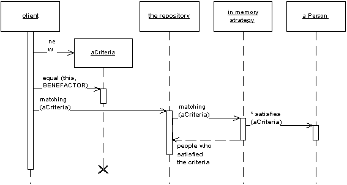

### Metadata Mapping

Хранит данные об объектно-реляционном распределении в метаданных.

В большинстве случаев, код, управляющий объектно-реляционным  распределением описывает, как поля в БД соотносятся с полями в объектах. Такой код получается сильно повторяющимся и скучным. Паттерн Metadata Mapping позволяет разработчикам определять правила распределения (маппинга) в  простой табличной форме, которая может быть обработана общим кодом,  который получает данные о правилах записи и чтения данных из БД.

### Query Object

Объект, представляющий запрос к БД.

Паттерн Query Object - это структура объектов, которая может интерпретироваться в  SQL-запрос. Можно создавать такой запрос ссылаясь на классы и поля так же как на таблицы и столбцы. Таким образом создаётся независимость  разработчика от струткуры БД и конкретной реализации БД.

### Repository

Посредничает между уровнями domain and data mapping layers, используя интерфейс, схожий с коллекциями для доступа к объектам области определения.

Паттерн Repository посредничает между слоем области определения и слоем распределения данных, работая, как обычная колекция объектов области определения.  Объекты-клиенты создают описание запроса декларативно и направляют их к объекту-репозиторию (Repository) для обработки. Объекты могут быть добавлены или удалены из репозитория, как будто они формируют простую коллекцию объектов. А код распределения данных, скрытый в объекте Repository, позаботится о соответсвующих операциях в незаметно для разработчика. В двух словах, паттерн Repository инкапсулирует объекты, представленыые в хранилище данных и операции,  производимые над ними, предоставляя более объектно-ориентированное  представление реальных данных. Repository также преследует цель достижения полного разделения и односторонней  зависимости между уровнями области определения и распределения данных.
