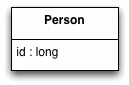
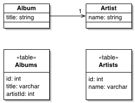
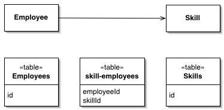
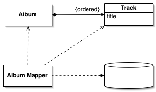
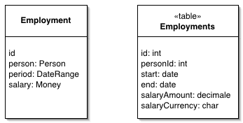
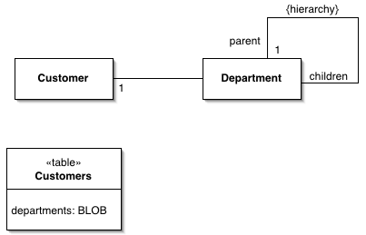
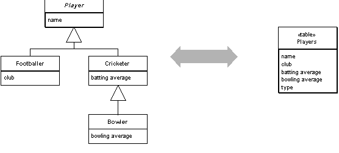
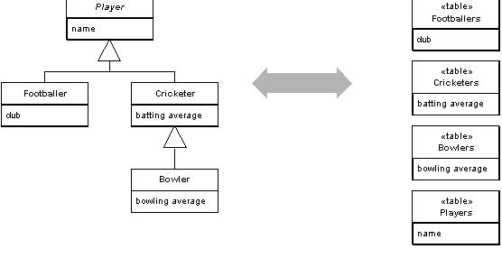
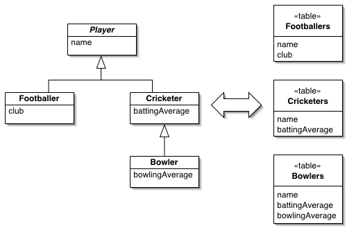
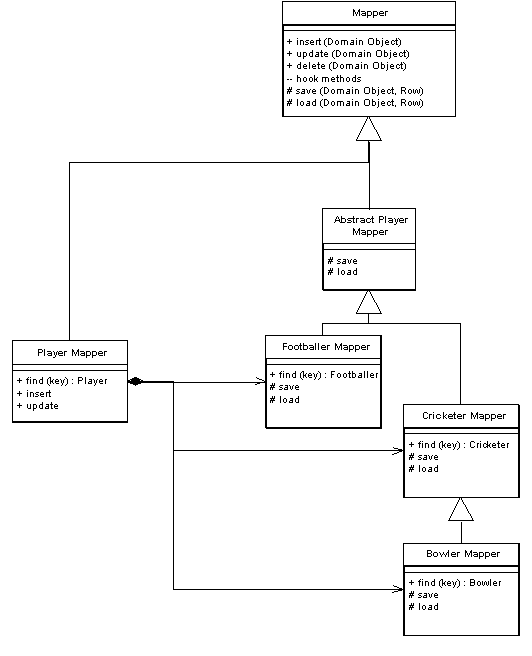

### Identity Field

Хранит первичный ключ из БД в объекте, чтобы обеспечивать соответствие между объектом и строкой в БД.

Реляционные базы данных отличают одну запись от другой при  помощи первичного ключа. Но объекты в памяти не нуждаются в таком ключе, так как объектная система следит отличием объектов сама. При чтении из  БД проблем не возникает, но для записи, нужна привязка объектной системы к БД.

### Foreign Key Mapping

Представляет отношения по внешним ключам между таблицами в виде отношений между объектами

Объекты могут ссылаться друг на друга напрямую, через объектные  ссылки. Чтобы хранить эти объекты в БД, необходимо сохранять эти ссылки. Тем не менее, так как в разное время в объектах хранятся разные данные, нельзя  сохранять значения "как есть". Еще больше усложняется всё тем, что  объекты могут легко содержать коллекции ссылок на други объекты. Такая структура нарушает нормализацию реляционных БД.

Разметка внешних ключей сводит ссылку на объект к внешнему ключу в БД.

### Association Table Mapping

Сохраняет соответствие в виде таблицы с внешними ключами к таблицам, которые объединены этим соответствием.

Объекты с лёгкостью могут управлять наборами из нескольких значений  при использовании коллекций в качестве собственных свойств. Реляционные  базы данных не предоставляют такой возможности и ограничиваются полями с одним значением. При разметке соответствия "один ко многим", можно использовать паттерн [Foreign Key Mapping](http://design-pattern.ru/patterns/foreign-key-mapping.html), используя внешний ключ для однозначного соответствия. Но отношения  "многие ко многим" не могут обеспечить этого, потому что нет однозначной сущности на которую ссылался бы внешний ключ.

Решением здесь является классическое разрешение, используемое в  реляционных БД годами: создание дополнительной таблицы, для хранения множественных связей. Тогда использование Association Table Mapping позволит разметить многозначные поля через связующую таблицу

### Dependent Mapping

Один класс предоставляет mapping (распределение) и для основного класса и для зависимого.

Некоторые объекты существуют только в контексте других объектов.  Песни из альбома могут быть загружены или сохранены в любой момент,  когда альбом загружен или сохранён. Если они не используются другими  таблицами в БД, то можно упростить процесс маппинга, переложив маппинг  песен на объект-маппер альбомов. Такое поведение называется Dependent Mapping (Управление распределением подчинённых сущностей)

### Embedded Value

Записывает объект в несколько полей таблицы другого объекта.

Множество небольших объектов играют важную роль в  объектно-ориентированной системе, но не подходят для хранения в  отдельной таблице. Это, к примеру, объекты-деньги, зависящие от валюты и диапазоны дат.

Паттерн Embedded Value распределяет значения полей объекта в поля таблицы объекта-владельца.

### Serialized LOB

Хранение графа связей объектов в БД посредством сериализации их в один large object (LOB).

Объектная модель зачастую содержит сложные графы взаимосвязей мелких  объектов. Большая часть информации в таких структурах содержится не в самих объектах, а в связях между ними. Например, при работе со  структурой организации, объектная модель достаточно хорошо может  отразить все взаимосвязи между структурами и можно с лёгкостью добавлять методы, позволяющие получать данные об отделах и их взаимосвязях.

Но хранение этой структуры в БД - не такая уж и простая задача.  Первое приходящее на ум решение - таблица "организация" с внешним ключём к родителю. Но работа с такой структурой БД требует использования JOIN'ов, которые одновременно медленные и громоздкие.

Объекты не нуждаются в представлении в виде связанных записей в  таблице. Есть другая форма представления - сериализация, когда весь граф объектов записывается в один LOB (large object).

### Single Table Inheritance

Представление всех классов из иерархии наследования в виде одной таблицы в БД, содержащей столбцы для всех полей различных классов.

Реляционные БД не поддерживают наследование, по этому, записывая  данные об объектах в БД, мы вынуждены придумывать, как отобразить наследование в таблицах. Конечно, мы стараемся минимизировать JOIN'ы,  которые мгновенно появятся, если наследование реализовывать несколькими  таблицами в БД. 

Паттерн Single Table Inheritance (наследование с единой таблицей) записывает все поля всех классов иерархии в одну таблицу.

### Class Table Inheritance

Представляет иерархию наследования классов в виде структуры БД, когда одна таблица отвечает одному классу.

Одно из самых заметных несоответствий между объектной и реляционной  моделью - отсутствие поддержки наследования. Иногда необходима  структура БД, точно соответсвующая объектной модели и позволяющая  наращивать дерево наследования. Паттерн Class Table Inheritance (Наследование с таблицами классов) предоставляет такие возможности,  используя одну таблицу на один класс из структуры наследования.

### Concrete Table Inheritance

Представляет иерархию наследования классов в виде структуры БД, когда одна таблица отвечает **целиком** одному классу.

Проблема объектно-реляционного взаимодействия заключается в  отсутствии поддержки наследования в РБД. Если рассматривать таблицы с  объектной точки зрения, есть смысл записывать каждый объект в отдельную  запись в БД. Такой подход реализует паттерн Concrete Table Inheritance, в котором каждому конкретному классу из иерархии наследования соответствует своя таблица.

### Inherritance Mappers

Структура организации распределителей данных, которые работают с деревом наследования.

При работе с распределением объектных данных из дерева наследования в БД, необходимо уменьшить объём кода, используемого для записи и чтения  данных из БД. Также необходимо предоставлять и абстрактные, и конкретные методы распределения данных, которые позволяли бы сохранять и читать и  родительские и дочерние классы.

Не смотря на то, что нюансы такого поведения могут видоизменяться в зависимости от схемы работы с деревом насделования ( [Single Table Inheritance](http://design-pattern.ru/patterns/single-table-inheritance.html), [Class Table Inheritance](http://design-pattern.ru/patterns/class-table-inheritance.html) или [Concrete Table Inheritance](http://design-pattern.ru/patterns/concrete-table-inheritance.html)), общая струтура одинакова для них всех.
