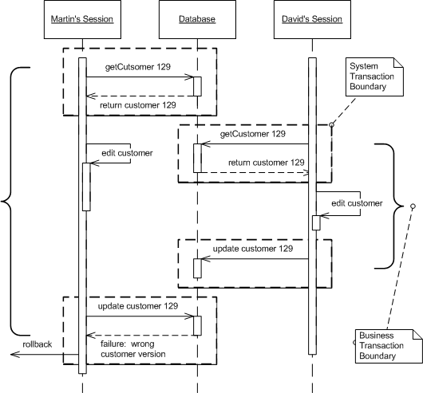
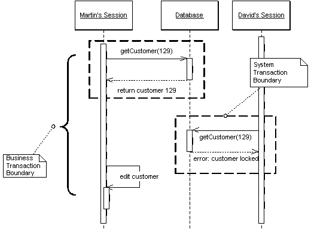
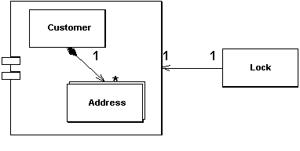
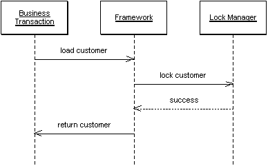

### Optimistic Offline Lock

Предотвращает конфликты между конкурирующими бизнес-транзакциями, выявляя их и откатывая транзакцию назад.

Зачастую бизнес-транзакция подразумевает выполнение нескольких  системных транзакций. Выходя за пределы одиночной системной транзакции,  мы не можем полагаться только на систему управления БД, чтобы быть  уверенными в том, что бизнес-транзакция оставит данные в консистентном  состоянии. Целостность данных находится под угрозой, каждый раз, когда  две бизнес-транзакции начинают работу над одними и теми же данными.  Также может случиться ситуация, когда один процесс читает данные в то  время, как другой - обновляет.

Паттерн Optimistic Offline Lock решает эту проблему, проверяя завершённость одной транзакции и  отсутствие конфликтов с другой. Успешная pre-commit проверка, в  известном смысле, получает сигнал блокировки, что можно продолжать  работать с изменениями в данных. Так как проверка происходит во время  завершения каждой системной транзакции, бизнес-транзакции будут также  консистентны.

Тогда как [Pessimistic Offline Lock](http://design-pattern.ru/patterns/pessimistic-offline-lock.html) подразумевает, что шанс сессии на конфликт высок и по этому ограничивает системную конкуренцию, Optimistic Offline Lock подразумевает, что шансы на конфликт не велики. Такое предположение не  очень подходит для одновременной работы нескольких пользователей над  одними данными.

### Pessimistic Offline Lock

Предотвращает конфликты между конкурирующими бизнес-транзакциями,  разрешая доступ к одинм данным только одной бизнес-транзакции за раз.

Так как локальная конкуренция включает в себя работу с данными бизнес-транзакции, которая содержит несколько запросов, то наиболее  простой подход был бы держать транзакцию открытой на протяжении всей  бизнес-транзакции. Но, к сожалению, этот подход не всегда работает  хорошо, потому что системы управления транзакциями не заточены под  работу с длинными транзацкиями. По этому приходится делать несколько  системных транзакций, а остальную конкуренцию отслеживать самостоятельно.

Первый из подходов, который следует попробовать в этом случае - [Optimistic Offline Lock](http://design-pattern.ru/patterns/optimistic-offline-lock.html). Однако, этот паттерн имеет свои недостатки. Например, если несколько  людей пытаются получить доступ к одним данным в одной бизнес-транзакции, один из них легко сможет сделать commit, но остальные получат конфликт и не смогут продолжить работу. Из-за того, что конфликты определяются  только в конце бизнес-транзакции (а не предотвращаются), жертвы будут делать все действия тразакции и в последний момент обнаружат, что вся их работа псу под хвост. Если так будет происходить, системы с длинными транзакциями вскоре станут непопулярны.

Pessimistic Offline Lock предотвращает конфликты, исключая их вообще. Этот паттерн заставляет  бизнес-транзакцию накладывать блокировку на ту часть данных, с которыми  она работает, так что чтобы начать работу с данными другой пользователь  сначала ждёт, пока данные освободятся.

### Coarse Grained Lock

Блокирует набор связанных объектов при помощи одной блокировки.

Объекты часто могут отредактироваться в группе. Например, есть клиент и набор его адресов. В таком случае можно блокировать их все, если надо обратиться к одному из них. Блокировка их по отдельности приведёт к  множеству проблем. Во-первых все кто пытается работать с такими данными, будет вынужден создавать код для поиска всех записей, чтобы потом  заблокировать их. Это достаточно просто в примере с клиентом и адресами, но что, если группа будет более сложной или групп будет больше. Куда  поместить часть программной логики, которая отвечает за слияние  блокировок. Если в стратегию блокировки входит правило, в соответствии с которым объект должен быть загружен перед блокировкой, как например в [Optimistic Offline Lock](http://design-pattern.ru/patterns/optimistic-offline-lock.html) , то блокировка большого массива объектов вызовет провал в производительности. А в случае с [Pessimistic Offline Lock](http://design-pattern.ru/patterns/pessimistic-offline-lock.html) , большая блокировка вызовет проблемы с управлением и увеличит конкуренцию за блокировки.

Паттерн Coarse-Grained Lock представляет собой одиночную блокировку,  которая покрывает множество объектов. Она не только упрощает работу с  блокировками, но ещё и освобождает разработчика от необходимости  загружать все элементы группы, чтобы заблокировать их.

### Implicit Lock

Позволяет коду фреймворка или супертипа уровня использовать локальные блокировки.

Суть всех блокировок в том, что при их использовании нельзя делать исключений. Если забыть написать одну строку кода, которая вызывает  блокировку, можно придти к полной бесполезности всей блокировочной схемы. Не вызвав блокировку на чтение, даже если остальные транзакции её используют, можно поставить под вопрос актуальность данных. В целом -  если что-то может быть заблокировано где-то, оно должно блокироваться  везде. Игнорируя это правило, блокировочные стратегии приложений рискуют целостностью данных. Если не завершить блокировку вовремя, то с данными ничего плохого не случится, однако, это приведёт к провалу  производительности. Из-за сложности тестирования локальных блокировок,  такие ошибки могут пройти все тесты и не быть обнаруженными

Единственное решение здесь - не дать разработчикам ошибиться. Задачи, использующие блокировки, которые не могут быть невыявленными, должны быть обработаны не явно для разработчика, но скрыто для приложения. А  тот факт, что большинство приложений промышленного масштаба используют  нектотрый набор фреймворков, [Layer Supertype](http://design-pattern.ru/patterns/layer-supertype.html) и генерацию кода, даёт большие возможности для внедрения паттерна Implicit Lock.
