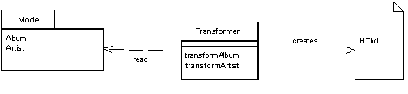
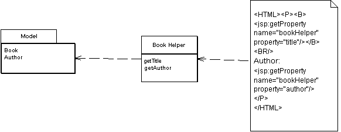
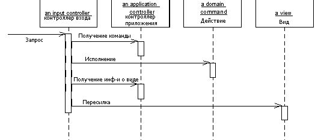
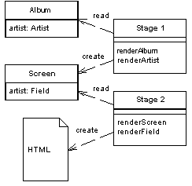
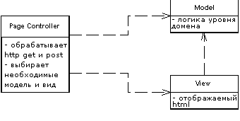
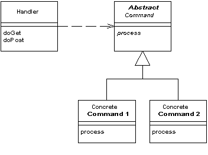
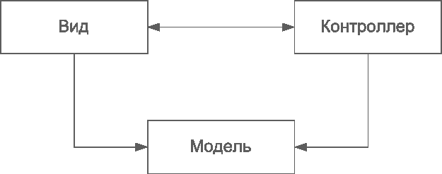

### Transform View



Преобразует записи в HTML по одной.

Когда выполняются запросы к БД, вы получаете данные, но этого не достаточно, чтобы отобразить нормальную web-страницу. Задача вида (view) в паттерне [MVC - Model View Controller](http://design-pattern.ru/patterns/mvc.html) - формировать данные в web-страницу. Использование Transform View подразумевает преобразование, когда на входе есть модель, а на выходе HTML.

Пример: на входе преобразователя модель, содержащая имя альбома (album name) и имя артиста (artist name). На выходе - код:
```html
<a href="http://exapmle.com/music/album_name/artist_name">artist name</a>
```


### Template View



Заполняет HTML-шаблон информацией при помощи маркеров, указанных в шаблоне.

В случае со статическими HTML-страницами, которые не меняются от  запроса к запросу, можно использоваться удобный WYSIWYG-редактор. Тэги проще и удобнее, чем собирать их через конкатенации в языке  программирования.

Для динамических страниц так же, как и статических, можно использовать маркеры, которые могут быть  заменены динамической информацией. Например, при  обработке шаблона, области, помеченные специальными маркерами `<jsp:.../>` заменяются результатами вызовов  методов helper'a.	


### Application Controller



Единая точка управления отображением и выполнением приложения.

Некоторые приложения содержат в разных своих частях значительное количество кода, управляющего отображением. Устранить это дублирование можно посредством помещения всей логики выполнения приложения в Application Controller. Тогда Input Controller будет обращаться к Application Controller за необходимыми к выполнению на модели и за необходимыми view в зависимости от контекста.


### Two Step View



Преобразует данные в HTML в два шага: сначала формирует логическую структуру, а позже - заполняет её отформатированными данными

Если web-приложение состоит из множества страниц, необходим единый вид и единая структура сайта. Если каждая страница выглядит по своему, получится сайт, который будет непонятным для пользователя. 

Two Step View решает эту проблему разбиением шаблонизации на две части. В первой, данные из модели преобразуются в логическое представление без  какого-либо другого, специфического форматирования. Второй шаг преобразует это логическое представление с использование необходимого конкретного форматирования. Таким образом, можно делать глобальные  изменения, изменяя только второй шаг. Также можно сделать несколько  представлений для одной и той же информации, выбирая на лету  форматирование для второго шага.


### Page Controller



Объект, обрабатывающий запрос к отдельной странице или действию.

Когда происходит запрос к статической  HTML-странице, веб-серверу передаётся имя и путь к хранящемуся на нём  HTML-документу. Главная идея здесь в том, что каждая страница на  веб-сайте является отдельным документом, хранящимся на сервере. В случае с динамическими страницами всё гораздо сложнее, так как сложнее связь  между введённым адресом и отображённой страницей.

В результате контроллер страницы (Page Controller) - паттерн, в котором один контроллер отвечает за отображение одной  логической страницы. Это может быть как отдельная страница, хранящаяся  на веб-сервере, так и отдельный объект, который отвечает за страницу.


### Front Controller



Один контроллер обрабатывает все запросы к веб-сайту.

В сложных веб-сайтах есть много одинаковых действий,  которые надо производить во время обработки запросов. Это, например, контроль безопасности, многоязычность и настройка интерфейса пользователя. Когда поведение входного контроллера разбросано между  несколькими объектами, дублируется большое количество кода. Помимо  прочего возникают сложности смены поведения в реальном времени.

Паттерн Front Controller объединяет всю обработку запросов, пропуская запросы через единственный объект-обработчик. Этот объект содержит общую логику поведения, которая может быть изменена в реальном времени при помощи декораторов. После обработки запроса контроллер обращается к конкретному объекту для  отработки конкретного поведения.


### MVC - Model View Controller



Этот шаблон разделяет работу веб-приложения на три отдельные  функциональные роли: модель данных (model), пользовательский интерфейс  (view) и управляющую логику (controller). Таким образом, изменения,  вносимые в один из компонентов, оказывают минимально возможное  воздействие на другие компоненты.

В данном паттерне модель не зависит от представления или  управляющей логики, что делает возможным проектирование модели как  независимого компонента и, например, создавать несколько представлений  для одной модели.
