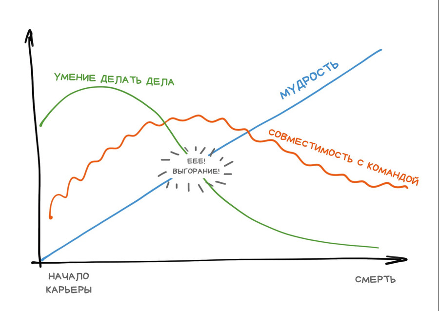
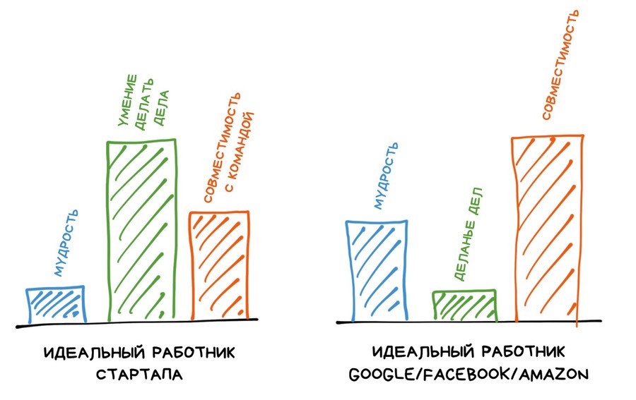
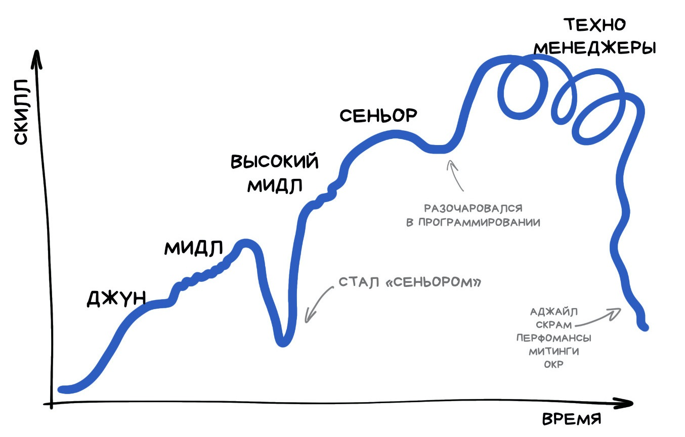
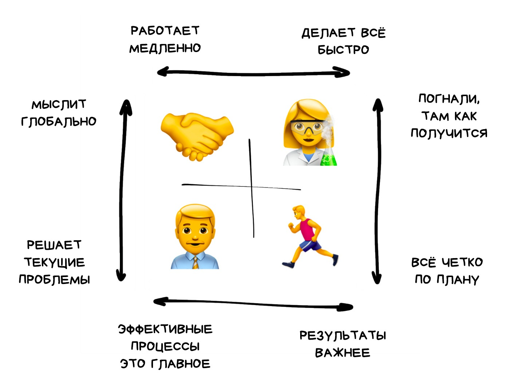
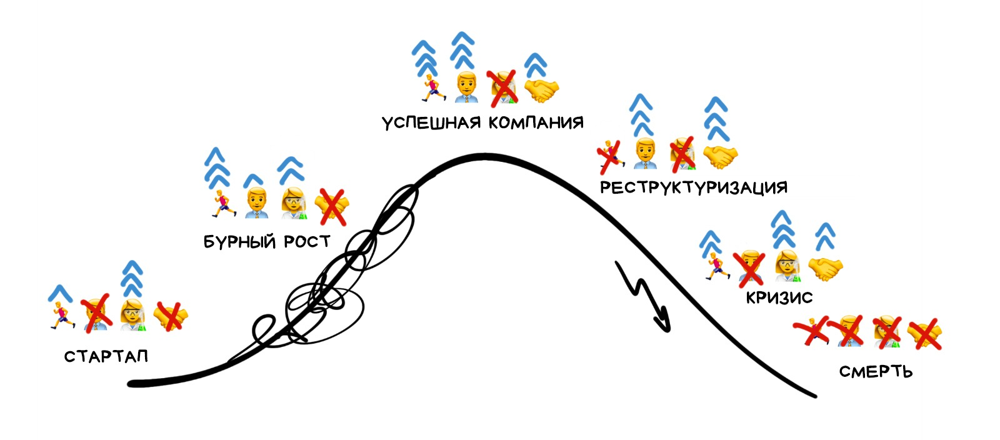

> References:
>
> https://vas3k.ru/inside/46/
>
> https://vas3k.ru/blog/team/

### Как нанимать нормальных людей

Крупняки на серьёзных щах выдумывают себе списки субъективных правил для найма, которые на деле выглядят как анекдот про «неудачники нам не  нужны». Поток желающих всё равно не иссякнет.

Цель любого интервью — принять бинарное решение «да»/«нет», и есть лишь  три качества в кандидате, на которые надо смотреть. Чувак не подходит  хотя бы по одному — сорян, до свидания. 

- Мудрость — это умение рассуждать, задавать вопросы, анализировать аргументы,  не делать поспешных выводов, видеть плюсы и минусы решений, процессов,  фреймворков.

- Умение делать дела - чем моложе и свежее проект — тем больше ему нужны люди, умеющие за  неделю на коленке нафигачить стартап. Старым и стабильным проектам  наоборот: чем меньше люди фигачат фичи и больше думают о логике — тем  лучше.

  Определить умение делать дела просто — по прямоте ответов на задаваемые вопросы и пресловутым «горящим глазам». 

  У умения делать дела есть неприятная особенность: оно уменьшается с ростом мудрости.

- Совместимость с командой

  

---

Если ты задаёшь кандидату вопрос, на который есть однозначный ответ и ты его знаешь — это плохой вопрос. Правильная постановка вопроса — *«понять, умеет ли он»*.

Сеньор же к своим годам повидал столько, что 90% из него он уже тупо забыл.

---

### Структура хорошего тех-интервью

##### Шаг 1. Рассказ о компании, продукте, задачах и планах

Лучше всего с ним справляется продукт-оунер (или кто там у вас по  скраму), но техлиды иногда тоже неплохо продают. Подойдет простая  домашняя заготовка на пять минут вида:

- Мы в %company_name% занимаемся тем-то
- Наша команда делает то-то для того-то (чтобы стало понятно зачем)
- Нас N человек, из которых M разработчиков, и.т.д. (команда и процессы)
- Мы пишем всё на %language_name% с использованием %framework_name% и %database_name% (описание стека)
- Сейчас ищем новых людей чтобы то-то (планы и понимание что будем пилить)

##### Шаг 2. «Расскажи о себе»

Во-первых, ради  банального знакомства и дальнейших вопросов по резюме. Во-вторых, что  важнее, для проверки первичных софт-скиллов:

- Я Олег, пишу на том-то столько-то лет
- Сейчас работаю в %company_name%, занимаюсь тем-то (рассказ о настоящем)
- Мы всё делаем на том-то с использованием вон той модной хрени (текущий стек)
- Раньше я занимался тем-то и сделал то-то (рассказ о прошлом и опыте работы)
- Мы делали то-то, а потом то-то, а самое крутое было то-то (более общий технический бекграунд)

##### Шаг 3. Смоллтолк за жизнь и технологии

- Какой твой любимый язык или фреймворк? Теперь расскажи его минусы.
- Почему вообще программируешь и что тебя драйвит?
- Ты сеньор и можешь дать один совет себе джуну 10-20 лет назад. Какой он будет?

##### Шаг 4. Настоящая задачка

Когда контакт установлен, можно бомбить заданиями. Обычно время есть на одно максимум.

- **Давать упрощенную версию задачи, которую сами недавно решали.** Кандидат сразу понимает чем занимается команда, а  команда видит насколько кандидату это интересно. Проходит в режиме  диалога: как бы ты решал? А какие ограничения? А что тут использовал бы?
- **Как бы ты спроектировал продукт, похожий на наш.** Можно взять похожий продукт конкурентов и вместе разобрать.
- **Вот пул-реквест, сделанный одним из наших джуниоров. Сделайте код-ревью.** Кандидат видит реальный проект, а интервьюер умение читать, писать, обсуждать код без фанатизма и истерик.
- **Расскажи о неоптимальном архитектурном решении в одном из твоих прошлых проектов и почему оно было принято.** Инженер должен уметь принимать и обсуждать неоднозначные решения.

##### Шаг 5. Тестовое на дом (если хочется)

Наличие кода на гитхабе заменяет тестовое на 100%

##### Шаг 6. Вопросы от кандидата

---

### Этапы эволюции проекта

Новый цикл эволюции проекта — как новая карта в RPG. Резко меняется  количество ресурсов, типы юнитов, их мотивация и цели всего похода. Понимать это головой сложно, потому что эволюция идёт медленно и не заметна глазу. 

#### Стартап

Хороший стартап понимает, что завтра может сдохнуть (и в 99.999% так и  будет). Самое плохое, что можно тут сделать — начать думать на долгий  срок — строить процессы, писать документацию, размышлять о миллионах,  и.т.д. Потому тут нужны люди, понимающие и одобряющие такой  «распиздяйский» подход.

Кучка гипермотивированных чуваков. Бюрократии нет, но и процессов тоже.

Больше делаем, меньше думаем.

#### Цикл роста

Стартап превратился в продукт, который зарабатывает и растёт. Начинается цикл роста, который является по сути метанием между двумя состояниями — «фигачим новую фичу» (опять как стартап) и «стабилизируем успех».

Тут уже можно писать документацию, отдавать технические долги.

Отваливаются выгорающие, приходят новые, но чуть менее мотивированные  чуваки. Появляется бюрократия, но пока в разумных пределах. 

Делаем и думаем пополам.

#### Успешная компания

Стабильность. Никто не хочет ничего менять.

Как правило на этом этапе из членов «старой» команды остаётся один-два  человека. Остальные отваливаются из-за невыносимой бюрократии.

Ничего не делаем и не меняем, сидим ~~думоем~~ строим бюрократию.

#### Реорганизация

Все вокруг токсят и скроллят линкедин. 

Вроде как что-то делаем, но пока в основном думаем и объясняем бюрократам необходимость перемен. Они не верят.

Это — время менеджеров. 

#### Цикл кризиса

Команда обычно меняется полностью вплоть до  менеджмента. Старые члены стали такими токсичными, что с ними невозможно даже разговаривать. 

Зато наконец-то отступает бюрократия, что возвращает всех во времена стартапа.

Много делаем, пофиг что менять, главное — выжить.

### Уровни персонажей

#### Джун

Минимально жизнеспособный персонаж. Знает базовые алгоритмы и может решить задачу, если кто-то расскажет ему как. 

Стажер не умеет и не знает, а джун — знает, но еще не умеет.

Самое важное в джуне — «горящие глаза», желание учиться и умение копать базовые штуки для вашей области.

#### Мидл

Самостоятельный юнит, который может решить любую поставленную  техническую задачу. Способен задавать правильные вопросы и приносить  работающие решения. Знает пицот языков и фреймворков, потому что всё еще считает программирование самым важным этапом разработки.

Он уже знает и уже умеет, но не знает куда грести. Когда ему не говорят что делать — он начинает заниматься всякой фигнёй типа замены либ на более модные.

мидл — это последний уровень, который можно собеседовать исключительно по хард-скиллам.

####  Сеньор

Автономный персонаж с опытом, личной экспертизой и софт-скиллами. 

Сеньор — это уже не столько про умение программировать, сколько степень зрелости человека как инженера. 

#### Лид

Сеньор, который уже полностью абстрагировался от написания кода, хотя и может, если надо. 

Исключительно по софт-скиллам и культурной совместимости как это делает Google на culture fit интервью.

Самое важное — чтобы лида приняла команда.

#### Принципал-Стаф-Феллоу-etc

Дальше в любой компании идёт длинный хвост лидов-над-лидами и техно-менеджеров.

Если лид еще может иногда пописывать код, то у принципал инженера на это просто нет времени. Да и платят ему уже давно не за код. Дальнейший рост привязан исключительно к иерархии внутри компании, потому его по сути и нет.

### Четыре базовых класса

###🏃‍ Деятель

Как шахтёр или строитель. Он просто делает то, что нужно делать.

Увидев список тасков в жире он берёт верхний и начинает его делать.  Потом берет следующий. Не всегда быстро, но таков путь. Обычно  самые говноустойчивые люди в команде и увольняются последними.

Неорганизованность считает распиздяйством.

Перманентно пребывает в одном из двух состояний — либо завален работой по уши, либо он выгорел и сидит в депрессии.

###👩‍🔬 Экспериментатор

Каждое утро он начинает с мысли, что пора переписать всё с нуля.

Стабильность для него смерть. В крупных компаниях задерживается редко.

Вдохновлять других, внедрять новые идеи, не давать продукту закостенеть в устаревших технологиях.

### 👨‍💼 Бюрократ

Процессы превыше всего, а результат по его мнению придёт, если делать всё правильно и терпеть.

Наводить порядок и налаживать процессы. Защищать продукт от необдуманных телодвижений. Документация, структуризация и разбор технического долга.

Бюрократы помогают сохранить систему в целом, при этом испортив жизнь всем её частям по отдельности.

### 🤝 Интегратор

Помните того весельчака, который пишет весьма средненький код, но имеет  друзей во всех командах, постоянно всем отвечает в слаке, завел канал с  мемами и постоянно ходит по митапам и конференциям?

В моменты реструктуризации и кризиса интеграторы выходят на первый план. Они объединяют оставшихся и интегрируют новеньких. 

### Сила — в сочетании

🧑‍🚀 Стартапер = 🏃‍♂️ Хуятор + 👩‍🔬 Экспериментатор

Он решает проблемы быстрее, чем остальные успевают их вообще понять.

👮‍♂️ Опричник = 👨‍💼 Бюрократ + 🤝 Интегратор

Часто обитает в службах безопасности (ИБ). Там, где не надо ничего производить, но нужно всеми силами охранять. 

👷‍♀️ Архитектор = 👩‍🔬 Экспериментатор + 👨‍💼 Бюрократ

Дай архитектору большую исследовательскую задачу — он закроется в  комнате на неделю и вынесет оттуда чёткий план действий или архитектуры  проекта. Делать он его не будет, конечно, он же не Хуятор. Хотя может прокачать этот скилл.

🦸‍♂️ Траблшутер = 👩‍🔬 Экспериментатор + 🤝 Интегратор

Только решая чужие проблемы он чувствует себя удовлетворённым.

Лидер — тот, кто сочетает не два, а сразу три базовых класса.

