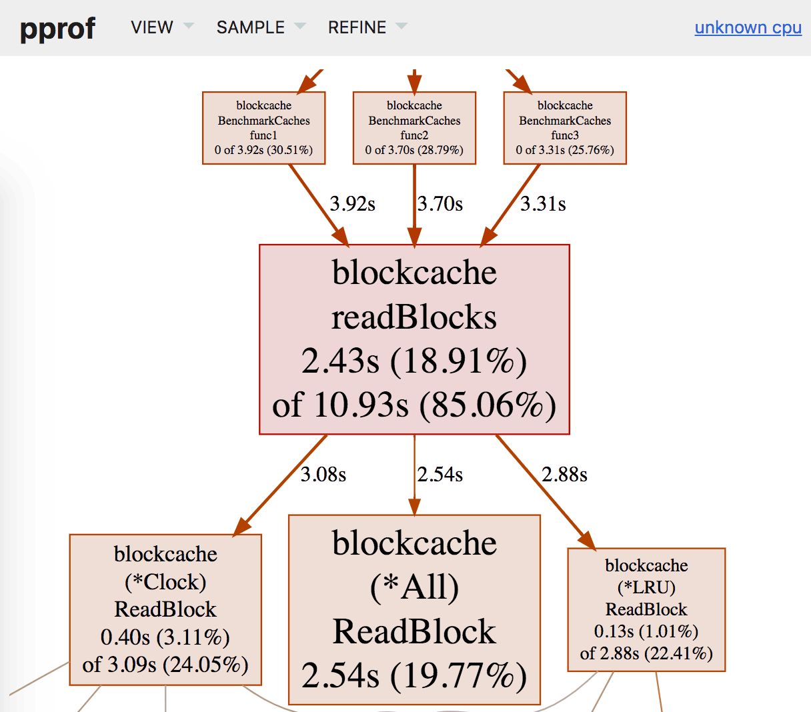

## Profiling Go Programs

> References:
> https://blog.intelligentbee.com/2017/08/01/profiling-web-applications-golang/
> https://blog.golang.org/pprof
> https://jvns.ca/blog/2017/09/24/profiling-go-with-pprof
> https://blog.gopheracademy.com/advent-2017/go-execution-tracer
> https://making.pusher.com/go-tool-trace


In order to use the profiling tool, you need to import the `net/http/pprof` package and register routes.

```go
func main() {
	// Create a new HTTP multiplexer
	mux := http.NewServeMux()
 
	// Register our handler for the / route
	mux.HandleFunc("/", handler)
 
	// Add the pprof routes
	mux.HandleFunc("/debug/pprof/", pprof.Index)
	mux.HandleFunc("/debug/pprof/cmdline", pprof.Cmdline)
	mux.HandleFunc("/debug/pprof/profile", pprof.Profile)
	mux.HandleFunc("/debug/pprof/symbol", pprof.Symbol)
	mux.HandleFunc("/debug/pprof/trace", pprof.Trace)
 
	mux.Handle("/debug/pprof/block", pprof.Handler("block"))
	mux.Handle("/debug/pprof/goroutine", pprof.Handler("goroutine"))
	mux.Handle("/debug/pprof/heap", pprof.Handler("heap"))
	mux.Handle("/debug/pprof/threadcreate", pprof.Handler("threadcreate"))
 
	// Start listening on port 8080
	if err := http.ListenAndServe(":8080", mux); err != nil {
		log.Fatal(fmt.Sprintf("Error when starting or running http server: %v", err))
	}
}
```

So you will need to run the profiling tool:

`go tool pprof -seconds 30 myserver http://localhost:8080/debug/pprof/profile`

While that’s running, run the benchmark:

`ab -k -c 8 -n 100000 "http://127.0.0.1:8080/"`

You can run commands to show you how much of CPU time each function took and other useful information, for example `top5`, `web`, `list`.

##### Profile memory:

`go tool pprof -alloc_objects myserver http://localhost:8080/debug/pprof/heap`

You can type `help` for a full list of commands.

- top

```
(pprof) top
Showing nodes accounting for 709.47MB, 99.09% of 715.96MB total
Dropped 35 nodes (cum <= 3.58MB)
      flat  flat%   sum%        cum   cum%
  697.38MB 97.41% 97.41%   697.38MB 97.41%  github.com/example/code/orders.(*Order).Process
    9.08MB  1.27% 98.67%   706.47MB 98.67%  github.com/example/code/orders.update
       3MB  0.42% 99.09%     5.50MB  0.77%  github.com/example/code/orders.All
         0     0% 99.09%   711.97MB 99.44%  github.com/example/code/orders.PreloadOrders.func1
```
- list update
```
(pprof) list update
Total: 715.96MB
ROUTINE ======================== github.com/example/code/orders.update in /Users/example/go/src/github.com/example/code/orders/order.go
    9.08MB   706.47MB (flat, cum) 98.67% of Total
         .          .     88:	for _, order := range order {
         .          .     89:		if order.ID > 0 {
.....
         .          .    103:
         .          .    104:	Mu.Lock()
```

- web

Generates an svg image, for example:



If your Go process is using a large amount of virtual memory (VSZ) but the heap is small, it means that your host or pod has more memory available than is actually needed by the  process.

For example, this worker using ~400mb of memory, which is the reserved amount:

```perl
PID  PPID USER     STAT   VSZ %VSZ CPU %CPU COMMAND
1     0   root     S     402m   1%   0   0% /usr/local/bin/worker
```

But If we look at the details, the high watermark for resident set (VmHWM) is ~231mb

```makefile
grep -i vm /proc/1/status

VmPeak:   409156 kB
VmSize:   407856 kB
...
VmHWM:    231548 kB
VmRSS:    212404 kB
```

Reserved memory for a pod should be set using the high watermark after performing a load test of the service with some (~20%) buffer added.
