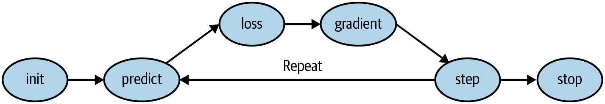
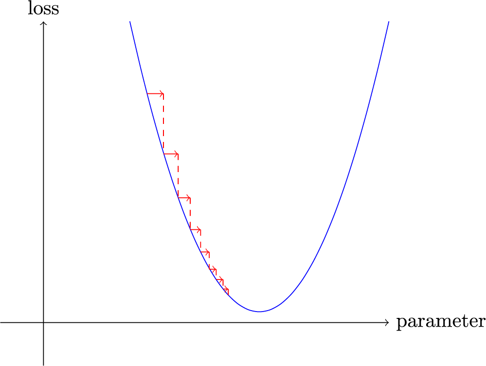

# The fastai book

> References:
>
> https://github.com/fastai/fastbook
>
> https://learning.oreilly.com/library/view/deep-learning-for/9781492045519/


*Deep learning* is a computer technique to extract and transform data—with use cases ranging from human speech recognition to animal imagery classification—by using multiple layers of neural networks. Each of these layers takes its inputs from previous layers and progressively refines them. The layers are trained by algorithms that minimize their errors and improve their accuracy.

Training a machine learning model:

Detailed training loop:


A classification model is one that attempts to predict a class, or category. That is, it’s predicting from a number of discrete possibilities, such as “dog” or “cat.”

A *regression model* is one that attempts to predict one or more numeric quantities, such as a temperature or a location.

Example of overfitting:


A *metric* is a function that measures the quality of the model’s predictions using the validation set, and will be printed at the end of each epoch:

-  `error_rate`tells you what percentage of images in the validation set are being classified incorrectly.
-  `accuracy` (which is just `1.0 - error_rate`)

---

*Fine-tuning* - A transfer learning technique that updates the parameters of a pretrained model by training for additional epochs using a different task from that used for pretraining:

1. Use one epoch to fit just those parts of the model necessary to get the new random head to work correctly with your dataset.
2. Use the number of epochs requested when calling the method to fit the entire model, updating the weights of the later layers (especially the head) faster than the earlier layers (which, as we’ll see, generally don’t require many changes from the pretrained weights).

The *head* of a model is the part that is newly added to be specific to the new dataset. An *epoch* is one complete pass through the dataset.

---

*Machine learning* is a discipline in which we define a program not by writing it entirely ourselves, but by learning from data.

*Deep learning* is a specialty within machine learning that uses *neural networks* with multiple *layers*.

*Image classification* is a representative example. We start with *labeled data*—a set of images for which we have assigned a *label* to each image, indicating what it represents. Our goal is to produce a program, called a *model*, that, given a new image, will make an accurate *prediction* regarding what that new image represents.

Every model starts with a choice of *architecture*, a general template for how that kind of model works internally. The process of *training* (or *fitting*) the model is the process of finding a set of *parameter values* (or *weights*) that specialize that general architecture into a model that works well for our particular kind of data. To define how well a model does on a single prediction, we need to define a *loss function*, which determines how we score a prediction as good or bad.

To make the training process go faster, we might start with a *pretrained model*—a model that has already been trained on someone else’s data. We can then adapt it to our data by training it a bit more on our data, a process called *fine-tuning*.

When we train a model, a key concern is to ensure that our model *generalizes*: it learns general lessons from our data that also apply to new items it will encounter, so it can make good predictions on those items. The risk is that if we train our model badly, instead of learning general lessons, it effectively memorizes what it has already seen, and then it will make poor predictions about new images. Such a failure is called *overfitting*.

To avoid this, we always divide our data into two parts, the *training set* and the *validation set*. We train the model by showing it only the training set, and then we evaluate how well the model is doing by seeing how well it performs on items from the validation set. In this way, we check if the lessons the model learns from the training set are lessons that generalize to the validation set. In order for a person to assess how well the model is doing on the validation set overall, we define a *metric*. During the training process, when the model has seen every item in the training set, we call that an *epoch*.

---

*categorical* (contain values that are one of a discrete set of choices, such as `occupation`) versus *continuous* (contain a number that represents a quantity, such as `age`).

---

Split our dataset into two sets: the *training set* (which our model sees in training) and the *validation set*, also known as the *development set* (which is used only for evaluation). Introduce another level of even more highly reserved data: the *test set*.

---

Computer vision:

- recognize items in an image at least as well as people can - object recognition
- where objects in an image are, and can highlight their locations and name each found object - object detection
- synthetically generate variations of input images, such as by rotating them or changing their brightness and contrast - data augmentation

---

In a cell, typing `?func_name` - the signature of the function and a short description.

In a cell, typing `??func_name` - the signature of the function, a short description, and the source code.

If you are using the fastai library: `doc(*func_name*)` in a cell will open a window with the signature of the function, a short description, and links to the source code on GitHub and the full documentation of the function in the [library docs](https://docs.fast.ai).

Type `%debug` in the next cell and execute to open the [Python debugger](https://oreil.ly/RShnP), which will let you inspect the content of every variable.

---

`DataLoaders` is a thin class that just stores whatever `DataLoader` objects you pass to it and makes them available as `train` and `valid`.

```
class DataLoaders(GetAttr):
    def __init__(self, *loaders): self.loaders = loaders
    def __getitem__(self, i): return self.loaders[i]
    train,valid = add_props(lambda i,self: self[i])
```

---

*Data augmentation* refers to creating random variations of our input data, such that they appear different but do not change the meaning of the data. Examples of common data augmentation techniques for images are rotation, flipping, perspective warping, brightness changes, and contrast changes.

---

```
interp = ClassificationInterpretation.from_learner(learn)
interp.plot_confusion_matrix()
```


Therefore, the diagonal of the matrix shows the images that were classified correctly, and the off-diagonal cells represent those that were classified incorrectly. 

---

When we use a model for getting predictions, instead of training, we call it *inference*.

---

Creating a Notebook App from the Model

- IPython widgets (ipywidgets) - GUI components
- Voilà

---

Cells that begin with a `!` do not contain Python code, but instead contain code that is passed to your shell (bash, Windows PowerShell, etc.).

---

*rank* is the number of axes or dimensions in a tensor; *shape* is the size of each axis of a tensor.

---

Two main ways to measure distance in this context:

- Take the mean of the *absolute value* of differences (absolute value is the function that replaces negative values with positive values). This is called the *mean absolute difference* or *L1 norm*.
- Take the mean of the *square* of differences (which makes everything positive) and then take the *square root* (which undoes the squaring). This is called the *root mean squared error* (RMSE) or *L2 norm*.

The difference between L1 norm and mean squared error (MSE) is that the latter will penalize bigger mistakes more heavily than the former (and  be more lenient with small mistakes).

##### NumPy Arrays and PyTorch Tensors

A NumPy array is a multidimensional table of data, with all items of the same type. Since that can be any type at all, they can even be arrays of arrays, with the innermost arrays potentially being different sizes—this is called a *jagged array*.

A PyTorch tensor is nearly the same thing as a NumPy array, but with an additional restriction - a tensor cannot use just any old type—it has to use a single basic numeric type for all components, a PyTorch tensor cannot be jagged. 

```
data = [[1,2,3],[4,5,6]]
arr = array (data)
tns = tensor(data)
```

Broadcasting - automatically expand the tensor with the smaller rank to have the same size as the one with the larger rank.

---

##### Stochastic Gradient Descent



1. Initialize the weights.
1. For each image, use these weights to *predict* whether it appears to be a 3 or a 7.
1. Based on these predictions, calculate how good the model is (its *loss*).
1. Calculate the *gradient*, which measures for each weight how changing that weight would change the loss.
1. Step (that is, change) all the weights based on that calculation.

Increase the weight by a small amount, and see if the loss goes up or down.

1. Go back to step 2 and *repeat* the process.
2. Iterate until you decide to *stop* the training process (for instance, because the model is good enough or you don’t want to wait any longer).

---

Calculating Gradients

The key point about a derivative is this: for any function, such as the quadratic function we saw in the previous section, we can calculate its derivative. The derivative is another function. It calculates the change, rather than the value. For instance, the derivative of the quadratic function at the value 3 tells us how rapidly the function changes at the value 3.

The gradients tell us only the slope of our function; they don’t tell us exactly how far to adjust the parameters. But they do give us some idea of how far: if the slope is very large, that may suggest that we have more adjustments to do, whereas if the slope is very small, that may suggest that we are close to the optimal value.



---

The `sigmoid` function always outputs a number between 0 and 1. It’s defined as  follows:

```python
def sigmoid(x): return 1/(1+torch.exp(-x))
```

---

The key difference is that the metric is to drive human understanding and the loss is to drive automated learning. To drive automated learning, the loss must be a function that has a meaningful derivative. It can’t have big flat sections and large jumps, but instead must be reasonably smooth.

---

##### SGD and Mini-Batches

we calculate the average loss for a few data items at a time. This is called a *mini-batch*. The number of data items in the mini-batch is called the *batch size*.

---

A neural network contains a lot of numbers, but they are only of two types: numbers that are calculated, and the parameters that these numbers are calculated from:

- Activations - Numbers that are calculated (both by linear and nonlinear layers)
- Parameters - Numbers that are randomly initialized, and optimized (that is, the numbers that define the model)

Our activations and parameters are all contained in *tensors*. These are simply regularly shaped arrays—for example, a matrix. Matrices have rows and columns; we call these the *axes* or *dimensions*. The number of dimensions of a tensor is its *rank*. There are some special tensors:
- Rank-0: scalar
- Rank-1: vector
- Rank-2: matrix

---

| Term             | Meaning                                                      |
| ---------------- | ------------------------------------------------------------ |
| ReLU             | Function that returns 0 for negative numbers and doesn’t change positive numbers. |
| Mini-batch       | A small group of inputs and labels gathered together in two  arrays. A gradient descent step is updated on this batch (rather than a  whole epoch). |
| Forward pass     | Applying the model to some input and computing the predictions. |
| Loss             | A value that represents how well (or badly) our model is doing. |
| Gradient         | The derivative of the loss with respect to some parameter of the model. |
| Backward pass    | Computing the gradients of the loss with respect to all model parameters. |
| Gradient descent | Taking a step in the direction opposite to the gradients to make the model parameters a little bit better. |
| Learning rate    | The size of the step we take when applying SGD to update the parameters of the model. |

### Image Classification


### Tabular Modeling

Continuous variables are numerical data, such as “age,” that can be  directly fed to the model, since you can add and multiply them directly. Categorical variables contain a number of discrete levels, such as  “movie ID,” for which addition and multiplication don’t have meaning  (even if they’re stored as numbers).

Recent studies have shown that the vast majority of datasets can be best modeled with just two methods:

- Ensembles of decision trees (i.e., random forests and gradient boosting machines), mainly for structured data (such as you might find  in a database table at most companies)

- Multilayered neural networks learned with SGD (i.e., shallow and/or deep learning), mainly for unstructured data (such as audio, images, and natural language)

#### Decision Trees


---

Replace every date column with a set of date metadata columns, such as holiday, day of week, and month. 

---

Handle strings and missing data with TabularPandas - `procs = [Categorify, FillMissing]`

---

Creating the Decision Tree


The top node represents the *initial model* before any splits have been done, when all the data is in one group. This is the simplest possible model. It is the result of asking zero questions and will always predict the value to be the average value of the whole dataset.

The bottom row contains our *leaf nodes*: the nodes with no answers coming out of them, because there are no more questions to be answered.

Bagging:

1. Randomly choose a subset of the rows of your data (i.e., “bootstrap replicates of your learning set”).
2. Train a model using this subset.
3. Save that model, and then return to step 1 a few times.
4. This will give you multiple trained models. To make a prediction, predict using all of the models, and then take the average of each of those model’s predictions.

---

Models with the lowest error result from using a subset of features but with a larger number of trees:


---

The OOB error is a way of measuring prediction error in the training  dataset by including in the calculation of a row’s error trees only  where that row was *not* included in training. This allows us to see whether the model is overfitting, without needing a separate validation set.

---

The OOB score is a number returned by sklearn that ranges between 1.0 for a perfect model and 0.0 for a random model.

---

Partial dependence plots try to answer the question: if a row varied on nothing other than the feature in question, how would it impact the dependent variable?

```go
from sklearn.inspection import plot_partial_dependence

fig,ax = plt.subplots(figsize=(12, 4))
plot_partial_dependence(m, valid_xs_final, ['YearMade','ProductSize'], grid_resolution=20, ax=ax);
```


We can see a nearly linear relationship between year and price.

---

```
!pip install treeinterpreter
!pip install waterfallcharts

prediction,bias,contributions = treeinterpreter.predict(m, row.values)
```

`prediction` is the prediction that the random forest makes. `bias` is the prediction based on taking the mean of the dependent variable (i.e., the *model* that is the root of every tree). `contributions` tells us the total change in prediction due to each of the independent variables. 


#### Ensembling

Why random forests work so well: each tree has errors, but those errors are not correlated with each other, so the average of those errors should tend toward zero once there are enough trees. 

We can then include a random forest in *another* ensemble—an ensemble of the random forest and the neural network.

#### Boosting

*Boosting*, where we add models instead of averaging them:

1. Train a small model that underfits your dataset.
2. Calculate the predictions in the training set for this model.
3. Subtract the predictions from the targets; these are called the *residuals* and represent the error for each point in the training set.
4. Go back to step 1, but instead of using the original targets, use the residuals as the targets for the training.
5. Continue doing this until you reach a stopping criterion, such as a  maximum number of trees, or you observe your validation set error  getting worse.

*Gradient boosting machines* (GBMs) and *gradient boosted decision trees* (GBDTs). *XGBoost* is the most popular.
