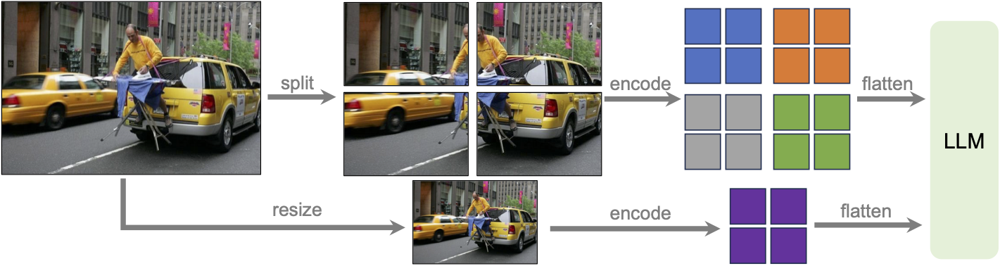
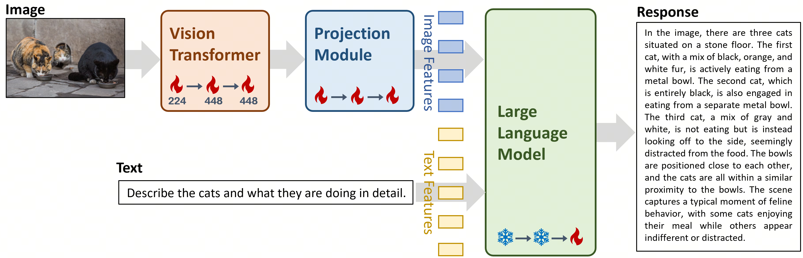
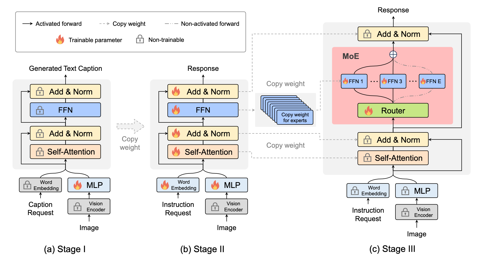

### LLaVA

> https://llava-vl.github.io
> https://github.com/haotian-liu/LLaVA
> https://huggingface.co/liuhaotian

LLaVa connects pre-trained [CLIP ViT-L/14](https://openai.com/research/clip) visual encoder and large language model [Vicuna](https://github.com/lm-sys/FastChat), using a simple projection matrix. 

LLaVA-1.5 uses Llama 2.

LLaVA-1.6 uses:

- NousResearch/Nous-Hermes-2-Yi-34B
- lmsys/vicuna-13b-v1.5
- lmsys/vicuna-7b-v1.5
- mistralai/Mistral-7B-Instruct-v0.2

Compared with LLaVA-1.5, LLaVA-1.6 has several improvements:

1. **Increasing the input image resolution** to 4x more  pixels. This allows it to grasp more visual details. It supports three  aspect ratios, up to 672x672, 336x1344, 1344x336 resolution.
2. **Better visual reasoning and OCR capability** with an improved visual instruction tuning data mixture.
3. **Better visual conversation for more scenarios**, covering different applications. Better world knowledge and logical reasoning.
4. **Efficient deployment and inference** with [SGLang](https://github.com/sgl-project/sglang).

##### Detailed Technical Improvement

- Dynamic High Resolution



- Data Mixture
  - High-quality User Instruct Data: 
    - (1) Existing GPT-V data. LAION-GPT-V and ShareGPT-4V. 
    - (2) A small 15K visual instruction tuning dataset covering different applications.
  - Multimodal Document/Chart Data:
    - (1) We remove [TextCaps](https://textvqa.org/textcaps/) from our training data and replace TextCaps with DocVQA and SynDog-EN.
    - (2) Motivated by [Qwen-VL-7B-Chat](https://huggingface.co/Qwen/Qwen-VL), we further add ChartQA, DVQA, and AI2D for better chart and diagram understanding.

### BakLLaVA-1

> https://github.com/SkunkworksAI/BakLLaVA
> https://huggingface.co/SkunkworksAI/BakLLaVA-1

BakLLaVA 1 is a Mistral 7B base augmented with the LLaVA 1.5 architecture.

### Yi VL

> https://huggingface.co/01-ai/Yi-VL-34B
> https://github.com/01-ai

##### Features

- Multi-round text-image conversations: Yi-VL can take both text and images as inputs and produce text outputs.
- 448×448 resolution

##### Architecture

- Yi-VL adopts the [LLaVA](https://github.com/haotian-liu/LLaVA) architecture
  - Vision Transformer (ViT) [CLIP ViT-H/14 model](https://huggingface.co/laion/CLIP-ViT-H-14-laion2B-s32B-b79K) and used for image encoding.
  - Projection Module: two-layer Multilayer Perceptron (MLP) with layer normalizations.
  - LLM: Yi-34B-Chat and Yi-6B-Chat



##### Training

- Stage 1: The parameters of ViT and the projection module are  trained using an image resolution of 224×224. The LLM weights are  frozen. The training leverages an image caption dataset comprising 100  million image-text pairs from [LAION-400M](https://laion.ai/blog/laion-400-open-dataset/). The primary objective is to enhance the ViT's knowledge acquisition  within our specified architecture and to achieve better alignment  between the ViT and the LLM.
- Stage 2: The image resolution of ViT is scaled up to 448×448, and the parameters of ViT and the projection module are trained. It aims to further boost the model's capability for discerning intricate visual  details. The dataset used in this stage includes about 25 million image-text pairs, such as [LAION-400M](https://laion.ai/blog/laion-400-open-dataset/), [CLLaVA](https://huggingface.co/datasets/LinkSoul/Chinese-LLaVA-Vision-Instructions), [LLaVAR](https://llavar.github.io/), [Flickr](https://www.kaggle.com/datasets/hsankesara/flickr-image-dataset), [VQAv2](https://paperswithcode.com/dataset/visual-question-answering-v2-0), [RefCOCO](https://github.com/lichengunc/refer/tree/master), [Visual7w](http://ai.stanford.edu/~yukez/visual7w/).
- Stage 3: The parameters of the entire model (that is, ViT,  projection module, and LLM) are trained. The primary goal is to enhance  the model's proficiency in multimodal chat interactions, thereby  endowing it with the ability to seamlessly integrate and interpret  visual and linguistic inputs. To this end, the training dataset  encompasses a diverse range of sources, totalling approximately 1  million image-text pairs, including [GQA](https://cs.stanford.edu/people/dorarad/gqa/download.html), [VizWiz VQA](https://vizwiz.org/tasks-and-datasets/vqa/), [TextCaps](https://opendatalab.com/OpenDataLab/TextCaps), [OCR-VQA](https://ocr-vqa.github.io/), [Visual Genome](https://homes.cs.washington.edu/~ranjay/visualgenome/api.html), [LAION GPT4V](https://huggingface.co/datasets/laion/gpt4v-dataset) and so on. To ensure data balancing, we impose a cap on the maximum  data contribution from any single source, restricting it to no more than 50,000 pairs.

##### Hardware requirements 

- Yi-VL-6B: RTX 3090, RTX 4090, A10, A30
- Yi-VL-34B: 4 × RTX 4090, A800 (80 GB)

### MoE-LLaVA

> https://github.com/PKU-YuanGroup/MoE-LLaVA
> https://huggingface.co/LanguageBind

##### Highlights

- MoE-LLaVA-2.7B×4-Top2-384 using Phi2-2.7B
- MoE-LLaVA-2.7B×4-Top2 using Phi2-2.7B
- MoE-LLaVA-1.8B×4-Top2 using Qwen-1.8B
- MoE-LLaVA-1.6B×4-Top2-384 using StableLM-1.6B
- MoE-LLaVA-1.6B×4-Top2 using StableLM-1.6B

- The MoE-Tuning consists of three stages. 
  - In stage I, only the MLP is trained. 
  - In stage II, all parameters are trained except for the Vision Encoder (VE). 
  - In stage III, FFNs are used to initialize the experts in MoE, and only the MoE layers are trained. For each MoE layer, only two experts are activated for each token, while the other experts remain silent.



---

### IDEFICS

> https://www.latent.space/p/idefics
>
> https://huggingface.co/datasets/HuggingFaceM4/OBELICS
>
> https://huggingface.co/HuggingFaceM4/idefics-80b-instruct
>
> 

DeepMind was the first to create a SOTA multimodal model by taking a pre-existing LLM ([Chinchilla 80B ](https://arxiv.org/abs/2203.15556)) and pre-existing vision encoder ([CLIP](https://arxiv.org/abs/2103.00020)) and training a “glue” adapter layer, inspiring a generation of stunningly cheap and effective multimodal models including [LLaVA](https://x.com/ChunyuanLi/status/1710299381335798202?s=20), [BakLLaVA](https://github.com/SkunkworksAI/BakLLaVA) and [FireLLaVA](https://twitter.com/lqiao/status/1748243039766925351).

Based on [the excellent paper](https://storage.googleapis.com/deepmind-media/DeepMind.com/Blog/tackling-multiple-tasks-with-a-single-visual-language-model/flamingo.pdf), LAION stepped up to create [OpenFlamingo](https://laion.ai/blog/open-flamingo/), but it never scaled beyond 9B.

The M4 (audio + video +  image + text multimodality) research team at HuggingFace [announced](https://x.com/SanhEstPasMoi/status/1632775840135016448?s=20) an independent effort to reproduce Flamingo up to the full 80B scale.

IDEFICS is an Open Access Visual Language Model, available in [9B](https://huggingface.co/HuggingFaceM4/idefics-9b) and [80B](https://huggingface.co/HuggingFaceM4/idefics-80b) model sizes. As an attempt to re-create an open-access version of [Flamingo](https://arxiv.org/abs/2204.14198), it seems to track very well on a range of multimodal benchmarks.

IDEFICS was built by connecting two unimodal models together to provide the multi-modality you see showcased above:

- [Llama](https://huggingface.co/huggyllama/llama-65b) v1 for language (specifically [huggyllama/llama-65b](https://huggingface.co/huggyllama/llama-65b)) - the best available open model at the time, to be swapped for Mistral in the next version of IDEFICS
- [A CLIP](https://github.com/mlfoundations/open_clip) model for vision (specifically [laion/CLIP-ViT-H-14-laion2B-s32B-b79K](https://huggingface.co/laion/CLIP-ViT-H-14-laion2B-s32B-b79K) - after a brief exploration of [EVA-CLIP](https://huggingface.co/QuanSun/EVA-CLIP))

An Open Web-Scale Filtered Dataset of Interleaved Image-Text Documents:

- 115B text tokens
- 141M English documents
- 353M images

---

### Fuyu-8B

> https://huggingface.co/adept/fuyu-8b
>
> https://www.adept.ai/blog/adept-fuyu-heavy

For digital agents, UI understanding.

Fuyu is a vanilla decoder-only transformer with no specialized image encoder. Image patches are linearly projected directly into the first layer of the transformer, bypassing the embedding lookup. This simplified architecture supports arbitrary image resolutions, and dramatically simplifies both training and inference.

We simply treat the normal transformer decoder like an image transformer (albeit with no pooling and causal attention).

This simplification allows us to support arbitrary image resolutions. To accomplish this, we just treat the sequence of image tokens like the sequence of text tokens. We remove image-specific position embeddings and feed in as many image tokens as necessary in raster-scan order.

Fuyu can understand complex visual relationships, such as in the below  chart, where it has to trace connections between actors and shows and  count them to answer the question.

It can also answer nontrivial, multi-hop questions given traditional charts.

Fuyu can also understand documents — both complex infographics and old PDFs.

The model can understand complex relational queries about scientific diagrams.

---

### vistar: Guided Visual Search as a Core Mechanism in Multimodal LLMs

> https://vstar-seal.github.io
>
> https://huggingface.co/craigwu/seal_vqa_7b
>
> https://huggingface.co/craigwu/seal_vsm_7b


Show, Search and Tell (SEAL) framework is a general  meta-architecture for MLLMs.


It is comprised of a VQA LLM and a visual search model which collaborate and interact through the visual working memory (VWM).

The VQA LLM  first evaluates if the encoder's initial (global) visual  features suffice for answering the question. If not, it explicitly lists all the needed but missing information in the format of a list of  target objects. Then, it initializes a visual working memory (VWM). The  VWM has four blocks, the <question> block contains the initial  textual question; <global image> contains the initial image;  <searched targets> stores the target object crops after search;  and <target location> stores the coordinates of the searched  targets. Next, the visual search model searches over the image and  localizes each required target. A region containing the identified  target is then cropped from the whole image. The cropped targets, along  with their coordinates, are added to the VWM. After that, the VQA LLM  processes the data contained in the VWM to generate the response  accordingly.             

LLM-guided Visual Search - drawing inspiration from how humans utilize contextual scene and  top-down feature guidance in their visual search process, we've  incorporated similar concepts into the design of the visual search model in V.

Search algorithm A is designed  for pathfinding, aiming to identify the shortest route between a  starting point and a goal by using a heuristic to approximate the cost.

---

### Qwen-VL: A Versatile Vision-Language Model for Understanding, Localization, Text Reading, and Beyond

> https://arxiv.org/abs/2308.12966
>
> https://huggingface.co/Qwen
>
> https://github.com/QwenLM/Qwen-VL

Qwen-VL adopts a large language model as its foundation component. The model
is initialized with pre-trained weights from Qwen-7B.

The visual encoder of Qwen-VL uses the Vision Transformer (ViT) (Dosovitskiy et al., 2021) architecture, initialized with pre-trained weights from Openclip’s ViT-bigG (Ilharco et al., 2021). During both training and inference, input images are resized to a specific resolution. The visual encoder processes images by splitting them into patches with a stride of 14, generating a set of image features.

Position-aware Vision-Language Adapter.

Details of Qwen-VL model parameters: 

```
 Vision Encoder  VL Adapter  LLM   Total
     1.9B         0.08B     7.7B   9.6B
```

Image Input: Images are processed through the visual encoder and adapter, yielding fixed-length sequences of image features.

Bounding Box Input and Output: To enhance the model’s capacity for fine-grained visual understanding and grounding, Qwen-VL’s training involves data in the form of region descriptions, questions, and detections.
