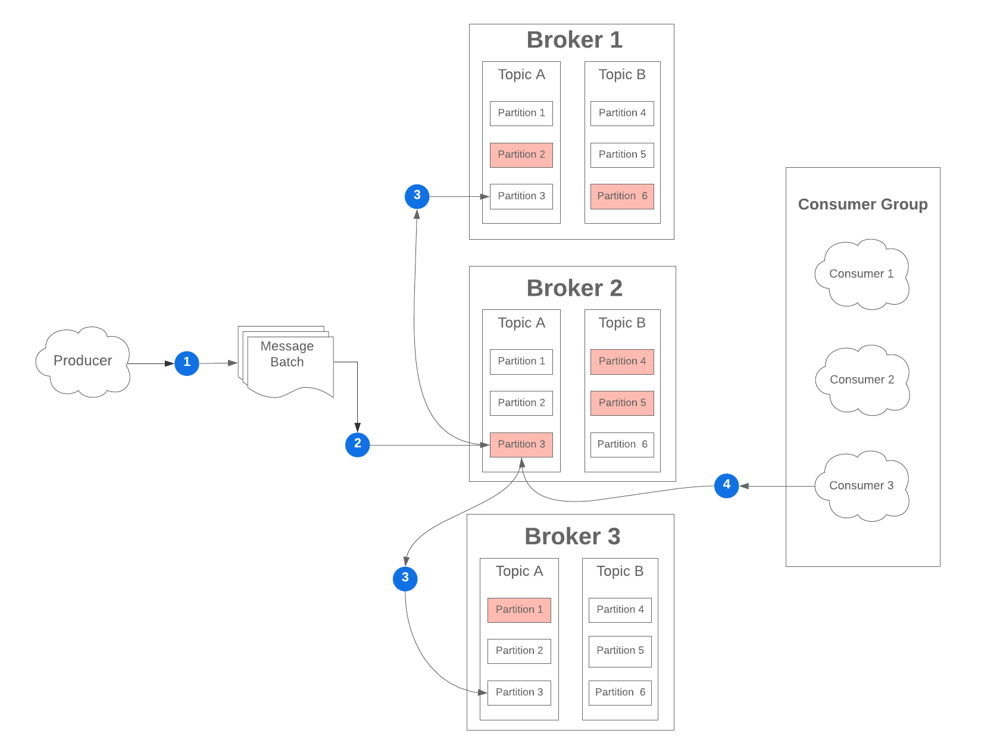

> References:
> - [I Heart Logs](https://www.confluent.io/ebook/i-heart-logs-event-data-stream-processing-and-data-integration/)
> - [Kafka: The Definitive Guide](https://www.confluent.io/resources/kafka-the-definitive-guide/)
> - [Making Sense of Stream Processing](https://www.confluent.io/stream-processing/)
> - [Designing Event Driven Systems](https://www.confluent.io/designing-event-driven-systems/)
> - [Kafka Streams In Action](https://www.confluent.io/blog/kafka-streams-action/)
> - [Designing Data Intensive Applications](https://www.oreilly.com/library/view/designing-data-intensive-applications/9781491903063/)
> - [Kafka In Action](https://www.manning.com/books/kafka-in-action)

##### Concepts:

- **Message** - A payload sent and stored in Kafka. A message can optionally contain custom headers and a key.
- **Topics** - A logical group of messages.
- **Partitions** - Disjoint divisions of topics stored and distributed across multiple brokers.
- **Brokers** - Servers on which topics/partitions are stored along with cluster, topic, and consumer group metadata.
- **Producers** - Services that write messages to Kafka.
- **Consumers** - Services that read messages from Kafka. These are usually logically arranged together in a "consumer group".
- **Consumer Group** - A set of consumers (defined by `group-id`) that reads messages. Each consumer may only belong to a single consumer group. **The number of consumers must NOT exceed the partition count**.

##### A message's lifecycle in a Kafka system:

1. A producer sends a batch of mesages to the Kafka cluster. A cluster can  be thought of as a group of Brokers, each one containing topics. The  reason messages are sent in batches instead of individually is to reduce latency and increase throughput.
1. The message batch is sent to a particular partition in a topic,  specified by the producer. As mentioned earlier, partitions contain  disjoint sets of messages within a particular topic. Every partition is  replicated across multiple brokers based on a **replication factor** configuration setting.
1. For each partition, one broker will be designated as the **leader** of that particular partition (colored red in the example), and that designation carries some important implications:
   - Every producer will only write **to** the leader partition
   - Each consumer will only read **from** the leader partition
   - Messages are copied to all replica partitions on each write to the leader for durability during a broker failure
1. A consumer within a consumer group will be assigned the partition  where the original message is copied and poll batches for processing.

**More details:**

- A producer publishes a message to a Kafka Topic
  - The message is appended to a partition of the Topic
    - Partitions are append only logs, and a topic represents a stream of messages over time
    - The key of the message is used to influence which partition in the topic the message is published to
      - This can help guarantee ordering for certain message types.
- A consumer group subscribes to a topic
  - Kafka begins tracking the Consumer Group Offset for the Consumer Group in this topic
    - The Topic Offset for the Consumer Group points to the next message to process in each partition of the topic
    - The starting offset is configurable
- Consumers within a Consumer Group begin consuming messages:
  - Consumers process messages from specific partitions
    - At most one consumer in the consumer group can process messages from a partition at any given time
    - Concurrency within a Consumer Group is based on the number of partitions.
      - Ex: 12 Partitions, 1 Consumer = 12 Partitions processed by a single node
      - Ex: 12 Partitions, 4 Consumers = 3 partitions processed by each consumer
      - Ex: 12 Partitions, 15 Consumers = 12 Partitions processed by 12 consumers, 3 consumers doing nothing
  - When processing is successful, the Consumer Group Offset for the partition is updated - the consumer receives the next message
  - When processing is unsuccessful, the offset is *not* updated. The message stays in the topic and the consumer group does not advance  to the next message on that partition until it's processed successfully.
- Message Retention is based on the configuration for the Topic.

##### Partition Configuration

Kafka achieves high throughput and fault-tolerance by splitting out each`Topic` into multiple `Partitions` that contain disjoint subsets of that `Topic`'s messages. These partitions are then replicated across one or more registered brokers in the Kafka cluster.

There are several factors to consider when configuring partitions, and  many of them are more relevant to the consumption of messages rather  than the production. However, since we are concerned with sending events to Kafka, it is important for us to know *how* Kafka will split  up our data. The official Kafka Producer API allows us to specify either a target partition for the message or a key for the message.

If producing without a `key`, messages are distributed to round-robin. If you do specify a `key` , the producer uses a consistent hashing algorithm to choose a partition.

##### Useful Tools For Kafka 

- [kafkacat](https://github.com/edenhill/kafkacat) - netcat for Kafka
- [Conduktor](https://www.conduktor.io/) - GUI management/dashboard tool for Kafka clusters
- [Confluent Operator](https://docs.confluent.io/current/installation/operator/index.html) - Kubernetes Confluent Operator for Kafka
- [cruise-control](https://github.com/linkedin/cruise-control) - Self healing and partition rebalancing for Kafka brokers
- [Burrow](https://github.com/linkedin/Burrow) - Lag monitoring for Kafka offsets and processing

