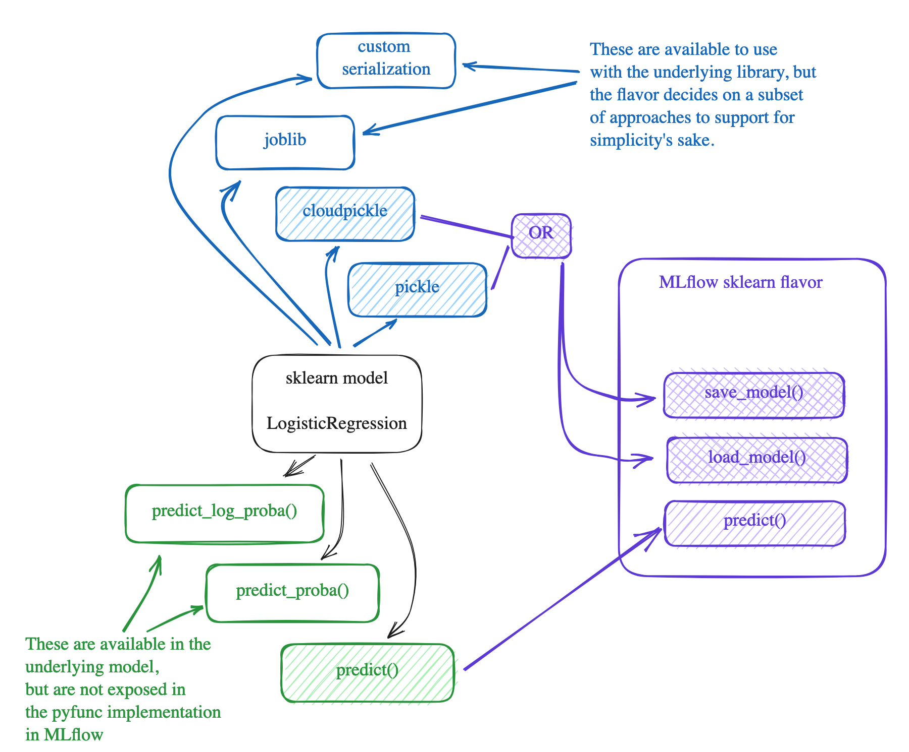
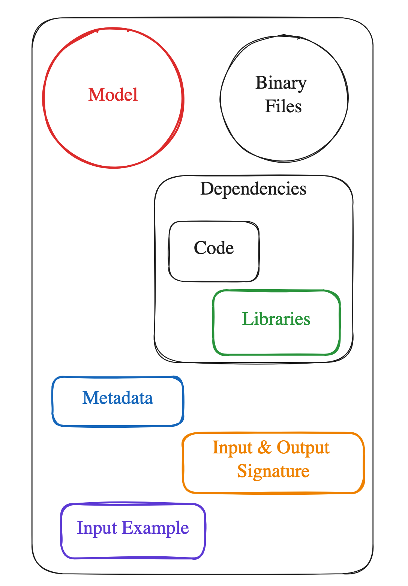
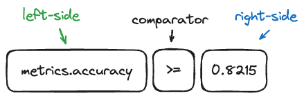

## MLflow

> https://mlflow.org/docs/latest/index.html

A Tool for Managing the Machine Learning Lifecycle.

#### Core Components of MLflow

- [Tracking](https://mlflow.org/docs/latest/tracking.html#tracking): MLflow Tracking provides both an API and UI dedicated to the logging of parameters, code versions, metrics, and artifacts during the ML  process. This centralized repository captures details such as  parameters, metrics, artifacts, data, and environment configurations.
- [Model Registry](https://mlflow.org/docs/latest/model-registry.html#registry): handling different versions of models, discerning their current  state, and ensuring smooth productionization. It offers a centralized  model store, APIs, and UI to collaboratively manage an MLflow Model’s  full lifecycle, including model lineage, versioning, aliasing, tagging,  and annotations.
- [MLflow Deployments for LLMs](https://mlflow.org/docs/latest/llms/deployments/index.html#deployments): unified  interface, bolstering security through authenticated access, and offers a common set of APIs for prominent LLMs.
- [Evaluate](https://mlflow.org/docs/latest/models.html#model-evaluation): set of tools facilitates  objective model comparison, be it traditional ML algorithms or  cutting-edge LLMs.
- [Prompt Engineering UI](https://mlflow.org/docs/latest/llms/prompt-engineering/index.html#prompt-engineering): UI-centric  component provides a space for prompt experimentation, refinement,  evaluation, testing, and deployment.
- [Recipes](https://mlflow.org/docs/latest/recipes.html#recipes): focused on ensuring functional end results  optimized for real-world deployment scenarios.
- [Projects](https://mlflow.org/docs/latest/projects.html#projects): standardize the packaging of ML code, workflows, and  artifacts, akin to an executable. Each project, be it a directory with  code or a Git repository, employs a descriptor or convention to define  its dependencies and execution method.

#### Who Uses MLflow


#### MLflow Tracking

The MLflow Tracking is an API and UI for logging parameters, code versions, metrics, and output files when running your machine learning code and for later visualizing the results. MLflow Tracking provides [Python](https://mlflow.org/docs/latest/python_api/index.html#python-api), [REST](https://mlflow.org/docs/latest/rest-api.html#rest-api), [R](https://mlflow.org/docs/latest/R-api.html#r-api), and [Java](https://mlflow.org/docs/latest/java_api/index.html#java-api) APIs.

Concepts: runs, experiments.

[MLflow Tracking APIs](https://mlflow.org/docs/latest/tracking/tracking-api.html) provide a set of functions to track your runs. 

Alternatively, [Auto-logging](https://mlflow.org/docs/latest/tracking/autolog.html) offers the ultra-quick setup for starting MLflow tracking. 

MLflow offers the ability to track datasets that are associated with model training events.

#### Components

- MLflow Tracking APIs
- The backend store persists various metadata for each Run, such as run ID, start and end times, parameters, metrics, etc. MLflow supports two types of storage for the backend: file-system-based like local files and database-based like PostgreSQL.
- Artifact store persists (typicaly large) artifacts for each run, such as model weights (e.g. a pickled scikit-learn model), images (e.g. PNGs), model and data files (e.g. [Parquet](https://parquet.apache.org/) file).
- Optional. MLflow Tracking Server is a stand-alone HTTP server that provides REST APIs for accessing backend and/or artifact store.

#### Example

```python
with mlflow.start_run():
    for epoch in range(0, 3):
        mlflow.log_metric(key="quality", value=2 * epoch, step=epoch)
```

---

MLflow allows users to log system metrics including CPU stats, GPU stats, memory usage, network traffic, and disk usage during the execution of an MLflow run.

---

MLflow has native integrations with common deep learning libraries, such as PyTorch, Keras and Tensorflow, so you can plug MLflow into your workflow easily to elevate your deep learning projects.

---

#### MLflow Projects

An MLflow Project is a format for packaging data science code in a reusable and reproducible way, based primarily on conventions. In addition, the Projects component includes an API and command-line tools for running projects, making it possible to chain together projects into workflows.

MLflow currently supports the following project environments: Virtualenv environment, conda environment, Docker container environment, and  system environment.

You can get more control over an MLflow Project by adding an MLproject file, which is a text file in YAML syntax, to the project’s root directory. The following is an example of an MLproject file:

```
name: My Project

python_env: python_env.yaml
# or
# conda_env: my_env.yaml
# or
# docker_env:
#    image:  mlflow-docker-example

entry_points:
  main:
    parameters:
      data_file: path
      regularization: {type: float, default: 0.1}
    command: "python train.py -r {regularization} {data_file}"
  validate:
    parameters:
      data_file: path
    command: "python validate.py {data_file}"
```

MLflow provides two ways to run projects: the `mlflow run` [command-line tool](https://mlflow.org/docs/latest/cli.html#cli), or the [`mlflow.projects.run()`](https://mlflow.org/docs/latest/python_api/mlflow.projects.html#mlflow.projects.run) Python API. 

---

#### LLMs

Serving as a unified interface, the MLflow Deployments Server (previously known as “MLflow AI Gateway”) simplifies interactions with multiple LLM providers.

**The MLflow Deployments Server** is designed to support a variety of  model providers. A provider represents the source of the machine learning models, such as OpenAI, Anthropic, and so on. Each provider has its specific characteristics and configurations that  are encapsulated within the model part of an endpoint in the MLflow  Deployments Server.

Endpoints are central to how the MLflow Deployments Server functions. Each endpoint acts as a proxy endpoint for the user, forwarding requests to the underlying Models and Providers specified in the configuration file.

The model section within an endpoint specifies which model to use for generating responses.

Example:

```yaml
endpoints:
- name: completions
  endpoint_type: llm/v1/completions
  model:
      provider: openai
      name: gpt-3.5-turbo
      config:
          openai_api_key: $OPENAI_API_KEY
```


**MLflow LLM Evaluation** - This feature is designed to simplify the evaluation process, offering a streamlined approach to compare foundational models, providers, and prompts.

1. **A model to evaluate**: it can be an MLflow `pyfunc` model, a URI pointing to one registered MLflow model, or any python callable that represents your model, e.g, a HuggingFace text summarization pipeline.
2. **Metrics**: the metrics to compute, LLM evaluate will use LLM metrics.
3. **Evaluation data**: the data your model is evaluated at, it can be a pandas Dataframe, a python list, a numpy array or an [`mlflow.data.dataset.Dataset()`](https://mlflow.org/docs/latest/python_api/mlflow.data.html#mlflow.data.dataset.Dataset) instance.

There are two types of LLM evaluation metrics in MLflow:

- Metrics relying on SaaS model (e.g., OpenAI) for scoring, e.g., [`mlflow.metrics.genai.answer_relevance()`](https://mlflow.org/docs/latest/python_api/mlflow.metrics.html#mlflow.metrics.genai.answer_relevance). 
- Function-based per-row metrics. These metrics are similar to traditional metrics.

MLflow offers a few pre-canned metrics which uses LLM as the judge.

**Prompt Engineering UI** - evaluate multiple models on a set of inputs and compare the responses to select the best one. Every model created with the prompt engineering UI is stored in the MLflow Model format and can be deployed for batch or real time inference. All configurations (prompt templates, choice of LLM, parameters, etc.) are tracked as MLflow Runs.

**MLflow Flavors** -  integration of the Transformers library,  OpenAI, LangChain etc.

**LLM Tracking in MLflow** - MLflow’s LLM Tracking system is an enhancement to the existing MLflow  Tracking system, offerring additional capabilities for monitoring, managing, and interpreting interactions with Large Language Models  (LLMs).

One such standout feature is the introduction of “prompts” – the  queries or inputs directed towards an LLM – and the subsequent data the model generates in response. While MLflow’s offerings for other  model types typically exclude built-in mechanisms for preserving inference results, LLMs necessitate this due to their dynamic and  generative nature. Recognizing this, MLflow introduces the term ‘predictions’ alongside the existing tracking components of **artifacts**, **parameters**, **tags**, and **metrics**, ensuring comprehensive lineage and quality tracking for text-generating models.

---

#### MLflow Recipes

Recipes in MLflow are predefined templates tailored for specific tasks:

- **Reduced Boilerplate**: These templates help eliminate repetitive setup or initialization code, speeding up development.
- **Best Practices**: MLflow’s recipes are crafted  keeping best practices in mind, ensuring that users are aligned with  industry standards right from the get-go.
- **Customizability**: While recipes provide a  structured starting point, they’re designed to be flexible,  accommodating tweaks and modifications as needed.

---

#### MLflow Evaluate

- **Auto-generated Metrics**: MLflow automatically  evaluates models, providing key metrics for regression (like RMSE, MAE)  and classification (such as F1-score, AUC-ROC).
- **Visualization**: Understand your model better with automatically generated plots. For instance, MLflow can produce  confusion matrices, precision-recall curves, and more for classification tasks.
- **Extensibility**: While MLflow provides a rich set  of evaluation tools out of the box, it’s also designed to accommodate  custom metrics and visualizations.

---

#### Model Registry

This feature acts as a catalog for models:

- **Versioning**: As models evolve, keeping track of  versions becomes crucial. The Model Registry handles versioning,  ensuring that users can revert to older versions or compare different  iterations.
- **Annotations**: Models in the registry can be annotated with descriptions, use-cases, or other relevant metadata.
- **Lifecycle Stages**: Track the stage of each model  version, be it ‘staging’, ‘production’, or ‘archived’. This ensures  clarity in deployment and maintenance processes.

---

#### Deployment

MLflow simplifies the transition from development to production:

- **Consistency**: By meticulously recording  dependencies and the computational environment, MLflow ensures that  models behave consistently across different deployment setups.
- **Docker Support**: Facilitate deployment in  containerized environments using Docker, encapsulating all dependencies  and ensuring a uniform runtime environment.
- **Scalability**: MLflow is designed to accommodate  both small-scale deployments and large, distributed setups, ensuring  that it scales with your needs.

---

#### Models, Flavors, and PyFuncs in MLflow

Essentially, a “flavor” is a designated wrapper for specific machine learning libraries. Flavors streamline the process of saving, loading, and handling  machine learning models across different frameworks. They consider each  library’s unique approach to model serialization and deserialization. MLflow’s flavor design ensures a degree of uniformity.



**Components of a Model in MLflow**



1. **The Model Binary**
2. **Additional Binary Files**: For example,  tokenizers for NLP models, scalers for preprocessing, or even  non-parametric elements like decision trees or k-means centroids.
3. **Pre-loaded Code**: This could be for preprocessing, postprocessing, or other  custom logic.
4. **Library Dependencies**: MLflow keeps track of these dependencies,  ensuring that the environment where the model runs matches the one where it was trained.
5. **Metadata**: details like who trained the model, with what code, when, and where.  This metadata is crucial for model governance, auditing, and reproducibility.
6. **PyFunc Signature**: MLflow wraps the model in a standardized pyfunc interface. This interface defines the expected input and output formats, ensuring consistency.
7. **Input Example**: sample input that can be used for testing, ensuring that the deployed model is functioning correctly.

**Understanding PyFunc in MLflow**

The custom [`pyfunc`](https://mlflow.org/docs/latest/python_api/mlflow.pyfunc.html#module-mlflow.pyfunc) (Python function), a universal interface, empowering you to encapsulate models from any framework into an MLflow Model by defining a custom Python function.

PyFunc versions of models are interacted with in the same way as any other MLflow model type, providing both [`save_model()`](https://mlflow.org/docs/latest/python_api/mlflow.pyfunc.html#mlflow.pyfunc.save_model) and [`log_model()`](https://mlflow.org/docs/latest/python_api/mlflow.pyfunc.html#mlflow.pyfunc.log_model) interfaces in order to create (save) and access (load) the models respectively.

Components of PyFunc:

1. **Python Function Flavor**: This is the default model interface for MLflow Python models. It ensures every MLflow Python model can be loaded and interacted with using a  consistent API.
2. **Filesystem Format**: A structured directory that contains all required data, code, and  configurations, ensuring the encapsulated model and its dependencies are self-contained and reproducible.
3. **MLModel Configuration**: An essential descriptor, the MLmodel file provides details about the  model, including its loader module, code, data, and environment.
4. **Custom Pyfunc Models**: A powerful feature that goes beyond named flavors, allowing for the  creation of models with custom logic, data transformations, and more.

---

#### Deployment

Concepts

- MLflow Model
- Container (Docker)
- Deployment Target (AWS, Kubernetes etc.)

An [MLflow Model](https://mlflow.org/docs/latest/models.html) already packages your model and its dependencies, hence MLflow can  create either a virtual environment (for local deployment) or a Docker container image containing everything needed to run your  model. 

Subsequently, MLflow launches an inference server with REST  endpoints using frameworks like [Flask](https://flask.palletsprojects.com/en/1.1.x/), preparing it for deployment to various destinations to handle inference requests.

##### Serving Frameworks

- [Flask](https://flask.palletsprojects.com/en/1.1.x/), a lightweight WSGI web application framework for Python, to serve the inference endpoint. 
- [MLServer](https://mlserver.readthedocs.io/en/latest/) achieves higher performance and scalability by leveraging asynchronous  request/response paradigm and workload offloading.

---

#### MLflow Models

A standard format for packaging machine learning models that can be used in a variety of downstream tools—for example, real-time serving through a REST API or batch inference on Apache Spark. The format defines a convention that lets you save a model in different “flavors” that can be understood by different downstream tools.

```
# Directory written by mlflow.sklearn.save_model(model, "my_model")
my_model/
├── MLmodel
├── model.pkl
├── conda.yaml
├── python_env.yaml
└── requirements.txt
```

And its `MLmodel` file describes two flavors:

```
time_created: 2018-05-25T17:28:53.35

flavors:
  sklearn:
    sklearn_version: 0.19.1
    pickled_model: model.pkl
  python_function:
    loader_module: mlflow.sklearn
```

We automatically log `conda.yaml`, `python_env.yaml`, and `requirements.txt` files whenever a model is logged.

Model Signatures And Input Examples.

Model API:

- [`add_flavor`](https://mlflow.org/docs/latest/python_api/mlflow.models.html#mlflow.models.Model.add_flavor) to add a flavor to the model. Each flavor has a string name and a dictionary of key-value attributes, where the values can be any object that can be serialized to YAML.
- [`save`](https://mlflow.org/docs/latest/python_api/mlflow.models.html#mlflow.models.Model.save) to save the model to a local directory.
- [`log`](https://mlflow.org/docs/latest/python_api/mlflow.models.html#mlflow.models.Model.log) to log the model as an artifact in the current run using MLflow Tracking.
- [`load`](https://mlflow.org/docs/latest/python_api/mlflow.models.html#mlflow.models.Model.load) to load a model from a local directory or from an artifact in a previous run.

##### Built-In Model Flavors

- [Python Function (`python_function`)](https://mlflow.org/docs/latest/models.html#python-function-python-function)
- [R Function (`crate`)](https://mlflow.org/docs/latest/models.html#r-function-crate)
- [H2O (`h2o`)](https://mlflow.org/docs/latest/models.html#h2o-h2o)
- [Keras (`keras`)](https://mlflow.org/docs/latest/models.html#keras-keras)
- [MLeap (`mleap`)](https://mlflow.org/docs/latest/models.html#mleap-mleap)
- [PyTorch (`pytorch`)](https://mlflow.org/docs/latest/models.html#pytorch-pytorch)
- [Scikit-learn (`sklearn`)](https://mlflow.org/docs/latest/models.html#scikit-learn-sklearn)
- [Spark MLlib (`spark`)](https://mlflow.org/docs/latest/models.html#spark-mllib-spark)
- [TensorFlow (`tensorflow`)](https://mlflow.org/docs/latest/models.html#tensorflow-tensorflow)
- [ONNX (`onnx`)](https://mlflow.org/docs/latest/models.html#onnx-onnx)
- [MXNet Gluon (`gluon`)](https://mlflow.org/docs/latest/models.html#mxnet-gluon-gluon)
- [XGBoost (`xgboost`)](https://mlflow.org/docs/latest/models.html#xgboost-xgboost)
- [LightGBM (`lightgbm`)](https://mlflow.org/docs/latest/models.html#lightgbm-lightgbm)
- [CatBoost (`catboost`)](https://mlflow.org/docs/latest/models.html#catboost-catboost)
- [Spacy(`spaCy`)](https://mlflow.org/docs/latest/models.html#spacy-spacy)
- [Fastai(`fastai`)](https://mlflow.org/docs/latest/models.html#fastai-fastai)
- [Statsmodels (`statsmodels`)](https://mlflow.org/docs/latest/models.html#statsmodels-statsmodels)
- [Prophet (`prophet`)](https://mlflow.org/docs/latest/models.html#prophet-prophet)
- [Pmdarima (`pmdarima`)](https://mlflow.org/docs/latest/models.html#pmdarima-pmdarima)
- [OpenAI (`openai`) (Experimental)](https://mlflow.org/docs/latest/models.html#openai-openai-experimental)
- [LangChain (`langchain`) (Experimental)](https://mlflow.org/docs/latest/models.html#langchain-langchain-experimental)
- [John Snow Labs (`johnsnowlabs`) (Experimental)](https://mlflow.org/docs/latest/models.html#john-snow-labs-johnsnowlabs-experimental)
- [Diviner (`diviner`)](https://mlflow.org/docs/latest/models.html#diviner-diviner)
- [Transformers (`transformers`) (Experimental)](https://mlflow.org/docs/latest/models.html#transformers-transformers-experimental)
- [SentenceTransformers (`sentence_transformers`) (Experimental)](https://mlflow.org/docs/latest/models.html#sentencetransformers-sentence-transformers-experimental)
- [Promptflow (`promptflow`) (Experimental)](https://mlflow.org/docs/latest/models.html#promptflow-promptflow-experimental)

After building and training your MLflow Model, you can use the [`mlflow.evaluate()`](https://mlflow.org/docs/latest/python_api/mlflow.html#mlflow.evaluate) API to evaluate its performance on one or more datasets of your choosing. Evaluation results are logged to MLflow Tracking.

---

#### MLflow Model Registry

A centralized model store, set of APIs, and UI, to collaboratively manage the full lifecycle of an MLflow Model. It provides model lineage (which MLflow experiment and run produced the model), model versioning, model aliasing, model tagging, and annotations.

There are three programmatic ways to add a model to the registry:

- use the `mlflow.<model_flavor>.log_model()` method.
- use the [`mlflow.register_model()`](https://mlflow.org/docs/latest/python_api/mlflow.html#mlflow.register_model) method, after all your experiment runs complete and when you have decided which model is most suitable to add to the registry.
- use the [`create_registered_model()`](https://mlflow.org/docs/latest/python_api/mlflow.client.html#mlflow.client.MlflowClient.create_registered_model) to create a new registered model.

---

#### MLflow Recipes

Previously known as MLflow Pipelines is a framework that enables data scientists to quickly develop high-quality models and deploy them to production:

- Predefined templates for common ML tasks
- execution engine with caching
- git-integrated recipe structure

MLflow Recipes is available as an extension of the MLflow Python library.

Key concepts:

- A Step represents an individual ML operation (ingesting data, fitting an estimator, evaluating a model etc.)
- A Recipe is an ordered composition of Steps
- A Recipe Template is a git repository with a standardized, modular layout containing all of the customizable code and configurations for a Recipe. Configurations are defined in YAML format for easy review via the recipe.yaml file and Profile YAML files. Each template also defines its requirements, data science notebooks, and tests. MLflow Recipes includes predefined templates for a variety of model development and MLOps tasks.
- Profiles contain user-specific or environment-specific configurations for a Recipe, such as the particular set of hyperparameters 
-  Step Cards display the results produced by running a [Step](https://mlflow.org/docs/latest/recipes.html#steps-key-concept), including dataset profiles, model performance & explainability plots, overviews of the best model parameters found during tuning, and more. Step Cards and their corresponding dataset and model information are also logged to MLflow Tracking.

Recipe templates:

- Regression template
- Classification template

Template structure:

```
├── recipe.yaml
├── requirements.txt
├── steps
│   ├── ingest.py
│   ├── split.py
│   ├── transform.py
│   ├── train.py
│   ├── custom_metrics.py
├── profiles
│   ├── local.yaml
│   ├── databricks.yaml
├── tests
│   ├── ingest_test.py
│   ├── ...
│   ├── train_test.py
│   ├── ...
```

---

#### MLflow Plugins 

As a framework-agnostic tool for machine learning, the MLflow Python API provides developer APIs for writing plugins that integrate with different ML frameworks and backends.

Plugins provide a powerful mechanism for customizing the behavior of the MLflow Python client and integrating third-party tools, allowing you to:

- Integrate with third-party storage solutions for experiment data, artifacts, and models
- Integrate with third-party authentication providers, e.g. read HTTP authentication credentials from a special file
- Use the MLflow client to communicate with other REST APIs, e.g. your organization’s existing experiment-tracking APIs
- Automatically capture additional metadata as run tags, e.g. the git repository associated with a run
- Add new backend to execute MLflow Project entrypoints.

The MLflow Python API supports several types of plugins:

- **Tracking Store**: override tracking backend logic, e.g. to log to a third-party storage solution
- **ArtifactRepository**: override artifact logging logic, e.g. to log to a third-party storage solution
- **Run context providers**: specify context tags to be set on runs created via the [`mlflow.start_run()`](https://mlflow.org/docs/latest/python_api/mlflow.html#mlflow.start_run) fluent API.
- **Model Registry Store**: override model registry backend logic, e.g. to log to a third-party storage solution
- **MLflow Project backend**: override the local execution backend to execute a project on your own cluster (Databricks, kubernetes, etc.)
- **MLflow ModelEvaluator**: Define custom model evaluator, which can be used in [`mlflow.evaluate()`](https://mlflow.org/docs/latest/python_api/mlflow.html#mlflow.evaluate) API.

---

#### MLflow Authentication

MLflow supports basic HTTP authentication to enable access control over experiments and registered models. Once enabled, any visitor will be required to login before they can view any resource from the Tracking Server.

---

#### Command-Line Interface

The MLflow command-line interface (CLI) provides a simple interface to various functionality in MLflow. You can use the CLI to run projects, start the tracking UI, create and list experiments, download run artifacts, serve MLflow Python Function and scikit-learn models, serve MLflow Python Function and scikit-learn models, and serve models on Microsoft Azure Machine Learning and Amazon SageMaker.

```
mlflow [OPTIONS] COMMAND [ARGS]...
```

---

#### Search

MLflow’s Search functionality leverages a Domain Specific Language (DSL) for querying. It is inspired by SQL but does not offer the full range of SQL capabilities.

[](https://mlflow.org/docs/latest/_images/search_syntax.png)

[`mlflow.search_experiments()`](https://mlflow.org/docs/latest/python_api/mlflow.html#mlflow.search_experiments) and [`MlflowClient.search_experiments()`](https://mlflow.org/docs/latest/python_api/mlflow.client.html#mlflow.client.MlflowClient.search_experiments) support the same filter string syntax as [`mlflow.search_runs()`](https://mlflow.org/docs/latest/python_api/mlflow.html#mlflow.search_runs) and [`MlflowClient.search_runs()`](https://mlflow.org/docs/latest/python_api/mlflow.client.html#mlflow.client.MlflowClient.search_runs), but the supported identifiers and comparators are different.

Comparators for string attributes and tags:

- `=`: Equal
- `!=`: Not equal
- `LIKE`: Case-sensitive pattern match
- `ILIKE`: Case-insensitive pattern match

Comparators for numeric attributes:

- `=`: Equal
- `!=`: Not equal
- `<`: Less than
- `<=`: Less than or equal to
- `>`: Greater than
- `>=`: Greater than or equal to
