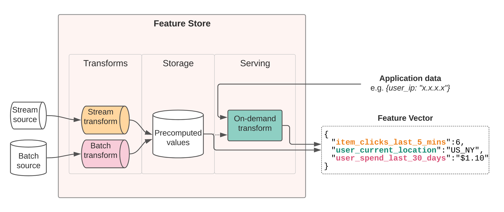

## MLOps

> https://neptune.ai/blog/mlops-architecture-guide

#### Architecture

1. Event-based architecture (push-based)
   - continously train real-time data ingestion
   - workflow orchestration tool or message broker
2. Orchestrated pull-based architecture
   - for scenarios where you have to retrain model at scheduled intervals
   - useful for problems where users don't need real-time scoring
3. Message-based training architecture
   - useful for when new data arrives from different sources

#### Pillars of MLOps

1. Production model deployment
2. Production model monitoring
3. Model governance in production
4. Model lifecycle management (retraining, remodeling, automated pipelines)

#### Well-Architected Framework pillars

1. Operational Excellence - organization, prepare, operate, evolve
2. Security - identify and access management, detection, infrastructure protection, data protection, incident response
3. Reliability - foundations, workload architecture, change management, failure management
4. Performance Efficiency - architecture selection, review, monitoring, trade-offs
5. Cost Optimization - practice cloud financial management, expenditure awareness, cost-effective resources, optimize over time

---

## Feature Store

> https://applyingml.com/resources/feature-stores/

A feature store is a centralized place where data scientists from different teams across your organization can share features for machine learning. The feature store allows them to search, reuse, and serve features in production at scale. 2021 was actually called [year of the feature store](https://www.datanami.com/2021/01/19/2021-the-year-of-the-feature-store/).

Core components:

1. Monitoring
2. Transformations
3. Storage
4. Serving
5. Registry

## Feast

1. Stream sources like kafka, kinesis. Batch sources Redshift, S3, Parquet, GCS
2. Store, Transform, Serve, Monitor, Register and discover
3. Feast supports easy feature creation, automatically execute transform specified
4. Provides unified serving layer to retrieve features
5. Duplication of effort for supporting cataloging and discovery

Types of data transformations include

1. Batch transforms - transformations applied only to data at rest
2. Streaming transform - transformations applied to streaming sources
3. On-demand transform - transformations produce features based on data that is available at time of prediction, cannot be pre-computed

Feast is a great option if you already have transformation pipelines to compute your features, but need a great storage and serving layer to help you use them in production. Feast is GCP/AWS only today, but we’re working hard to make Feast available as a light-weight feature store for all environments.

## Tecton

Tecton is a feature-store-as-a-service. 

A big difference between Feast and Tecton is that Tecton supports **transformations**, so feature pipelines can be managed end-to-end within Tecton. 

Tecton is a managed offering, and a great feature store choice if you need production SLAs, hosting, advanced collaboration, managed transformations (batch/streaming/real-time), and/or enterprise capabilities.

## Michelangelo

**Data**

A platform should provide standard tools for building data pipelines to generate feature and label data sets for training (and re-training) and feature-only data sets for predicting. These tools should have deep integration with the company’s data lake or warehouses and with the company’s online data serving systems. The pipelines need to be scalable and performant, incorporate integrated monitoring for data flow and data quality, and support both online and offline training and predicting.

**HDFS for Spark**

Cassandra for bulk precomputing and loading of historical features Near real-time compute

Models versioned with record of who trained model, start/end time, full configuration, reference to datasets, distribution, model accuracy, learned parameters, model visualization

1. Model accuracy report
2. Decision tree visualization
3. Feature report, partial dependence plots

Save R-squared, RMSE, MAE to time series systems

Things to do:

1. AutoML
2. Model Visualization
3. Online learning
4. Distributed deep learning

## Other

1. Doordash Gigascale

2. Alibaba Basic Feature Server